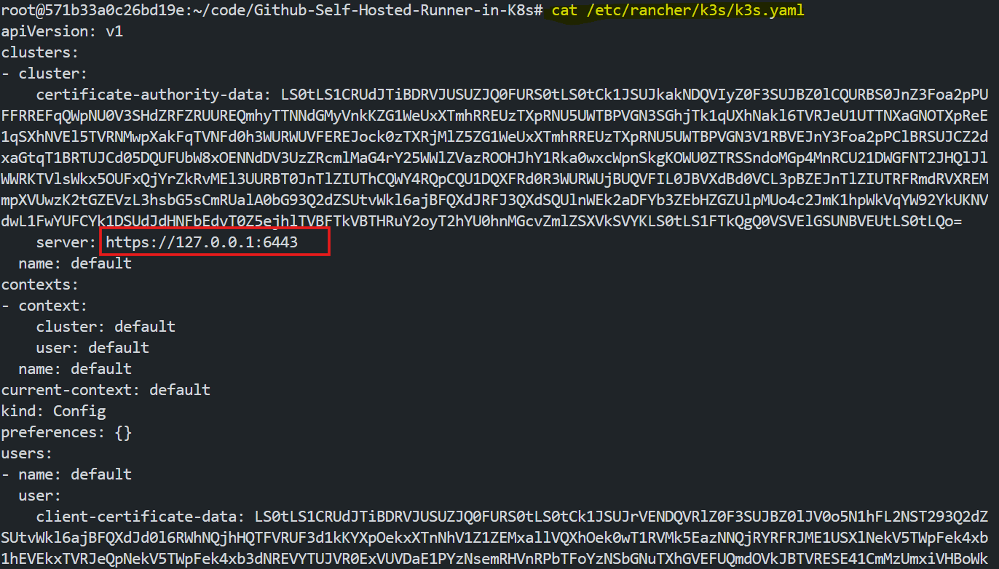
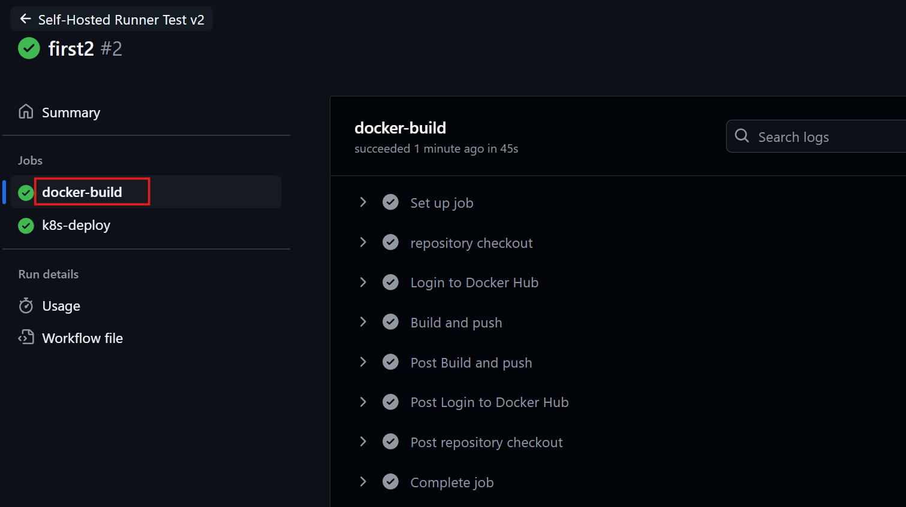
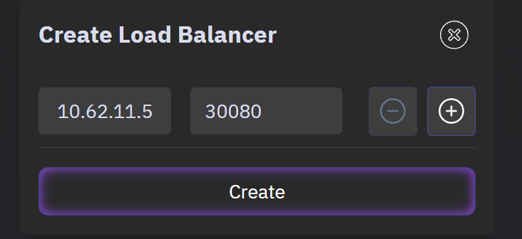

# Self-Hosted Runner in Kubernetes

GitHub Actions is a powerful CI/CD tool that enables developers to automate workflows directly in their GitHub repositories. While GitHub provides hosted runners, these may not always suit specific needs such as cost efficiency, custom environments, or organizational compliance. Self-hosted runners allow you to control your runner environment, offering:

- Customization of tools, dependencies, or configurations.

- Enhanced security by executing workflows within your private network.

- Cost efficiency by utilizing your existing infrastructure.


## What is Self-Hosted Runner?

A self-hosted GitHub Actions runner is a machine (virtual or physical) that you configure and manage yourself to run GitHub Actions workflows. Unlike GitHub-hosted runners, which are managed by GitHub and run on shared infrastructure, self-hosted runners give you greater control over the environment, resources, and dependencies used in your workflows.

## How Self-Hosted GitHub Action Runners Work?

A self-hosted GitHub Actions runner operates as a service on a machine you configure, acting as a bridge between GitHub and your local environment to execute workflows.

**Runner Software:**

- GitHub provides runner software that can be installed on your machine.
- The runner listens for job requests from GitHub and executes them when triggered by workflows.

**Integration:**

- After installation, the runner connects to your GitHub repository or organization.
- Jobs defined in workflow YAML files are dispatched to the runner when triggered.

**Execution:**

- The runner downloads the workflow steps and executes them sequentially.
- It reports logs, statuses, and results back to GitHub.

### Why Kubernetes for Self-Hosted Runners?

**Scalability:** Kubernetes can automatically scale runners up or down based on demand using features like Horizontal Pod Autoscaling (HPA). You can increase the number of runner pods during peak activity and reduce them during low activity, saving costs and resources.

**High Availability:** Kubernetes ensures high availability by automatically restarting pods if they fail. Self-healing capabilities reduce downtime for workflows. Kubernetes can distribute jobs across multiple nodes, ensuring optimal utilization and no single point of failure.

**Resource Management:** Kubernetes allows fine-grained control over resource allocation using requests and limits for CPU and memory. This ensures that self-hosted runners don't overwhelm the cluster or underutilize resources.

### Example Use Case with Kubernetes


Imagine a GitHub repository with frequent CI/CD workflows:

1. A workflow is triggered.
2. GitHub dispatches the job to a Kubernetes-hosted runner `(runs-on: self-hosted)`.
3. Kubernetes creates a pod for the job using pre-defined configurations.
4. The pod completes the workflow, uploads artifacts to GitHub, and is then terminated.
5. Kubernetes reclaims resources, maintaining cluster efficiency.

## Prerequisites

Before you begin, ensure you have the following:

- A functional Kubernetes cluster (e.g., k3s, EKS, or kind).
- Kubernetes command-line tool (`kubectl`) installed and configured.
- Docker installed on your system for building images.
- A GitHub account with a repository.
- A GitHub Personal Access Token (PAT) with the required permissions.

## Project Structure

```
github-repo/
├── github-runner-k8s/
│   ├── Dockerfile
│   ├── entrypoint.sh
│   ├── kubernetes.yaml
├── nginx-deployment/
│   ├── namespace.yml
│   ├── deployment.yml
│   ├── service.yml
├── .github/
│   └── workflows/
│       └── deploy.yml
├── Dockerfile.nginx
├── index.html
```

## Step 1: Project Structure Setup

### **Create a new repository:**

- Go to [GitHub](https://github.com) and create a new repository ( e.g., `github-runner-k8s` ) with a `README.md` file.

### **Clone the repository:**

```bash 
git clone <github-repository-link>
```

### Setup githubs default account:

```bash
git config user.email "<your-email>"
git config user.name "<Your Name>"
```

Replace `<your-email>` and `<your-name>` with your github email address and username.

### **Create a project directory:**

```bash
mkdir github-runner-k8s
cd github-runner-k8s
```

### **Create the necessary files:**

```bash
touch Dockerfile entrypoint.sh kubernetes.yaml
```

## Step 2: Creating the Custom runner image

Now we will create a Dockerfile that defines the container image for the self-hosted runner, including all required dependencies and configurations.

### **Base Image**
```dockerfile
FROM debian:bookworm-slim
```
**Purpose**: Specifies the base image.  

- `debian:bookworm-slim`: Used to minimizing unnecessary components for a smaller, faster image.

### **Arguments and Environment Variables**
```dockerfile
ARG RUNNER_VERSION="2.302.1"
ENV GITHUB_PERSONAL_TOKEN ""
ENV GITHUB_OWNER ""
ENV GITHUB_REPOSITORY ""
```
**Purpose**:

- `ARG RUNNER_VERSION`: Allows setting the Actions Runner version during the build. The default is `2.302.1`.
- `ENV GITHUB_PERSONAL_TOKEN`, `GITHUB_OWNER`, `GITHUB_REPOSITORY`: Defines environment variables for the GitHub token, repository owner, and repository name. These are placeholders that will be configured at runtime.


### **Install Docker**
```dockerfile
RUN apt-get update && \
    apt-get install -y ca-certificates curl gnupg
```
**Purpose**: Updates the package list and installs essential utilities:

- `ca-certificates`: Ensures HTTPS support for secure communications.
- `curl`: Used to fetch external resources, like Docker GPG keys and GitHub Runner binaries.
- `gnupg`: For verifying digital signatures (needed for Docker key verification).

```dockerfile
RUN install -m 0755 -d /etc/apt/keyrings
RUN curl -fsSL https://download.docker.com/linux/debian/gpg | gpg --dearmor -o /etc/apt/keyrings/docker.gpg
RUN chmod a+r /etc/apt/keyrings/docker.gpg
```
**Purpose**: Adds Docker's GPG key securely.

- Creates a directory for keyrings (`/etc/apt/keyrings`).
- Downloads and converts Docker's GPG key into a binary format (`gpg --dearmor`).
- Sets permissions for the key file to make it readable.

```dockerfile
RUN echo \
  "deb [arch="$(dpkg --print-architecture)" signed-by=/etc/apt/keyrings/docker.gpg] https://download.docker.com/linux/debian \
  "$(. /etc/os-release && echo "$VERSION_CODENAME")" stable" | \
  tee /etc/apt/sources.list.d/docker.list > /dev/null
RUN apt-get update
```
**Purpose**: Adds Docker’s repository to the system and updates the package list.
- Ensures `docker-ce-cli` (Docker CLI) can be installed.

```dockerfile
RUN apt-get install -y docker-ce-cli sudo jq
```
**Purpose**: This command will install:

- `docker-ce-cli`: Docker CLI for interacting with Docker containers.
- `sudo`: Allows privileged commands.
- `jq`: A lightweight tool for parsing JSON (useful for processing GitHub API responses).

### **Set Up GitHub User**
```dockerfile
RUN useradd -m github && \
    usermod -aG sudo github && \
    echo "%sudo ALL=(ALL) NOPASSWD:ALL" >> /etc/sudoers
```
**Purpose**:

- Creates a new user `github`.
- Adds `github` to the `sudo` group, allowing administrative tasks without a password prompt.

### **Create Directories with Correct Permissions**
```dockerfile
RUN mkdir -p /actions-runner && \
    chown -R github:github /actions-runner && \
    mkdir -p /work && \
    chown -R github:github /work
```
**Purpose**:
  - Creates required directories (`/actions-runner` for the GitHub runner and `/work` for workflow operations).
  - Sets ownership to the `github` user to avoid permission issues.

### **Switch User and Working Directory**
```dockerfile
USER github
WORKDIR /actions-runner
```
- **Purpose**:
  - Switches to the `github` user to run processes with non-root privileges.
  - Sets the working directory for subsequent commands to `/actions-runner`.

### **Download and Install GitHub Runner**
```dockerfile
RUN curl -Ls https://github.com/actions/runner/releases/download/v${RUNNER_VERSION}/actions-runner-linux-x64-${RUNNER_VERSION}.tar.gz -o actions-runner.tar.gz && \
    tar xzf actions-runner.tar.gz && \
    rm actions-runner.tar.gz && \
    sudo ./bin/installdependencies.sh
```
**Purpose**:
  - Downloads the specified version of the GitHub Actions Runner binary.
  - Extracts the runner software to the `/actions-runner` directory.
  - Deletes the tarball to save space.
  - Installs the runner’s dependencies via `installdependencies.sh`.

### **Add Entrypoint Script**
```dockerfile
COPY --chown=github:github entrypoint.sh /actions-runner/entrypoint.sh
RUN sudo chmod u+x /actions-runner/entrypoint.sh
```
- **Purpose**:
  - Copies the `entrypoint.sh` script to the `/actions-runner` directory.
  - Makes the script executable.

### **Set Entrypoint**
```dockerfile
ENTRYPOINT ["/actions-runner/entrypoint.sh"]
```
- **Purpose**:
  - Specifies the command to be run when the container starts. The entrypoint script typically handles runner registration, job execution, and cleanup.

Here is the complete dockerfile:

```dockerfile
FROM debian:bookworm-slim
ARG RUNNER_VERSION="2.302.1"
ENV GITHUB_PERSONAL_TOKEN ""
ENV GITHUB_OWNER ""
ENV GITHUB_REPOSITORY ""

# Install Docker
RUN apt-get update && \
    apt-get install -y ca-certificates curl gnupg
RUN install -m 0755 -d /etc/apt/keyrings
RUN curl -fsSL https://download.docker.com/linux/debian/gpg | gpg --dearmor -o /etc/apt/keyrings/docker.gpg
RUN chmod a+r /etc/apt/keyrings/docker.gpg

# Add Docker repository
RUN echo \
  "deb [arch="$(dpkg --print-architecture)" signed-by=/etc/apt/keyrings/docker.gpg] https://download.docker.com/linux/debian \
  "$(. /etc/os-release && echo "$VERSION_CODENAME")" stable" | \
  tee /etc/apt/sources.list.d/docker.list > /dev/null
RUN apt-get update

# Install required packages
RUN apt-get install -y docker-ce-cli sudo jq

# Setup github user
RUN useradd -m github && \
    usermod -aG sudo github && \
    echo "%sudo ALL=(ALL) NOPASSWD:ALL" >> /etc/sudoers

# Create directories with correct permissions
RUN mkdir -p /actions-runner && \
    chown -R github:github /actions-runner && \
    mkdir -p /work && \
    chown -R github:github /work

USER github
WORKDIR /actions-runner

# Download and install runner
RUN curl -Ls https://github.com/actions/runner/releases/download/v${RUNNER_VERSION}/actions-runner-linux-x64-${RUNNER_VERSION}.tar.gz -o actions-runner.tar.gz && \
    tar xzf actions-runner.tar.gz && \
    rm actions-runner.tar.gz && \
    sudo ./bin/installdependencies.sh

COPY --chown=github:github entrypoint.sh /actions-runner/entrypoint.sh
RUN sudo chmod u+x /actions-runner/entrypoint.sh

ENTRYPOINT ["/actions-runner/entrypoint.sh"]
```

## Step 3: Entrypoint Script

The `entrypoint.sh` script handles runner registration, execution, and cleanup. Lets create this script step by step: 

### **Requesting the Runner Registration Token**
```sh
registration_url="https://api.github.com/repos/${GITHUB_OWNER}/${GITHUB_REPOSITORY}/actions/runners/registration-token"
echo "Requesting registration URL at '${registration_url}'"
payload=$(curl -sX POST -H "Authorization: token ${GITHUB_PERSONAL_TOKEN}" ${registration_url})
export RUNNER_TOKEN=$(echo $payload | jq .token --raw-output)
```
**Purpose**:
  - Fetches a **registration token** from the GitHub API to register the self-hosted runner with a repository.

**How It Works**:
  1. Constructs the API URL for the repository based on `GITHUB_OWNER` and `GITHUB_REPOSITORY`.
  2. Sends a POST request to the API with the `GITHUB_PERSONAL_TOKEN` for authentication.
  3. Parses the response using `jq` to extract the `token` and assigns it to the environment variable `RUNNER_TOKEN`.

### **Configuring the Runner**
```sh
./config.sh \
    --name $(hostname) \
    --token ${RUNNER_TOKEN} \
    --labels my-runner \
    --url https://github.com/${GITHUB_OWNER}/${GITHUB_REPOSITORY} \
    --work "/work" \
    --unattended \
    --replace
```
**Purpose**:
  - Configures the GitHub Actions runner to associate it with the repository.

**Key Flags**:
  - `--name $(hostname)`: Sets the runner's name as the container's hostname for identification in GitHub.
  - `--token ${RUNNER_TOKEN}`: Uses the registration token for authentication.
  - `--labels my-runner`: Adds a label (`my-runner`) to the runner for workflows to target specific runners.
  - `--url https://github.com/${GITHUB_OWNER}/${GITHUB_REPOSITORY}`: Specifies the repository URL for the runner.
  - `--work "/work"`: Defines the working directory where jobs will execute.
  - `--unattended`: Runs without interactive prompts.
  - `--replace`: Replaces any existing runner with the same name.

### **Runner Cleanup on Exit**
```sh
remove() {
    ./config.sh remove --unattended --token "${RUNNER_TOKEN}"
}

trap 'remove; exit 130' INT
trap 'remove; exit 143' TERM
```
**Purpose**:
  - Defines a cleanup function (`remove`) that deregisters the runner from the repository.
  - Sets traps to handle signals (`INT` for Ctrl+C and `TERM` for termination signals). When the container receives these signals, the `remove` function is called to cleanly unregister the runner.

### **Running the Runner Process**
```sh
./run.sh "$*" &
wait $!
```
- **Purpose**:
  - Starts the GitHub Actions runner process using `run.sh`.
  - Runs it in the background (`&`) and waits for it to complete.
  - The `wait` command ensures the script stays active, allowing the container to continue running until the runner process stops.

Here is the complete script:

```sh
#!/bin/sh
registration_url="https://api.github.com/repos/${GITHUB_OWNER}/${GITHUB_REPOSITORY}/actions/runners/registration-token"
echo "Requesting registration URL at '${registration_url}'"
payload=$(curl -sX POST -H "Authorization: token ${GITHUB_PERSONAL_TOKEN}" ${registration_url})
export RUNNER_TOKEN=$(echo $payload | jq .token --raw-output)

./config.sh \
    --name $(hostname) \
    --token ${RUNNER_TOKEN} \
    --labels my-runner \
    --url https://github.com/${GITHUB_OWNER}/${GITHUB_REPOSITORY} \
    --work "/work" \
    --unattended \
    --replace

remove() {
    ./config.sh remove --unattended --token "${RUNNER_TOKEN}"
}

trap 'remove; exit 130' INT
trap 'remove; exit 143' TERM

./run.sh "$*" &
wait $!
```

### Make the script executable:

```sh
chmod +x entrypoint.sh
```

## Step 4: Build the docker image

To build the Docker image with the specified environment variables set in the Dockerfile, We need to create the `Github` personal access token (`PAT`).

### **Generate the Personal Access Token (PAT)**

#### **Log in to GitHub**:
   - Go to [GitHub](https://github.com) and log in to your account.

#### **Navigate to Developer Settings**:
   - Click on your profile picture in the top-right corner.
   - Go to **Settings** → **Developer Settings** (located near the bottom of the left sidebar).

#### **Generate a New Token**:
   - Click on **Personal access tokens** → **Tokens (classic)**.
   - Select **Generate new token (classic)**.

     

#### **Set Permissions**:
   - Provide a meaningful **note** (e.g., `Self-Hosted Runner`).
   - Select **Expiration** (set a reasonable expiry based on your needs).
   - Under **Scopes**, select the following permissions:
     - `repo` (Full control of private repositories).
     - `admin:repo_hook` (Manage webhooks and services).
     - `workflow` (Update GitHub Actions workflows).

     

#### **Generate and Save**:
   - Click **Generate token**.
   - Copy the generated token **immediately** (it won't be shown again).

#### **Docker Build Command**:

```bash
docker build \
  --build-arg RUNNER_VERSION="2.302.1" \
  --build-arg GITHUB_PERSONAL_TOKEN="<your-personal-access-token" \
  --build-arg GITHUB_OWNER="<your-github-username>" \
  --build-arg GITHUB_REPOSITORY="<your-github-repository-name" \
  -t <image-name> .
```

> NOTE: Make sure to replace all the environment variables with your credentials in docker build command.

## Step 5: Push the Image to DockerHub

### **Login to Docker**

```bash
docker login
```

- Enter your DockerHub **username** and **password** when prompted.
- If you're using an access token instead of a password (recommended for security), enter the token in place of the password.

### **Tag the Docker Image**

```bash
docker tag <image-name>:latest <dockerhub-username>/<image-name>:latest
```

### **Push the Image to DockerHub**

```bash
docker push <dockerhub-username>/<image-name>:latest
```
> NOTE: Replace `<dockerhub-username>`and `<image-name>` with your DockerHub username and with your image name.

### **Verify the Image on DockerHub**
- Log in to your DockerHub account at [DockerHub](https://hub.docker.com/).
- Navigate to the **Repositories** section.
- Ensure the `<your-image-name>` is listed under your account with the `latest` tag.


## Step 6: Configure the self hosted runner in Kubernetes

### **Create `kubernetes.yaml` with the following content:**

```yaml
apiVersion: apps/v1
kind: Deployment
metadata:
  name: github-runner
  labels:
    app: github-runner
spec:
  replicas: 1
  selector:
    matchLabels:
      app: github-runner
  template:
    metadata:
      labels:
        app: github-runner
    spec:
      containers:
      - name: github-runner
        imagePullPolicy: IfNotPresent
        image: <dockerhub-username>/<image-name>:latest
        env:
        - name: GITHUB_OWNER
          valueFrom:
            secretKeyRef:
              name: github-secret
              key: GITHUB_OWNER
        - name: GITHUB_REPOSITORY
          valueFrom:
            secretKeyRef:
              name: github-secret
              key: GITHUB_REPOSITORY
        - name: GITHUB_PERSONAL_TOKEN
          valueFrom:
            secretKeyRef:
              name: github-secret
              key: GITHUB_PERSONAL_TOKEN
        - name: DOCKER_HOST
          value: tcp://localhost:2375
        volumeMounts:
        - name: data
          mountPath: /work/
      - name: dind
        image: docker:24.0.6-dind
        env:
        - name: DOCKER_TLS_CERTDIR
          value: ""
        resources:
          requests:
            cpu: 20m
            memory: 512Mi
        securityContext:
          privileged: true
        volumeMounts:
        - name: docker-graph-storage
          mountPath: /var/lib/docker
        - name: data
          mountPath: /work/
      volumes:
      - name: docker-graph-storage
        emptyDir: {}
      - name: data
        emptyDir: {}

```

This YAML file defines a **Kubernetes Deployment** for a GitHub Actions self-hosted runner. Here's a breakdown of its components:

#### **Metadata**
- **name**: `github-runner` - The name of the deployment.
- **labels**: `app: github-runner` - Labels used to identify resources related to this deployment.


#### **Spec**
- **replicas**: `1` - Specifies one instance (pod) of the runner will be created.
- **selector**: Matches pods with the label `app: github-runner`.
- **template**: Defines the pod specification for the runner.


#### **Containers**
1. **`github-runner` (Main Container)**
   - **image**: `<dockerhub-username>/<image-name>:latest` - The Docker image for the runner.
   - **env**:
     - `GITHUB_OWNER`, `GITHUB_REPOSITORY`, `GITHUB_PERSONAL_TOKEN`: Environment variables retrieved from a Kubernetes secret (`github-secret`).
     - `DOCKER_HOST`: Configures Docker-in-Docker (DinD) communication.
   - **volumeMounts**:
     - `/work/`: Mounts a shared volume for runner jobs and data.

2. **`dind` (Docker-in-Docker Sidecar Container)**
   - **image**: `docker:24.0.6-dind` - Runs a DinD container to enable Docker capabilities for the runner.
   - **env**:
     - `DOCKER_TLS_CERTDIR`: Disables TLS for easier Docker communication within the cluster.
   - **resources**: Limits resource usage to prevent overloading the cluster.
   - **securityContext**: `privileged: true` - Grants privileges for DinD to function.
   - **volumeMounts**:
     - `/var/lib/docker`: Docker data storage.
     - `/work/`: Shared volume with the main container.


#### **Volumes**
- **`docker-graph-storage`**: Temporary storage for Docker images and layers.
- **`data`**: Shared storage for job-related data between containers.


### **Create a Kubernetes namespace:**
```bash
kubectl create namespace host-runner
```

### **Create secrets (replace placeholder values):**

```bash
kubectl -n host-runner create secret generic github-secret \
  --from-literal=GITHUB_OWNER=<your-github-username> \
  --from-literal=GITHUB_REPOSITORY=<your-repo-name> \
  --from-literal=GITHUB_PERSONAL_TOKEN=<your-github-personal-access-token>
```

## Step 7: Deploying to Kubernetes

### **Apply the Kubernetes deployment:**

```bash
kubectl apply -f kubernetes.yaml -n host-runner
```

### **Verify the deployment:**
```yaml
# Check pod status
kubectl get pods -n host-runner

# Check runner logs
kubectl  logs <pod-name> -n host-runner
```

## Step 8: Testing the Runner with Nginx Deployment


### **Create Directory Structure**

Set up the necessary directory structure for your deployment files:

```bash
mkdir -p nginx-deployment
cd nginx-deployment
```
### **Create Kubernetes Manifest Files**

```
touch namespace.yml deployment.yml service.yml
```

### **Kubernetes Manifest Files**

1. **Namespace Manifest**   
   Defines a namespace to isolate resources within the Kubernetes cluster.

   ```yaml
   apiVersion: v1
   kind: Namespace
   metadata:
      name: ${NAMESPACE}
   ```

2. **Deployment Manifest**  
    ```yaml
    apiVersion: apps/v1
    kind: Deployment
    metadata:
      name: nginx-deployment
      namespace: ${NAMESPACE}
    spec:
      replicas: ${REPLICAS}
      selector:
        matchLabels:
          app: nginx
      template:
        metadata:
          labels:
            app: nginx
        spec:
          containers:
          - name: nginx
            image: ${DOCKER_REGISTRY}/${DOCKER_IMAGE}:${IMAGE_TAG}
            ports:
            - containerPort: 80 
    ```

3. **Service Manifest**  
    ```yaml
    apiVersion: v1
    kind: Service
    metadata:
      name: nginx-service
      namespace: ${NAMESPACE}
    spec:
      type: NodePort
      selector:
        app: nginx
      ports:
        - port: 80
          targetPort: 80
          nodePort: ${NODE_PORT}
    ```

### **Dockerfile and Static Content**
Prepare a simple Dockerfile (`Dockerfile.nginx`) for Nginx, including a test `index.html` file to verify the deployment.

`Dockerfile.nginx`:

```dockerfile
FROM nginx:alpine
COPY index.html /usr/share/nginx/html/
```

`index.html`:

```html
<!DOCTYPE html>
<html>
<head>
    <title>Test Page</title>
</head>
<body>
    <h1>Hello from self-hosted runner!</h1>
</body>
</html>
```

### **GitHub Actions Workflow**
Create a workflow file `.github/workflows/deploy.yml`  to automate the process using a self-hosted runner.

```yaml
name: Self-Hosted Runner Test v2
on:
  push:
    branches:
      - main
env:
  DOCKER_REGISTRY: ${{ secrets.DOCKER_REGISTRY }}
  DOCKER_IMAGE: nginx-app
  NAMESPACE: dev
  REPLICAS: "2"
  NODE_PORT: "30080"
jobs:
  docker-build:
    runs-on: self-hosted
    steps:
      - name: repository checkout 
        uses: actions/checkout@v4
      - name: Login to Docker Hub
        uses: docker/login-action@v3
        with:
          username: ${{ secrets.DOCKER_USERNAME }}
          password: ${{ secrets.DOCKER_PASSWORD }}
      - name: Build and push
        uses: docker/build-push-action@v5
        with:
          context: .
          file: Dockerfile.nginx
          push: true
          tags: ${{ env.DOCKER_REGISTRY }}/${{ env.DOCKER_IMAGE }}:${{ github.sha }}
  k8s-deploy:
    needs: docker-build
    runs-on: self-hosted
    steps:
      - uses: actions/checkout@v4
      - name: Install kubectl
        uses: azure/setup-kubectl@v3
        with:
          version: 'latest'
    
      - name: Configure kubectl
        uses: azure/k8s-set-context@v3
        with:
          method: kubeconfig
          kubeconfig: ${{ secrets.KUBE_CONFIG }}
      - name: Update Kubernetes Manifests
        run: |
          for file in nginx-deployment/*.yml; do
            sed -i "s|\${DOCKER_REGISTRY}|$DOCKER_REGISTRY|g" $file
            sed -i "s|\${DOCKER_IMAGE}|$DOCKER_IMAGE|g" $file
            sed -i "s|\${IMAGE_TAG}|${{ github.sha }}|g" $file
            sed -i "s|\${NAMESPACE}|$NAMESPACE|g" $file
            sed -i "s|\${REPLICAS}|$REPLICAS|g" $file
            sed -i "s|\${NODE_PORT}|$NODE_PORT|g" $file
          done
      - name: Deploy to Kubernetes
        run: |
          kubectl apply -f nginx-deployment/namespace.yml
          kubectl apply -f nginx-deployment/deployment.yml
          kubectl apply -f nginx-deployment/service.yml
```

### **Workflow Details**

#### **Workflow Trigger**
- Runs on every `push` to the `main` branch.

#### **Environment Variables**
- **`DOCKER_REGISTRY`, `DOCKER_IMAGE`, `NAMESPACE`, `REPLICAS`, `NODE_PORT`**:
  Used to dynamically configure the workflow and Kubernetes manifests. These values are stored as secrets in GitHub.

#### **`docker-build` Job**
Runs on a self-hosted runner to build and push the Docker image.

1. **Checkout Repository**:
   ```yaml
   - name: repository checkout
     uses: actions/checkout@v4
   ```
   Fetches the code from the repository.

2. **Login to Docker Hub**:
   ```yaml
   - name: Login to Docker Hub
     uses: docker/login-action@v3
     with:
       username: ${{ secrets.DOCKER_USERNAME }}
       password: ${{ secrets.DOCKER_PASSWORD }}
   ```
   Logs in to Docker Hub using credentials stored as secrets.

3. **Build and Push Docker Image**:
   ```yaml
   - name: Build and push
     uses: docker/build-push-action@v5
     with:
       context: .
       file: Dockerfile.nginx
       push: true
       tags: ${{ env.DOCKER_REGISTRY }}/${{ env.DOCKER_IMAGE }}:${{ github.sha }}
   ```
   - Builds the Docker image from `Dockerfile.nginx`.
   - Tags it with the GitHub commit hash.
   - Pushes it to the Docker registry.

#### **`k8s-deploy` Job**
Deploys the application to a Kubernetes cluster after the Docker image is built.

1. **Checkout Repository**:
   ```yaml
   - uses: actions/checkout@v4
   ```
   Fetches the code repository.

2. **Install `kubectl`**:
   ```yaml
   - name: Install kubectl
     uses: azure/setup-kubectl@v3
     with:
       version: 'latest'
   ```
   Installs the `kubectl` CLI tool to interact with the Kubernetes cluster.

3. **Configure `kubectl`**:
   ```yaml
   - name: Configure kubectl
     uses: azure/k8s-set-context@v3
     with:
       method: kubeconfig
       kubeconfig: ${{ secrets.KUBE_CONFIG }}
   ```
   Configures `kubectl` with a kubeconfig file stored in GitHub secrets. `kubeconfig` is a Kubernetes configuration file that defines cluster settings. Which is used to authenticate with the Kubernetes cluster.

4. **Update Kubernetes Manifests**:
   ```yaml
   - name: Update Kubernetes Manifests
     run: |
       for file in nginx-deployment/*.yml; do
         sed -i "s|\${DOCKER_REGISTRY}|$DOCKER_REGISTRY|g" $file
         sed -i "s|\${DOCKER_IMAGE}|$DOCKER_IMAGE|g" $file
         sed -i "s|\${IMAGE_TAG}|${{ github.sha }}|g" $file
         sed -i "s|\${NAMESPACE}|$NAMESPACE|g" $file
         sed -i "s|\${REPLICAS}|$REPLICAS|g" $file
         sed -i "s|\${NODE_PORT}|$NODE_PORT|g" $file
       done
   ```
   - Replaces placeholder variables (e.g., `${DOCKER_REGISTRY}`, `${NAMESPACE}`) in Kubernetes YAML files with actual values.

5. **Apply Kubernetes Manifests**:
   ```yaml
   - name: Deploy to Kubernetes
     run: |
       kubectl apply -f nginx-deployment/namespace.yml
       kubectl apply -f nginx-deployment/deployment.yml
       kubectl apply -f nginx-deployment/service.yml
   ```
   Deploys the Nginx application to the Kubernetes cluster by applying the manifests.


#### Purpose:
- **`docker-build`**: Builds and pushes the Nginx Docker image.
- **`k8s-deploy`**: Configures Kubernetes and deploys the application using updated manifests.

### **Add GitHub Repository Secrets**
Ensure the following secrets are added to your GitHub repository for secure handling:

- **DOCKER_REGISTRY**: Docker registry name (e.g., Docker Hub username).  
- **DOCKER_USERNAME**: Docker Hub username.  
- **DOCKER_PASSWORD**: Docker Hub password.  
- **KUBE_CONFIG**: Kubernetes configuration file.  

### **Kubernetes Configuration File**

To get the `KUBE_CONFIG` file, you can use the following command:

```bash
cat /etc/rancher/k3s/k3s.yaml
```



Copy the contents of the file and replace the `server ip` with kubernetes `master node ip`.

To get the master node ip, you can use the following command:

```bash
kubectl get nodes -o wide
```


and add it as a secret in your GitHub repository as `KUBE_CONFIG`.

### **Commit and Push to Repository**
After creating the required files and configuration, commit and push all files to the main branch of your repository.


### **Verify the Workflow**
Monitor the **Actions** tab in your GitHub repository to ensure the workflow runs successfully. The workflow will:  
1. Build and push the Docker image.

   

2. Update Kubernetes manifests dynamically. 

3. Deploy the application to the Kubernetes cluster.

    


## Access the Application

In Poridhi's Kubernetes cluster verify the deploymets and services

```bash
kubectl get namespaces
```
For successful deployment, you should see the `dev` namespace.

```bash
kubectl get deployments -n dev
```
For successful deployment, you should see the `nginx-deployment`.

```bash
kubectl get services -n dev
```
For successful deployment, you should see the `nginx-service` with a `NodePort` service.


Now to access the application, you should get the `etho` ip of the master node and the `nodeport` of the service.

To get the `eth0` ip of the master node, you can use the following command:

```bash
ifconfig
```


### **Create a Load Balancer**

Create a load balancer with eht0 ip of the master node and the nodeport of the service.



With the provided `url` by `load-balancer` you can access the application.


