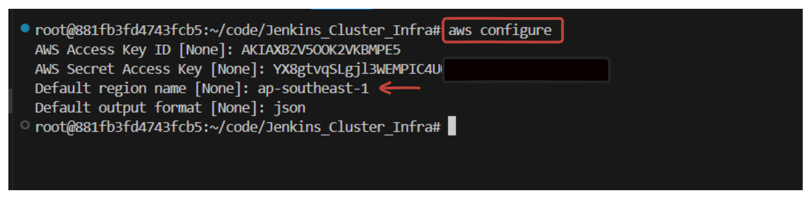

# Setting Up a Jenkins Agent Using SSH Keys

In this guide, we'll walk you through the process of configuring a Jenkins agent node using SSH keys. This setup allows Jenkins to securely communicate with the agent node, enabling remote job execution.


## Prerequisites for Jenkins Agent



Before you can add a Jenkins agent node, ensure the following requirements are met on the agent machine:
- **Agent Node**: Ensure you have an `Ubuntu Machine` as an agent server to follow this guide.

    

- **Java**: Install Java on the agent server, as Jenkins requires Java to run.
    - To verify installation, run:
    ```sh
    java -version
    ```
    - You will get a similiar output like this:
    
    ```sh
    openjdk version "17.0.8" 2023-07-18
    OpenJDK Runtime Environment (build 17.0.8+7-Debian-1deb12u1)
    OpenJDK 64-Bit Server VM (build 17.0.8+7-Debian-1deb12u1, mixed mode, sharing)
    ```
- **Linux User Account**: Create a valid Linux user account on the agent server. It is preferable to use a user with `sudo` privileges, or you can use `root` user, if your Jenkins jobs require elevated permissions.

## Step-by-Step Guide

### Step 1: Create a New Node in Jenkins

1. **Access Jenkins Dashboard**:
   - Navigate to your Jenkins dashboard.


2. **Manage Nodes**:
   - Go to **Manage Jenkins** > **Nodes**.


3. **Add New Node**:
   - Click on **New Node**.
   - Enter a name for the node.
   - Select **Permanent Agent** and click **Create** to proceed with node creation.


### Step 2: Set Up SSH Key Pair on the Agent Machine

1. **Log In to the Agent Server**:
   - Access the agent server via SSH or directly on the machine.

2. **Create SSH Key Pair**:
   - Generate a new SSH key pair by running:
     ```sh
     ssh-keygen -t rsa
     ```
   - Press **Enter** to accept default file locations and settings when prompted.

   

3. **Add Public Key to `authorized_keys`**:
   - Append the public key to the `~/.ssh/authorized_keys` file to enable SSH access:
     ```sh
     cat ~/.ssh/id_rsa.pub >> ~/.ssh/authorized_keys
     ```

4. **Copy Private Key for Jenkins**:
   - Display the private key content and copy it to your clipboard:
     ```sh
     cat ~/.ssh/id_rsa
     ```

### Step 3: Add SSH Private Key to Jenkins Credentials

1. **Navigate to Jenkins Credentials**:
   - Go to **Jenkins Dashboard** > **Manage Jenkins** > **Manage Credentials**.

2. **Add New Credentials**:
   - Select the appropriate domain or use `(global)`.
   - Click on **Add Credentials**.
   - Choose **SSH Username with private key** from the **Kind** dropdown.
   - Provide an **ID** for the credentials (e.g., `agent1`).

   

   - Enter the following details:
     - **Username**: Enter the username of the agent machine.
     - **Private Key**: Select **Enter directly** and paste the contents of the private key (`id_rsa`) you copied earlier.

     

   - Click **OK** to save the credentials.

### Step 4: Configure the Jenkins Agent Node

1. **Edit Node Configuration**:
   - Return to **Manage Nodes and Clouds**.
   - Select the node you created earlier.
   - Configure the following:
     - **Number of executors**: Specify the number of executors. Enter the number of    executors you want for this node. For example, setting this to 2 means the node can handle two concurrent builds.
     - **Remote Root Directory**: Specify the directory on the agent machine where Jenkins will run commands (e.g., `/opt/jenkins`).

     

     - **Labels**: Give it a label to use it in the job. (e.g, `agent1`).
     - **Launch Method**: Choose **Launch agents via SSH**.
     - **Host**: Enter the IP address or hostname of the agent machine.
     - **Credentials**: Select the SSH credentials you created.

      

2. **Host Key Verification Strategy**:
   - Optionally, configure the **Host Key Verification Strategy**. For now, you can use `Non verifying Verfication Strategy`. This strategy is a setting that instructs Jenkins to not perform any host key verification when establishing an SSH connection to a remote agent. Though it is not recommended to use, as it has `Security Risks: Man-in-the-Middle Attacks`. But for `Convenience`, we can use it to simplify the initial setup or testing phases.

3. Leave the other configuration blank for now.


3. Select `Save` and check the log of the agent if everything is correct.


4. After successfull authentication, you will have an agent node in the node dashboard.


### Step 5: Test the Jenkins Agent

1. **Create a Test Job**:
   - In Jenkins, create a new job (e.g., a Freestyle project).

   

2. **Assign the Node**:
   - Configure the job to run on the specific agent node by using the **Restrict where this project can be run** option.
   - Enter the label you assigned to the node during its setup.

   

3. **Run a Test Job**:
   - Add a simple build step, such as a shell script, to verify the agent's functionality:
     ```sh
     echo "Hello from the Jenkins agent!"
     ```
   - Run the job and ensure it executes successfully on the agent node.

4. **Check the console output**:

    - Verify that the job executed correctly and the output matches the expected result.

    

    - You can also check the build history of the agent node that you have created.

    

By following these steps, you should have a fully configured Jenkins agent node using SSH keys, ready for executing Jenkins jobs remotely.