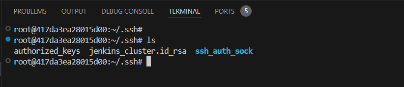
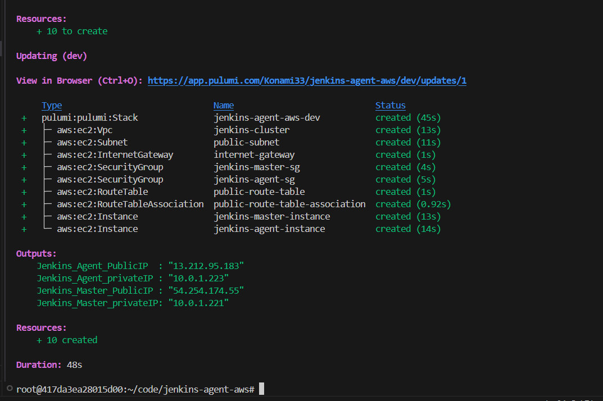
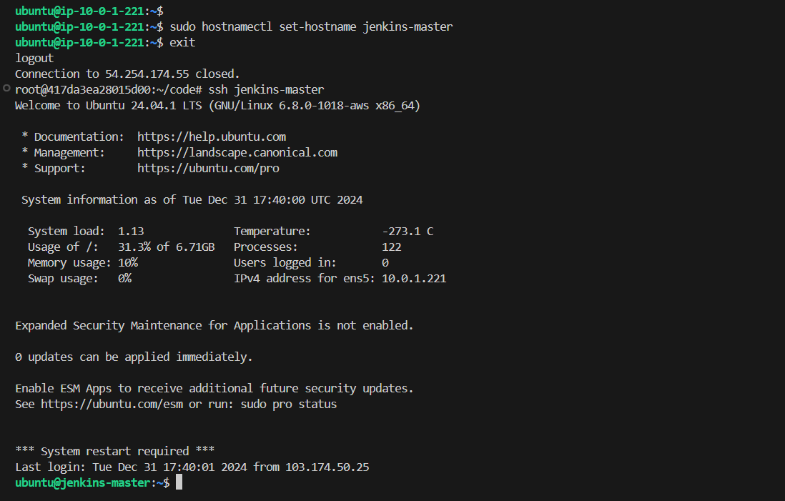
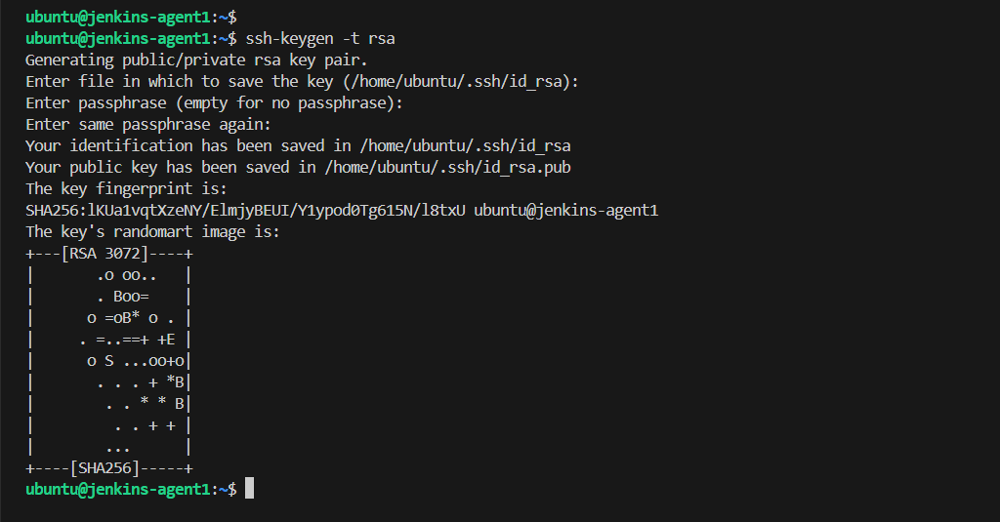
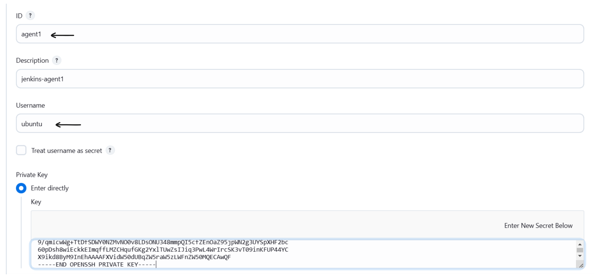
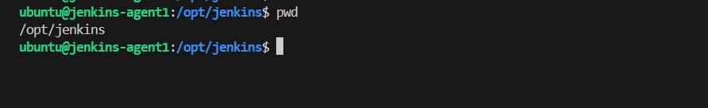

# Setting Up a Jenkins Agent Using SSH Keys

In this lab, we'll walk you through the process of configuring a Jenkins agent node using SSH keys. This setup allows Jenkins to securely communicate with the agent node, enabling remote job execution.


## What is Jenkins Agent?

A Jenkins agent is a remote machine or environment that is configured to execute tasks for a Jenkins controller (master). Agents allow Jenkins to distribute workload across multiple systems, enhancing scalability and efficiency in a Continuous Integration/Continuous Delivery (CI/CD) pipeline.

### How Jenkins Agent Works:

**Master-Agent Architecture**:

- Jenkins operates on a master-agent model.
- The Jenkins controller manages the agents and coordinates the distribution of tasks.

**Communication**: Agents communicate with the controller through various methods:

- **SSH**
- **Java Web Start (deprecated in newer versions)**
- **Agents running as Windows services**
- **Kubernetes-based or Docker-based agents**

- **Execution**:

Once configured, the Jenkins controller sends job instructions to the agent.
The agent performs the job, sends the results back to the controller, and awaits further instructions.

## Step-by-Step Guide

## Create a Jenkins Agent server on AWS

We will be using AWS EC2 to create a Jenkins Agent server. We will use PULUMI as our infrastructure as code tool to create the server. Follow the steps below to create the server.

**1. Create a Directory for Your Infrastructure**

```sh
mkdir jenkins-agent-aws
cd jenkins-agent-aws
```

**2. Install Python `venv`**

```sh
sudo apt update
sudo apt install python3.8-venv -y
```

**3. Create a New Pulumi Project**

```sh
pulumi new aws-python
```

**4. Update the `__main__.py` file:**

```python
import pulumi
import pulumi_aws as aws
import os
import base64


# Configuration setup
t3_small = 't3.small' # Change this to your desired instance type
t3_medium = 't3.medium'
ami = "ami-06650ca7ed78ff6fa" # Change this to your desired AMI


# Read installation scripts
with open('jenkins_install.sh', 'r') as file:
    jenkins_script = file.read()

# Create a VPC
vpc = aws.ec2.Vpc(
    'jenkins-cluster',
    cidr_block='10.0.0.0/16',
    enable_dns_hostnames=True,
    enable_dns_support=True,
    tags={
        'Name': 'Jenkins-cluster-vpc',
    }
)

# Create subnets
public_subnet = aws.ec2.Subnet('public-subnet',
    vpc_id=vpc.id,
    cidr_block='10.0.1.0/24',
    map_public_ip_on_launch=True,
    availability_zone='ap-southeast-1a',
    tags={
        'Name': 'public-subnet',
    }
)

# Internet Gateway
igw = aws.ec2.InternetGateway(
    'internet-gateway',
    vpc_id=vpc.id,
    tags={
        'Name': 'jenkins-cluster-igw'
    }
)

# Route Table
public_route_table = aws.ec2.RouteTable(
    'public-route-table', 
    vpc_id=vpc.id,
    routes=[{
        'cidr_block': '0.0.0.0/0',
        'gateway_id': igw.id,
    }],
    tags={
        'Name': 'public-route-table',
    }
)

# Route Table Association
public_route_table_association = aws.ec2.RouteTableAssociation(
    'public-route-table-association',
    subnet_id=public_subnet.id,
    route_table_id=public_route_table.id
)

# Security Group for Jenkins Master
jenkins_master_sg = aws.ec2.SecurityGroup("jenkins-master-sg",
    description='Jenkins Master Security Group',
    vpc_id=vpc.id,
    ingress=[
        # SSH access
        {
            "protocol": "tcp",
            "from_port": 22,
            "to_port": 22,
            "cidr_blocks": ["0.0.0.0/0"],
            "description": "SSH access"
        },
        # Jenkins web interface
        {
            "protocol": "tcp",
            "from_port": 8080,
            "to_port": 8080,
            "cidr_blocks": ["0.0.0.0/0"],
            "description": "Jenkins web interface"
        },
        # Jenkins JNLP port for agent connection
        {
            "protocol": "tcp",
            "from_port": 50000,
            "to_port": 50000,
            "cidr_blocks": ["10.0.0.0/16"],
            "description": "Jenkins agent connection"
        },
    ],
    egress=[{
        "protocol": "-1",
        "from_port": 0,
        "to_port": 0,
        "cidr_blocks": ["0.0.0.0/0"],
        "description": "Allow all outbound traffic"
    }],
    tags={
        'Name': 'jenkins-master-sg',
    }
)

# Security Group for Jenkins Agent
jenkins_agent_sg = aws.ec2.SecurityGroup(
    'jenkins-agent-sg',
    description='Allow SSH and communication with Jenkins Master',
    vpc_id=vpc.id,
    ingress=[
        {"protocol": "tcp", "from_port": 22, "to_port": 22, "cidr_blocks": ["0.0.0.0/0"], "description": "SSH access"},
        {"protocol": "tcp", "from_port": 50000, "to_port": 50000, "cidr_blocks": ["10.0.0.0/16"], "description": "JNLP communication with Master"}
    ],
    egress=[{"protocol": "-1", "from_port": 0, "to_port": 0, "cidr_blocks": ["0.0.0.0/0"], "description": "Allow all outbound"}],
    tags={'Name': 'Jenkins Agent SG'}
)


# Create user data script for Jenkins master
jenkins_user_data = f'''#!/bin/bash
# Write installation scripts
cat > /tmp/jenkins_install.sh << 'EOL'
{jenkins_script}
EOL

# Make scripts executable
chmod +x /tmp/jenkins_install.sh

# Run installation scripts
/tmp/jenkins_install.sh
'''

# EC2 Jenkins Master
jenkins_master = aws.ec2.Instance(
    'jenkins-master-instance',
    instance_type=t3_medium,
    ami=ami,
    subnet_id=public_subnet.id,
    vpc_security_group_ids=[jenkins_master_sg.id],
    key_name='jenkins_cluster',
    user_data=jenkins_user_data,
    tags={
        'Name': 'Jenkins Master Node',
    }
)

jenkins_agent = aws.ec2.Instance(
    'jenkins-agent-instance',
    instance_type=t3_small,
    ami=ami,
    subnet_id=public_subnet.id,
    vpc_security_group_ids=[jenkins_agent_sg.id],
    key_name='jenkins_cluster',
    tags={
        'Name': 'Jenkins Agent Node',
    }
)

# Outputs
pulumi.export('Jenkins_Master_PublicIP', jenkins_master.public_ip)
pulumi.export('Jenkins_Agent_PublicIP', jenkins_agent.public_ip)
pulumi.export('Jenkins_Master_privateIP', jenkins_master.private_ip)
pulumi.export('Jenkins_Agent_privateIP', jenkins_agent.private_ip)

def create_config_file(ip_addresses):
    jenkins_master_ip, jenkins_agent_ip = ip_addresses
    
    config_content = f"""Host jenkins-master
    HostName {jenkins_master_ip}
    User ubuntu
    IdentityFile ~/.ssh/jenkins_cluster.id_rsa

    Host agent-1
    HostName {jenkins_agent_ip}
    User ubuntu
    IdentityFile ~/.ssh/jenkins_cluster.id_rsa
    
""" 
    config_path = os.path.expanduser("~/.ssh/config")
    os.makedirs(os.path.dirname(config_path), exist_ok=True)
    with open(config_path, "w") as config_file:
        config_file.write(config_content)

pulumi.Output.all(
    jenkins_master.public_ip,
    jenkins_agent.public_ip,
).apply(create_config_file)
```

This python script will create the infrastructure and output the public IP addresses of the Jenkins Master and Jenkins Agent. Also, it will create a config file in the `~/.ssh/config` file to access the Jenkins Agent from the Jenkins Master.

**5. Generate the key Pair named `jenkins_cluster`**

```sh
cd ~/.ssh/
aws ec2 create-key-pair --key-name jenkins_cluster --output text --query 'KeyMaterial' > jenkins_cluster.id_rsa
chmod 400 jenkins_cluster.id_rsa
```



**6. Create a file named `jenkins_install.sh` and add the following content:**

```sh
#!/bin/bash

# Function to print colored output
print_message() {
    GREEN='\033[0;32m'
    NC='\033[0m'
    echo -e "${GREEN}$1${NC}"
}

# Function to check if command was successful
check_status() {
    if [ $? -eq 0 ]; then
        print_message "✓ Success: $1"
    else
        echo "✗ Error: $1"
        exit 1
    fi
}

# Check if script is run as root
if [ "$EUID" -ne 0 ]; then 
    echo "Please run as root (use sudo)"
    exit 1
fi

# Set Jenkins port (default 8081 or use command line argument)
JENKINS_PORT=${1:-8080}

print_message "Starting Jenkins installation..."
print_message "Jenkins will be configured to run on port: $JENKINS_PORT"

# Update system packages
print_message "Updating system packages..."
apt update
apt upgrade -y
check_status "System update completed"

# Install Java
print_message "Installing Java..."
apt install -y openjdk-17-jre-headless
check_status "Java installation completed"

# Verify Java installation
java -version
check_status "Java verification"

# Add Jenkins repository
print_message "Adding Jenkins repository..."
curl -fsSL https://pkg.jenkins.io/debian-stable/jenkins.io-2023.key | tee \
    /usr/share/keyrings/jenkins-keyring.asc > /dev/null

echo deb [signed-by=/usr/share/keyrings/jenkins-keyring.asc] \
    https://pkg.jenkins.io/debian-stable binary/ | tee \
    /etc/apt/sources.list.d/jenkins.list > /dev/null
check_status "Jenkins repository added"

# Install Jenkins
print_message "Installing Jenkins..."
apt update
apt install -y jenkins
check_status "Jenkins installation completed"

# Configure Jenkins port
print_message "Configuring Jenkins port..."
sed -i "s/HTTP_PORT=.*/HTTP_PORT=$JENKINS_PORT/" /etc/default/jenkins
sed -i "s/--httpPort=[0-9]*/--httpPort=$JENKINS_PORT/" /etc/default/jenkins
check_status "Port configuration completed"

# Update systemd service file
print_message "Updating systemd service..."
sed -i "s|^ExecStart=.*|ExecStart=/usr/bin/jenkins --httpPort=$JENKINS_PORT|" /lib/systemd/system/jenkins.service
check_status "Systemd service updated"

# Reload systemd and restart Jenkins
print_message "Restarting Jenkins..."
systemctl daemon-reload
systemctl restart jenkins
check_status "Jenkins restart completed"

# Wait for Jenkins to start
print_message "Waiting for Jenkins to start..."
sleep 30

# Get initial admin password
if [ -f /var/lib/jenkins/secrets/initialAdminPassword ]; then
    ADMIN_PASSWORD=$(cat /var/lib/jenkins/secrets/initialAdminPassword)
    print_message "Jenkins initial admin password: $ADMIN_PASSWORD"
else
    echo "Warning: Could not find initial admin password"
fi

print_message "\nInstallation completed!"
print_message "Please allow a few minutes for Jenkins to fully start"
print_message "Access Jenkins at: http://your-server-ip:$JENKINS_PORT"
```

**8. Create Infra**

Run the following command to create the infrastructure:

```sh
pulumi up --yes
```




## SSH into the Jenkins Master

After the infrastructure is created, SSH into the Jenkins Master using the following command:

```sh
ssh jenkins-master
```


You can optionally set the hostname of the Jenkins Master to `jenkins-master` by running the following command:

```sh
sudo hostnamectl set-hostname jenkins-master
```



**2. Access the Jenkins UI**

We can access the Jenkins UI, using the Public IP of Jenkins Instance and port (8080):

```
http://<jenkins-public-ip>:8080
```

To get the password, run the following command:

```sh
sudo cat /var/lib/jenkins/secrets/initialAdminPassword
```
This will output the initial admin password. Use this password to log in to the Jenkins UI.


### Create a New Node in Jenkins

**1. Access Jenkins Dashboard**:

Navigate to your Jenkins dashboard.


**2. Manage Nodes**:
Go to **Manage Jenkins** > **Nodes**.


**3. Add New Node**:

- Click on **New Node**.
- Enter a name for the node.
- Select **Permanent Agent** and click **Create** to proceed with node creation.


### Step 2: Set Up SSH Key Pair on the Agent Machine

**1. SSH into the Agent Server**:

Access the agent server via SSH. Run the following command:

```sh
ssh agent-1
```


**2. Create SSH Key Pair**:

- Generate a new SSH key pair by running:
   ```sh
   ssh-keygen -t rsa
   ```
- Press **Enter** to accept default file locations and settings when prompted.

   

**3. Add Public Key to `authorized_keys`**:

- Append the public key to the `~/.ssh/authorized_keys` file to enable SSH access:
   ```sh
   cat ~/.ssh/id_rsa.pub >> ~/.ssh/authorized_keys
   ```

**4. Copy Private Key for Jenkins**:
- Display the private key content and copy it to your clipboard:
   ```sh
   cat ~/.ssh/id_rsa
   ```

### Step 3: Add SSH Private Key to Jenkins Credentials

**1. Navigate to Jenkins Credentials**: 

Go to **Jenkins Dashboard** > **Manage Jenkins** > **Manage Credentials**.

**2. Add New Credentials**:

- Select the appropriate domain or use `(global)`.
- Click on **Add Credentials**.
- Choose **SSH Username with private key** from the **Kind** dropdown.
- Provide an **ID** for the credentials (e.g., `agent1`).

   

   - Enter the following details:
     - **Username**: Enter the username of the agent machine.
     - **Private Key**: Select **Enter directly** and paste the contents of the private key (`id_rsa`) you copied earlier.

     

   - Click **OK** to save the credentials.

### Step 4: Configure the Jenkins Agent Node

**1. Edit Node Configuration**:

- Return to **Manage Nodes and Clouds**.
- Select the node you created earlier.
- Configure the following:
     - **Number of executors**: Specify the number of executors. Enter the number of    executors you want for this node. For example, setting this to 2 means the node can handle two concurrent builds.
     - **Remote Root Directory**: Specify the directory on the agent machine where Jenkins will run commands (e.g., `/opt/jenkins`).

     

     - **Labels**: Give it a label to use it in the job. (e.g, `agent1`).
     - **Launch Method**: Choose **Launch agents via SSH**.
     - **Host**: Enter the IP address or hostname of the agent machine.
     - **Credentials**: Select the SSH credentials you created.

      

**2. Host Key Verification Strategy**:

- Optionally, configure the **Host Key Verification Strategy**. For now, you can use `Non verifying Verfication Strategy`. This strategy is a setting that instructs Jenkins to not perform any host key verification when establishing an SSH connection to a remote agent. Though it is not recommended to use, as it has `Security Risks: Man-in-the-Middle Attacks`. But for `Convenience`, we can use it to simplify the initial setup or testing phases.

**3. Leave the other configuration blank for now.**


**3. Select `Save` and check the log of the agent if everything is correct.**


**4. After successfull authentication, you will have an agent node in the node dashboard.**


### Step 5: Test the Jenkins Agent

**1. Create a Test Job**:
   - In Jenkins, create a new job (e.g., a Freestyle project).

   

**2. Assign the Node**:

- Configure the job to run on the specific agent node by using the **Restrict where this project can be run** option.
- Enter the label you assigned to the node during its setup.


**3. Run a Test Job**:

- Add a simple build step, such as a shell script, to verify the agent's functionality:
   ```sh
   echo "Hello from the Jenkins agent!"
   ```
   - Run the job and ensure it executes successfully on the agent node.

**4. Check the console output**:

- Verify that the job executed correctly and the output matches the expected result.

    

   You can also check the build history of the agent node that you have created.

    

By following these steps, you should have a fully configured Jenkins agent node using SSH keys, ready for executing Jenkins jobs remotely.