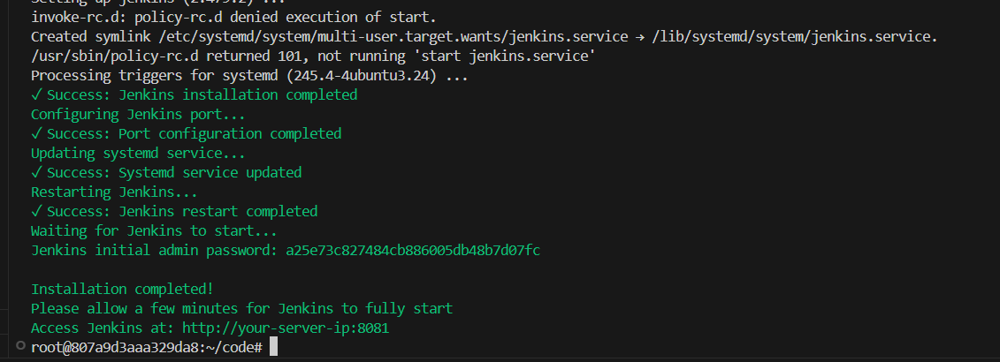

# CI CD Pipeline using Jenkins

In this lab, we will be setting up a CI/CD pipeline using Jenkins for a containerized application. We will be using DockerHub as our container registry and Kubernetes as our container orchestration tool.

## Setting up AWS Infrastructure

We will create AWS infrastructure to setup a Jenkins server cluster with one master and one agent. We will be using Pulumi to create the infrastructure.

**1. Create a Directory for Your Infrastructure**

```sh
mkdir jenkins-infra-aws
cd jenkins-infra-aws
```

**2. Install Python `venv`**

```sh
sudo apt update
sudo apt install python3.8-venv -y
```

**3. Create a New Pulumi Project**

```sh
pulumi new aws-python
```
**4. Update the `__main.py__` file:**

```python
import pulumi
import pulumi_aws as aws
import os

# Configuration setup
instance_type = 't3.small' # Change this to your desired instance type
ami = "ami-06650ca7ed78ff6fa" # Change this to your desired AMI

# Create a VPC
vpc = aws.ec2.Vpc(
    'jenkins-cluster',
    cidr_block='10.0.0.0/16',
    enable_dns_hostnames=True,
    enable_dns_support=True,
    tags={
        'Name': 'Jenkins-cluster-vpc',
    }
)

# Create subnets
public_subnet = aws.ec2.Subnet('public-subnet',
    vpc_id=vpc.id,
    cidr_block='10.0.1.0/24',
    map_public_ip_on_launch=True,
    availability_zone='ap-southeast-1a',
    tags={
        'Name': 'public-subnet',
    }
)

# Internet Gateway
igw = aws.ec2.InternetGateway(
    'internet-gateway',
    vpc_id=vpc.id,
    tags={
        'Name': 'jenkins-cluster-igw'
    }
)

# Route Table
public_route_table = aws.ec2.RouteTable(
    'public-route-table', 
    vpc_id=vpc.id,
    routes=[{
        'cidr_block': '0.0.0.0/0',
        'gateway_id': igw.id,
    }],
    tags={
        'Name': 'public-route-table',
    }
)

# Route Table Association
public_route_table_association = aws.ec2.RouteTableAssociation(
    'public-route-table-association',
    subnet_id=public_subnet.id,
    route_table_id=public_route_table.id
)

# Security Group for Jenkins Master
jenkins_master_sg = aws.ec2.SecurityGroup("jenkins-master-sg",
    description='Jenkins Master Security Group',
    vpc_id=vpc.id,
    ingress=[
        # SSH access
        {
            "protocol": "tcp",
            "from_port": 22,
            "to_port": 22,
            "cidr_blocks": ["0.0.0.0/0"],
            "description": "SSH access"
        },
        # Jenkins web interface
        {
            "protocol": "tcp",
            "from_port": 8080,
            "to_port": 8080,
            "cidr_blocks": ["0.0.0.0/0"],
            "description": "Jenkins web interface"
        },
        # Jenkins JNLP port for agent connection
        {
            "protocol": "tcp",
            "from_port": 50000,
            "to_port": 50000,
            "cidr_blocks": ["10.0.0.0/16"],
            "description": "Jenkins agent connection"
        }
    ],
    egress=[{
        "protocol": "-1",
        "from_port": 0,
        "to_port": 0,
        "cidr_blocks": ["0.0.0.0/0"],
        "description": "Allow all outbound traffic"
    }],
    tags={
        'Name': 'jenkins-master-sg',
    }
)

# Security Group for Jenkins Agents
jenkins_agent_sg = aws.ec2.SecurityGroup("jenkins-agent-sg",
    description='Jenkins Agent Security Group',
    vpc_id=vpc.id,
    ingress=[
        # SSH access
        {
            "protocol": "tcp",
            "from_port": 22,
            "to_port": 22,
            "cidr_blocks": ["10.0.0.0/16"],
            "description": "SSH access from VPC"
        }
    ],
    egress=[{
        "protocol": "-1",
        "from_port": 0,
        "to_port": 0,
        "cidr_blocks": ["0.0.0.0/0"],
        "description": "Allow all outbound traffic"
    }],
    tags={
        'Name': 'jenkins-agent-sg',
    }
)

# EC2 Jenkins Master
jenkins_master = aws.ec2.Instance(
    'master-instance',
    instance_type=instance_type,
    ami=ami,
    subnet_id=public_subnet.id,
    vpc_security_group_ids=[jenkins_master_sg.id],
    key_name='jenkins',
    tags={
        'Name': 'Jenkins Master Node',
    }
)

# EC2 Jenkins Agents
worker_instances = []
for i in range(1):
    worker = aws.ec2.Instance(
        f'worker-{i+1}',
        instance_type=instance_type,
        ami=ami,
        subnet_id=public_subnet.id,
        vpc_security_group_ids=[jenkins_agent_sg.id],
        tags={'Name': f'jenkins-worker-{i+1}'},
        key_name='jenkins'
    )
    worker_instances.append(worker)

# Outputs
pulumi.export('Jenkins_Master_PublicIP', jenkins_master.public_ip)
pulumi.export('Workers_Public_IP', [worker.public_ip for worker in worker_instances])
pulumi.export('Jenkins_MasterIP', jenkins_master.private_ip)
pulumi.export('Workers_Private_IP', [worker.private_ip for worker in worker_instances])

def create_config_file(ip_addresses):
    jenkins_master_ip, *worker_ips = ip_addresses
    
    config_content = f"""Host jenkins-master
    HostName {jenkins_master_ip}
    User ubuntu
    IdentityFile ~/.ssh/jenkins.id_rsa

"""
    
    for i, worker_ip in enumerate(worker_ips, 1):
        config_content += f"""Host jenkins-worker-{i}
    HostName {worker_ip}
    User ubuntu
    IdentityFile ~/.ssh/jenkins.id_rsa

"""
    
    config_path = os.path.expanduser("~/.ssh/config")
    os.makedirs(os.path.dirname(config_path), exist_ok=True)
    with open(config_path, "w") as config_file:
        config_file.write(config_content)

pulumi.Output.all(
    jenkins_master.public_ip,
    *[worker.public_ip for worker in worker_instances]
).apply(create_config_file)
```

**5. Generate the key Pair**

```sh
cd ~/.ssh/
aws ec2 create-key-pair --key-name jenkins_k3s --output text --query 'KeyMaterial' > jenkins_k3s.id_rsa
chmod 400 jenkins_k3s.id_rsa
```


**6. Create Infra**

```sh
pulumi up --yes
```


## SSH into the Jenkins Master

After the infrastructure is created, SSH into the Jenkins Master using the following command:

```sh
ssh jenkins-master
```


## Install and Configure Jenkins in the Jenkins Master Instance

**1. Install Jenkins**

Create an installation script for Jenkins named `jenkins-install.sh` and fill it with the following code:

```sh
#!/bin/bash

# Function to print colored
print_message() {
    GREEN='\033[0;32m'
    NC='\033[0m'
    echo -e "${GREEN}$1${NC}"
}

# Function to check if command was successful
check_status() {
    if [ $? -eq 0 ]; then
        print_message "✓ Success: $1"
    else
        echo "✗ Error: $1"
        exit 1
    fi
}

# Check if script is run as root
if [ "$EUID" -ne 0 ]; then 
    echo "Please run as root (use sudo)"
    exit 1
fi

# Set Jenkins port (default 8080 or use command line argument)
JENKINS_PORT=${1:-8080}

print_message "Starting Jenkins installation..."
print_message "Jenkins will be configured to run on port: $JENKINS_PORT"

# Update system packages
print_message "Updating system packages..."
apt update
apt upgrade -y
check_status "System update completed"

# Install Java
print_message "Installing Java..."
apt install -y openjdk-17-jre-headless
check_status "Java installation completed"

# Verify Java installation
java -version
check_status "Java verification"

# Add Jenkins repository
print_message "Adding Jenkins repository..."
curl -fsSL https://pkg.jenkins.io/debian-stable/jenkins.io-2023.key | tee \
    /usr/share/keyrings/jenkins-keyring.asc > /dev/null

echo deb [signed-by=/usr/share/keyrings/jenkins-keyring.asc] \
    https://pkg.jenkins.io/debian-stable binary/ | tee \
    /etc/apt/sources.list.d/jenkins.list > /dev/null
check_status "Jenkins repository added"

# Install Jenkins
print_message "Installing Jenkins..."
apt update
apt install -y jenkins
check_status "Jenkins installation completed"

# Configure Jenkins port
print_message "Configuring Jenkins port..."
sed -i "s/HTTP_PORT=.*/HTTP_PORT=$JENKINS_PORT/" /etc/default/jenkins
sed -i "s/--httpPort=[0-9]*/--httpPort=$JENKINS_PORT/" /etc/default/jenkins
check_status "Port configuration completed"

# Update systemd service file
print_message "Updating systemd service..."
sed -i "s|^ExecStart=.*|ExecStart=/usr/bin/jenkins --httpPort=$JENKINS_PORT|" /lib/systemd/system/jenkins.service
check_status "Systemd service updated"

# Reload systemd and restart Jenkins
print_message "Restarting Jenkins..."
systemctl daemon-reload
systemctl restart jenkins
check_status "Jenkins restart completed"

# Wait for Jenkins to start
print_message "Waiting for Jenkins to start..."
sleep 30

# Get initial admin password
if [ -f /var/lib/jenkins/secrets/initialAdminPassword ]; then
    ADMIN_PASSWORD=$(cat /var/lib/jenkins/secrets/initialAdminPassword)
    print_message "Jenkins initial admin password: $ADMIN_PASSWORD"
else
    echo "Warning: Could not find initial admin password"
fi

print_message "\nInstallation completed!"
print_message "Please allow a few minutes for Jenkins to fully start"
print_message "Access Jenkins at: http://your-server-ip:$JENKINS_PORT"
```

Run the script by executing the following command:

```sh
sudo chmod +x jenkins-install.sh
./jenkins-install.sh
```

After running the script, you will see output like this:



**2. Access the Jenkins UI**

We can access the Jenkins UI, using the Public IP of Jenkins Instance and port (8080):

```
http://<jenkins-public-ip>:8080
```

To get the password, run the following command:

```sh
sudo cat /var/lib/jenkins/secrets/initialAdminPassword
```
This will output the initial admin password. Use this password to log in to the Jenkins UI.

## Install Required Plugins and Tools

To complete our CI/CD pipeline, we need to install some Plugins. Navigate to **Manage Jenkins** > **Manage Plugins** > **Available Plugins** and install the following plugings.

- **Eclipse**:
    - Name: `Eclipse`
    - Enable automatic installation.

- **NodeJS**:
    - Name: `Node 16`
    - Enable automatic installation.
    - Version: `16.x`.

- **Docker**:
    - Name: `Docker`.
    - Enable automatic installation.
    - Installer: Download from the official site # Change this to your desired version

> Change the version of the tools to your desired version.

**Required Tools**

Goto **Manage Jenkins** > **Manage Tools** > **Install Tools** and install the following tools.

- **NodeJS**:
    - Name: `NODE-18`
    - Version: `18.x`

    

- **JDK**:
    - Name: `JDK-17`
    - Version: `17.0.8.1+1`

    


- **Docker**:
    - Name: `Docker`
    - Version: `latest`

    

**Integrate DockerHub**

1. Create a DockerHub Personal Access Token:
   - Go to DockerHub > **Account Settings** > **Security** > **Access Tokens**.
   - Generate a new token and copy it.

   

2. Add DockerHub credentials to Jenkins:
   - Navigate to **Manage Jenkins** > **Credentials** > **System** > **Global Credentials**.
   - Add a new credential:
     - Type: `Username with password`.
     - Username: Your DockerHub username.
     - Password: The generated token.
     - ID: `dockerhub`.
     - Description: `DockerHub Credentials`.

     

## **Jenkins Pipeline**

Now, we will create a jenkins pipeline to build and push a Docker image to DockerHub.

**1. In the Jenkins dashboard, create a new pipeline job:**

- Name: `Sample-cicd`.
- Type: `Pipeline`.


**2. Configure the pipeline script:**

Check the discard old build option.


Add the following script to the pipeline:

```groovy
pipeline {
    agent any
    tools {
        jdk 'JDK-17'
        nodejs 'NODE-18'
    }
    stages {
        stage('Clean Workspace') {
            steps {
                cleanWs()
            }
        }
        stage('Checkout from Git') {
            steps {
                git branch: 'main', url: '<git-repo-url>'
            }
        }
        stage('Install Dependencies') {
            steps {
                dir('frontend') {
                    sh "npm install"
                }
            }
        }
        stage('Docker Build & Push') {
            steps {
                script {
                    def imageName = '<dockerhub-username>/<image-name>'
                    def imageTag = "${imageName}:${BUILD_NUMBER}"
                    
                    dir('frontend') {
                        withDockerRegistry(credentialsId: 'dockerhub', toolName: 'docker') {
                            sh "docker build -t ${imageTag} ."
                            sh "docker push ${imageTag}"
                        }
                    }
                }
            }
        }
        stage('Deploy to Kubernetes') {
            steps {
                script {
                    kubernetesDeploy(
                        kubeconfigId: 'kubernetes',
                        configs: 'kubernetes/deployment.yaml'
                    )
                    kubernetesDeploy(
                        kubeconfigId: 'kubernetes',
                        configs: 'kubernetes/service.yaml'
                    )
                }
            }
        }
    }
}
```

> Replace `<git-repo-url>` with the URL of your git repository.
> Replace `<dockerhub-username>` with your DockerHub username.
> Replace `<image-name>` with the name of your Docker image.

**3. Save and build the job.**

Check the `Sample-cicd` job in the Jenkins dashboard and click on `Build Now` to trigger the pipeline.


Monitor the build and check the logs to ensure the Docker image is built and pushed successfully. Check console output to ensure the Docker image is built and pushed successfully.

### 1. Install Required Jenkins Plugins
1. Navigate to **Manage Jenkins** > **Plugins**.
2. Under the **Available Plugins** section, search for and install the following plugins:
   - Kubernetes
   - Kubernetes Credentials Provider
   - Kubernetes CLI
   - Pipeline: Kubernetes

   

### 2. Configure Kubernetes Credentials in Jenkins
1. Download the Kubernetes `config` file:
   - Access the server terminal and locate the `config` file, typically found in the `.kube` directory.
   - Save the file to your local machine.
2. Add the Kubernetes credentials in Jenkins:
   - Navigate to **Manage Jenkins** > **Manage Credentials**.
   - Select a credentials store (e.g., Global).
   - Click **Add Credentials** and set:
     - **Kind**: Secret file
     - **ID**: `kubernetes`
     - Upload the downloaded `config` file.
   - Click **OK**.

   

---

### 3. Update Jenkins Pipeline Script
1. Create or modify the Jenkins pipeline job.
2. Add a new stage for deploying resources to Kubernetes:
   ```groovy
   stage('Deploy to Kubernetes') {
       steps {
           script {
               kubernetesDeploy(
                   kubeconfigId: 'kubernetes',
                   configs: 'kubernetes/*.yaml',
                   enableConfigSubstitution: true
               )
           }
       }
   }
   ```
3. Generate the `kubectl` command:
   - Navigate to **Pipeline Syntax** in Jenkins.
   - Select the **Kubernetes CLI** plugin from the dropdown.
   - Use the `kubernetes` credential and generate the script.
   - Copy and paste the script into your pipeline.

---

### 4. Set Up Webhooks in GitHub
1. Enable webhooks in Jenkins:
   - Navigate to the pipeline configuration.
   - Check the **GitHub project** box and provide the repository URL.
   - Under **Build Triggers**, select **GitHub hook trigger for GITScm polling**.
2. Add a webhook in GitHub:
   - Go to the repository's **Settings** > **Webhooks**.
   - Click **Add webhook** and provide:
     - **Payload URL**: `http://<JENKINS_PUBLIC_IP>:8080/github-webhook/`
     - **Content type**: `application/json`
   - Click **Add webhook**.

---

### 5. Push Changes to Trigger the Pipeline
1. Make changes to your code or manifest files.
2. Commit and push the changes:
   ```bash
   git add .
   git commit -m "Updated application settings"
   git push origin main
   ```
3. Provide your GitHub personal access token if prompted.

---

### 6. Verify Deployment
1. Check the Jenkins job:
   - The job should trigger automatically upon detecting changes in the GitHub repository.
   - Verify the pipeline's success in Jenkins.
2. Validate the DockerHub image:
   - Ensure the new image is uploaded to your DockerHub repository.
3. Check the application in Kubernetes:
   - Run `kubectl get services` to retrieve the application URL.
   - Access the application in your browser using the service URL.

---

### 7. Update and Verify Application Changes
1. Modify application code, e.g., change a UI element's color:
   ```bash
   nano src/components/sidebar.js
   ```
   Change:
   ```javascript
   color: 'red'
   ```
   To:
   ```javascript
   color: 'blue'
   ```
2. Commit and push the changes to the repository.
3. Jenkins will trigger the pipeline. Verify the changes in the deployed application.

---

### 8. Monitor the Pipeline
1. Use Grafana or similar tools to monitor Kubernetes pods and services.
2. Run commands like:
   ```bash
   kubectl get pods
   kubectl get services
   ```
3. Confirm the changes in the application's interface.

---

### Conclusion
By following these steps, you can set up an automated DevSecOps CI/CD pipeline using Jenkins and Kubernetes. The pipeline ensures seamless application updates and deployments triggered by changes in your GitHub repository.

For further questions or issues, feel free to ask in the comments or contact me on LinkedIn.


