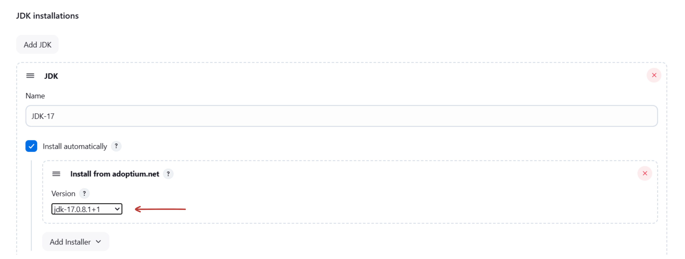
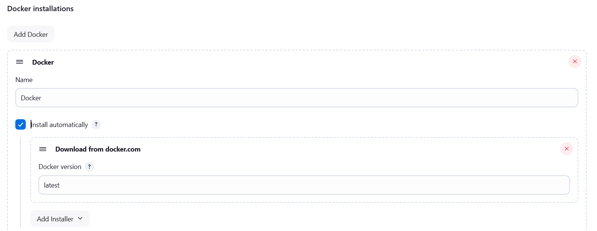
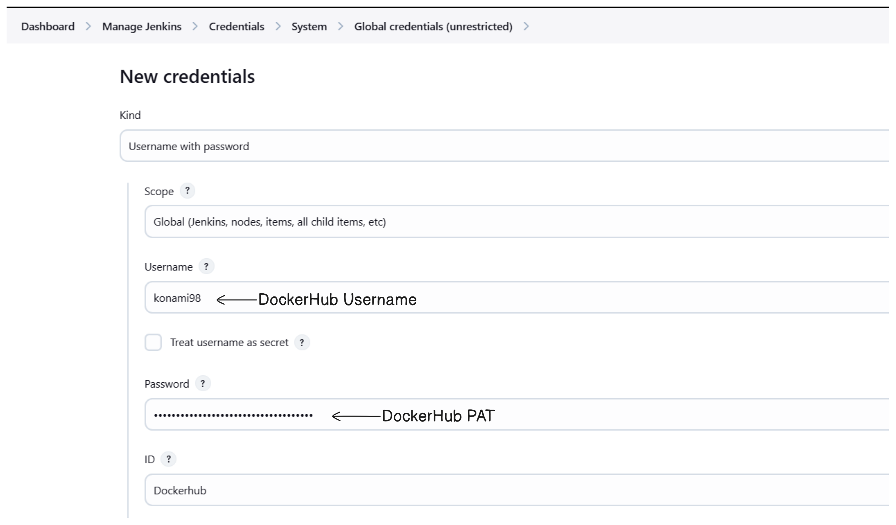
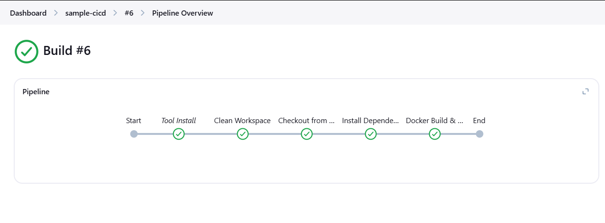
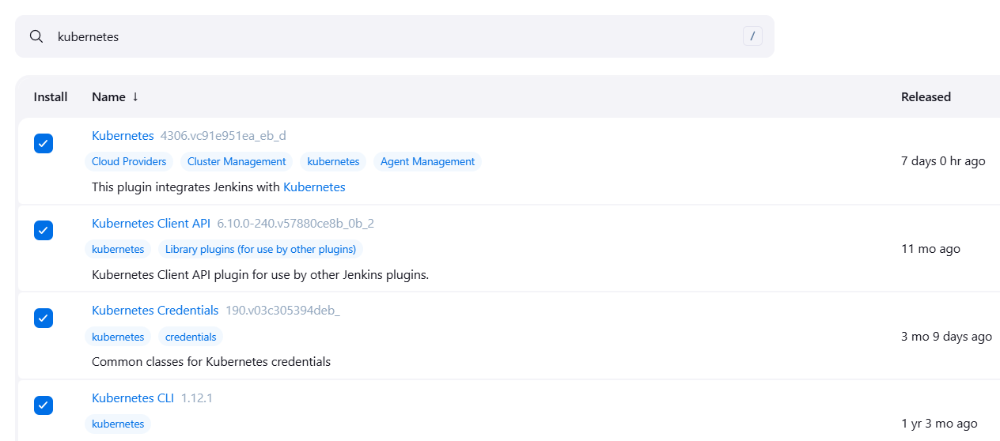
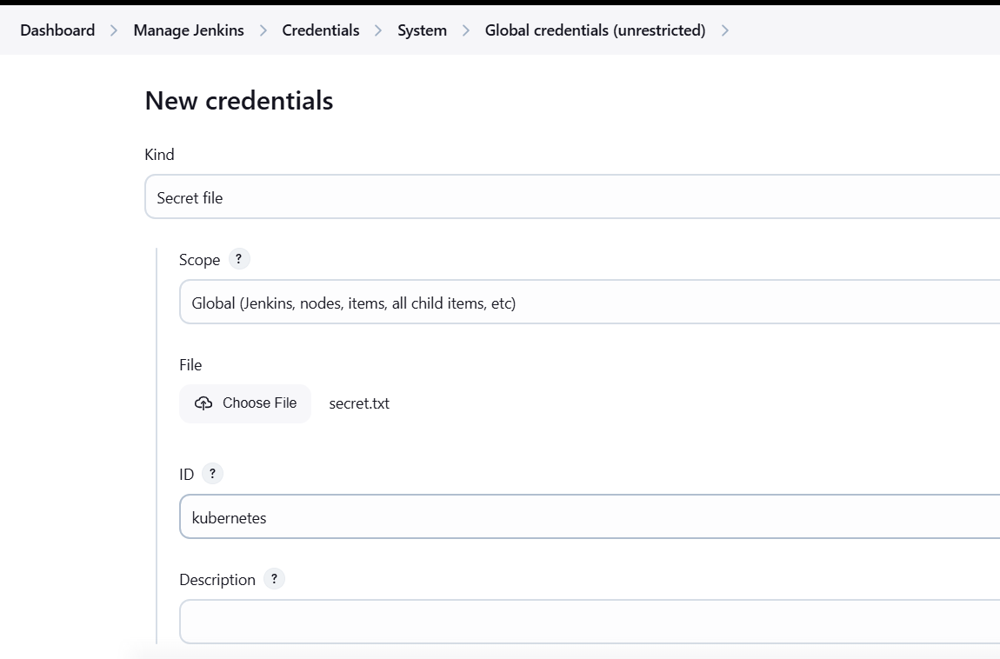
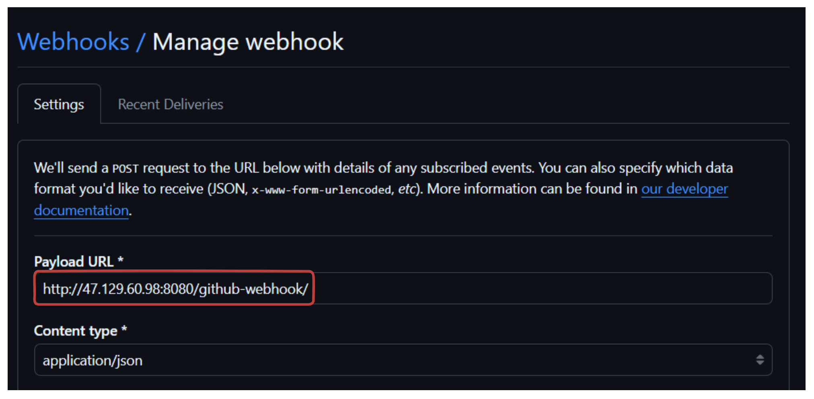
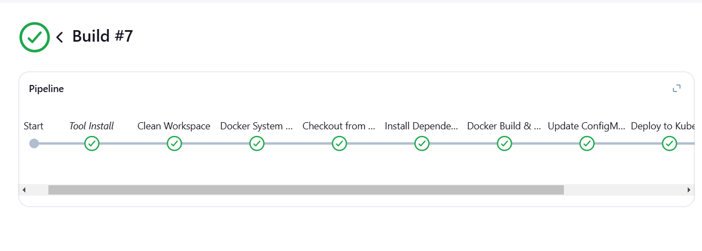

# CI CD Pipeline using Jenkins

This lab provides a step-by-step approach to building a robust CI/CD pipeline for a simple application using Jenkins, Docker, and Kubernetes. We will automate the entire process, from building the React application to deploying it in a Kubernetes cluster. The pipeline will leverage Jenkins to build, test, and push the Docker image to DockerHub. Subsequently, Kubernetes will manage the deployment of the containerized application, ensuring scalability and reliability. By the end of this guide, you will have a fully functional CI/CD pipeline that can be triggered with every code commit, providing a seamless path from development to production.

## Setting up AWS Infrastructure

We will create AWS infrastructure to setup a Jenkins server and k3s cluster. We will be using Pulumi to create the infrastructure.

**1. Create a Directory for Your Infrastructure**

```sh
mkdir jenkins-infra-aws
cd jenkins-infra-aws
```

**2. Install Python `venv`**

```sh
sudo apt update
sudo apt install python3.8-venv -y
```

**3. Create a New Pulumi Project**

```sh
pulumi new aws-python
```
**4. Update the `__main.py__` file:**

```python
import pulumi
import pulumi_aws as aws
import os
import base64


# Configuration setup
t3_small = 't3.small' # Change this to your desired instance type
t3_medium = 't3.medium'
ami = "ami-06650ca7ed78ff6fa" # Change this to your desired AMI


# Read installation scripts
with open('jenkins_install.sh', 'r') as file:
    jenkins_script = file.read()

with open('docker_install.sh', 'r') as file:
    docker_script = file.read()

# Create a VPC
vpc = aws.ec2.Vpc(
    'jenkins-k3s',
    cidr_block='10.0.0.0/16',
    enable_dns_hostnames=True,
    enable_dns_support=True,
    tags={
        'Name': 'Jenkins-k3s-vpc',
    }
)

# Create subnets
public_subnet = aws.ec2.Subnet('public-subnet',
    vpc_id=vpc.id,
    cidr_block='10.0.1.0/24',
    map_public_ip_on_launch=True,
    availability_zone='ap-southeast-1a',
    tags={
        'Name': 'public-subnet',
    }
)

# Internet Gateway
igw = aws.ec2.InternetGateway(
    'internet-gateway',
    vpc_id=vpc.id,
    tags={
        'Name': 'jenkins-k3s-igw'
    }
)

# Route Table
public_route_table = aws.ec2.RouteTable(
    'public-route-table', 
    vpc_id=vpc.id,
    routes=[{
        'cidr_block': '0.0.0.0/0',
        'gateway_id': igw.id,
    }],
    tags={
        'Name': 'public-route-table',
    }
)

# Route Table Association
public_route_table_association = aws.ec2.RouteTableAssociation(
    'public-route-table-association',
    subnet_id=public_subnet.id,
    route_table_id=public_route_table.id
)

# Security Group for Jenkins Master
jenkins_master_sg = aws.ec2.SecurityGroup("jenkins-master-sg",
    description='Jenkins Master Security Group',
    vpc_id=vpc.id,
    ingress=[
        # SSH access
        {
            "protocol": "tcp",
            "from_port": 22,
            "to_port": 22,
            "cidr_blocks": ["0.0.0.0/0"],
            "description": "SSH access"
        },
        # Jenkins web interface
        {
            "protocol": "tcp",
            "from_port": 8080,
            "to_port": 8080,
            "cidr_blocks": ["0.0.0.0/0"],
            "description": "Jenkins web interface"
        },
        # Jenkins JNLP port for agent connection
        {
            "protocol": "tcp",
            "from_port": 50000,
            "to_port": 50000,
            "cidr_blocks": ["10.0.0.0/16"],
            "description": "Jenkins agent connection"
        },
        # Add port for kubectl
        {
            "protocol": "tcp",
            "from_port": 6443,
            "to_port": 6443,
            "cidr_blocks": ["10.0.0.0/16"],
            "description": "Kubernetes API access"
        }
    ],
    egress=[{
        "protocol": "-1",
        "from_port": 0,
        "to_port": 0,
        "cidr_blocks": ["0.0.0.0/0"],
        "description": "Allow all outbound traffic"
    }],
    tags={
        'Name': 'jenkins-master-sg',
    }
)

# Security Group for k3s Master
k3s_master_sg = aws.ec2.SecurityGroup("k3s-master-sg",
    description='k3s Master Security Group',
    vpc_id=vpc.id,
    ingress=[
        # SSH access
        {
            "protocol": "tcp",
            "from_port": 22,
            "to_port": 22,
            "cidr_blocks": ["0.0.0.0/0"],
            "description": "SSH access"
        },
        # Kubernetes API server
        {
            "protocol": "tcp",
            "from_port": 6443,
            "to_port": 6443,
            "cidr_blocks": ["10.0.0.0/16"],
            "description": "Kubernetes API server"
        },
        # etcd client port
        {
            "protocol": "tcp",
            "from_port": 2379,
            "to_port": 2380,
            "cidr_blocks": ["10.0.0.0/16"],
            "description": "etcd client and peer communication"
        },
        # Kubelet API
        {
            "protocol": "tcp",
            "from_port": 10250,
            "to_port": 10250,
            "cidr_blocks": ["10.0.0.0/16"],
            "description": "Kubelet API"
        },
        # NodePort Services
        {
            "protocol": "tcp",
            "from_port": 30000,
            "to_port": 32767,
            "cidr_blocks": ["0.0.0.0/0"],
            "description": "NodePort Services"
        }
    ],
    egress=[{
        "protocol": "-1",
        "from_port": 0,
        "to_port": 0,
        "cidr_blocks": ["0.0.0.0/0"],
        "description": "Allow all outbound traffic"
    }],
    tags={
        'Name': 'k3s-master-sg',
    }
)


# Create user data script for Jenkins master
jenkins_user_data = f'''#!/bin/bash
# Write installation scripts
cat > /tmp/jenkins_install.sh << 'EOL'
{jenkins_script}
EOL

cat > /tmp/docker_install.sh << 'EOL'
{docker_script}
EOL

# Make scripts executable
chmod +x /tmp/jenkins_install.sh
chmod +x /tmp/docker_install.sh

# Run installation scripts
/tmp/docker_install.sh
/tmp/jenkins_install.sh

# Install kubectl
curl -LO "https://dl.k8s.io/release/$(curl -L -s https://dl.k8s.io/release/stable.txt)/bin/linux/amd64/kubectl"
chmod +x kubectl
mv kubectl /usr/local/bin/

# Create .kube directory
mkdir -p /var/lib/jenkins/.kube
chown jenkins:jenkins /var/lib/jenkins/.kube
'''

# EC2 Jenkins Master
jenkins_master = aws.ec2.Instance(
    'jenkins-master-instance',
    instance_type=t3_medium,
    ami=ami,
    subnet_id=public_subnet.id,
    vpc_security_group_ids=[jenkins_master_sg.id],
    key_name='jenkins_k3s',
    user_data=jenkins_user_data,
    tags={
        'Name': 'Jenkins Master Node',
    }
)


# k3s installation script
k3s_install_script = '''#!/bin/bash
# Install k3s
curl -sfL https://get.k3s.io | sh -

# Wait for k3s to be ready
sleep 30

# Make kubeconfig accessible
sudo chmod 644 /etc/rancher/k3s/k3s.yaml
'''

k3s_master = aws.ec2.Instance(
    'k3s-master-instance',
    instance_type=t3_medium,
    ami=ami,
    subnet_id=public_subnet.id,
    vpc_security_group_ids=[k3s_master_sg.id],
    key_name='jenkins_k3s',
    user_data=k3s_install_script,
    tags={
        'Name': 'k3s Master Node',
    }
)

# Outputs
pulumi.export('Jenkins_Master_PublicIP', jenkins_master.public_ip)
pulumi.export('k3s_Master_PublicIP', k3s_master.public_ip)
pulumi.export('Jenkins_Master_privateIP', jenkins_master.private_ip)
pulumi.export('k3s_Master_privateIP', k3s_master.private_ip)

def create_config_file(ip_addresses):
    jenkins_master_ip, k3s_master_ip = ip_addresses
    
    config_content = f"""Host jenkins-master
    HostName {jenkins_master_ip}
    User ubuntu
    IdentityFile ~/.ssh/jenkins_k3s.id_rsa

    Host master
    HostName {k3s_master_ip}
    User ubuntu
    IdentityFile ~/.ssh/jenkins_k3s.id_rsa
    
""" 
    config_path = os.path.expanduser("~/.ssh/config")
    os.makedirs(os.path.dirname(config_path), exist_ok=True)
    with open(config_path, "w") as config_file:
        config_file.write(config_content)

pulumi.Output.all(
    jenkins_master.public_ip,
    k3s_master.public_ip
).apply(create_config_file)
```

**5. Generate the key Pair**

```sh
cd ~/.ssh/
aws ec2 create-key-pair --key-name jenkins_k3s --output text --query 'KeyMaterial' > jenkins_k3s.id_rsa
chmod 400 jenkins_k3s.id_rsa
```


**6. Create a file named `jenkins_install.sh` and add the following content:**

```sh
#!/bin/bash

# Function to print colored output
print_message() {
    GREEN='\033[0;32m'
    NC='\033[0m'
    echo -e "${GREEN}$1${NC}"
}

# Function to check if command was successful
check_status() {
    if [ $? -eq 0 ]; then
        print_message "✓ Success: $1"
    else
        echo "✗ Error: $1"
        exit 1
    fi
}

# Check if script is run as root
if [ "$EUID" -ne 0 ]; then 
    echo "Please run as root (use sudo)"
    exit 1
fi

# Set Jenkins port (default 8081 or use command line argument)
JENKINS_PORT=${1:-8080}

print_message "Starting Jenkins installation..."
print_message "Jenkins will be configured to run on port: $JENKINS_PORT"

# Update system packages
print_message "Updating system packages..."
apt update
apt upgrade -y
check_status "System update completed"

# Install Java
print_message "Installing Java..."
apt install -y openjdk-17-jre-headless
check_status "Java installation completed"

# Verify Java installation
java -version
check_status "Java verification"

# Add Jenkins repository
print_message "Adding Jenkins repository..."
curl -fsSL https://pkg.jenkins.io/debian-stable/jenkins.io-2023.key | tee \
    /usr/share/keyrings/jenkins-keyring.asc > /dev/null

echo deb [signed-by=/usr/share/keyrings/jenkins-keyring.asc] \
    https://pkg.jenkins.io/debian-stable binary/ | tee \
    /etc/apt/sources.list.d/jenkins.list > /dev/null
check_status "Jenkins repository added"

# Install Jenkins
print_message "Installing Jenkins..."
apt update
apt install -y jenkins
check_status "Jenkins installation completed"

# Configure Jenkins port
print_message "Configuring Jenkins port..."
sed -i "s/HTTP_PORT=.*/HTTP_PORT=$JENKINS_PORT/" /etc/default/jenkins
sed -i "s/--httpPort=[0-9]*/--httpPort=$JENKINS_PORT/" /etc/default/jenkins
check_status "Port configuration completed"

# Update systemd service file
print_message "Updating systemd service..."
sed -i "s|^ExecStart=.*|ExecStart=/usr/bin/jenkins --httpPort=$JENKINS_PORT|" /lib/systemd/system/jenkins.service
check_status "Systemd service updated"

# Reload systemd and restart Jenkins
print_message "Restarting Jenkins..."
systemctl daemon-reload
systemctl restart jenkins
check_status "Jenkins restart completed"

# Wait for Jenkins to start
print_message "Waiting for Jenkins to start..."
sleep 30

# Get initial admin password
if [ -f /var/lib/jenkins/secrets/initialAdminPassword ]; then
    ADMIN_PASSWORD=$(cat /var/lib/jenkins/secrets/initialAdminPassword)
    print_message "Jenkins initial admin password: $ADMIN_PASSWORD"
else
    echo "Warning: Could not find initial admin password"
fi

print_message "\nInstallation completed!"
print_message "Please allow a few minutes for Jenkins to fully start"
print_message "Access Jenkins at: http://your-server-ip:$JENKINS_PORT"
```

**7. Create a file named `docker_install.sh` and add the following content:**

```sh
#!/bin/bash

# Update package database
#!/bin/bash

# Update package database
echo "Updating package database..."
sudo apt update

# Upgrade existing packages
echo "Upgrading existing packages..."
sudo apt upgrade -y

# Install required packages
echo "Installing required packages..."
sudo apt install -y apt-transport-https ca-certificates curl software-properties-common

# Add Docker’s official GPG key
echo "Adding Docker’s GPG key..."
curl -fsSL https://download.docker.com/linux/ubuntu/gpg | sudo gpg --dearmor -o /usr/share/keyrings/docker-archive-keyring.gpg

# Add Docker APT repository
echo "Adding Docker APT repository..."
echo "deb [arch=amd64 signed-by=/usr/share/keyrings/docker-archive-keyring.gpg] https://download.docker.com/linux/ubuntu $(lsb_release -cs) stable" | sudo tee /etc/apt/sources.list.d/docker.list > /dev/null

# Update package database with Docker packages
echo "Updating package database with Docker packages..."
sudo apt update

# Install Docker
echo "Installing Docker..."
sudo apt install -y docker-ce

# Start Docker manually in the background
echo "Starting Docker manually in the background..."
sudo dockerd > /dev/null 2>&1 &

# Add current user to Docker group
echo "Adding current user to Docker group..."
sudo usermod -aG docker ${USER}

echo "Adding jenkins user to Docker group..."
sudo usermod -aG docker jenkins

# Apply group changes
echo "Applying group changes..."
newgrp docker

# Set Docker socket permissions
echo "Setting Docker socket permissions..."
sudo chmod 666 /var/run/docker.sock

# Print Docker version
echo "Verifying Docker installation..."
docker --version
```

**8. Create Infra**

```sh
pulumi up --yes
```


## SSH into the Jenkins Master

After the infrastructure is created, SSH into the Jenkins Master using the following command:

```sh
ssh jenkins-master
```


**2. Access the Jenkins UI**

We can access the Jenkins UI, using the Public IP of Jenkins Instance and port (8080):

```
http://<jenkins-public-ip>:8080
```

To get the password, run the following command:

```sh
sudo cat /var/lib/jenkins/secrets/initialAdminPassword
```
This will output the initial admin password. Use this password to log in to the Jenkins UI.

## Install Required Plugins and Tools

To complete our CI/CD pipeline, we need to install some Plugins. Navigate to **Manage Jenkins** > **Manage Plugins** > **Available Plugins** and install the following plugings.

- **Eclipse**:
    - Name: `Eclipse`
    - Enable automatic installation.

- **NodeJS**:
    - Name: `Node 16`
    - Enable automatic installation.
    - Version: `16.x`.

- **Docker**:
    - Name: `Docker`.
    - Enable automatic installation.
    - Installer: Download from the official site # Change this to your desired version

> Change the version of the tools to your desired version.

**Required Tools**

Goto **Manage Jenkins** > **Manage Tools** > **Install Tools** and install the following tools.

- **NodeJS**:
    - Name: `NODE-18`
    - Version: `18.x`

    

- **JDK**:
    - Name: `JDK-17`
    - Version: `17.0.8.1+1`

    


- **Docker**:
    - Name: `Docker`
    - Version: `latest`

    

**Integrate DockerHub**

1. Create a DockerHub Personal Access Token:
   - Go to DockerHub > **Account Settings** > **Security** > **Access Tokens**.
   - Generate a new token and copy it.

   

2. Add DockerHub credentials to Jenkins:
   - Navigate to **Manage Jenkins** > **Credentials** > **System** > **Global Credentials**.
   - Add a new credential:
     - Type: `Username with password`.
     - Username: Your DockerHub username.
     - Password: The generated token.
     - ID: `dockerhub`.
     - Description: `DockerHub Credentials`.

     

## **Jenkins Pipeline**

Now, we will create a jenkins pipeline to build and push a Docker image to DockerHub.

**1. In the Jenkins dashboard, create a new pipeline job:**

- Name: `Sample-cicd`.
- Type: `Pipeline`.


**2. Configure the pipeline script:**

Check the discard old build option.


Add the following script to the pipeline:

```groovy
pipeline {
    agent any
    tools {
        jdk 'JDK-17'
        nodejs 'NODE-18'
    }
    environment {
        DOCKER_IMAGE = 'konami98/simple-react'
    }
    options {
        timeout(time: 30, unit: 'MINUTES')
    }
    stages {
        stage('Clean Workspace') {
            steps {
                cleanWs()
            }
        }
        stage('Docker System Cleanup') {
            steps {
                sh '''
                    docker system prune -af --volumes || true
                    if docker images ${DOCKER_IMAGE} -q | grep -q .; then
                        docker rmi $(docker images ${DOCKER_IMAGE} -q) || true
                    fi
                '''
            }
        }
        stage('Checkout from Git') {
            steps {
                git branch: 'main', url: 'https://github.com/Konami33/Simple-React.git'
            }
        }
        stage('Install Dependencies') {
            steps {
                dir('frontend') {
                    sh """
                        npm cache clean --force
                        rm -rf node_modules package-lock.json
                        npm install
                    """
                }
            }
        }
        stage('Docker Build & Push') {
            steps {
                script {
                    try {
                        def imageTag = "${BUILD_NUMBER}"
                        def fullImageName = "${DOCKER_IMAGE}:${imageTag}"
                        
                        dir('frontend') {
                            withDockerRegistry(credentialsId: 'Dockerhub', toolName: 'Docker') {
                                sh """
                                    docker build --no-cache -t ${fullImageName} . || (echo 'Docker build failed' && exit 1)
                                    docker push ${fullImageName} || (echo 'Docker push failed' && exit 1)
                                """
                            }
                        }
                    } catch (Exception e) {
                        echo "Docker build or push failed: ${e.getMessage()}"
                        throw e
                    }
                }
            }
        }
    }
}
```

> Replace `<git-repo-url>` with the URL of your git repository.
> Replace `<dockerhub-username>` with your DockerHub username.
> Replace `<image-name>` with the name of your Docker image.


### **Pipeline Overview**

This Jenkins pipeline is a scripted pipeline for automating the CI/CD process of a React project. It defines several stages, tools, and environment configurations, utilizing Docker to build and push an image of the application to a container registry.

### **Pipeline Details**

#### 1. **Tools**
- Configures the tools required for the pipeline:
  - `jdk 'JDK-17'`: Uses Java Development Kit version 17.
  - `nodejs 'NODE-18'`: Uses Node.js version 18.

We have already configured the tools in the Jenkins dashboard.

#### 2. **Environment**
- `DOCKER_IMAGE = 'konami98/simple-react'`: Defines an environment variable for the Docker image name to simplify reuse throughout the pipeline.

### **Stages**

The pipeline consists of the following stages:

#### **Stage 1: Clean Workspace**
- `cleanWs()`: Cleans up the Jenkins workspace to ensure no leftover files from previous builds. This is essential to avoid unexpected behavior caused by old files.

---

#### **Stage 2: Docker System Cleanup**
- Executes shell commands to clean up Docker resources:
  1. `docker system prune -af --volumes`: Removes all unused Docker objects, including images, containers, networks, and volumes.
  2. `docker rmi $(docker images ${DOCKER_IMAGE} -q)`: Removes the specific Docker image if it exists (`${DOCKER_IMAGE}` is the name from the environment variable).

The `|| true` ensures that the command does not fail if there are no matching images or unused objects to clean.

---

#### **Stage 3: Checkout from Git**
- Uses the `git` step to clone the project from the GitHub repository's `main` branch:
  ```groovy
  git branch: 'main', url: '<git-repo-url>'
  ```

---

#### **Stage 4: Install Dependencies**
- Switches to the `frontend` directory and installs the necessary dependencies for the React application:
  1. `npm cache clean --force`: Clears the npm cache.
  2. `rm -rf node_modules package-lock.json`: Removes any existing `node_modules` folder and `package-lock.json` file to ensure a clean installation.
  3. `npm install`: Installs the dependencies listed in `package.json`.

#### **Stage 5: Docker Build & Push**
- **Purpose**: Builds a Docker image for the application and pushes it to DockerHub.
- **Steps**:
  1. Defines variables:
     - `imageTag`: Sets the image tag to the current Jenkins build number (`${BUILD_NUMBER}`).
     - `fullImageName`: Combines the image name and tag (e.g., `konami98/simple-react:123`).
  2. Changes to the `frontend` directory.
  3. Executes the Docker commands inside a Docker registry context:
     - `docker build --no-cache -t ${fullImageName} .`: Builds the Docker image with no cache.
     - `docker push ${fullImageName}`: Pushes the image to DockerHub.

- **Error Handling**:
  - If the build or push fails, the pipeline logs an error message and throws an exception to stop execution.

- **Docker Registry Credentials**:
  - `withDockerRegistry(credentialsId: 'Dockerhub', toolName: 'Docker')`: Uses the Docker credentials stored in Jenkins to authenticate with DockerHub.


**3. Save and build the job.**

Check the `Sample-cicd` job in the Jenkins dashboard and click on `Build Now` to trigger the pipeline.



Monitor the build and check the logs to ensure the Docker image is built and pushed successfully. Check console output to ensure the Docker image is built and pushed successfully.

## Kubernetes Deployment

Now, we will deploy the application to the Kubernetes cluster. To do that, we need to install the required Jenkins plugins and configure the Kubernetes credentials in Jenkins.

### 1. Install Required Jenkins Plugins

1. Navigate to **Manage Jenkins** > **Plugins**.
2. Under the **Available Plugins** section, search for and install the following plugins:
   - Kubernetes
   - Kubernetes Credentials Provider
   - Kubernetes CLI
   - Pipeline: Kubernetes

   

### 2. Configure Kubernetes Credentials in Jenkins
1. Download the Kubernetes `config` file:
   - Access the server terminal and locate the `config` file, typically found in the `.kube` directory.
   - Save the file to your local machine.
2. Add the Kubernetes credentials in Jenkins:
   - Navigate to **Manage Jenkins** > **Manage Credentials**.
   - Select a credentials store (e.g., Global).
   - Click **Add Credentials** and set:
     - **Kind**: Secret file
     - **ID**: `kubernetes`
     - Upload the downloaded `config` file.
   - Click **OK**.

   

### 3. Access the k3s cluster from the Jenkins instance

To access the k3s cluster from the Jenkins instance, we'll need to follow these steps:

1. First, get the k3s kubeconfig from the k3s master node. On the k3s master:

    ```bash
    sudo cat /etc/rancher/k3s/k3s.yaml
    ```

2. Copy this config to the Jenkins master instance and place it in `/var/lib/jenkins/.kube/config`. You can either:

   a. Manually copy and paste:
   ```bash
   # On Jenkins master
   sudo mkdir -p /var/lib/jenkins/.kube
   sudo vim /var/lib/jenkins/.kube/config
   # Paste the content from k3s.yaml
   ```

3. Modify the kubeconfig file on Jenkins master:
   ```bash
   # Update the server URL in the config to use the k3s master's private IP
   sudo sed -i 's/127.0.0.1/<YOUR_K3S_MASTER_PRIVATE_IP>/' /var/lib/jenkins/.kube/config
   ```

4. Set proper ownership and permissions:
   ```bash
   sudo chown -R jenkins:jenkins /var/lib/jenkins/.kube
   sudo chmod 600 /var/lib/jenkins/.kube/config
   ```

5. Verify the connection (as jenkins user):
   ```bash
   sudo -u jenkins kubectl get nodes
   ```
---

### 3. Update Jenkins Pipeline Script

**1. Modify the Jenkins pipeline job. Add a new stage for deploying resources to Kubernetes:**

Here is the modified pipeline script:

```groovy
pipeline {
    agent any
    tools {
        jdk 'JDK-17'
        nodejs 'NODE-18'
    }
    environment {
        DOCKER_IMAGE = 'konami98/simple-react'
    }
    options {
        timeout(time: 30, unit: 'MINUTES')
    }
    stages {
        stage('Clean Workspace') {
            steps {
                cleanWs()
            }
        }
        stage('Docker System Cleanup') {
            steps {
                sh '''
                    docker system prune -af --volumes || true
                    if docker images ${DOCKER_IMAGE} -q | grep -q .; then
                        docker rmi $(docker images ${DOCKER_IMAGE} -q) || true
                    fi
                '''
            }
        }
        stage('Checkout from Git') {
            steps {
                git branch: 'main', url: 'https://github.com/Konami33/Simple-React.git'
            }
        }
        stage('Install Dependencies') {
            steps {
                dir('frontend') {
                    sh """
                        npm cache clean --force
                        rm -rf node_modules package-lock.json
                        npm install
                    """
                }
            }
        }
        stage('Docker Build & Push') {
            steps {
                script {
                    try {
                        def imageTag = "${BUILD_NUMBER}"
                        def fullImageName = "${DOCKER_IMAGE}:${imageTag}"
                        
                        dir('frontend') {
                            withDockerRegistry(credentialsId: 'Dockerhub', toolName: 'Docker') {
                                sh """
                                    docker build --no-cache -t ${fullImageName} . || (echo 'Docker build failed' && exit 1)
                                    docker push ${fullImageName} || (echo 'Docker push failed' && exit 1)
                                """
                            }
                        }
                    } catch (Exception e) {
                        echo "Docker build or push failed: ${e.getMessage()}"
                        throw e
                    }
                }
            }
        }
        stage('Update ConfigMap') {
            steps {
                script {
                    try {
                        def imageTag = "${BUILD_NUMBER}"
                        withKubeConfig([credentialsId: 'kubernetes']) {
                            sh """
                                kubectl create configmap image-tag-config \
                                    --from-literal=IMAGE_TAG=${imageTag} \
                                    --dry-run=client -o yaml | \
                                kubectl apply -f - || (echo 'ConfigMap update failed' && exit 1)
                            """
                        }
                    } catch (Exception e) {
                        echo "ConfigMap update failed: ${e.getMessage()}"
                        throw e
                    }
                }
            }
        }
        stage('Deploy to Kubernetes') {
            steps {
                script {
                    try {
                        def imageTag = "${BUILD_NUMBER}"
                        withKubeConfig([credentialsId: 'kubernetes']) {
                            sh """
                                # Verify kubectl connection
                                kubectl get nodes || (echo 'Kubernetes cluster connection failed' && exit 1)
                                
                                # Replace image tag in deployment file
                                sed -i 's|${DOCKER_IMAGE}:[^\"]*|${DOCKER_IMAGE}:${imageTag}|' kubernetes/deployment.yaml
                                
                                # Apply the manifests with error checking
                                kubectl apply -f kubernetes/deployment.yaml || (echo 'Deployment apply failed' && exit 1)
                                kubectl apply -f kubernetes/service.yaml || (echo 'Service apply failed' && exit 1)
                                
                                # Wait for deployment with timeout
                                timeout 300s kubectl rollout status deployment/simple-react || (echo 'Deployment rollout failed' && exit 1)
                                
                                # Verify deployment
                                kubectl get pods | grep simple-react
                            """
                        }
                    } catch (Exception e) {
                        echo "Kubernetes deployment failed: ${e.getMessage()}"
                        throw e
                    }
                }
            }
        }
    }
    post {
        always {
            echo "Pipeline execution completed."
            sh 'docker system prune -af --volumes || true'
        }
        success {
            echo "Deployment successful!"
            echo "Access the application at NodePort 30000"
        }
        failure {
            echo "Deployment failed. Please check the logs."
            script {
                try {
                    withKubeConfig([credentialsId: 'kubernetes']) {
                        sh """
                            echo 'Kubernetes Deployment Status:'
                            kubectl get deployments
                            echo 'Pod Status:'
                            kubectl get pods
                            echo 'Recent Pod Logs:'
                            kubectl logs -l app=simple-react --tail=50 || true
                        """
                    }
                } catch (Exception e) {
                    echo "Failed to fetch debug information: ${e.getMessage()}"
                }
            }
        }
    }
}
```

Here's the explanation of the two pipeline stages (`Update ConfigMap` and `Deploy to Kubernetes`) and the `post` section:

### **Stage: Update ConfigMap**

#### **Purpose**:
This stage updates a Kubernetes ConfigMap to store the Docker image tag (`BUILD_NUMBER`). This can be used by other resources (e.g., deployments) to retrieve and apply the correct image version dynamically.

#### **Steps**:
1. **Retrieve Build Number**:
   - `def imageTag = "${BUILD_NUMBER}"` stores the current Jenkins build number to be used as the image tag.
   
2. **Kubernetes Context**:
   - `withKubeConfig([credentialsId: 'kubernetes'])`: Configures access to the Kubernetes cluster using the credentials stored in Jenkins.

3. **Create/Update ConfigMap**:
   - Executes a `kubectl create configmap` command to create a new ConfigMap with the key `IMAGE_TAG` and value as the current build number.
   - The `--dry-run=client -o yaml` flag ensures the command generates a ConfigMap manifest without actually creating it. This manifest is piped to `kubectl apply` to apply the configuration.
   - The `||` part ensures the pipeline logs a failure message and exits if the command fails.

4. **Error Handling**:
   - Uses a `try-catch` block to handle errors. If the ConfigMap update fails, an error message is logged, and the pipeline terminates.

---

### **Stage: Deploy to Kubernetes**

#### **Purpose**:
This stage deploys the updated application Docker image to the Kubernetes cluster by modifying the deployment manifest and applying it.

#### **Steps**:

1. **Retrieve Build Number**:
   - The `imageTag` variable is set to the current Jenkins build number.

2. **Verify Kubernetes Connection**:
   - Runs `kubectl get nodes` to ensure the connection to the Kubernetes cluster is working. If this fails, the stage logs an error and exits.

3. **Update Deployment Manifest**:
   - The `sed` command updates the image tag in the deployment YAML file (`kubernetes/deployment.yaml`) to point to the newly built Docker image (`DOCKER_IMAGE:BUILD_NUMBER`).

4. **Apply Kubernetes Manifests**:
   - `kubectl apply -f kubernetes/deployment.yaml`: Deploys the updated application.
   - `kubectl apply -f kubernetes/service.yaml`: Applies the Kubernetes service definition.
   - Both commands include error checking (`||`) to log a failure and exit if something goes wrong.

5. **Wait for Rollout**:
   - `kubectl rollout status deployment/simple-react`: Waits for the deployment to finish rolling out. If it times out (300 seconds), it logs a failure.

6. **Verify Deployment**:
   - Lists all pods with `kubectl get pods | grep simple-react` to confirm the deployment succeeded.

7. **Error Handling**:
   - Errors in the stage are caught, logged, and the pipeline terminates.

---

### **Post Section**

The `post` block contains actions to execute after the pipeline, regardless of the outcome.

#### **`always`**:
- **Logs Completion**:
  - Outputs a message that the pipeline has completed execution.
- **Clean Docker Resources**:
  - Runs `docker system prune` to remove unused Docker resources and volumes to free up space.

#### **`success`**:
- **Logs Success**:
  - Outputs a success message indicating the deployment succeeded.
  - Provides instructions to access the application using the NodePort `30000`.

#### **`failure`**:
- **Logs Failure**:
  - Outputs an error message indicating the deployment failed.
- **Debug Information**:
  - Retrieves debug information from the Kubernetes cluster:
    1. `kubectl get deployments`: Lists the status of all deployments.
    2. `kubectl get pods`: Displays the status of all pods.
    3. `kubectl logs -l app=simple-react --tail=50`: Fetches the last 50 logs from the pods matching the label `app=simple-react`.
  - Includes error handling in case the debug commands fail.


### 4. Set Up Webhooks in GitHub
1. Enable webhooks in Jenkins:
   - Navigate to the pipeline configuration.
   - Check the **GitHub project** box and provide the repository URL.
   - Under **Build Triggers**, select **GitHub hook trigger for GITScm polling**.
2. Add a webhook in GitHub:
   - Go to the repository's **Settings** > **Webhooks**.
   - Click **Add webhook** and provide:
     - **Payload URL**: `http://<JENKINS_PUBLIC_IP>:8080/github-webhook/`
     - **Content type**: `application/json`
   - Click **Add webhook**.

   

   - Check the webhook status

   

---

### 5. Push Changes to Trigger the Pipeline
1. Make changes to your code or manifest files.
2. Commit and push the changes:
   ```bash
   git add .
   git commit -m "Updated application settings"
   git push origin main
   ```
3. Provide your GitHub personal access token if needed.

### 6. Verify Deployment
1. Check the Jenkins job:
   - The job should trigger automatically upon detecting changes in the GitHub repository.
   - Verify the pipeline's success in Jenkins.

   

   
2. Validate the DockerHub image:
   - Ensure the new image is uploaded to your DockerHub repository.
3. Check the application in Kubernetes:
   - Run `kubectl get services` to retrieve the application URL.
   - Access the application in your browser using the service URL.

### 7. Update and Verify Application Changes
1. Modify application code, e.g., change a UI element's color:
2. Commit and push the changes to the repository.
3. Jenkins will trigger the pipeline. Verify the changes in the deployed application.

### 8. Monitor the Pipeline


### Conclusion
By following these steps, you can set up an automated DevSecOps CI/CD pipeline using Jenkins and Kubernetes. The pipeline ensures seamless application updates and deployments triggered by changes in your GitHub repository.


