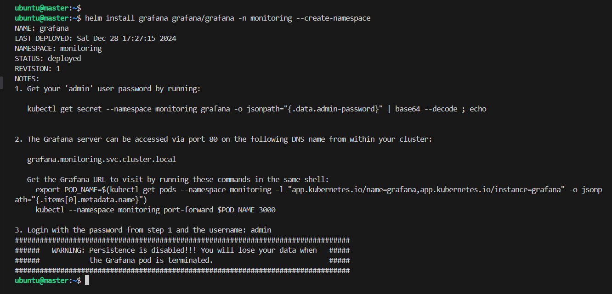
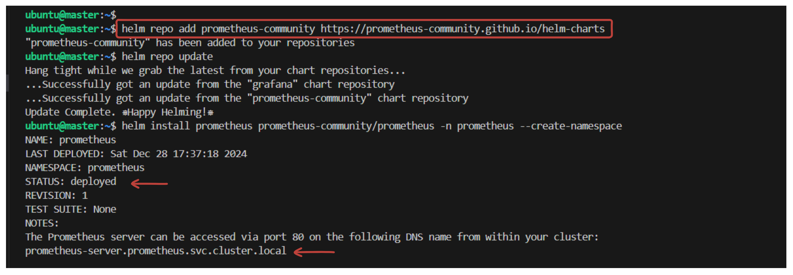
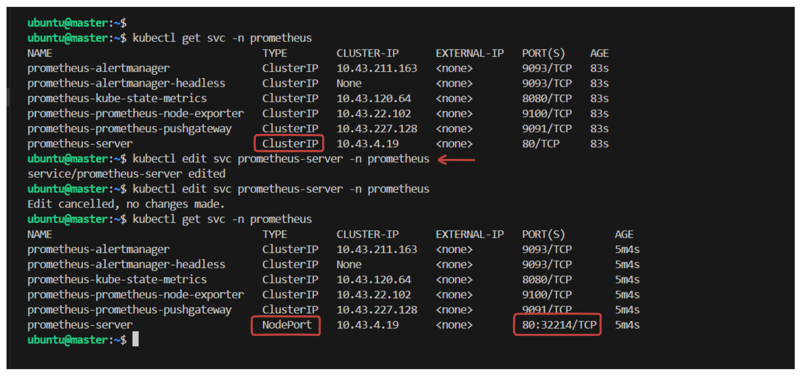
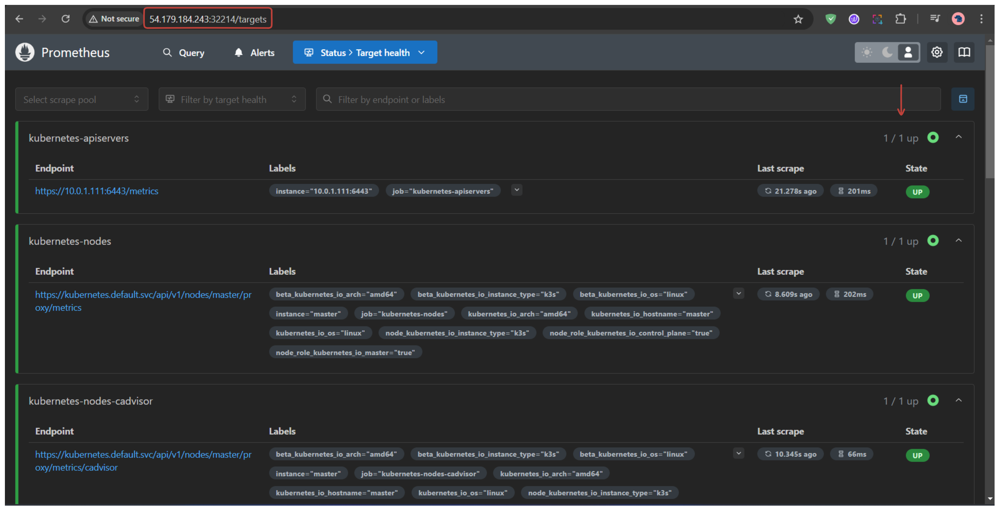
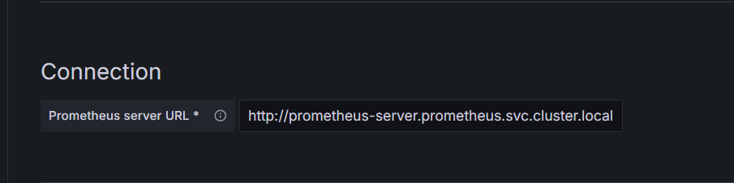
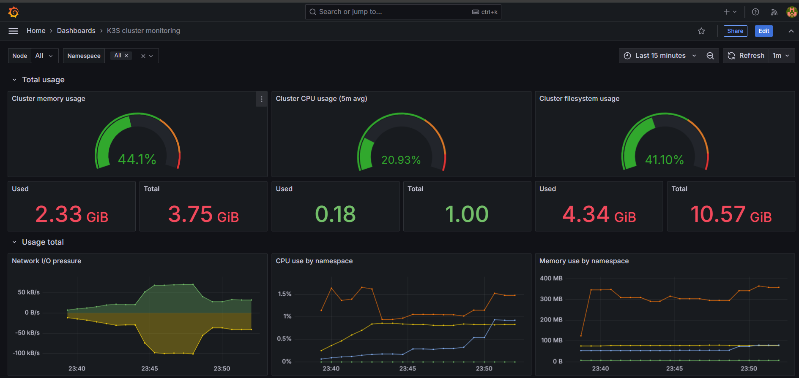

## CI/CD Pipeline using Jenkins and Monitoring Tools

## Monitoring the Kubernetes Cluster

1. Install helm

```sh
curl https://raw.githubusercontent.com/helm/helm/master/scripts/get-helm-3 | bash
```


```
sudo cp /etc/rancher/k3s/k3s.yaml ~/.kube/config
sudo chown $USER:$USER ~/.kube/config
chmod 600 ~/.kube/config
export KUBECONFIG=~/.kube/config
```




```sh
helm upgrade --install grafana grafana/grafana \
  --namespace monitoring \
  --set service.type=NodePort \
  --set service.nodePort=30080
```


```sh
kubectl get secret --namespace monitoring grafana -o jsonpath="{.data.admin-password}" | base64 --decode ; echo
```








## Data source

```
http://prometheus-server.prometheus.svc.cluster.local
```




## Dashboard

15282

