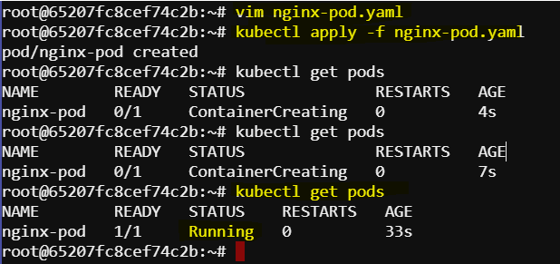
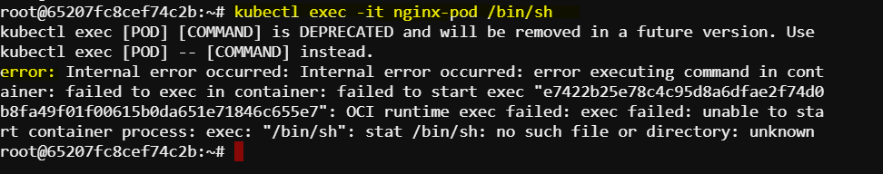
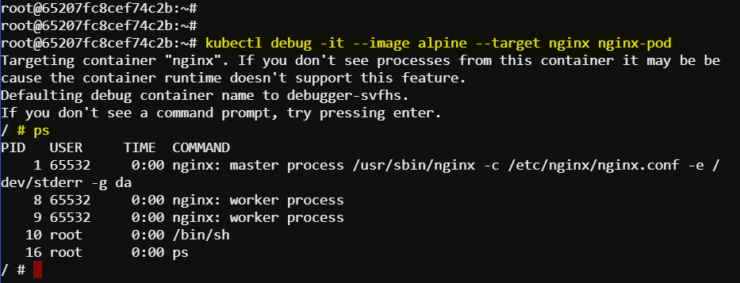
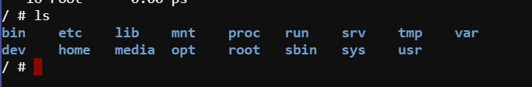
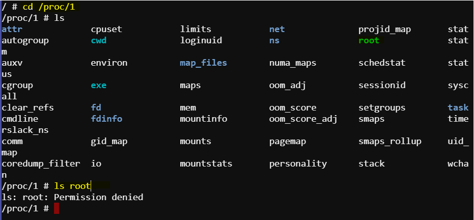
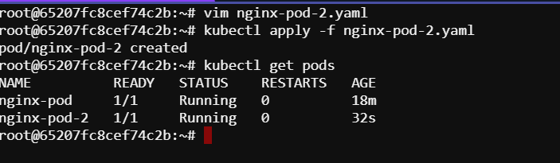
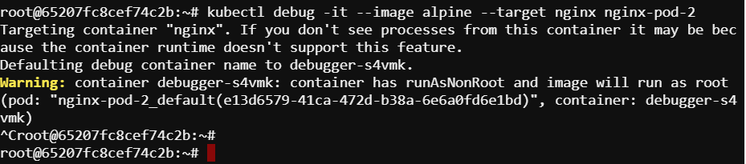
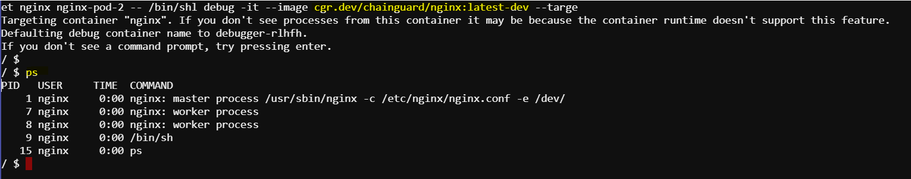
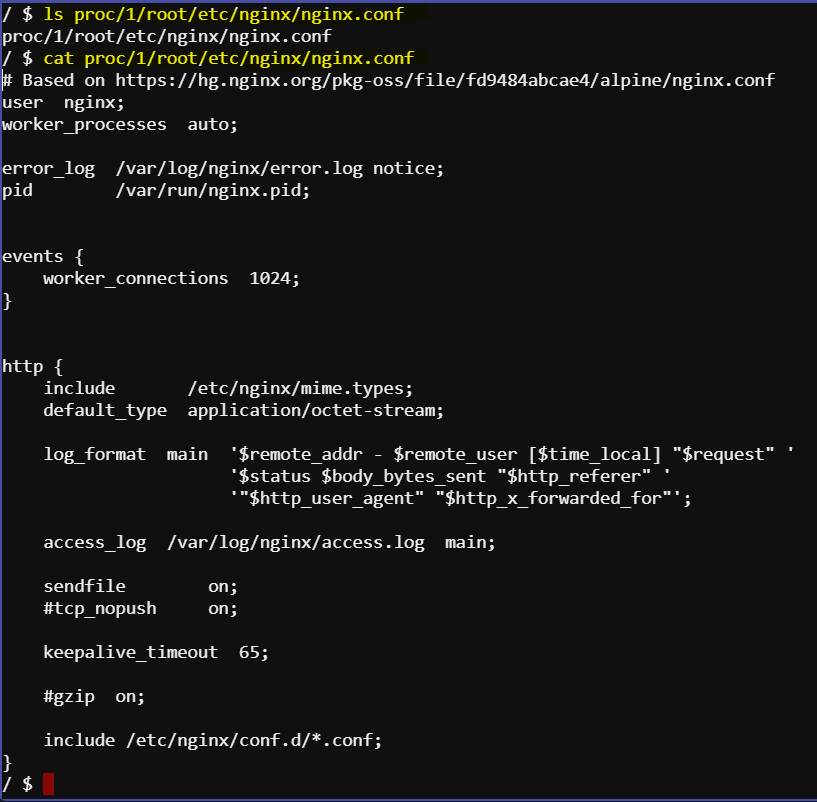
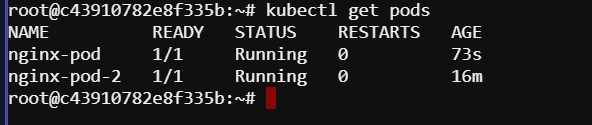

# Debugging Distroless Containers with Alternative Tools

## Introduction

While Docker Debug is a powerful tool, it requires a Docker Desktop Pro license. In this guide, we will explore a alternative tools for debugging distroless containers: *Kubectl Debug*

## Why Distroless Containers Pose a Challenge

Distroless containers do not include a shell, which means you cannot simply exec into the container to see what's going on as you would with a Debian or Alpine container. This necessitates additional tooling to facilitate debugging, typically by creating a temporary container that shares the file and process namespaces with the target container.

## Using Kubectl Debug

### Setting Up

1. *Deploy the NGINX Pod:*

To deploy the nginx pod, we can use a yaml manifest file:

```yaml
apiVersion: v1
kind: Pod
metadata:
  name: nginx-pod
  labels:
    app: nginx
spec:
  containers:
  - name: nginx
    image: cgr.dev/chainguard/nginx:latest
    ports:
    - containerPort: 8080
```

Apply the manifest file and create the pod:

```sh
kubectl apply -f nginx-pod.yaml
```

Ensure the pod is running:
```sh
kubectl get pods
```

Expected Output:



### Debugging with kubectl Debug

To debug this pod maybe its thrown an error or displaying the wrong output etc, if its a regular container we can attempt to `exec` into the pod

1. *Attempt to Exec into the Pod:*

```sh
kubectl exec -it nginx-pod -- /bin/sh
```



This will fail with bin/sh: no such file or directory because the container is distroless. Thats where the kubectl debug comes in.

2. *Run kubectl Debug:*
```sh
kubectl debug -it --image alpine --target nginx nginx-pod
```
This command attaches a debug container to the target container's namespace. Here in this command `image` is the debug container image. The target is the container we need, in this case `nginx`.

3. *Verify Access:*
```sh
ps aux
```

You should see the NGINX processes running.



### Accessing the File System

1. *List the File System:*
```sh
ls
```


This shows the file system of the debug container, not the target container. we can verify this by the command:

```sh
cat /etc/os-release
```


2. *Access the Target Container's File System:*
```sh
ls /etc/nginx/nginx.conf
ls /proc/1/root
```


    
This will fail with Permission denied due to namespace and permissions issues.

### Handling Non-Root Containers

1. *Deploy a Non-Root NGINX Pod:*

Now to deploy a non-root nginx pod, we can add `securityContext` to the previous definition file.

```yaml
apiVersion: v1
kind: Pod
metadata:
  name: nginx-pod-2
  labels:
    app: nginx
spec:
  securityContext:
    runAsNonRoot: true
  containers:
  - name: nginx
    image: cgr.dev/chainguard/nginx:latest
    ports:
    - containerPort: 8080
```

```sh
kubectl apply -f nginx-pod-2.yaml
```

Also make sure the pod is running.



2. *Run kubectl Debug on the Non-Root Pod:*
```sh
kubectl debug -it --image alpine --target nginx nginx-pod-2
```    
This command will fail due to the non-root security context.




3. *Use a Compatible Debug Image:*

We will use the `nginx:latest-dev` image which includes a shell and runs as the same non-root user as the target container.

```sh
kubectl debug -it --image cgr.dev/chainguard/nginx:latest-dev --target nginx nginx-pod-2 -- /bin/sh
```    

Now we are in the container, we can see the nginx processes by:

```sh
ps
```



To find out where the file system is

```sh
ls proc/1/root/etc/nginx/nginx.conf
cat proc/1/root/etc/nginx/nginx.conf
```

Now we can see the actual nginx conf from the target container.



<!-- ## Using Cdebug

### Setting Up

1. *Ensure the Pods are Running:*
```sh
kubectl get pods
```



```sh
cdebug exec -it --privileged pod/nginx-pod/nginx


```


### Debugging with Cdebug

1. *Run Cdebug with Privileged Mode:*
```sh
kubectl exec -it --image=alpine --target=nginx nginx-pod
    
    This grants access to both processes and the file system.

2. *Verify Access:*
    shell
    ps aux
    ls /
    

3. *Modify Files:*
    shell
    vi /etc/nginx/nginx.conf
    

### Handling Non-Root Containers

1. *Run Cdebug with Non-Root User:*
    shell
    kubectl exec -it --privileged --user=1000 --image=alpine --target=nginx-container nginx-nonroot-pod
    
    This ensures the debug container runs as the same non-root user.

2. *Verify Access:*
    shell
    ps aux
    ls /
    

## Conclusion

Both *Cytail Debug* and *Cdebug* provide robust solutions for debugging distroless containers. While Cytail Debug requires some adjustments to handle non-root containers, Cdebug simplifies the process with additional options like the --privileged and --user flags. Try these tools out and see which one best fits your workflow. -->