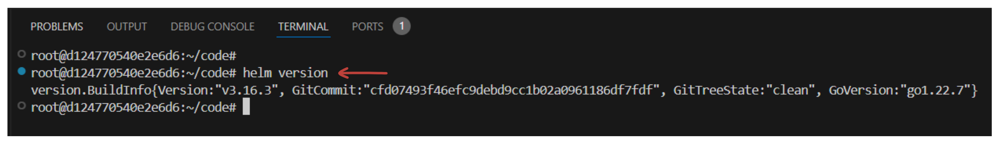
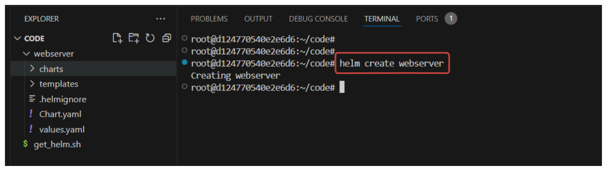
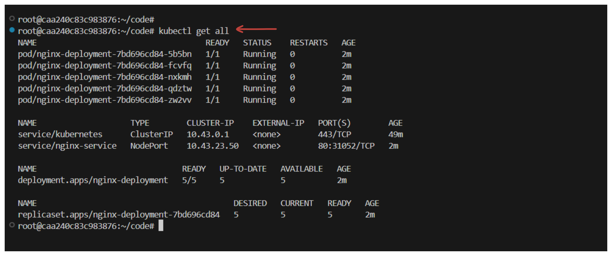

# The Ultimate Guide to Create Helm Charts

This documentation provides a step-by-step guide to creating Helm charts for deploying Kubernetes applications. By following this guide, you will learn how to generate a Helm chart, understand its folder structure, and apply templating to customize deployments for different environments such as development, staging, and production.

---

## **Introduction to Helm Charts**
Helm is a package manager for Kubernetes that simplifies the deployment process by bundling Kubernetes resources into reusable templates called charts. A Helm chart allows you to deploy your application with a single command, reducing complexity and ensuring consistency across environments.

---

## **Prerequisites**

**1. Helm CLI installed**

If you don't have Helm CLI installed, you can install it using the following command:
```bash
curl -fsSL -o get_helm.sh https://raw.githubusercontent.com/helm/helm/main/scripts/get-helm-3
chmod 700 get_helm.sh
./get_helm.sh
```

After installing Helm CLI, you can verify the installation by running:
```bash
helm version
```



**2. Kubernetes Cluster**

This lab is intended to be run on `Poridhi's` Kubernetes Cluster. You might need to change the kubeconfig path if you face any issues running helm commands.

```bash
kubectl config view --raw > /root/.kube/config
chmod 600 /root/.kube/config.
```
---

## **Steps to Create a Helm Chart**

### **1. Generate a Basic Helm Chart**
Helm provides a command to scaffold the necessary files and directories for a chart.

#### **Command:**
```bash
helm create <chart-name>
```

For example:
```bash
helm create web-server
```

This command generates a folder structure for the Helm chart:



---

### **2. Folder and File Structure Overview**

#### **Chart.yaml**
- Contains metadata about the Helm chart.
- Fields:
  - `name`: The name of the chart.
  - `version`: The version of the chart, incremented with changes.

#### **values.yaml**
- Contains default configuration values for the chart.
- Customizable by the user for specific environments.
- Example:
  ```yaml
  appName: my-app
  replicas: 2
  ```

#### **charts/**
- Stores dependencies for the chart.
- Only used for complex applications requiring other charts.

#### **templates/**
- Contains Kubernetes manifest templates (YAML files).
- Examples:
  - `deployment.yaml`
  - `service.yaml`
  - `configmap.yaml`

#### **.helmignore**
- Specifies files to ignore when packaging the Helm chart.

---

### **3. Customize the Chart**
#### **Clean Up Unnecessary Files**
The generated templates may include example files (e.g., an Nginx application). Remove unnecessary files to start fresh:
```bash
rm -rf templates/*
```

#### **Add Custom Templates**
Create the required Kubernetes resource files, such as:
- `deployment.yaml`
- `service.yaml`
- `configmap.yaml`

Example: `templates/deployment.yaml`
```yaml
apiVersion: apps/v1
kind: Deployment
metadata:
  name: {{ .Values.appName }}
spec:
  replicas: {{ .Values.replicas }}
  selector:
    matchLabels:
      app: {{ .Values.appName }}
  template:
    metadata:
      labels:
        app: {{ .Values.appName }}
    spec:
      containers:
        - name: {{ .Values.appName }}
          image: nginx
```

---

### **4. Deploy the Application**
#### **Install the Chart**
Run the following command to install the Helm chart:
```bash
helm install <release-name> <chart-directory>
```

Example:
```bash
helm install my-release ./web-app
```

Verify deployment:
```bash
kubectl get all
```
You should see resources such as Pods, Services, and Deployments.



#### **Access the Application**

To access the application, we can use Poridhi's loadbalancer.

**1. First, we need to get the NodeIP of the master node.**

```bash
kubectl get nodes -o wide
```

**2. Get the NodePort of the service.**

```bash
kubectl get svc
```

**3. Create a loadbalancer using the NodeIP and NodePort.**

**4. Access the application using the loadbalancer URL.**

---

### **5. Helm Templating for Customization**
Helm templating allows dynamic values to be injected into YAML files, enabling configurations for different environments.

#### **Add Values in `values.yaml`**
Define values in `values.yaml`:
```yaml
appName: my-app
replicas: 3
```

#### **Reference Values in Templates**
Use the `.Values` object in your templates:
```yaml
name: {{ .Values.appName }}
replicas: {{ .Values.replicas }}
```

#### **Upgrade the Release**
When changes are made, upgrade the release:
```bash
helm upgrade <release-name> <chart-directory> --values <path-to-values-file>
```

Example:
```bash
helm upgrade my-release ./web-app --values ./web-app/values.yaml
```

---

### **6. Test and Validate**
- **Test Templates:**
  Validate templates with:
  ```bash
  helm template <chart-directory>
  ```

- **Lint Chart:**
  Check for errors in the chart:
  ```bash
  helm lint <chart-directory>
  ```

---

## **Best Practices**
1. **Keep it Modular:**
   - Use the `charts/` directory for dependencies.
2. **Use Default Values:**
   - Provide sensible defaults in `values.yaml`.
3. **Version Control:**
   - Increment the `version` field in `Chart.yaml` for each update.
4. **Test Thoroughly:**
   - Test charts in all environments (Dev, Staging, Production).

---

## **Conclusion**
By following this guide, you now have the foundational skills to create, customize, and deploy Helm charts. This will allow you to streamline the Kubernetes application deployment process and maintain consistency across multiple environments. Explore further Helm features, such as hooks and dependencies, to enhance your deployments!