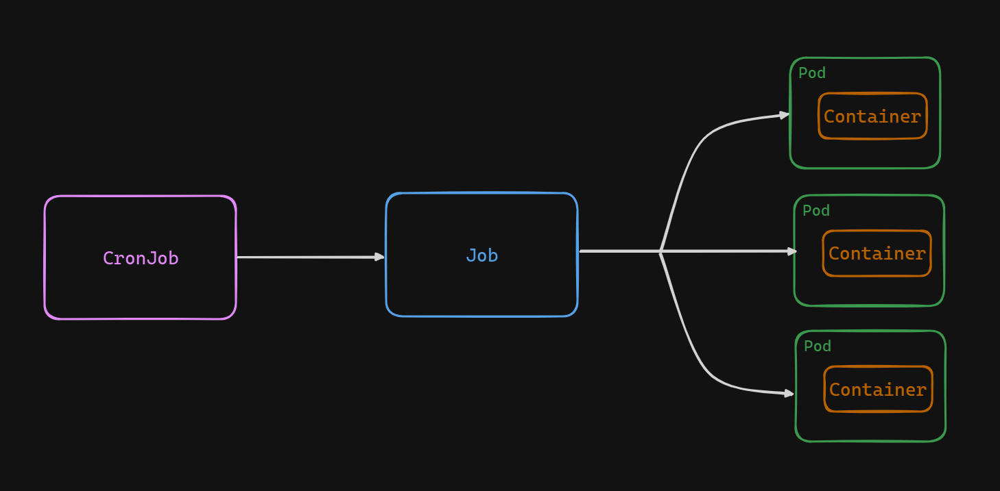

# Exploring CronJobs in Kubernetes

In the dynamic environment of Kubernetes, automation is key to efficiency. CronJobs provide a way to schedule and execute tasks at specific intervals, akin to the cron utility in Linux. In this lab, we'll delve into the intricacies of CronJobs in Kubernetes, understanding their workings and practical implementation.




### How CronJobs Work:
CronJobs are Kubernetes resources designed to run jobs at specified intervals. They function by creating Job resources on a predefined schedule. Each Job created by a CronJob carries out a specific task, following the schedule set by the CronJob definition. The main logic is implemented in the CronJob controller as part of kube-controller-manager. By default, it checks every ten seconds whether it should run a CronJob.


## CronJobs vs Jobs

**Scheduling:** CronJobs are designed for recurring tasks, allowing administrators to specify a schedule using cron-like syntax. In contrast, Jobs are created for one-time execution of tasks, typically triggered manually or by other events.

**Management:** CronJobs automate the creation and management of Jobs based on the defined schedule. They ensure that tasks are executed at the specified intervals without manual intervention. Additionally, CronJobs provide features like job history and automatic cleanup of completed Jobs, simplifying maintenance and resource management within the cluster.

## Task

Create a CronJob named `helloworld` that prints the `current date` and a greeting message: `Hello World from Poridhi` every `1` minutes.

## Create a CronJob

Create a CronJob definition file `cronjob.yaml` and edit the configuration as follows:

```yaml
apiVersion: batch/v1
kind: CronJob
metadata:
  name: helloworld
spec:
  schedule: "*/1 * * * *"
  jobTemplate:
    spec:
      template:
        spec:
          restartPolicy: OnFailure
          containers:
            - name: task
              image: busybox
              command:
                - /bin/sh
                - -c
                - date; echo 'Hello World from Poridhi';
```
