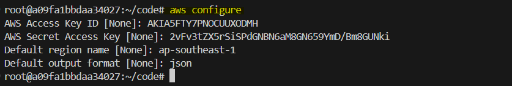

# Infrastructure Setup for Kubernetes Cluster with Terraform

In this lab, we will use **Terraform** to provision the infrastructure required to deploy a Kubernetes cluster on AWS. This infrastructure includes a Virtual Private Cloud (VPC), subnets, security groups, and EC2 instances that will act as the master and worker nodes of the Kubernetes cluster. After provisioning the infrastructure, we will SSH into the EC2 instances to set up hostnames for each instance, which are critical for identifying the roles of each node in the Kubernetes cluster.

Terraform allows us to automate the provisioning and management of infrastructure, enabling a more streamlined and reproducible setup.


## **Objective**

By the end of this lab, you will:

- Understand how to use Terraform to provision AWS infrastructure.
- Create networking components such as VPC, subnet, and route tables.
- Provision EC2 instances that will be used as Kubernetes master and worker nodes.
- SSH into the instances and configure their hostnames as `master`, `worker-1`, and `worker-2`.


## **Prerequisites**

Before starting this lab, ensure you have:

- An AWS account with programmatic access enabled.
- AWS CLI installed and configured.
- Terraform installed on your local machine.
  
If you don’t have the `AWS CLI` and Terraform installed, follow the official documentation to get them set up.We will use `Poridhi's Vscode` where `AWS CLI` and `Terraform` is preinstalled.

## **What is Terraform?**

**Terraform** is an open-source Infrastructure as Code (IaC) tool by HashiCorp. It automates the provisioning and management of infrastructure across multiple cloud platforms, such as AWS, Azure, and Google Cloud. Terraform uses configuration files to define infrastructure and maintains state files to track changes, ensuring efficient and consistent deployments.


## **AWS CLI Configuration**

Before using Terraform with AWS, configure the AWS CLI on your local machine. This allows Terraform to authenticate with your AWS account.

Run the following command:

```bash
aws configure
```

This command prompts you to enter:

- **AWS Access Key ID**
- **AWS Secret Access Key**
- **Default region** (e.g., `ap-southeast-1`)
- **Output format** (e.g., `json`)



## **Creating the `main.tf` File**

Create the main Terraform configuration file called `main.tf`, which contains all the code to provision your infrastructure.

1. **Create a file named `main.tf` in your project directory**.
2. Add the following code to `main.tf` to create the infrastructure.

---

### **Part 1: Provider Configuration and Key Pair Creation**

```hcl
# Provider configuration
provider "aws" {
  region = "ap-southeast-1" # Replace with your desired region
}

# Create a key pair and store it locally
resource "tls_private_key" "example" {
  algorithm = "RSA"
  rsa_bits  = 4096
}

resource "aws_key_pair" "my_key_pair" {
  key_name   = "cni"
  public_key = tls_private_key.example.public_key_openssh
}

resource "local_file" "private_key" {
  filename        = "${path.module}/cni.pem"
  content         = tls_private_key.example.private_key_pem
  file_permission = "0400"
}
```

#### **Explanation**:
- **Provider Configuration**: This specifies that Terraform will interact with AWS services, and defines the AWS region to use (you can replace it with your preferred region).
- **Key Pair Creation**: The `tls_private_key` resource generates an RSA private key, which is stored locally using the `local_file` resource. The `aws_key_pair` resource uses this key to create an AWS key pair, allowing SSH access to the EC2 instances.

---

### **Part 2: VPC, Subnet, and Internet Gateway**

```hcl
# Create a VPC
resource "aws_vpc" "my_vpc" {
  cidr_block           = "10.0.0.0/16"
  enable_dns_support   = true
  enable_dns_hostnames = true
  tags = {
    Name = "my-vpc"
  }
}

# Create an Internet Gateway
resource "aws_internet_gateway" "my_igw" {
  vpc_id = aws_vpc.my_vpc.id
  tags = {
    Name = "my-igw"
  }
}

# Create a public subnet
resource "aws_subnet" "public_subnet" {
  vpc_id                  = aws_vpc.my_vpc.id
  cidr_block              = "10.0.1.0/24"
  map_public_ip_on_launch = true
  availability_zone       = "ap-southeast-1a" # Change based on your region
  tags = {
    Name = "public-subnet"
  }
}
```

#### **Explanation**:
- **VPC (Virtual Private Cloud)**: Creates a VPC with a CIDR block of `10.0.0.0/16`, providing isolated networking for the Kubernetes cluster.
- **Internet Gateway**: Allows the VPC to communicate with the internet by attaching an Internet Gateway.
- **Public Subnet**: Creates a subnet within the VPC, with a CIDR block of `10.0.1.0/24`. Instances in this subnet will automatically receive public IP addresses.

---

### **Part 3: Route Table and Security Group**

```hcl
# Create a route table
resource "aws_route_table" "my_rt" {
  vpc_id = aws_vpc.my_vpc.id
  route {
    cidr_block = "0.0.0.0/0"
    gateway_id = aws_internet_gateway.my_igw.id
  }
  tags = {
    Name = "my-rt"
  }
}

# Associate the route table with the public subnet
resource "aws_route_table_association" "my_rt_association" {
  subnet_id      = aws_subnet.public_subnet.id
  route_table_id = aws_route_table.my_rt.id
}

# Create a security group allowing all traffic
resource "aws_security_group" "allow_all_traffic" {
  vpc_id = aws_vpc.my_vpc.id
  ingress {
    from_port   = 0
    to_port     = 0
    protocol    = "-1"
    cidr_blocks = ["0.0.0.0/0"]
  }
  egress {
    from_port   = 0
    to_port     = 0
    protocol    = "-1"
    cidr_blocks = ["0.0.0.0/0"]
  }
  tags = {
    Name = "allow-all-traffic"
  }
}
```

#### **Explanation**:
- **Route Table**: Defines a route table allowing traffic from the VPC to the internet.
- **Route Table Association**: Associates the route table with the public subnet, enabling internet access.
- **Security Group**: Creates a security group that allows all inbound and outbound traffic. For production, restrict access based on your needs.

---

### **Part 4: EC2 Instances**

```hcl
# Define AMI and instance type
variable "ami_id" {
  default = "ami-0e86e20dae9224db8"  # Replace with your desired AMI
}

variable "instance_type" {
  default = "t3.small"
}

# Create 3 EC2 instances with specific tags
resource "aws_instance" "ec2_instances" {
  count                       = 3
  ami                         = var.ami_id
  instance_type               = var.instance_type
  subnet_id                   = aws_subnet.public_subnet.id
  vpc_security_group_ids      = [aws_security_group.allow_all_traffic.id]
  associate_public_ip_address = true
  key_name                    = aws_key_pair.my_key_pair.key_name
  tags = {
    Name = "ec2-instance-${count.index + 1}"
  }
}

# Output the key pair location and instance public IPs
output "private_key_path" {
  value = local_file.private_key.filename
}

output "ec2_public_ips" {
  value = [for instance in aws_instance.ec2_instances : instance.public_ip]
}
```

#### **Explanation**:
- **AMI and Instance Type**: Defines the AMI ID and instance type for the EC2 instances.
- **EC2 Instances**: Creates three EC2 instances (one master and two workers) with public IPs and attaches them to the public subnet. These instances will serve as the nodes for your Kubernetes cluster.
- **Outputs**: Outputs the path to the private key and the public IPs of the EC2 instances.

---

### **Apply Terraform Script**

1. Initialize the Terraform configuration:
   ```bash
   terraform init
   ```

2. Apply the Terraform configuration to provision the AWS infrastructure:
   ```bash
   terraform apply
   ```

   

3. After the script completes, Terraform will output the public IPs of the EC2 instances and the path to the private key (`cni.pem`). You can use this information to SSH into the instances.

---

### **SSH into EC2 Instances and Set Hostnames**

Now, we will SSH into the EC2 instances and configure the hostnames as `master`, `worker-1`, and `worker-2`.

1. **SSH into the EC2 instances** using the `cni.pem` private key and the public IP addresses provided by Terraform:

   ```bash
   ssh -i cni.pem ubuntu@<master-instance-public-ip>
   ```

2. Once logged in, set the hostname for the master node:

   ```bash
   sudo hostnamectl set-hostname master
   ```

3. **SSH into the first worker node**:

   ```bash
   ssh -i cni.pem ubuntu@<worker-1-instance-public-ip>
   ```

4. Set the hostname for worker-1:

   ```bash
   sudo hostnamectl set-hostname worker-1
   ```

5. **SSH into the second worker node**:

   ```bash
   ssh -i cni.pem ubuntu@<worker-2-instance-public-ip>
   ```

6. Set the hostname for worker-2:

   ```bash
   sudo hostnamectl set-hostname worker-2
   ```
*You need to `exit`/`logout` from current session ,then ssh into the instances again to apply the hostname.*

### **Summary**

In this lab, we used Terraform to create the infrastructure for a Kubernetes cluster on AWS. We:

- Created a VPC with a public subnet.
- Set up an Internet Gateway for internet access.
- Configured a security group to allow all traffic.
- Provisioned three EC2 instances (master, worker-1, and worker-2).
- SSHed into the EC2 instances and configured their hostnames as `master`, `worker-1`, and `worker-2`.

In the next lab, we will focus on setting up the Kubernetes cluster on these EC2 instances.