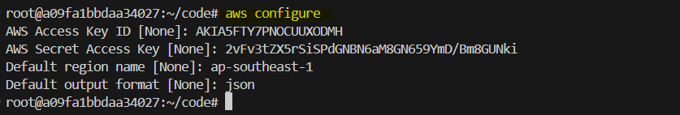
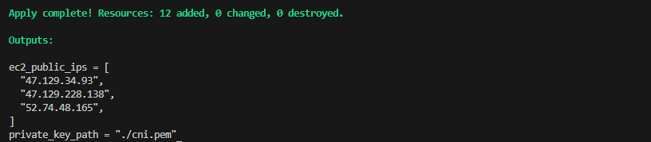

# **Kubernetes Cluster Setup on AWS EC2 Instances**

In this lab, we will set up a Kubernetes cluster on AWS EC2 instances using Terraform to provision the infrastructure. We will install Docker, **Kubeadm**, **Kubelet**, and **Kubectl** on the master and worker nodes. Then, we will initialize the Kubernetes cluster on the master node and join the worker nodes to the cluster.


## **Objective**

By the end of this lab, you will:

- Use Terraform to provision EC2 instances and networking components.
- Install Docker and Kubernetes components on all nodes.
- Initialize the Kubernetes cluster on the master node with a Pod CIDR block.
- Join the worker nodes to the Kubernetes cluster.

## **Prerequisites**

Before starting this lab, ensure that you have:

- An AWS account with programmatic access enabled.
- AWS CLI installed and configured.
- Terraform installed on your local machine.

## **AWS CLI Configuration**

To interact with AWS, you need to configure the AWS CLI. Run the following command:

```bash
aws configure
```

This command prompts you to enter:

- **AWS Access Key ID**
- **AWS Secret Access Key**
- **Default region** (e.g., `ap-southeast-1`)
- **Output format** (e.g., `json`)

  

## **Create the Infrastructure with Terraform**

1. **Create the `main.tf` file**

   Create a Terraform configuration file called `main.tf`, which contains the code to provision the infrastructure for the Kubernetes cluster.

2. **Define the Terraform Configuration in `main.tf`**
   
    Add the following code to the `main.tf` file:
   
   ```hcl
   # Provider configuration
   provider "aws" {
     region = "ap-southeast-1" # Replace with your desired region
   }
   
   # Create a key pair and store it locally
   resource "tls_private_key" "example" {
     algorithm = "RSA"
     rsa_bits  = 4096
   }
   
   resource "aws_key_pair" "my_key_pair" {
     key_name   = "cni"
     public_key = tls_private_key.example.public_key_openssh
   }
   
   resource "local_file" "private_key" {
     filename        = "${path.module}/cni.pem"
     content         = tls_private_key.example.private_key_pem
     file_permission = "0400"
   }
   
   # Create a VPC
   resource "aws_vpc" "my_vpc" {
     cidr_block           = "10.0.0.0/16"
     enable_dns_support   = true
     enable_dns_hostnames = true
     tags = {
       Name = "my-vpc"
     }
   }
   
   # Create an Internet Gateway
   resource "aws_internet_gateway" "my_igw" {
     vpc_id = aws_vpc.my_vpc.id
     tags = {
       Name = "my-igw"
     }
   }
   
   # Create a public subnet
   resource "aws_subnet" "public_subnet" {
     vpc_id                  = aws_vpc.my_vpc.id
     cidr_block              = "10.0.1.0/24"
     map_public_ip_on_launch = true
     availability_zone       = "ap-southeast-1a" # Change based on your region
     tags = {
       Name = "public-subnet"
     }
   }
   
   # Create a route table
   resource "aws_route_table" "my_rt" {
     vpc_id = aws_vpc.my_vpc.id
     route {
       cidr_block = "0.0.0.0/0"
       gateway_id = aws_internet_gateway.my_igw.id
     }
     tags = {
       Name = "my-rt"
     }
   }
   
   # Associate the route table with the public subnet
   resource "aws_route_table_association" "my_rt_association" {
     subnet_id      = aws_subnet.public_subnet.id
     route_table_id = aws_route_table.my_rt.id
   }
   
   # Create a security group allowing all traffic
   resource "aws_security_group" "allow_all_traffic" {
     vpc_id = aws_vpc.my_vpc.id
     ingress {
       from_port   = 0
       to_port     = 0
       protocol    = "-1"
       cidr_blocks = ["0.0.0.0/0"]
     }
     egress {
       from_port   = 0
       to_port     = 0
       protocol    = "-1"
       cidr_blocks = ["0.0.0.0/0"]
     }
     tags = {
       Name = "allow-all-traffic"
     }
   }
   
   # Hostname setup for each node
   variable "user_data_master" {
     default = <<EOF
   #!/bin/bash
   sudo hostnamectl set-hostname master
   EOF
   }
   
   variable "user_data_worker_1" {
     default = <<EOF
   #!/bin/bash
   sudo hostnamectl set-hostname worker-1
   EOF
   }
   
   variable "user_data_worker_2" {
     default = <<EOF
   #!/bin/bash
   sudo hostnamectl set-hostname worker-2
   EOF
   }
   
   # Create EC2 instances for master and workers
   resource "aws_instance" "ec2_instances" {
     count                       = 3
     ami                         = var.ami_id
     instance_type               = var.instance_type
     subnet_id                   = aws_subnet.public_subnet.id
     vpc_security_group_ids      = [aws_security_group.allow_all_traffic.id]
     associate_public_ip_address = true
     key_name                    = aws_key_pair.my_key_pair.key_name
     
     # Assign different user_data to set the hostname for each instance
     user_data = lookup({
       0 = var.user_data_master
       1 = var.user_data_worker_1
       2 = var.user_data_worker_2
     }, count.index)
   
     tags = {
       Name = "ec2-instance-${count.index + 1}"
     }
   }
   
   # Output for private key and public IPs of instances
   output "private_key_path" {
     value = local_file.private_key.filename
   }
   
   output "ec2_public_ips" {
     value = [for instance in aws_instance.ec2_instances : instance.public_ip]
   }
   
   # Variables for AMI and instance type
   variable "ami_id" {
     default = "ami-01811d4912b4ccb26"  # Replace with your desired AMI
   }
   
   variable "instance_type" {
     default = "t3.small"
   }
   ```
   ### User Data Section in `main.tf`
   
   In this Terraform configuration, we define different **user data** scripts for each EC2 instance (master, worker-1, and worker-2). **User data** is a script that gets executed when an instance is first launched. It is a way to automatically configure the instance upon boot.
   
   Here's what we have done in the user data section:
   
   - **Master Node Setup**: We define a bash script that sets the hostname of the master node to "master". 
   - **Worker Nodes Setup**: Similarly, for worker-1 and worker-2, we set their hostnames to "worker-1" and "worker-2" respectively.
   
   By using the `lookup` function in Terraform, we assign different `user_data` to each instance based on its index (`count.index`). This ensures that the hostname for each instance is set correctly, helping to differentiate between the master and worker nodes in the Kubernetes cluster.
### **Apply Terraform Script**
   
   1. Initialize the Terraform configuration:
      ```bash
      terraform init
      ```
   
   2. Apply the Terraform configuration to provision the AWS infrastructure:
      ```bash
      terraform apply
      ```
   
      
   
      This will create the EC2 instances and configure the hostnames (`master`, `worker-1`, `worker-2`) as per the user data provided in `main.tf`.
   

## **Install Docker and Kubernetes Components**

1. **SSH into the master node**

   SSH into the master node using the public IP provided by Terraform:

   ```bash
   ssh -i cni.pem ubuntu@<master-instance-public-ip>
   ```

2. **Install Docker**

   Docker is the container runtime engine that Kubernetes uses to manage containers. Install Docker by running:

   ```bash
   sudo apt-get update
   sudo apt-get install -y apt-transport-https ca-certificates curl
   sudo apt-get install -y docker.io
   ```

3. **Install Kubernetes components**

   Kubernetes components include **Kubeadm** for cluster bootstrapping, **Kubelet** for managing containers, and **Kubectl** for managing the cluster. Install these components on the master node:

   ```bash
   # Add Kubernetes APT repository
   curl -fsSL https://pkgs.k8s.io/core:/stable:/v1.31/deb/Release.key | sudo gpg --dearmor -o /etc/apt/keyrings/kubernetes-apt-keyring.gpg
   echo 'deb [signed-by=/etc/apt/keyrings/kubernetes-apt-keyring.gpg] https://pkgs.k8s.io/core:/stable:/v1.31/deb/ /' | sudo tee /etc/apt/sources.list.d/kubernetes.list

   # Install kubeadm, kubelet, and kubectl
   sudo apt-get update
   sudo apt-get install -y kubelet kubeadm kubectl
   ```

4. **Enable IP forwarding**

   Run the following command to enable IP forwarding, which is required for Kubernetes networking:

   ```bash
   sudo sysctl net.ipv4.ip_forward=1
   ```

## **Initialize the Kubernetes Cluster on the Master Node**

1. **Initialize the Kubernetes cluster**

   Now that Docker and Kubernetes components are installed on the master node, initialize the Kubernetes cluster and define the Pod CIDR block for networking:

   ```bash
   sudo kubeadm init --pod-network-cidr=10.244.0.0/16
   ```
   

   *After running this command, Kubernetes will provide a `join command` that is needed to connect the worker nodes to the cluster. `Note down this join command` as you will use it later to join the worker nodes.*

2. **Set up `kubectl` on the master node**

   To use `kubectl` to manage the cluster, set it up on the master node:

   ```bash
   mkdir -p $HOME/.kube
   sudo cp -i /etc/kubernetes/admin.conf $HOME/.kube/config
   sudo chown $(id -u):$(id -g) $HOME/.kube/config
   ```

3. **Check the status of the master node**

   Run the following command to check the status of the master node:

   ```bash
   kubectl get nodes
   ```

   The master node will show a **NotReady** status because the networking setup is not yet complete, but the master is initialized.

## **Join Worker Nodes to the Cluster**

1. **SSH into worker nodes**

   SSH into each worker node using the public IPs provided by Terraform:

   ```bash
   ssh -i cni.pem ubuntu@<worker-1-instance-public-ip>
   ```

   ```bash
   ssh -i cni.pem ubuntu@<worker-2-instance-public-ip>
   ```

2. **Install Docker and Kubernetes components**

   Repeat the steps used for the master node to install Docker and Kubernetes components on each worker nodes (`worker-1` & `worker-2`):

   ```bash
   # Install Docker
   sudo apt-get update
   sudo apt-get install -y apt-transport-https ca-certificates curl
   sudo apt-get install -y docker.io

   # Install Kubernetes components
   curl -fsSL https://pkgs.k8s.io/core:/stable:/v1.31/deb/Release.key | sudo gpg --dearmor -o /etc/apt/keyrings/kubernetes-apt-keyring.gpg
   echo 'deb [signed-by=/etc/apt/keyrings/kubernetes-apt-keyring.gpg] https://pkgs.k8s.io/core:/stable:/v1.31/deb/ /' | sudo tee /etc/apt/sources.list.d/kubernetes.list
   sudo apt-get update
   sudo apt-get install -y kubelet kubeadm kubectl

   # Enable IP forwarding
   sudo sysctl net.ipv4.ip_forward=1
   ```

3. **Join the worker nodes to the cluster**

   1. SSH into worker node 1 (`worker-1`) and run the **join command**
   
      ```bash
      ssh -i cni.pem ubuntu@<worker-1-public-ip>
      ```
   
      ```bash
      sudo kubeadm join <master-ip>:6443 --token <token> --discovery-token-ca-cert-hash sha256:<hash>
      ```

      
   
   2. SSH into worker node 2 (`worker-2`) and run the **join command**
   
      ```bash
      ssh -i cni.pem ubuntu@<worker-1-public-ip>
      ```
   
      ```bash
      sudo kubeadm join <master-ip>:6443 --token <token> --discovery-token-ca-cert-hash sha256:<hash>
      ```
   
      

## **Verify the Cluster Setup**
1. **Check the status of the nodes**

   Once the worker nodes have joined the cluster, you can verify the setup by running the following command on the master node:

   ```bash
   kubectl get nodes
   ```

   

   As you can see from the output, both master and worker nodes are currently in the “NotReady” state. This is expected, because we haven’t configured any networking plug-in yet. If you try to deploy a pod at this time, your pod will forever hang in the “Pending” state, because the Kubernetes schedule will not be able to find any “Ready” node for it.
## **Summary**

In this lab, we set up a Kubernetes cluster on AWS EC2 instances provisioned using Terraform. We:

- Installed Docker and Kubernetes components on the master and worker nodes.
- Initialized the Kubernetes cluster on the master node with a Pod CIDR block.
- Joined the worker nodes to the cluster.