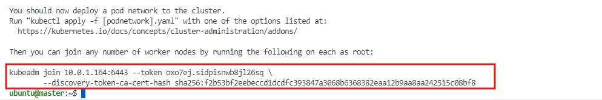
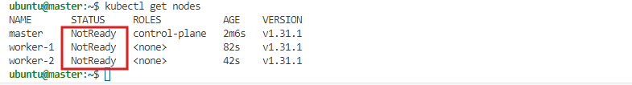
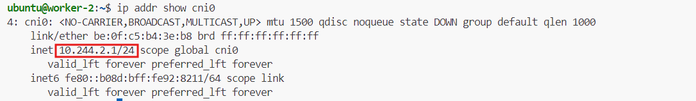

# **Network Interfaces for Kubernetes Pod Communication with Bash CNI**

In Kubernetes, pod-to-pod communication across nodes is enabled by network interfaces that link the virtual network inside each node with the broader cluster. In this lab, we will set up network interfaces and bridges to facilitate pod connectivity across the Kubernetes cluster using a custom **Bash CNI** plugin. Configuring these network interfaces first ensures that the infrastructure is ready for dynamic IP assignment and pod communication in the next stage.


### **What is CNI?**
CNI is a project under the **Cloud Native Computing Foundation (CNCF)** and consists of a specification and libraries used to configure networking for containers. It helps allocate and deallocate networking resources when containers are created or removed. CNI provides a standardized interface to ensure Kubernetes clusters can communicate consistently.

### **How CNI Works**
CNI works by integrating with container runtimes such as Docker. The runtime invokes the CNI when it creates or deletes containers. Here's a simplified process:
- **Container Creation**: The runtime calls the CNI, which configures networking for the container by setting up routes, namespaces, and interfaces. Once the network is configured, the runtime launches the container.
- **Container Deletion**: When a container is terminated, the runtime invokes the CNI again to clean up the networking resources.


### **CNI Plugins**
Kubernetes allows the use of various **CNI plugins**, which are responsible for networking tasks like IP address assignment, network configuration, and routing.

Popular plugins include:
- **Flannel**: Provides basic networking by creating an overlay network.
- **Calico**: Offers more advanced features such as network security policies and encryption.
- **Weave**: Facilitates networking across Kubernetes clusters, making it possible to connect pods across different nodes.
- **Cilium**: Provides enhanced security and network visibility by integrating with layers of the Linux kernel.

But we will use our own Custom CNI plugins.Which will gives us more clear idea about how CNI works in kubernetes

### **Key Features of CNI Networking in Kubernetes**
- **Consistency**: CNI ensures that networking configuration is applied uniformly across all pods and nodes in a cluster.
- **Flexibility**: Administrators can choose from a variety of plugins to suit their use case, whether for simple network setups or advanced security features.
- **Dynamic Setup**: CNI dynamically configures networking upon the creation or deletion of containers.
- **Standardization**: The CNI specification provides a standardized method for defining network interfaces across different container runtimes.

## **Objectives**

By the end of this lab, you will:

- Provision the necessary infrastructure for a Kubernetes cluster on AWS using Terraform.
- Set up network interfaces and a bridge (`cni0`) for each node to allow communication between pods.
- Prepare the cluster for dynamic IP assignment and pod-to-pod communication.

## **Prerequisites**

Before starting this lab, ensure you have:

- An AWS account with programmatic access enabled.
- AWS CLI installed and configured.
- Terraform installed on your local machine.

## **Provision Infrastructure for Kubernetes Cluster**

We will use **Terraform** to automate the creation of AWS resources for our Kubernetes cluster. This includes setting up EC2 instances for the master and worker nodes, with the necessary tools for Kubernetes installed via user data scripts.


### **AWS CLI Configuration**

To configure AWS CLI, use the following command:

```bash
aws configure
```

This will prompt you to enter:

- **AWS Access Key ID**
- **AWS Secret Access Key**
- **Default region** (e.g., `ap-southeast-1`)
- **Output format** (e.g., `json`)


### **Terraform Configuration (main.tf)**

Create a `main.tf` file with the following configuration to set up your Kubernetes cluster infrastructure.

```hcl
# Provider configuration
provider "aws" {
  region = "ap-southeast-1" # Replace with your desired region
}

# Create a key pair and store it locally
resource "tls_private_key" "example" {
  algorithm = "RSA"
  rsa_bits  = 4096
}

resource "aws_key_pair" "my_key_pair" {
  key_name   = "cni"
  public_key = tls_private_key.example.public_key_openssh
}

resource "local_file" "private_key" {
  filename        = "${path.module}/cni.pem"
  content         = tls_private_key.example.private_key_pem
  file_permission = "0400"
}

# Create a VPC
resource "aws_vpc" "my_vpc" {
  cidr_block           = "10.0.0.0/16"
  enable_dns_support   = true
  enable_dns_hostnames = true
  tags = {
    Name = "my-vpc"
  }
}

# Create an Internet Gateway
resource "aws_internet_gateway" "my_igw" {
  vpc_id = aws_vpc.my_vpc.id
  tags = {
    Name = "my-igw"
  }
}

# Create a public subnet
resource "aws_subnet" "public_subnet" {
  vpc_id                  = aws_vpc.my_vpc.id
  cidr_block              = "10.0.1.0/24"
  map_public_ip_on_launch = true
  availability_zone       = "ap-southeast-1a"
  tags = {
    Name = "public-subnet"
  }
}

# Create a route table
resource "aws_route_table" "my_rt" {
  vpc_id = aws_vpc.my_vpc.id
  route {
    cidr_block = "0.0.0.0/0"
    gateway_id = aws_internet_gateway.my_igw.id
  }
  tags = {
    Name = "my-rt"
  }
}

# Associate the route table with the public subnet
resource "aws_route_table_association" "my_rt_association" {
  subnet_id      = aws_subnet.public_subnet.id
  route_table_id = aws_route_table.my_rt.id
}

# Create a security group allowing all traffic
resource "aws_security_group" "allow_all_traffic" {
  vpc_id = aws_vpc.my_vpc.id
  ingress {
    from_port   = 0
    to_port     = 0
    protocol    = "-1"
    cidr_blocks = ["0.0.0.0/0"]
  }
  egress {
    from_port   = 0
    to_port     = 0
    protocol    = "-1"
    cidr_blocks = ["0.0.0.0/0"]
  }
  tags = {
    Name = "allow-all-traffic"
  }
}

# Hostname and Kubernetes setup for each node
variable "user_data_master" {
  default = <<EOF
#!/bin/bash
sudo hostnamectl set-hostname master

# Install Docker
sudo apt-get update
sudo apt-get install -y apt-transport-https ca-certificates curl
sudo apt-get install -y docker.io

# Install Kubernetes components
curl -fsSL https://pkgs.k8s.io/core:/stable:/v1.31/deb/Release.key | sudo gpg --dearmor -o /etc/apt/keyrings/kubernetes-apt-keyring.gpg
echo 'deb [signed-by=/etc/apt/keyrings/kubernetes-apt-keyring.gpg] https://pkgs.k8s.io/core:/stable:/v1.31/deb/ /' | sudo tee /etc/apt/sources.list.d/kubernetes.list
sudo apt-get update
sudo apt-get install -y kubelet kubeadm kubectl

# Enable IP forwarding
sudo sysctl net.ipv4.ip_forward=1
EOF
}

variable "user_data_worker_1" {
  default = <<EOF
#!/bin/bash
sudo hostnamectl set-hostname worker-1

# Install Docker
sudo apt-get update
sudo apt-get install -y apt-transport-https ca-certificates curl
sudo apt-get install -y docker.io

# Install Kubernetes components
curl -fsSL https://pkgs.k8s.io/core:/stable:/v1.31/deb/Release.key | sudo gpg --dearmor -o /etc/apt/keyrings/kubernetes-apt-keyring.gpg
echo 'deb [signed-by=/etc/apt/keyrings/kubernetes-apt-keyring.gpg] https://pkgs.k8s.io/core:/stable:/v1.31/deb/ /' | sudo tee /etc/apt/sources.list.d/kubernetes.list
sudo apt-get update
sudo apt-get install -y kubelet kubeadm kubectl

# Enable IP forwarding
sudo sysctl net.ipv4.ip_forward=1
EOF
}

variable "user_data_worker_2" {
  default = <<EOF
#!/bin/bash
sudo hostnamectl set-hostname worker-2

# Install Docker
sudo apt-get update
sudo apt-get install -y apt-transport-https ca-certificates curl
sudo apt-get install -y docker.io

# Install Kubernetes components
curl -fsSL https://pkgs.k8s.io/core:/stable:/v1.31/deb/Release.key | sudo gpg --dearmor -o /etc/apt/keyrings/kubernetes-apt-keyring.gpg
echo 'deb [signed-by=/etc/apt/keyrings/kubernetes-apt-keyring.gpg] https://pkgs.k8s.io/core:/stable:/v1.31/deb/ /' | sudo tee /etc/apt/sources.list.d/kubernetes.list
sudo apt-get update
sudo apt-get install -y kubelet kubeadm kubectl

# Enable IP forwarding
sudo sysctl net.ipv4.ip_forward=1
EOF
}

# Create EC2 instances for master and workers
resource "aws_instance" "ec2_instances" {
  count                       = 3
  ami                         = var.ami_id
  instance_type               = var.instance_type
  subnet_id                   = aws_subnet.public_subnet.id
  vpc_security_group_ids      = [aws_security_group.allow_all_traffic.id]
  associate_public_ip_address = true
  key_name                    = aws_key_pair.my_key_pair.key_name
  
  # Assign different user_data to set the hostname for each instance
  user_data = lookup({
    0 = var.user_data_master
    1 = var.user_data_worker_1
    2 = var.user_data_worker_2
  }, count.index)

  tags = {
    Name = "ec2-instance-${count.index + 1}"
    Role = lookup({
      0 = "master"
      1 = "worker-1"
      2 = "worker-2"
    }, count.index)
  }
}
 # Output for private key and public IPs of instances
 output "private_key_path" {
   value = local_file.private_key.filename
 }
 
 output "ec2_public_ips_with_roles" {
  value = {
    "master"   = aws_instance.ec2_instances[0].public_ip
    "worker-1" = aws_instance.ec2_instances[1].public_ip
    "worker-2" = aws_instance.ec2_instances[2].public_ip
  }
}

# Variables for AMI and instance type
variable "ami_id" {
  default = "ami-01811d4912b4ccb26"  # Replace with your desired AMI
}

variable "instance_type" {
  default = "t3.small"
}
```

### User Data in `main.tf`

In this Terraform configuration, the **user data** scripts for each EC2 instance (master, worker-1, and worker-2) are used to automate the setup of Kubernetes components on each node. The user data executes upon instance boot and helps configure the environment.

- **Master Node**: The script sets the hostname to `master`, installs Docker, and then installs the Kubernetes components (`kubelet`, `kubeadm`, `kubectl`). It also enables IP forwarding to ensure network traffic can be routed properly.
  
- **Worker Nodes (worker-1 & worker-2)**: Similar to the master node, the user data sets the hostname (e.g., `worker-1`, `worker-2`), installs Docker, and installs the Kubernetes components. IP forwarding is also enabled on each worker node.

These scripts ensure that each node is configured correctly for a Kubernetes cluster, streamlining the setup process by automating the necessary software installations and network settings.

### **Applying the Terraform Configuration**

Once the `main.tf` file is created, follow these steps to apply the configuration and create the infrastructure:

1. **Initialize Terraform**:

   ```bash
   terraform init
   ```

2. **Apply the Terraform configuration**:

   ```bash
   terraform apply
   ```

   

Terraform will create the necessary infrastructure, and it will output the public IPs of the EC2 instances and the path to the private key (`cni.pem`). You can use this information to SSH into the instances.

## **Set Up the Cluster**

Once the instances are provisioned, SSH into the **master** and **worker** nodes to complete the Kubernetes setup:

### **Setting Up the master node**

1. **SSH into master node using private key in project directory**

   ```bash
   ssh -i cni.pem ubuntu@<master-public-ip>
   ```

   

2. **Initialize the Kubernetes cluster on the master node**

   ```bash
   sudo kubeadm init --pod-network-cidr=10.244.0.0/16
   ```

   

   *After running this command, Kubernetes will provide a `join command` that is needed to connect the worker nodes to the cluster. `Note down this join command` as you will use it later to join the worker nodes.*

3. **Set up `kubectl` for the master node**

   ```bash
   mkdir -p $HOME/.kube
   sudo cp -i /etc/kubernetes/admin.conf $HOME/.kube/config
   sudo chown $(id -u):$(id -g) $HOME/.kube/config
   ```
### **Setting Up the worker nodes**
1. SSH into worker node 1 (`worker-1`) and run the **join command**

   ```bash
   ssh -i cni.pem ubuntu@<worker-1-public-ip>
   ```
   

   ```bash
   sudo kubeadm join <master-ip>:6443 --token <token> --discovery-token-ca-cert-hash sha256:<hash>
   ```

   

2. SSH into worker node 2 (`worker-2`) and run the **join command**

   ```bash
   ssh -i cni.pem ubuntu@<worker-2-public-ip>
   ```
   

   ```bash
   sudo kubeadm join <master-ip>:6443 --token <token> --discovery-token-ca-cert-hash sha256:<hash>
   ```

   

### **Verify the Cluster Setup**

1. **Check the status of the nodes**:

   Once the worker nodes have joined the cluster, you can verify the setup by running the following command on the master node:

   ```bash
   kubectl get nodes
   ```

   

   As you can see from the output, both master and worker nodes are currently in the “NotReady” state. This is expected because we haven’t configured any networking plug-in yet. If you try to deploy a pod at this time, your pod will forever hang in the “Pending” state because the Kubernetes scheduler will not be able to find any “Ready” node for it.


## **Setting Up Network Interfaces**

### **Create the Custom CNI Plug-in**

To implement networking for Kubernetes pods, we will create a custom CNI plug-in in Bash.

1. **Create the CNI configuration on each node (master, worker-1, worker-2)**:

   ```bash
   sudo nano /etc/cni/net.d/10-bash-cni-plugin.conf
   ```

2. Add the following content:

   ```json
   {
       "cniVersion": "0.3.1",
       "name": "mynet",
       "type": "bash-cni",
       "network": "10.244.0.0/16",
       "subnet": "<node-cidr-range>"
   }
   ```

   Replace `<node-cidr-range>` with:
   - `10.244.0.0/24` for the **master** node.
   - `10.244.1.0/24` for **worker-1**.
   - `10.244.2.0/24` for **worker-2**.


### **Create the `cni0` Bridge and Virtual Interfaces**

1. **Create the network bridge (`cni0`) on each node worker nodes**:

   ```bash
   sudo brctl addbr cni0
   sudo ip link set cni0 up
   sudo ip addr add <bridge-ip>/24 dev cni0
   ```

   Replace `<bridge-ip>` with:
   - `10.244.0.1` for **master**.
   - `10.244.1.1` for **worker-1**.
   - `10.244.2.1` for **worker-2**.

   This prepares the network bridge on each node to facilitate pod-to-pod communication. However, we are not configuring the CNI plugin script yet. The bridge setup ensures the nodes are ready for IP assignments in the next step.


### **Verify the Network Configuration**

After setting up the `cni0` bridge and CIDR blocks, verify the successful creation of these interfaces:

1. **Check the status of the network bridge on each node**:

   ```bash
   sudo brctl show cni0
   ```
   For `master` node

   

   For `worker-1` node

   

   For `worker-2` node
   
   

2. **Verify IP assignments** for each bridge interface on each node:

   ```bash
   ip addr show cni0
   ```
   For `master` node

   

   For `worker-1` node

   

   For `worker-2` node

   


   The output should show the respective IP addresses (`10.244.0.1`, `10.244.1.1`, `10.244.2.1`) assigned to the `cni0` bridge on each node.
### **Check Node Status Again**

Now the nodes should be in a **Ready** state:

```bash
kubectl get nodes
```


**Note:** We still won't be able to deploy pods on the clusters ,as we don't setup any `network configuration` on the cluster yet.

At this point, we have successfully set up the network infrastructure required for Kubernetes pod communication. In the upcomming labs, we will create and configure the **Bash CNI plugin script** to manage IP assignment and networking for the pods.