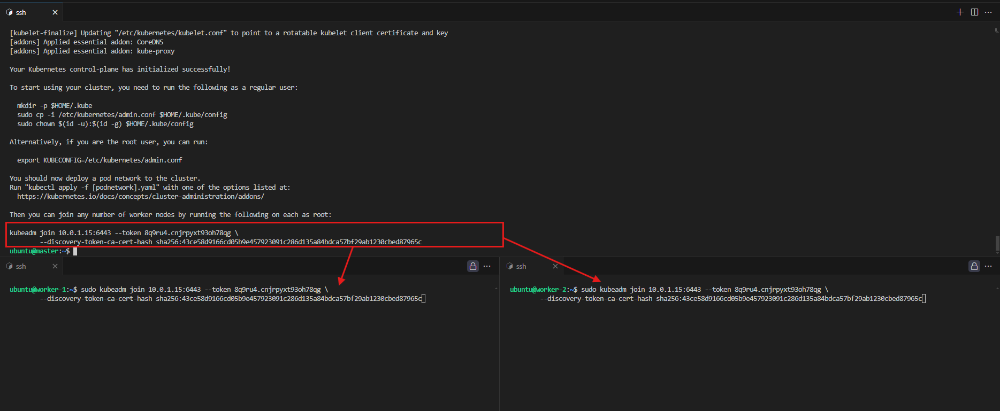

# **Network Interfaces for Kubernetes Pod Communication with Bash CNI**

In Kubernetes, pod-to-pod communication across nodes is enabled by network interfaces that link the virtual network inside each node with the broader cluster. In this lab, we will set up network interfaces and bridges to facilitate pod connectivity across the Kubernetes cluster using a custom **Bash CNI** plugin. Configuring these network interfaces first ensures that the infrastructure is ready for dynamic IP assignment and pod communication in the next stage.


## **Objectives**

By the end of this lab, you will:

- Provision the necessary infrastructure for a Kubernetes cluster on AWS using Terraform.
- Set up network interfaces and a bridge (`cni0`) for each node to allow communication between pods.
- Prepare the cluster for dynamic IP assignment and pod-to-pod communication.


## **Prerequisites**

Before starting this lab, ensure you have:

- An AWS account with programmatic access enabled.
- AWS CLI installed and configured.
- Terraform installed on your local machine.


## **Provision Infrastructure for Kubernetes Cluster**

We will use **Terraform** to automate the creation of AWS resources for our Kubernetes cluster. This includes setting up EC2 instances for the master and worker nodes, with the necessary tools for Kubernetes installed via user data scripts.


### **AWS CLI Configuration**

To configure AWS CLI, use the following command:

```bash
aws configure
```

This will prompt you to enter:

- **AWS Access Key ID**
- **AWS Secret Access Key**
- **Default region** (e.g., `ap-southeast-1`)
- **Output format** (e.g., `json`)

  

### **Terraform Configuration (main.tf)**

Create a `main.tf` file with the following configuration to set up your Kubernetes cluster infrastructure.

```hcl
# Provider configuration
provider "aws" {
  region = "ap-southeast-1" # Replace with your desired region
}

# Create a key pair and store it locally
resource "tls_private_key" "example" {
  algorithm = "RSA"
  rsa_bits  = 4096
}

resource "aws_key_pair" "my_key_pair" {
  key_name   = "cni"
  public_key = tls_private_key.example.public_key_openssh
}

resource "local_file" "private_key" {
  filename        = "${path.module}/cni.pem"
  content         = tls_private_key.example.private_key_pem
  file_permission = "0400"
}

# Create a VPC
resource "aws_vpc" "my_vpc" {
  cidr_block           = "10.0.0.0/16"
  enable_dns_support   = true
  enable_dns_hostnames = true
  tags = {
    Name = "my-vpc"
  }
}

# Create an Internet Gateway
resource "aws_internet_gateway" "my_igw" {
  vpc_id = aws_vpc.my_vpc.id
  tags = {
    Name = "my-igw"
  }
}

# Create a public subnet
resource "aws_subnet" "public_subnet" {
  vpc_id                  = aws_vpc.my_vpc.id
  cidr_block              = "10.0.1.0/24"
  map_public_ip_on_launch = true
  availability_zone       = "ap-southeast-1a"
  tags = {
    Name = "public-subnet"
  }
}

# Create a route table
resource "aws_route_table" "my_rt" {
  vpc_id = aws_vpc.my_vpc.id
  route {
    cidr_block = "0.0.0.0/0"
    gateway_id = aws_internet_gateway.my_igw.id
  }
  tags = {
    Name = "my-rt"
  }
}

# Associate the route table with the public subnet
resource "aws_route_table_association" "my_rt_association" {
  subnet_id      = aws_subnet.public_subnet.id
  route_table_id = aws_route_table.my_rt.id
}

# Create a security group allowing all traffic
resource "aws_security_group" "allow_all_traffic" {
  vpc_id = aws_vpc.my_vpc.id
  ingress {
    from_port   = 0
    to_port     = 0
    protocol    = "-1"
    cidr_blocks = ["0.0.0.0/0"]
  }
  egress {
    from_port   = 0
    to_port     = 0
    protocol    = "-1"
    cidr_blocks = ["0.0.0.0/0"]
  }
  tags = {
    Name = "allow-all-traffic"
  }
}

# Hostname and Kubernetes setup for each node
variable "user_data_master" {
  default = <<EOF
#!/bin/bash
sudo hostnamectl set-hostname master

# Install Docker
sudo apt-get update
sudo apt-get install -y apt-transport-https ca-certificates curl
sudo apt-get install -y docker.io

# Install Kubernetes components
curl -fsSL https://pkgs.k8s.io/core:/stable:/v1.31/deb/Release.key | sudo gpg --dearmor -o /etc/apt/keyrings/kubernetes-apt-keyring.gpg
echo 'deb [signed-by=/etc/apt/keyrings/kubernetes-apt-keyring.gpg] https://pkgs.k8s.io/core:/stable:/v1.31/deb/ /' | sudo tee /etc/apt/sources.list.d/kubernetes.list
sudo apt-get update
sudo apt-get install -y kubelet kubeadm kubectl

# Enable IP forwarding
sudo sysctl net.ipv4.ip_forward=1
EOF
}

variable "user_data_worker_1" {
  default = <<EOF
#!/bin/bash
sudo hostnamectl set-hostname worker-1

# Install Docker
sudo apt-get update
sudo apt-get install -y apt-transport-https ca-certificates curl
sudo apt-get install -y docker.io

# Install Kubernetes components
curl -fsSL https://pkgs.k8s.io/core:/stable:/v1.31/deb/Release.key | sudo gpg --dearmor -o /etc/apt/keyrings/kubernetes-apt-keyring.gpg
echo 'deb [signed-by=/etc/apt/keyrings/kubernetes-apt-keyring.gpg] https://pkgs.k8s.io/core:/stable:/v1.31/deb/ /' | sudo tee /etc/apt/sources.list.d/kubernetes.list
sudo apt-get update
sudo apt-get install -y kubelet kubeadm kubectl

# Enable IP forwarding
sudo sysctl net.ipv4.ip_forward=1
EOF
}

variable "user_data_worker_2" {
  default = <<EOF
#!/bin/bash
sudo hostnamectl set-hostname worker-2

# Install Docker
sudo apt-get update
sudo apt-get install -y apt-transport-https ca-certificates curl
sudo apt-get install -y docker.io

# Install Kubernetes components
curl -fsSL https://pkgs.k8s.io/core:/stable:/v1.31/deb/Release.key | sudo gpg --dearmor -o /etc/apt/keyrings/kubernetes-apt-keyring.gpg
echo 'deb [signed-by=/etc/apt/keyrings/kubernetes-apt-keyring.gpg] https://pkgs.k8s.io/core:/stable:/v1.31/deb/ /' | sudo tee /etc/apt/sources.list.d/kubernetes.list
sudo apt-get update
sudo apt-get install -y kubelet kubeadm kubectl

# Enable IP forwarding
sudo sysctl net.ipv4.ip_forward=1
EOF
}

# Create EC2 instances for master and workers
resource "aws_instance" "ec2_instances" {
  count                       = 3
  ami                         = var.ami_id
  instance_type               = var.instance_type
  subnet_id                   = aws_subnet.public_subnet.id
  vpc_security_group_ids      = [aws_security_group.allow_all_traffic.id]
  associate_public_ip_address = true
  key_name                    = aws_key_pair.my_key_pair.key_name

  # Assign different user_data to set the hostname and install components for each instance
  user_data = lookup({
    0 = var.user_data_master
    1 = var.user_data_worker_1
    2 = var.user_data_worker_2
  }, count.index)

  tags = {
    Name = "ec2-instance-${count.index + 1}"
  }
}

# Output for private key and public IPs of instances
output "private_key_path" {
  value = local_file.private_key.filename
}

output "ec2_public_ips" {
  value = [for instance in aws_instance.ec2_instances : instance.public_ip]
}

# Variables for AMI and instance type
variable "ami_id" {
  default = "ami-0e86e20dae9224db8"  # Replace with your desired AMI
}

variable "instance_type" {
  default = "t3.small"
}
```

### **Applying the Terraform Configuration**

Once the `main.tf` file is created, follow these steps to apply the configuration and create the infrastructure:

1. **Initialize Terraform**:

   ```bash
   terraform init
   ```

2. **Apply the Terraform configuration**:

   ```bash
   terraform apply
   ```

   

Terraform will create the necessary infrastructure, and it will output the public IPs of the EC2 instances and the path to the private key (`cni.pem`). You can use this information to SSH into the instances.


### **SSH into EC2 Instances and Set Up the Cluster**

Once the instances are provisioned, SSH into the **master** and **worker** nodes to complete the Kubernetes setup:

1. SSH into the **master node** using the private key:

   ```bash
   ssh -i cni.pem ubuntu@<master-public-ip>
   ```

2. Initialize the Kubernetes cluster on the master node:

   ```bash
   sudo kubeadm init --pod-network-cidr=10.244.0.0/16
   ```

   *After running this command, Kubernetes will provide a `join command` that is needed to connect the worker nodes to the cluster. `Note down this join command` as you will use it later to join the worker nodes.*

3. Set up `kubectl` for the master node:

   ```bash
   mkdir -p $HOME/.kube
   sudo cp -i /etc/kubernetes/admin.conf $HOME/.kube/config
   sudo chown $(id -u):$(id -g) $HOME/.kube/config
   ```

4. SSH into each worker node (`worker-1` & `worker-2`) and run the **join command**:

   ```bash
   ssh -i cni.pem ubuntu@<worker-1-public-ip>
   ```

   ```bash
   sudo kubeadm join <master-ip>:6443 --token <token> --discovery-token-ca-cert-hash sha256:<hash>
   ```
   
###  **Verify the Cluster Setup**
1. **Check the status of the nodes**

   Once the worker nodes have joined the cluster, you can verify the setup by running the following command on the master node:

   ```bash
   kubectl get nodes
   ```

   

   As you can see from the output, both master and worker nodes are currently in the “NotReady” state. This is expected, because we haven’t configured any networking plug-in yet. If you try to deploy a pod at this time, your pod will forever hang in the “Pending” state, because the Kubernetes schedule will not be able to find any “Ready” node for it.

## **Why We Need Network Interfaces**

Network interfaces, such as **bridges** and **virtual Ethernet (veth) pairs**, are required to link the pod’s network namespace to the host and enable **pod-to-pod communication** across the cluster. These interfaces allow the master and worker nodes to communicate efficiently, ensuring that pods can connect to each other, regardless of their location in the cluster.

## **Setting Up Network Interfaces**

### **Create the `cni0` Bridge and Virtual Interfaces**

1. **Create the network bridge (`cni0`) on each node**:

   ```bash
   sudo brctl addbr cni0
   sudo ip link set cni0 up
   sudo ip addr add <bridge-ip>/24 dev cni0
   ```

   Replace `<bridge-ip>` with:

   - `10.244.0.1` for the **master** node.
   - `10.244.1.1` for **worker-1**.
   - `10.244.2.1` for **worker-2**.

   This file contains the configuration for the custom **CNI plug-in**. The configuration defines the CNI version, the name of the network (`mynet`), the type of CNI plug-in (`bash-cni`), and the network and subnet details. It specifies how the custom CNI plug-in should behave, including the IP ranges for the pods on each node.
 
    The key sections include:
    - `cniVersion`: Specifies the version of the CNI specification.
    - `name`: Name of the CNI network.
    - `type`: The type of CNI plug-in, in this case, a custom `bash-cni` plug-in.
   - `network` and `subnet`: Define the network and subnet ranges that the plug-in will use to allocate IP addresses to pods.

### **Testing The node State**

Now the nodes will be in ready state

   ```bash
   kubectl get nodes
   ```
   

## **Update the Bash CNI Script for Network Interface Configuration**

   Create the following script on each node:

   ```bash
   sudo nano /opt/cni/bin/bash-cni
   ```

   Insert this script to set up veth pairs and connect them to the network bridge:

   ```bash
   #!/bin/bash -e

   exec 3>&1
   exec &>> /var/log/bash-cni-plugin.log

   case $CNI_COMMAND in
   ADD)
       mkdir -p /var/run/netns/
       ln -sfT $CNI_NETNS /var/run/netns/$CNI_CONTAINERID

       rand=$(tr -dc 'A-F0-9' < /dev/urandom | head -c4)
       host_if_name="veth$rand"
       ip link add $CNI_IFNAME type veth peer name $host_if_name

       ip link set $host_if_name up
       ip link set $host_if_name master cni0

       ip link set $CNI_IFNAME netns $CNI_CONTAINERID
       ip netns exec $CNI_CONTAINERID ip link set $CNI_IFNAME up
   ;;
   DEL)
       ip=$(ip netns exec $CNI_CONTAINERID ip addr show $CNI_IFNAME | awk '/inet / {print $2}' | sed s%/.*%% || echo "")
       if [ ! -z "$ip" ]
       then
           sed -i "/$ip/d" $IP_STORE
       fi
   ;;
   *)
     echo "Unknown CNI command: $CNI_COMMAND"
     exit 1
   ;;
   esac
   ```
### **Bash CNI Plugin Script: Network Interface Configuration**

This script sets up the essential networking infrastructure by connecting the container’s interface (`eth0`) to the `cni0` bridge on the host, enabling pod communication within the Kubernetes cluster.

- **ADD Command**:
  1. **Creates a network namespace** for the container using `CNI_CONTAINERID`.
  2. **Generates a veth pair**, where one end stays on the host and the other is moved to the container.
  3. **Connects the host-side veth** to the `cni0` bridge on the host.
  4. **Moves the container-side veth** into the container’s network namespace and brings it up.

- **DEL Command**:
  - **Cleans up** by removing the container's IP address from the IP store when the pod is deleted, making the IP available for reuse.

### **Make the script executable**:

   ```bash
   sudo chmod +x /opt/cni/bin/bash-cni
   ```

### **Test Network Interface Configuration**

1. **Create and deploy the following YAML configuration file** (`deploy.yaml`):

   ```yaml
   apiVersion: v1
   kind: Pod
   metadata:
     name: nginx-worker-1
   spec:
     containers:
     - name: nginx
       image: nginx
       ports:
       - containerPort: 80
     nodeSelector:
       kubernetes.io/hostname: worker-1
   ---
   apiVersion: v1
   kind: Pod
   metadata:
     name: bash-worker-1
   spec:
     containers:
     - name: ubuntu
       image: smatyukevich/ubuntu-net-utils
       command:
         - "/bin/bash"
         - "-c"
         - "sleep 10000"
     nodeSelector:
       kubernetes.io/hostname: worker-1
   ---
   apiVersion: v1
   kind: Pod
   metadata:
     name: nginx-worker-2
   spec:
     containers:
     - name: nginx
       image: nginx
       ports:
       - containerPort: 80
     nodeSelector:
       kubernetes.io/hostname: worker-2
   ---
   apiVersion: v1
   kind: Pod
   metadata:
     name: bash-worker-2
   spec:
     containers:
     - name: ubuntu
       image: smatyukevich/ubuntu-net-utils
       command:
         - "/bin/bash"
         - "-c"
         - "sleep 10000"
     nodeSelector:
       kubernetes.io/hostname: worker-2
   ```

2. **Deploy the YAML configuration**:

   Run the following command to deploy the pods using the `deploy.yaml` file:

   ```bash
   kubectl apply -f deploy.yaml
   ```
   Here, we are deploying four simple pods. Two goes on the worker-1 and the remaining two on the worker-2. 

3. **Check the status of the pods**:

   Once the pods are deployed, check their status and observe that they have not been assigned IP addresses yet:

   ```bash
   kubectl get pods -o wide
   ```
 
   The pods will be listed, but you will notice that they **do not have any IP addresses** assigned yet, which confirms that the IP assignment part of the CNI has not been implemented at this stage. The pod's status might show "Pending" or "Running" without an IP.

### **Verify that the `cni0` bridge is active**:

   Run the following commands on each nodes (`master`,`worker-1`,`worker-2`) to check if the `cni0` bridge is up and if veth pairs are created:

   ```bash
   sudo brctl show cni0
   ```

   You should see the `cni0` bridge with connected interfaces, even though IP assignment isn’t yet configured.


## **Conclusion**

In this lab, we have set up the infrastructure for a Kubernetes cluster using Terraform and configured the necessary network interfaces to facilitate pod-to-pod communication. The setup of the `cni0` bridge and veth pairs prepares the cluster for dynamic IP assignment and ensures that network communication between pods can happen smoothly.