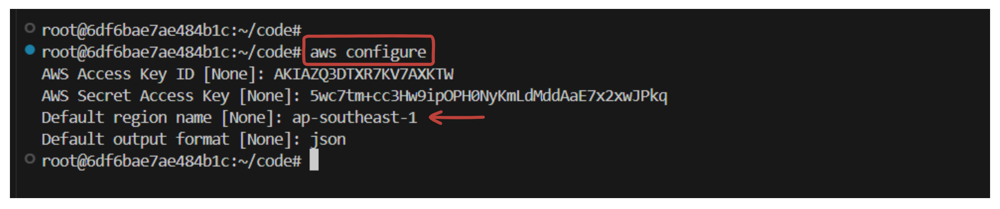
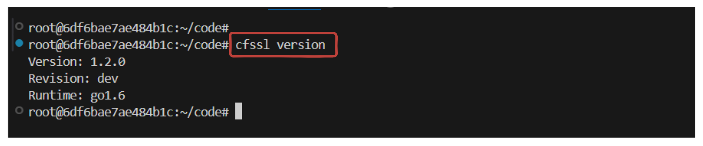
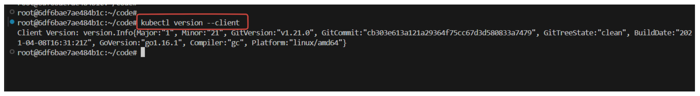
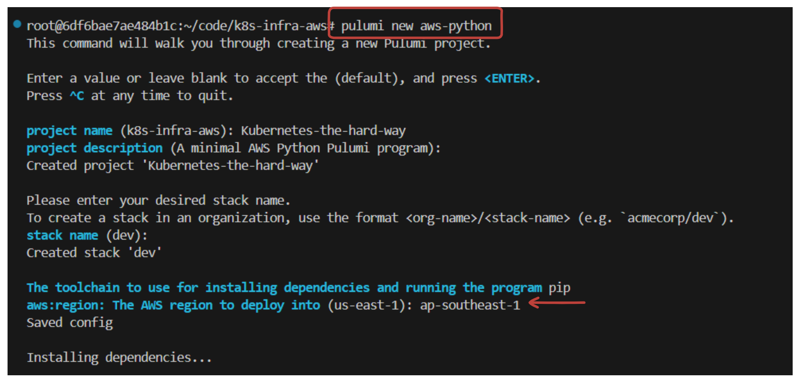
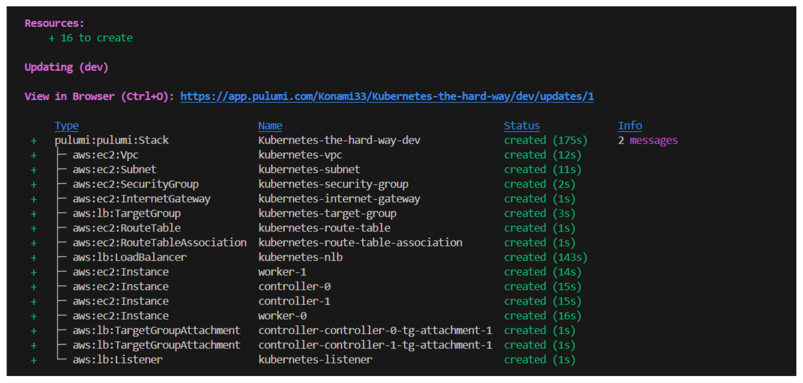

# Kubernetes the Hard Way on AWS: Infrastructure Setup

## Introduction

This is the first lab on setting up a Kubernetes cluster from scratch on Amazon Web Services (AWS) series. The goal of this tutorial is to help you understand the internal workings of Kubernetes by manually provisioning the necessary cloud infrastructure and configuring each component step-by-step.

By the end of this lab series, you'll have a deeper understanding of how each Kubernetes component interacts and will be able to troubleshoot any issues that arise during the setup process.

### Prerequisites:

- Basic familiarity with AWS and its services **(EC2, VPC, IAM, etc.)**
- AWS account with sufficient permissions to create EC2 instances, VPCs, and IAM roles
- Working knowledge of Kubernetes architecture and components
- Installed **AWS CLI, jq, and Python 3** on your local machine

## Kubernetes Architecture Overview

In a typical Kubernetes setup, the cluster is divided into control plane nodes and worker nodes. The control plane nodes manage the state of the cluster, while the worker nodes are responsible for running your containerized applications.


### Key Components of Kubernetes Architecture

**1. Control Plane Components:**

- **etcd:** A highly available key-value store used for maintaining the cluster state.
- **kube-apiserver:** The API server provides the frontend to the control plane and handles all external communication.
- **kube-scheduler:** Assigns tasks to nodes based on resource availability and workload requirements.
- **kube-controller-manager:** Manages the state of the cluster, ensuring that the desired number of pods are running at all times.

**2. Worker Node Components:**

- **kubelet**: Runs on each worker node and ensures that containers are running as expected.
- **kube-proxy:** Maintains network rules for allowing pods to communicate with each other and with services.

The setup will include deploying a secure, highly-available control plane, multiple worker nodes, and networking components, all manually configured on AWS.

## AWS Infrastructure

In this setup, we will design and deploy AWS Infrastructure to support Kubernetes Cluster. The cluster will 

- Consist of `four` public instances, divided into `two` categories: **Controller nodes** and **Worker nodes**. 
- To enable connectivity and internet access to the nodes, we will create a **public route table** and attach an **internet gateway** to it. This will allow the nodes to communicate with each other and access external resources and services. 
- Finally, we will utilize Pulumi python to create and manage this AWS infrastructure.


## Setting Up Amazon Web Services (AWS) Command Line Interface (CLI)

The AWS CLI is a command-line tool that allows you to interact with AWS services programmatically. It simplifies provisioning resources, such as EC2 instances and load balancers, which are required to host your Kubernetes cluster.

## Step 1: Configure AWS CLI

Before interacting with AWS services, you must configure the AWS CLI with your credentials. This can be done using the `aws configure` command, which prompts you for four pieces of information:

1. **AWS Access Key ID**: Your access key to authenticate AWS API requests.
2. **AWS Secret Access Key**: A secret key associated with your access key.
3. **Default region**: The AWS region in which you want to provision your resources (`ap-southeast-1`).
4. **Default output format**: You can choose the output format (JSON, text, table).

Run the following command and provide the required information:

```sh
aws configure
```



> Note: Use aws configure list to verify that your configuration is correct and check the active profile and region settings.

## Step 2: Install `jq` for JSON Parsing

`jq` is a lightweight and flexible command-line JSON processor that is helpful for parsing JSON responses from AWS commands. On a Debian-based system like Ubuntu, you can use:

```sh
sudo apt-get update
sudo apt-get install jq -y
```

This will install `jq` on your system, allowing you to parse AWS CLI responses more easily.

## Step 3: Installing Client Tools

For the Kubernetes the Hard Way tutorial, you'll need the following command-line utilities:

1. **cfssl**: A command-line tool used to build and manage a Public Key Infrastructure (PKI).
2. **cfssljson**: A tool for working with JSON output from cfssl.
3. **kubectl**: The command-line tool for interacting with a Kubernetes cluster.

### 1. Install CFSSL and CFSSLJSON

**CFSSL (Cloudflare’s PKI and TLS toolkit)** will be used for managing the `PKI` and generating `TLS` certificates required by Kubernetes components.

#### Download and Install

Use the following commands to download and install `cfssl` and `cfssljson`:

```sh
wget -q --show-progress --https-only --timestamping \
  https://pkg.cfssl.org/R1.2/cfssl_linux-amd64 \
  https://pkg.cfssl.org/R1.2/cfssljson_linux-amd64

chmod +x cfssl_linux-amd64 cfssljson_linux-amd64

sudo mv cfssl_linux-amd64 /usr/local/bin/cfssl
sudo mv cfssljson_linux-amd64 /usr/local/bin/cfssljson
```

#### Verification

Ensure the tools have been installed successfully by checking their versions:

```sh
cfssl version
```

You should see output similar to:



Similarly, check for `cfssljson`:

```sh
cfssljson --version
```

### 2. Install Kubectl

`kubectl` is the primary tool for interacting with the Kubernetes cluster. You'll use it to deploy applications, inspect cluster resources, and manage Kubernetes objects.

#### Download and Install

Use the following commands to install `kubectl`:

```sh
curl -LO "https://dl.k8s.io/release/v1.21.0/bin/linux/amd64/kubectl"

chmod +x ./kubectl

sudo mv ./kubectl /usr/local/bin/kubectl
```

#### Verification

Check that `kubectl` is installed correctly by verifying its version:

```sh
kubectl version --client
```



## Step 4: Provisioning Compute Resources

In this step, you will provision the necessary AWS resources that will host your Kubernetes cluster.

### 1. Create a Directory for Your Infrastructure

Before starting, it’s best to create a dedicated directory for the infrastructure files:

```sh
mkdir k8s-infra-aws
cd k8s-infra-aws
```

### 2. Install Python `venv`

Set up a Python virtual environment (`venv`) to manage dependencies for Pulumi or other Python-based tools:

```sh
sudo apt update
sudo apt install python3.8-venv -y
```

This will set up a Python virtual environment which will be useful later when working with Pulumi.

### 3. Initialize a New Pulumi Project

`Pulumi` is an Infrastructure-as-Code (IaC) tool used to manage cloud infrastructure. In this tutorial, you'll use Pulumi python to provision the AWS resources required for Kubernetes.

Run the following command to initialize a new Pulumi project:

```sh
pulumi new aws-python
```



Pulumi will guide you through setting up a new project and configuring it to use AWS resources.

### 4. Update the `__main.py__` file:

Open the `__main__.py` file and define the AWS infrastructure required for the Kubernetes cluster. This Pulumi code provisions the foundational infrastructure required to set up a Kubernetes cluster on AWS. It handles the creation of a **Virtual Private Cloud (VPC)**, **subnets**, **security groups**, **EC2 instances** (for both control plane and worker nodes), and a **Network Load Balancer (NLB)**.

Let's break down each part of the code:

#### 1. **Create a Virtual Private Cloud (VPC)**

```python
vpc = aws.ec2.Vpc(
    'kubernetes-vpc',
    cidr_block='10.0.0.0/16',
    enable_dns_support=True,
    enable_dns_hostnames=True,
    tags={'Name': 'kubernetes-the-hard-way'}
)
```
- Creates a new VPC named `kubernetes-vpc` with a CIDR block of `10.0.0.0/16`.
- Enables DNS support and hostnames, allowing EC2 instances within the VPC to resolve DNS names.
- Tags the VPC for easy identification in the AWS console.

#### 2. **Create a Subnet**

```python
subnet = aws.ec2.Subnet(
    'kubernetes-subnet',
    vpc_id=vpc.id,
    cidr_block='10.0.1.0/24',
    map_public_ip_on_launch=True,
    tags={'Name': 'kubernetes'}
)
```
- Creates a new subnet within the VPC with a CIDR block of `10.0.1.0/24`.
- `map_public_ip_on_launch=True` automatically assigns a public IP to each instance created in this subnet.
- Tags the subnet as `kubernetes`.

#### 3. **Create an Internet Gateway**

```python
internet_gateway = aws.ec2.InternetGateway(
    'kubernetes-internet-gateway',
    vpc_id=vpc.id,
    tags={'Name': 'kubernetes'}
)
```
- Creates an Internet Gateway to allow instances within the VPC to access the internet.

#### 4. **Create a Route Table and Associate It with the Subnet**

```python
route_table = aws.ec2.RouteTable(
    'kubernetes-route-table',
    vpc_id=vpc.id,
    routes=[
        aws.ec2.RouteTableRouteArgs(
            cidr_block='0.0.0.0/0',
            gateway_id=internet_gateway.id,
        )
    ],
    tags={'Name': 'kubernetes'}
)

# Associate the route table with the subnet
route_table_association = aws.ec2.RouteTableAssociation(
    'kubernetes-route-table-association',
    subnet_id=subnet.id,
    route_table_id=route_table.id
)
```
- Creates a route table with a default route (`0.0.0.0/0`) pointing to the Internet Gateway.
- Associates the route table with the subnet to ensure instances in the subnet have internet access.

#### 5. **Create a Security Group with Ingress and Egress Rules**

```python
security_group = aws.ec2.SecurityGroup(
    'kubernetes-security-group',
    vpc_id=vpc.id,
    description="Kubernetes security group",
    ingress=[
        aws.ec2.SecurityGroupIngressArgs(
            protocol='-1',
            from_port=0,
            to_port=0,
            cidr_blocks=['10.0.0.0/16', '10.200.0.0/16'],
        ),
        aws.ec2.SecurityGroupIngressArgs(
            protocol='tcp',
            from_port=22,
            to_port=22,
            cidr_blocks=['0.0.0.0/0'],
        ),
        aws.ec2.SecurityGroupIngressArgs(
            protocol='tcp',
            from_port=6443,
            to_port=6443,
            cidr_blocks=['0.0.0.0/0'],
        ),
        aws.ec2.SecurityGroupIngressArgs(
            protocol='tcp',
            from_port=443,
            to_port=443,
            cidr_blocks=['0.0.0.0/0'],
        ),
        aws.ec2.SecurityGroupIngressArgs(
            protocol='icmp',
            from_port=-1,
            to_port=-1,
            cidr_blocks=['0.0.0.0/0'],
        ),
    ],
    egress=[
        aws.ec2.SecurityGroupEgressArgs(
            protocol='-1',  # -1 allows all protocols
            from_port=0,
            to_port=0,
            cidr_blocks=['0.0.0.0/0'],  # Allow all outbound traffic
        )
    ],
    tags={'Name': 'kubernetes'}
)
```
- Creates a security group with ingress and egress rules to allow specific traffic.
  - Allows all traffic within the VPC and another CIDR block (`10.200.0.0/16`).
  - Allows SSH (port 22), Kubernetes API server (port 6443), HTTPS (port 443), and ICMP traffic from any source.
  - Allows all outbound (egress) traffic to any destination.

#### 6. **Create EC2 Instances for Control Plane and Worker Nodes**

```python
controller_instances = []
for i in range(2):
    controller = aws.ec2.Instance(
        f'controller-{i}',
        instance_type='t2.small',
        ami='ami-01811d4912b4ccb26',  # Update with correct Ubuntu AMI ID
        subnet_id=subnet.id,
        key_name="kubernetes",
        vpc_security_group_ids=[security_group.id],
        associate_public_ip_address=True,
        private_ip=f'10.0.1.1{i}',
        tags={
            'Name': f'controller-{i}'
        }
    )
    controller_instances.append(controller)
```
- Creates 2 control plane instances (`controller-0` and `controller-1`) with private IP addresses `10.0.1.10` and `10.0.1.11`.
- Attaches the instances to the previously created security group and subnet.

```python
worker_instances = []
for i in range(2):
    worker = aws.ec2.Instance(
        f'worker-{i}',
        instance_type='t2.small',
        ami='ami-01811d4912b4ccb26',  # Update with correct Ubuntu AMI ID
        subnet_id=subnet.id,
        key_name="kubernetes",
        vpc_security_group_ids=[security_group.id],
        associate_public_ip_address=True,
        private_ip=f'10.0.1.2{i}',
        tags={'Name': f'worker-{i}'}
    )
    worker_instances.append(worker)
```
- Similarly, creates 2 worker nodes (`worker-0` and `worker-1`) with private IP addresses `10.0.1.20` and `10.0.1.21`.

#### 7. **Create a Network Load Balancer (NLB)**

```python
nlb = aws.lb.LoadBalancer(
    'kubernetes-nlb',
    internal=False,
    load_balancer_type='network',
    subnets=[subnet.id],
    name='kubernetes'
)
```
- Creates an external-facing Network Load Balancer named `kubernetes`.

#### 8. **Create a Target Group and Register EC2 Instances**

```python
target_group = aws.lb.TargetGroup(
    'kubernetes-target-group',
    port=6443,
    protocol='TCP',
    vpc_id=vpc.id,
    target_type='ip',
    health_check=aws.lb.TargetGroupHealthCheckArgs(
        protocol='TCP',
    )
)

def create_attachment(name, target_id):
    return aws.lb.TargetGroupAttachment(
        name,
        target_group_arn=target_group.arn,
        target_id=target_id,
        port=6443
    )

# Iterate over controller instances and create TargetGroupAttachment
for i, instance in enumerate(controller_instances):
    # Use `apply` to get the resolved values of `instance.private_ip` and `instance.tags["Name"]`
    target_id = instance.private_ip
    attachment_name = instance.tags["Name"].apply(lambda tag_name: f'controller-{tag_name}-tg-attachment-{i}')
    
    # Ensure that `name` and `target_id` are resolved before creating the resource
    attachment = pulumi.Output.all(target_id, attachment_name).apply(lambda vals: create_attachment(vals[1], vals[0]))

    # Debug output
    pulumi.log.info(f'Creating TargetGroupAttachment with name: {attachment_name}')
```

- Creates a target group for the NLB to route traffic to the Kubernetes API server (port 6443).
  
- Defines a helper function to create a `TargetGroupAttachment` resource that registers EC2 instances with the target group.

#### 9. **Create an NLB Listener**

```python
listener = aws.lb.Listener(
    'kubernetes-listener',
    load_balancer_arn=nlb.arn,
    port=443,
    protocol='TCP',
    default_actions=[aws.lb.ListenerDefaultActionArgs(
        type='forward',
        target_group_arn=target_group.arn,
    )]
)
```
- Creates an NLB listener that forwards traffic on port 443 (HTTPS) to the target group.

#### 10. **Export Outputs**


This section **exports** necessary outputs:

```python
# Export Public DNS Name of the NLB
pulumi.export('kubernetes_public_address', nlb.dns_name)

# Export Public and Private IPs of Controller and Worker Instances
controller_public_ips = [controller.public_ip for controller in controller_instances]
controller_private_ips = [controller.private_ip for controller in controller_instances]
worker_public_ips = [worker.public_ip for worker in worker_instances]
worker_private_ips = [worker.private_ip for worker in worker_instances]

pulumi.export('controller_public_ips', controller_public_ips)
pulumi.export('controller_private_ips', controller_private_ips)
pulumi.export('worker_public_ips', worker_public_ips)
pulumi.export('worker_private_ips', worker_private_ips)

# Export the VPC ID and Subnet ID for reference
pulumi.export('vpc_id', vpc.id)
pulumi.export('subnet_id', subnet.id)
```

#### 11. **Create an SSH Configuration File**

This function dynamically creates an SSH config file to simplify SSH access to the instances.

```python
def create_config_file(ip_list):
    # Define the hostnames for each IP address
    hostnames = ['controller-0', 'controller-1', 'worker-0', 'worker-1']
    
    config_content = ""
    
    # Iterate over IP addresses and corresponding hostnames
    for hostname, ip in zip(hostnames, ip_list):
        config_content += f"Host {hostname}\n"
        config_content += f"    HostName {ip}\n"
        config_content += f"    User ubuntu\n"
        config_content += f"    IdentityFile ~/.ssh/kubernetes.id_rsa\n\n"
    
    # Write the content to the SSH config file
    config_path = os.path.expanduser("~/.ssh/config")
    with open(config_path, "w") as config_file:
        config_file.write(config_content)

# Collect the IPs for all nodes
all_ips = [controller.public_ip for controller in controller_instances] + [worker.public_ip for worker in worker_instances]

# Create the config file with the IPs once the instances are ready
pulumi.Output.all(*all_ips).apply(create_config_file)
```
- Generates a local SSH config file to `~/.ssh/` directory using the `public IPs` of the control plane and worker nodes for easier access during cluster management.

### Key Points
- This code provides a complete setup for a Kubernetes cluster’s base infrastructure.
- It creates a VPC, subnet, route tables, security groups, EC2 instances, and configures a Network Load Balancer for handling Kubernetes API traffic.
- The code dynamically updates the `SSH config file`, simplifying SSH access to EC2 instances.

### 5. Create an AWS Key Pair

Kubernetes nodes need to communicate securely. This key pair will be used to authenticate when accessing EC2 instances.

#### Generate the Key Pair

Use the following AWS CLI command to create a new SSH key pair named `kubernetes`:

```sh
cd ~/.ssh/
aws ec2 create-key-pair --key-name kubernetes --output text --query 'KeyMaterial' > kubernetes.id_rsa
chmod 400 kubernetes.id_rsa
```

This will save the private key as `kubernetes.id_rsa` in the `~/.ssh/` directory and restrict its permissions.

### 6. Create Infrastructure

Now Create the infrastructure using this command:

```sh
pulumi up --yes
```
After the creation check from the AWS console management or PULUMI ouputs for ensuring if all the necessary resources are created or not.



---

So, we have set up the basic infrastructure and client tools necessary for following Kubernetes the Hard Way. Each step ensures that you have the right environment, permissions, and tools to proceed further with setting up a Kubernetes cluster.