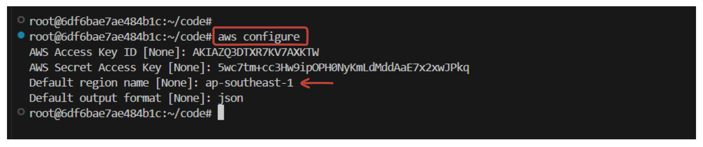
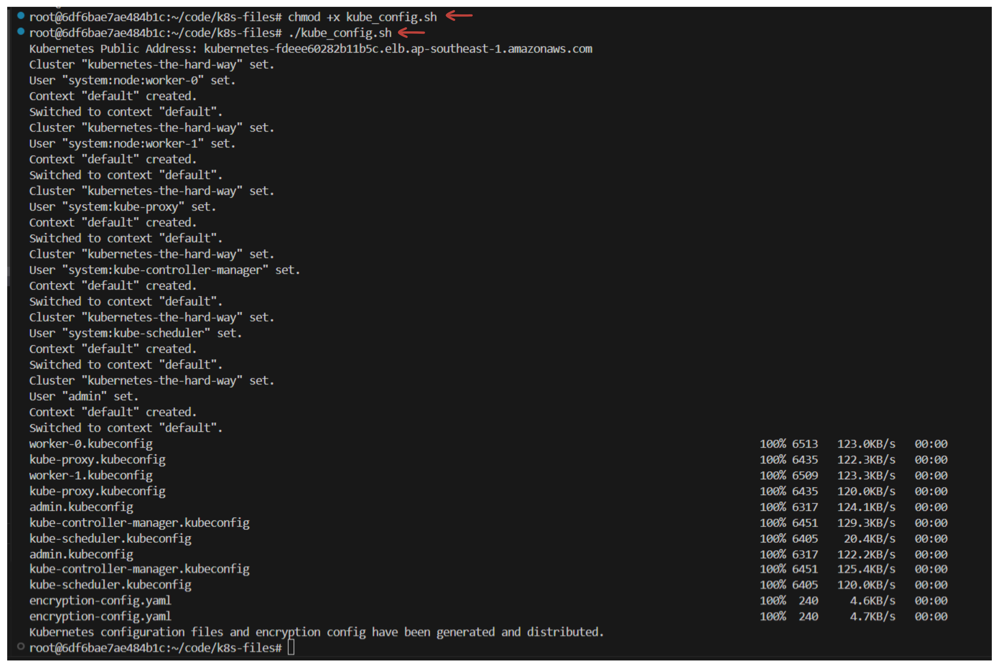
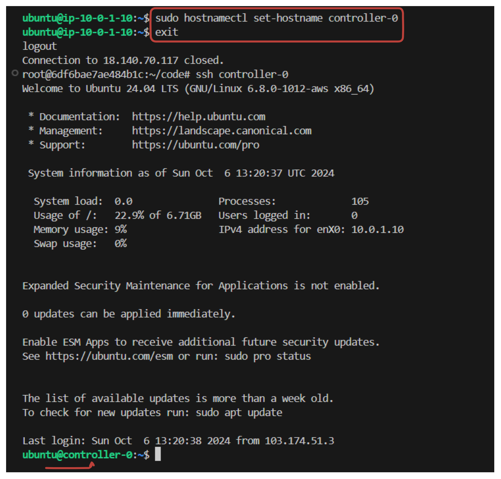
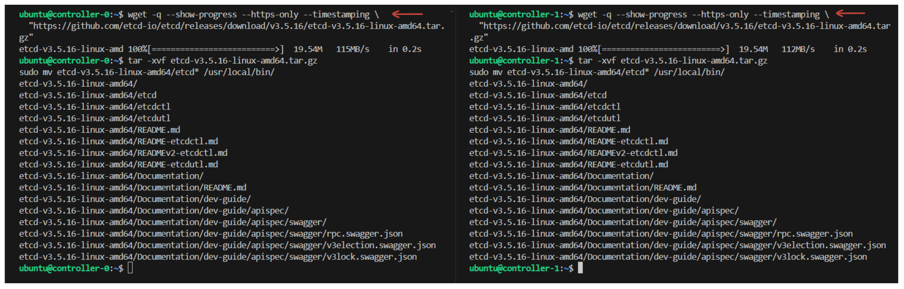
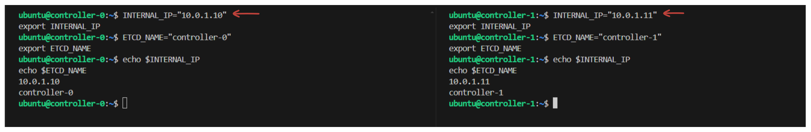
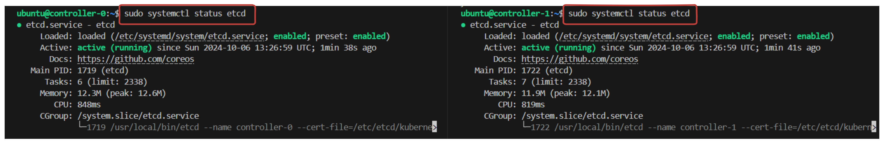
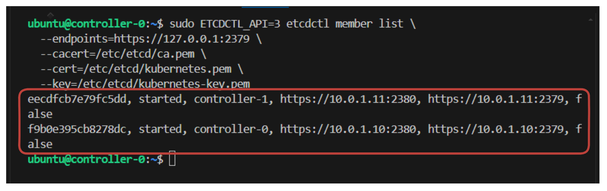

# Bootstrapping the etcd Cluster


## Introduction

Kubernetes components are inherently **stateless**, and they rely on `etcd` to store all cluster-related data, such as configuration, cluster state, and service discovery information.


This is the **fourth** lab on setting up a Kubernetes cluster from scratch on Amazon Web Services (AWS) series. In this guide, we will set up a two-node `etcd` cluster to provide high availability and secure communication between Kubernetes components. This setup is designed to ensure that the cluster state is consistently stored and available even if one `etcd` node goes down.

## Pretask: Initialize AWS Infrastructure

In this setup, we will design and deploy AWS Infrastructure to support Kubernetes Cluster. The cluster will 

- Consist of `four` public instances, divided into `two` categories: **Controller nodes** and **Worker nodes**. 
- To enable connectivity and internet access to the nodes, we will create a **public route table** and attach an **internet gateway** to it. This will allow the nodes to communicate with each other and access external resources and services. 
- Finally, we will utilize Pulumi python to create and manage this AWS infrastructure.


### 1. Configure AWS CLI

```sh
aws configure
```



### 2. Create a script to install the necessary tools:

```bash
#!/bin/bash

# Script to install jq, cfssl, cfssljson, kubectl, and python3.8-venv

# Function to check if a command exists
command_exists() {
  command -v "$1" &> /dev/null
}

echo "Updating package list..."
sudo apt-get update -y

# Install jq if not already installed
if command_exists jq; then
  echo "jq is already installed."
else
  echo "Installing jq..."
  sudo apt-get install jq -y
fi

# Download and install cfssl and cfssljson if not already installed
if command_exists cfssl && command_exists cfssljson; then
  echo "cfssl and cfssljson are already installed."
else
  echo "Installing cfssl and cfssljson..."
  wget -q --show-progress --https-only --timestamping \
    https://pkg.cfssl.org/R1.2/cfssl_linux-amd64 \
    https://pkg.cfssl.org/R1.2/cfssljson_linux-amd64

  chmod +x cfssl_linux-amd64 cfssljson_linux-amd64

  sudo mv cfssl_linux-amd64 /usr/local/bin/cfssl
  sudo mv cfssljson_linux-amd64 /usr/local/bin/cfssljson
  echo "cfssl and cfssljson installed successfully."
fi

# Download and install kubectl if not already installed
if command_exists kubectl; then
  echo "kubectl is already installed."
else
  echo "Installing kubectl..."
  curl -LO "https://dl.k8s.io/release/v1.21.0/bin/linux/amd64/kubectl"
  chmod +x ./kubectl
  sudo mv ./kubectl /usr/local/bin/kubectl
  echo "kubectl installed successfully."
fi

echo "All tools installed successfully!"
```
This script will install **jq, cfssl, cfssljson, kubectl**, and **python3.8-venv**.

**1. Now, Save the script as `install_k8s_tools.sh`**

**2. Make the script executable:**

```sh
chmod +x install_k8s_tools.sh
```
**3. Run the script:**

```sh
./install_k8s_tools.sh
```


## Provisioning Compute Resources

**1. Create a Directory for Your Infrastructure**

```sh
mkdir k8s-infra-aws
cd k8s-infra-aws
```

**2. Install Python `venv`**

```sh
sudo apt update
sudo apt install python3.8-venv -y
```


**3. Create a New Pulumi Project**

```sh
pulumi new aws-python
```
**4. Update the `__main.py__` file:**

```python
import pulumi
import pulumi_aws as aws
import os

# Create a VPC
vpc = aws.ec2.Vpc(
    'kubernetes-vpc',
    cidr_block='10.0.0.0/16',
    enable_dns_support=True,
    enable_dns_hostnames=True,
    tags={'Name': 'kubernetes-the-hard-way'}
)

# Create a subnet
subnet = aws.ec2.Subnet(
    'kubernetes-subnet',
    vpc_id=vpc.id,
    cidr_block='10.0.1.0/24',
    map_public_ip_on_launch=True,
    tags={'Name': 'kubernetes'}
)

# Create an Internet Gateway
internet_gateway = aws.ec2.InternetGateway(
    'kubernetes-internet-gateway',
    vpc_id=vpc.id,
    tags={'Name': 'kubernetes'}
)

# Create a Route Table
route_table = aws.ec2.RouteTable(
    'kubernetes-route-table',
    vpc_id=vpc.id,
    routes=[
        aws.ec2.RouteTableRouteArgs(
            cidr_block='0.0.0.0/0',
            gateway_id=internet_gateway.id,
        )
    ],
    tags={'Name': 'kubernetes'}
)

# Associate the route table with the subnet
route_table_association = aws.ec2.RouteTableAssociation(
    'kubernetes-route-table-association',
    subnet_id=subnet.id,
    route_table_id=route_table.id
)

# Create a security group with egress and ingress rules
security_group = aws.ec2.SecurityGroup(
    'kubernetes-security-group',
    vpc_id=vpc.id,
    description="Kubernetes security group",
    ingress=[
        aws.ec2.SecurityGroupIngressArgs(
            protocol='-1',
            from_port=0,
            to_port=0,
            cidr_blocks=['10.0.0.0/16', '10.200.0.0/16'],
        ),
        aws.ec2.SecurityGroupIngressArgs(
            protocol='tcp',
            from_port=22,
            to_port=22,
            cidr_blocks=['0.0.0.0/0'],
        ),
        aws.ec2.SecurityGroupIngressArgs(
            protocol='tcp',
            from_port=6443,
            to_port=6443,
            cidr_blocks=['0.0.0.0/0'],
        ),
        aws.ec2.SecurityGroupIngressArgs(
            protocol='tcp',
            from_port=443,
            to_port=443,
            cidr_blocks=['0.0.0.0/0'],
        ),
        aws.ec2.SecurityGroupIngressArgs(
            protocol='icmp',
            from_port=-1,
            to_port=-1,
            cidr_blocks=['0.0.0.0/0'],
        ),
    ],
    egress=[
        aws.ec2.SecurityGroupEgressArgs(
            protocol='-1',  # -1 allows all protocols
            from_port=0,
            to_port=0,
            cidr_blocks=['0.0.0.0/0'],  # Allow all outbound traffic
        )
    ],
    tags={'Name': 'kubernetes'}
)

# Create EC2 Instances for Controllers
controller_instances = []
for i in range(2):
    controller = aws.ec2.Instance(
        f'controller-{i}',
        instance_type='t2.small',
        ami='ami-01811d4912b4ccb26',  # Update with correct Ubuntu AMI ID
        subnet_id=subnet.id,
        key_name="kubernetes",
        vpc_security_group_ids=[security_group.id],
        associate_public_ip_address=True,
        private_ip=f'10.0.1.1{i}',
        tags={
            'Name': f'controller-{i}'
        }
    )
    controller_instances.append(controller)

# Create EC2 Instances for Workers
worker_instances = []
for i in range(2):
    worker = aws.ec2.Instance(
        f'worker-{i}',
        instance_type='t2.small',
        ami='ami-01811d4912b4ccb26',  # Update with correct Ubuntu AMI ID
        subnet_id=subnet.id,
        key_name="kubernetes",
        vpc_security_group_ids=[security_group.id],
        associate_public_ip_address=True,
        private_ip=f'10.0.1.2{i}',
        tags={'Name': f'worker-{i}'}
    )
    worker_instances.append(worker)

# Create a Network Load Balancer
nlb = aws.lb.LoadBalancer(
    'kubernetes-nlb',
    internal=False,
    load_balancer_type='network',
    subnets=[subnet.id],
    name='kubernetes'
)

# Create a Target Group for the Load Balancer
target_group = aws.lb.TargetGroup(
    'kubernetes-target-group',
    port=6443,
    protocol='TCP',
    vpc_id=vpc.id,
    target_type='ip',
    health_check=aws.lb.TargetGroupHealthCheckArgs(
        protocol='TCP',
    )
)

# Register Instances in Target Group
def create_attachment(name, target_id):
    return aws.lb.TargetGroupAttachment(
        name,
        target_group_arn=target_group.arn,
        target_id=target_id,
        port=6443
    )

# Iterate over controller instances and create TargetGroupAttachment
for i, instance in enumerate(controller_instances):
    # Use `apply` to get the resolved values of `instance.private_ip` and `instance.tags["Name"]`
    target_id = instance.private_ip
    attachment_name = instance.tags["Name"].apply(lambda tag_name: f'controller-{tag_name}-tg-attachment-{i}')
    
    # Ensure that `name` and `target_id` are resolved before creating the resource
    attachment = pulumi.Output.all(target_id, attachment_name).apply(lambda vals: create_attachment(vals[1], vals[0]))

    # Debug output
    pulumi.log.info(f'Creating TargetGroupAttachment with name: {attachment_name}')

# Create a Listener for the Load Balancer
listener = aws.lb.Listener(
    'kubernetes-listener',
    load_balancer_arn=nlb.arn,
    port=443,
    protocol='TCP',
    default_actions=[aws.lb.ListenerDefaultActionArgs(
        type='forward',
        target_group_arn=target_group.arn,
    )]
)

# Export Public DNS Name of the NLB
pulumi.export('kubernetes_public_address', nlb.dns_name)

# Export Public and Private IPs of Controller and Worker Instances
controller_public_ips = [controller.public_ip for controller in controller_instances]
controller_private_ips = [controller.private_ip for controller in controller_instances]
worker_public_ips = [worker.public_ip for worker in worker_instances]
worker_private_ips = [worker.private_ip for worker in worker_instances]

pulumi.export('controller_public_ips', controller_public_ips)
pulumi.export('controller_private_ips', controller_private_ips)
pulumi.export('worker_public_ips', worker_public_ips)
pulumi.export('worker_private_ips', worker_private_ips)

# Export the VPC ID and Subnet ID for reference
pulumi.export('vpc_id', vpc.id)
pulumi.export('subnet_id', subnet.id)

# create config file
def create_config_file(ip_list):
    # Define the hostnames for each IP address
    hostnames = ['controller-0', 'controller-1', 'worker-0', 'worker-1']
    
    config_content = ""
    
    # Iterate over IP addresses and corresponding hostnames
    for hostname, ip in zip(hostnames, ip_list):
        config_content += f"Host {hostname}\n"
        config_content += f"    HostName {ip}\n"
        config_content += f"    User ubuntu\n"
        config_content += f"    IdentityFile ~/.ssh/kubernetes.id_rsa\n\n"
    
    # Write the content to the SSH config file
    config_path = os.path.expanduser("~/.ssh/config")
    with open(config_path, "w") as config_file:
        config_file.write(config_content)

# Collect the IPs for all nodes
all_ips = [controller.public_ip for controller in controller_instances] + [worker.public_ip for worker in worker_instances]

# Create the config file with the IPs once the instances are ready
pulumi.Output.all(*all_ips).apply(create_config_file)
```

**5. Generate the key Pair**

```sh
cd ~/.ssh/
aws ec2 create-key-pair --key-name kubernetes --output text --query 'KeyMaterial' > kubernetes.id_rsa
chmod 400 kubernetes.id_rsa
```

**6. Create Infra**

```sh
pulumi up --yes
```


## Certificate Generation

**1. Create a directory to store all the necessary certifications and config files.**

```sh
mkdir k8s-files
cd k8s-files
```

**2. Create a script `(certificate.sh)` in the `k8s-files` files directory to create the necessary certificates.**

```sh
#!/bin/bash

KUBERNETES_PUBLIC_ADDRESS=$(aws elbv2 describe-load-balancers \
  --load-balancer-arns ${LOAD_BALANCER_ARN} \
  --output text --query 'LoadBalancers[].DNSName')
export KUBERNETES_PUBLIC_ADDRESS

KUBERNETES_HOSTNAMES=kubernetes,kubernetes.default,kubernetes.default.svc,kubernetes.default.svc.cluster,kubernetes.svc.cluster.local
export KUBERNETES_HOSTNAMES
           
# Generate CA configuration and certificate
cat > ca-config.json <<EOF
{
  "signing": {
    "default": {
      "expiry": "8760h"
    },
    "profiles": {
      "kubernetes": {
        "usages": ["signing", "key encipherment", "server auth", "client auth"],
        "expiry": "8760h"
      }
    }
  }
}
EOF

cat > ca-csr.json <<EOF
{
  "CN": "Kubernetes",
  "key": {
    "algo": "rsa",
    "size": 2048
  },
  "names": [
    {
      "C": "US",
      "L": "Portland",
      "O": "Kubernetes",
      "OU": "CA",
      "ST": "Oregon"
    }
  ]
}
EOF

cfssl gencert -initca ca-csr.json | cfssljson -bare ca

# Generate Admin Client Certificate
cat > admin-csr.json <<EOF
{
  "CN": "admin",
  "key": {
    "algo": "rsa",
    "size": 2048
  },
  "names": [
    {
      "C": "US",
      "L": "Portland",
      "O": "system:masters",
      "OU": "Kubernetes The Hard Way",
      "ST": "Oregon"
    }
  ]
}
EOF

cfssl gencert -ca=ca.pem -ca-key=ca-key.pem -config=ca-config.json -profile=kubernetes admin-csr.json | cfssljson -bare admin

# Generate Kubelet Client Certificates
for i in 0 1; do
  instance="worker-${i}"
  instance_hostname="ip-10-0-1-2${i}"
  
  cat > ${instance}-csr.json <<EOF
{
  "CN": "system:node:${instance_hostname}",
  "key": {
    "algo": "rsa",
    "size": 2048
  },
  "names": [
    {
      "C": "US",
      "L": "Portland",
      "O": "system:nodes",
      "OU": "Kubernetes The Hard Way",
      "ST": "Oregon"
    }
  ]
}
EOF

  external_ip=$(aws ec2 describe-instances --filters "Name=tag:Name,Values=${instance}" "Name=instance-state-name,Values=running" --output text --query 'Reservations[].Instances[].PublicIpAddress')
  internal_ip=$(aws ec2 describe-instances --filters "Name=tag:Name,Values=${instance}" "Name=instance-state-name,Values=running" --output text --query 'Reservations[].Instances[].PrivateIpAddress')

  cfssl gencert -ca=ca.pem -ca-key=ca-key.pem -config=ca-config.json -hostname=${instance_hostname},${external_ip},${internal_ip} -profile=kubernetes ${instance}-csr.json | cfssljson -bare ${instance}
done

# Generate Kube Controller Manager Certificate
cat > kube-controller-manager-csr.json <<EOF
{
  "CN": "system:kube-controller-manager",
  "key": {
    "algo": "rsa",
    "size": 2048
  },
  "names": [
    {
      "C": "US",
      "L": "Portland",
      "O": "system:kube-controller-manager",
      "OU": "Kubernetes The Hard Way",
      "ST": "Oregon"
    }
  ]
}
EOF

cfssl gencert -ca=ca.pem -ca-key=ca-key.pem -config=ca-config.json -profile=kubernetes kube-controller-manager-csr.json | cfssljson -bare kube-controller-manager

# Generate Kube Proxy Certificate
cat > kube-proxy-csr.json <<EOF
{
  "CN": "system:kube-proxy",
  "key": {
    "algo": "rsa",
    "size": 2048
  },
  "names": [
    {
      "C": "US",
      "L": "Portland",
      "O": "system:node-proxier",
      "OU": "Kubernetes The Hard Way",
      "ST": "Oregon"
    }
  ]
}
EOF

cfssl gencert -ca=ca.pem -ca-key=ca-key.pem -config=ca-config.json -profile=kubernetes kube-proxy-csr.json | cfssljson -bare kube-proxy

# Generate Kube Scheduler Certificate
cat > kube-scheduler-csr.json <<EOF
{
  "CN": "system:kube-scheduler",
  "key": {
    "algo": "rsa",
    "size": 2048
  },
  "names": [
    {
      "C": "US",
      "L": "Portland",
      "O": "system:kube-scheduler",
      "OU": "Kubernetes The Hard Way",
      "ST": "Oregon"
    }
  ]
}
EOF

cfssl gencert -ca=ca.pem -ca-key=ca-key.pem -config=ca-config.json -profile=kubernetes kube-scheduler-csr.json | cfssljson -bare kube-scheduler

# Generate Kubernetes API Server Certificate
cat > kubernetes-csr.json <<EOF
{
  "CN": "kubernetes",
  "key": {
    "algo": "rsa",
    "size": 2048
  },
  "names": [
    {
      "C": "US",
      "L": "Portland",
      "O": "Kubernetes",
      "OU": "Kubernetes The Hard Way",
      "ST": "Oregon"
    }
  ]
}
EOF

cfssl gencert -ca=ca.pem -ca-key=ca-key.pem -config=ca-config.json -hostname=10.32.0.1,10.0.1.10,10.0.1.11,${KUBERNETES_PUBLIC_ADDRESS},127.0.0.1,${KUBERNETES_HOSTNAMES} -profile=kubernetes kubernetes-csr.json | cfssljson -bare kubernetes

# Generate Service Account Certificate
cat > service-account-csr.json <<EOF
{
  "CN": "service-accounts",
  "key": {
    "algo": "rsa",
    "size": 2048
  },
  "names": [
    {
      "C": "US",
      "L": "Portland",
      "O": "Kubernetes",
      "OU": "Kubernetes The Hard Way",
      "ST": "Oregon"
    }
  ]
}
EOF

cfssl gencert -ca=ca.pem -ca-key=ca-key.pem -config=ca-config.json -profile=kubernetes service-account-csr.json | cfssljson -bare service-account

echo "All certificates generated successfully."

for instance in worker-0 worker-1; do
  external_ip=$(aws ec2 describe-instances --filters \
    "Name=tag:Name,Values=${instance}" \
    "Name=instance-state-name,Values=running" \
    --output text --query 'Reservations[].Instances[].PublicIpAddress')

  scp -i ~/.ssh/kubernetes.id_rsa ca.pem ${instance}-key.pem ${instance}.pem ubuntu@${external_ip}:~/
done

for instance in controller-0 controller-1; do
  external_ip=$(aws ec2 describe-instances --filters \
    "Name=tag:Name,Values=${instance}" \
    "Name=instance-state-name,Values=running" \
    --output text --query 'Reservations[].Instances[].PublicIpAddress')

  scp -i ~/.ssh/kubernetes.id_rsa \
    ca.pem ca-key.pem kubernetes-key.pem kubernetes.pem \
    service-account-key.pem service-account.pem ubuntu@${external_ip}:~/
done
```

This script will install all the necessary certificates.

**3. Now, Save the script as `certificate.sh`**

**4. Make the script executable:**

```sh
chmod +x certificate.sh
```


**5. Run the script:**

```sh
./certificate.sh
```

## Client Authentication Configs

Create a script `(kube_config.sh)` in the `k8s-files` files directory to create the necessary certificates.

```sh
#!/bin/bash

# Retrieve the Kubernetes Public DNS Address
KUBERNETES_PUBLIC_ADDRESS=$(aws elbv2 describe-load-balancers \
  --load-balancer-arns ${LOAD_BALANCER_ARN} \
  --output text --query 'LoadBalancers[0].DNSName')

echo "Kubernetes Public Address: ${KUBERNETES_PUBLIC_ADDRESS}"

# Generate kubeconfig for each worker node
for instance in worker-0 worker-1; do
  kubectl config set-cluster kubernetes-the-hard-way \
    --certificate-authority=ca.pem \
    --embed-certs=true \
    --server=https://${KUBERNETES_PUBLIC_ADDRESS}:443 \
    --kubeconfig=${instance}.kubeconfig

  kubectl config set-credentials system:node:${instance} \
    --client-certificate=${instance}.pem \
    --client-key=${instance}-key.pem \
    --embed-certs=true \
    --kubeconfig=${instance}.kubeconfig

  kubectl config set-context default \
    --cluster=kubernetes-the-hard-way \
    --user=system:node:${instance} \
    --kubeconfig=${instance}.kubeconfig

  kubectl config use-context default --kubeconfig=${instance}.kubeconfig
done

# Generate kubeconfig for kube-proxy
kubectl config set-cluster kubernetes-the-hard-way \
  --certificate-authority=ca.pem \
  --embed-certs=true \
  --server=https://${KUBERNETES_PUBLIC_ADDRESS}:443 \
  --kubeconfig=kube-proxy.kubeconfig

kubectl config set-credentials system:kube-proxy \
  --client-certificate=kube-proxy.pem \
  --client-key=kube-proxy-key.pem \
  --embed-certs=true \
  --kubeconfig=kube-proxy.kubeconfig

kubectl config set-context default \
  --cluster=kubernetes-the-hard-way \
  --user=system:kube-proxy \
  --kubeconfig=kube-proxy.kubeconfig

kubectl config use-context default --kubeconfig=kube-proxy.kubeconfig

# Generate kubeconfig for kube-controller-manager
kubectl config set-cluster kubernetes-the-hard-way \
  --certificate-authority=ca.pem \
  --embed-certs=true \
  --server=https://127.0.0.1:6443 \
  --kubeconfig=kube-controller-manager.kubeconfig

kubectl config set-credentials system:kube-controller-manager \
  --client-certificate=kube-controller-manager.pem \
  --client-key=kube-controller-manager-key.pem \
  --embed-certs=true \
  --kubeconfig=kube-controller-manager.kubeconfig

kubectl config set-context default \
  --cluster=kubernetes-the-hard-way \
  --user=system:kube-controller-manager \
  --kubeconfig=kube-controller-manager.kubeconfig

kubectl config use-context default --kubeconfig=kube-controller-manager.kubeconfig

# Generate kubeconfig for kube-scheduler
kubectl config set-cluster kubernetes-the-hard-way \
  --certificate-authority=ca.pem \
  --embed-certs=true \
  --server=https://127.0.0.1:6443 \
  --kubeconfig=kube-scheduler.kubeconfig

kubectl config set-credentials system:kube-scheduler \
  --client-certificate=kube-scheduler.pem \
  --client-key=kube-scheduler-key.pem \
  --embed-certs=true \
  --kubeconfig=kube-scheduler.kubeconfig

kubectl config set-context default \
  --cluster=kubernetes-the-hard-way \
  --user=system:kube-scheduler \
  --kubeconfig=kube-scheduler.kubeconfig

kubectl config use-context default --kubeconfig=kube-scheduler.kubeconfig

# Generate kubeconfig for admin user
kubectl config set-cluster kubernetes-the-hard-way \
  --certificate-authority=ca.pem \
  --embed-certs=true \
  --server=https://127.0.0.1:6443 \
  --kubeconfig=admin.kubeconfig

kubectl config set-credentials admin \
  --client-certificate=admin.pem \
  --client-key=admin-key.pem \
  --embed-certs=true \
  --kubeconfig=admin.kubeconfig

kubectl config set-context default \
  --cluster=kubernetes-the-hard-way \
  --user=admin \
  --kubeconfig=admin.kubeconfig

kubectl config use-context default --kubeconfig=admin.kubeconfig

# Distribute kubeconfig files to worker instances
for instance in worker-0 worker-1; do
  external_ip=$(aws ec2 describe-instances --filters \
    "Name=tag:Name,Values=${instance}" \
    "Name=instance-state-name,Values=running" \
    --output text --query 'Reservations[].Instances[].PublicIpAddress')

  scp -i ~/.ssh/kubernetes.id_rsa \
    ${instance}.kubeconfig kube-proxy.kubeconfig ubuntu@${external_ip}:~/
done

# Distribute kubeconfig files to controller instances
for instance in controller-0 controller-1; do
  external_ip=$(aws ec2 describe-instances --filters \
    "Name=tag:Name,Values=${instance}" \
    "Name=instance-state-name,Values=running" \
    --output text --query 'Reservations[].Instances[].PublicIpAddress')
  
  scp -i ~/.ssh/kubernetes.id_rsa \
    admin.kubeconfig kube-controller-manager.kubeconfig kube-scheduler.kubeconfig ubuntu@${external_ip}:~/
done

# Generate encryption key
ENCRYPTION_KEY=$(head -c 32 /dev/urandom | base64)

# Create encryption config file
cat > encryption-config.yaml <<EOF
kind: EncryptionConfig
apiVersion: v1
resources:
  - resources:
      - secrets
    providers:
      - aescbc:
          keys:
            - name: key1
              secret: ${ENCRYPTION_KEY}
      - identity: {}
EOF

# Copy the encryption config file to each controller instance
for instance in controller-0 controller-1; do
  external_ip=$(aws ec2 describe-instances --filters \
    "Name=tag:Name,Values=${instance}" \
    "Name=instance-state-name,Values=running" \
    --output text --query 'Reservations[].Instances[].PublicIpAddress')
  
  scp -i ~/.ssh/kubernetes.id_rsa encryption-config.yaml ubuntu@${external_ip}:~/
done

echo "Kubernetes configuration files and encryption config have been generated and distributed."
```

This script will install all the necessary Client Authentication Configs.

**1. Now, Save the script as `kube_config.sh`**

**2. Make the script executable:**

```sh
chmod +x kube_config.sh
```
**3. Run the script:**

```sh
./kube_config.sh
```



## Bootstrapping the etcd Cluster

> NOTE: From now on wards, the commands must be run on each controller instances: `controller-0`, `controller-1`

Login to each controller instance using the `ssh` command. Example:

```sh
ssh controller-0
ssh controller-1
```

We can also set the hostname of each controller:

**1. Controller-0**

```sh
sudo hostnamectl set-hostname controller-0
```


**2. Controller-1**

```sh
sudo hostnamectl set-hostname controller-1
```

>Tip: After setting the hostname, exit the SSH session and re-login to reload the changes.

## Download and Install the etcd Binaries

`etcd` is a distributed key-value store that stores cluster state and configuration information. Download the official etcd release binaries from the [etcd](https://github.com/etcd-io/etcd) GitHub project:

```sh
wget -q --show-progress --https-only --timestamping \
  "https://github.com/etcd-io/etcd/releases/download/v3.5.16/etcd-v3.5.16-linux-amd64.tar.gz"
```



Extract and install the `etcd` server and the `etcdctl` command line utility:

```sh
tar -xvf etcd-v3.5.16-linux-amd64.tar.gz
sudo mv etcd-v3.5.16-linux-amd64/etcd* /usr/local/bin/
```
This command will install both the `etcd server` and the `etcdctl` command-line utility, which is used for managing and interacting with the etcd cluster.

### Configure the etcd Server

Create the necessary directories for etcd configuration and data storage:

```sh
sudo mkdir -p /etc/etcd /var/lib/etcd
sudo chmod 700 /var/lib/etcd
sudo cp ca.pem kubernetes-key.pem kubernetes.pem /etc/etcd/
```

The TLS certificates `(ca.pem, kubernetes-key.pem, kubernetes.pem)` are used to secure communication between etcd nodes and clients. The certificates ensure that only trusted nodes and clients can communicate with the etcd cluster.


### Set Environment Variables for etcd Configuration

The internal IP (private ip) address of each controller node will be used for etcd node communication and client access. Set the environment variables for each controller node as shown below:


## For Controller-0

### Set `INTERNAL_IP`

Set the INTERNAL_IP with the private IP of controller-0.

```bash
INTERNAL_IP="10.0.1.10"
export INTERNAL_IP
```

### Set `ETCD_NAME`

If you know the etcd name (which typically matches the hostname or a unique identifier for the instance in the etcd cluster), you can set it like this:

```bash
ETCD_NAME="controller-0"
export ETCD_NAME
```

### Verify the Values
You can verify that the environment variables are set correctly by running:

```bash
echo $INTERNAL_IP
echo $ETCD_NAME
```



## For Controller-1

### Set `INTERNAL_IP`
Set the INTERNAL_IP with the private IP of controller-1.

```bash
INTERNAL_IP="10.0.1.11"
export INTERNAL_IP
```

### Set `ETCD_NAME`

If you know the etcd name (which typically matches the hostname or a unique identifier for the instance in the etcd cluster), you can set it like this:

```bash
ETCD_NAME="controller-1"
export ETCD_NAME
```

### Verify the Values
You can verify that the environment variables are set correctly by running:
```bash
echo $INTERNAL_IP
echo $ETCD_NAME
```

## Create the `etcd.service` systemd unit file:

The `etcd` service is managed by `systemd` to ensure it starts at boot and restarts automatically if it fails. Create the `etcd.service` file with the following content:

```sh
cat <<EOF | sudo tee /etc/systemd/system/etcd.service
[Unit]
Description=etcd
Documentation=https://github.com/coreos

[Service]
Type=notify
ExecStart=/usr/local/bin/etcd \\
  --name ${ETCD_NAME} \\
  --cert-file=/etc/etcd/kubernetes.pem \\
  --key-file=/etc/etcd/kubernetes-key.pem \\
  --peer-cert-file=/etc/etcd/kubernetes.pem \\
  --peer-key-file=/etc/etcd/kubernetes-key.pem \\
  --trusted-ca-file=/etc/etcd/ca.pem \\
  --peer-trusted-ca-file=/etc/etcd/ca.pem \\
  --peer-client-cert-auth \\
  --client-cert-auth \\
  --initial-advertise-peer-urls https://${INTERNAL_IP}:2380 \\
  --listen-peer-urls https://${INTERNAL_IP}:2380 \\
  --listen-client-urls https://${INTERNAL_IP}:2379,https://127.0.0.1:2379 \\
  --advertise-client-urls https://${INTERNAL_IP}:2379 \\
  --initial-cluster-token etcd-cluster-0 \\
  --initial-cluster controller-0=https://10.0.1.10:2380,controller-1=https://10.0.1.11:2380 \\
  --initial-cluster-state new \\
  --data-dir=/var/lib/etcd
Restart=on-failure
RestartSec=5

[Install]
WantedBy=multi-user.target
EOF
```

### Explanation of the Configuration
- **Peer URLs:** The `--initial-advertise-peer-urls` and `--listen-peer-urls` flags specify the communication address and port (2380) for etcd nodes to talk to each other.
- **Client URLs:** The `--listen-client-urls` and --advertise-client-urls flags specify the address and port (2379) for clients (like API servers) to communicate with etcd.
- **TLS Certificates:** The `--cert-file`, `--key-file`, and `--trusted-ca-file` options secure communication between etcd nodes and between clients and etcd.
- **Cluster Configuration:** The `--initial-cluster` flag defines the initial etcd cluster members and their peer URLs.

### Start and Enable the etcd Service

```sh
sudo systemctl daemon-reload
sudo systemctl enable etcd
sudo systemctl start etcd
```

> Important: Remember to run the above commands on each controller node: `controller-0`, `controller-1`.


## Verify the etcd Cluster

First check if etcd service is ruinning on both nodes or not

```sh
sudo systemctl status etcd
```



Once the etcd service is running on both nodes, verify the cluster status by listing the cluster members:

```sh
sudo ETCDCTL_API=3 etcdctl member list \
  --endpoints=https://127.0.0.1:2379 \
  --cacert=/etc/etcd/ca.pem \
  --cert=/etc/etcd/kubernetes.pem \
  --key=/etc/etcd/kubernetes-key.pem
```

> output



This output confirms that both `controller-0` and `controller-1` are part of the etcd cluster and are functioning correctly.

So, You have **successfully** bootstrapped a `two-node` etcd cluster that provides a foundation for storing Kubernetes cluster state and configuration data.