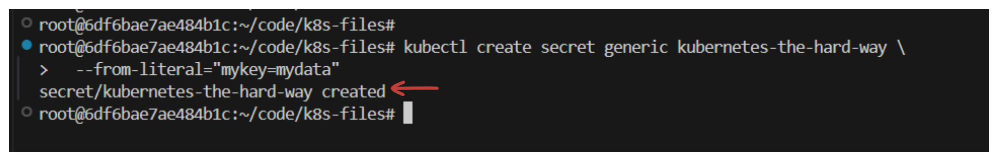
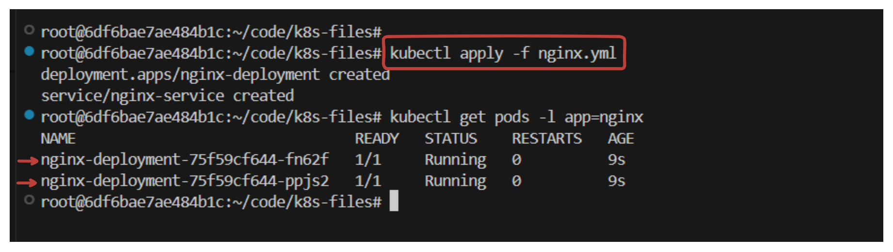
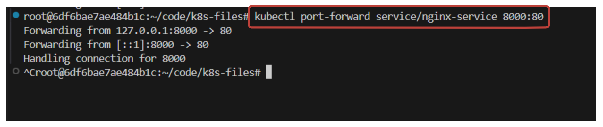

# Smoke Test

In this lab you will complete a series of tasks to ensure your Kubernetes cluster is functioning correctly.

## Data Encryption

In this section you will verify the ability to [encrypt secret data at rest](https://kubernetes.io/docs/tasks/administer-cluster/encrypt-data/#verifying-that-data-is-encrypted).

Create a generic secret:

```sh
kubectl create secret generic kubernetes-the-hard-way \
  --from-literal="mykey=mydata"
```



Print a hexdump of the `kubernetes-the-hard-way` secret stored in etcd:

```sh
ssh controller-0 \
 "sudo ETCDCTL_API=3 etcdctl get \
  --endpoints=https://127.0.0.1:2379 \
  --cacert=/etc/etcd/ca.pem \
  --cert=/etc/etcd/kubernetes.pem \
  --key=/etc/etcd/kubernetes-key.pem\
  /registry/secrets/default/kubernetes-the-hard-way | hexdump -C"
```

> output


The etcd key should be prefixed with `k8s:enc:aescbc:v1:key1`, which indicates the `aescbc` provider was used to encrypt the data with the `key1` encryption key.

## Deployments  - To be run on local machine

In this section you will verify the ability to create and manage [Deployments](https://kubernetes.io/docs/concepts/workloads/controllers/deployment/).

Create a deployment for the [nginx](https://nginx.org/en/) web server:

```yaml
apiVersion: apps/v1
kind: Deployment
metadata:
  name: nginx-deployment
  labels:
    app: nginx
spec:
  replicas: 2
  selector:
    matchLabels:
      app: nginx
  template:
    metadata:
      labels:
        app: nginx
      annotations:
        container.apparmor.security.beta.kubernetes.io/nginx: unconfined
    spec:
      containers:
      - name: nginx
        image: nginx:latest
        ports:
        - containerPort: 80
---
apiVersion: v1
kind: Service
metadata:
  name: nginx-service
  labels:
    app: nginx
spec:
  type: LoadBalancer
  selector:
    app: nginx
  ports:
    - protocol: TCP
      port: 80           
      targetPort: 80      
```

Apply the Manifest file:

```sh
kubectl apply -f nginx.yml
```

List the pod created by the `nginx` deployment:

```sh
kubectl get pods -l app=nginx
```

> output



### Port Forwarding

Port forwarding is a great option for accessing services locally on your machine without exposing them externally or modifying your Kubernetes service configuration. Here's how you can do it:

### Steps for Port Forwarding

1. **Identify the Pod or Service**: 
   First, you need to identify the pod or service you want to forward ports from. For example, if you have an `nginx` deployment, find one of its pods:

   ```bash
   kubectl get pods -l app=nginx
   ```

2. **Forward the Port**:
   You can use `kubectl port-forward` to forward a port from the pod or service to your local machine.

   **Forwarding from a Pod:**

   If you want to forward from a specific pod, use this command:

   ```bash
   kubectl port-forward <pod-name> 8000:80
   ```

   Example:
   ```bash
   kubectl port-forward nginx-deployment-6d8bf79768-h24xt 8000:80
   ```

   This will forward port `80` from the pod to `8000` on your local machine. You can now access the service at `http://localhost:8000`.

   **Forwarding from a Service:**

   Alternatively, if you want to forward from a service, you can do so as well:

   ```bash
   kubectl port-forward service/nginx-service 8000:80
   ```

   

   This forwards traffic from the `nginx-service` service on port `80` to your local machine on port `8000`.

3. **Access the Service**: 
   After running the port-forward command, you can access the service locally on your machine by navigating to:

   ```sh
   http://localhost:8000
   ```

   This is useful for testing or accessing services locally without modifying your cluster's networking configuration.