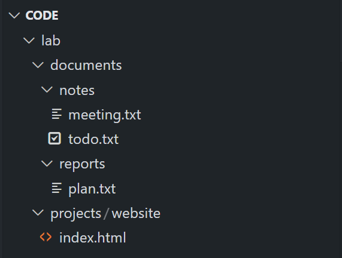
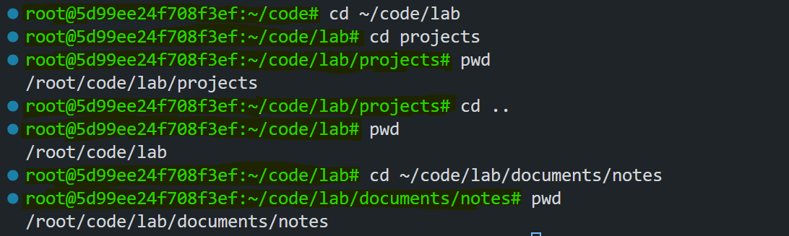
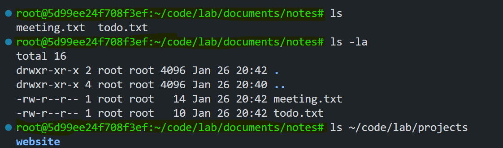
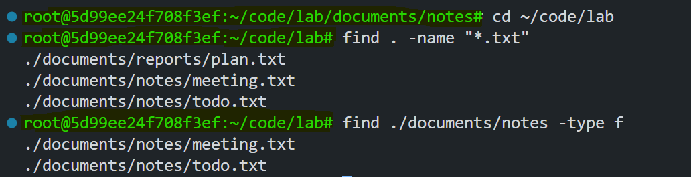
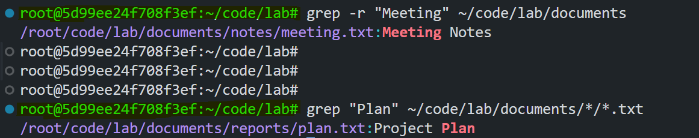
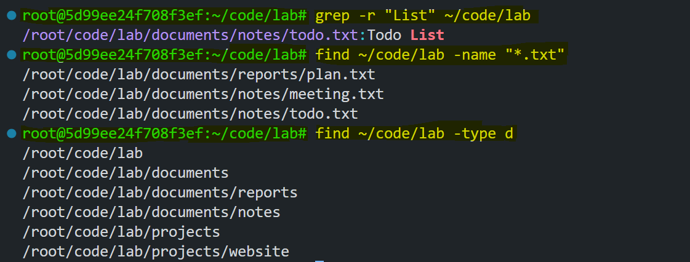

# Mastering Linux File System Navigation

Navigating the Linux file system is a fundamental skill for anyone working with Linux. This lab will guide you through the essential commands for file system navigation, directory management, and file searching. By the end of this lab, you'll have a solid understanding of basic Bash commands and how to use them effectively.


## Prerequisites
- A Linux terminal or Windows Subsystem for Linux (WSL)
- Basic familiarity with using a terminal

## Lab Setup

To get started, set up the practice environment by running the following commands in `Poridhi's VSCode` terminal:

```bash
# Create main directory structure
mkdir -p ~/code/lab/projects/website
mkdir -p ~/code/lab/documents/reports
mkdir -p ~/code/lab/documents/notes

# Create some sample files
echo "Hello World" > ~/code/lab/projects/website/index.html
echo "Project Plan" > ~/code/lab/documents/reports/plan.txt
echo "Meeting Notes" > ~/code/lab/documents/notes/meeting.txt
echo "Todo List" > ~/code/lab/documents/notes/todo.txt
```

This script creates directories and files that will be used in the exercises.



## Lab Exercises

### Exercise 1: Viewing Your Current Directory with `pwd`

1. Open `Poridhi's VSCode` terminal.
2. Type the following command:

   ```bash
   pwd
   ```

   **Explanation**: The `pwd` command (Print Working Directory) displays the full path of your current location in the file system. For example, it might output something like `/root/code`.

### Exercise 2: Navigating Directories with `cd`

1. Move to the lab directory:

   ```bash
   cd ~/code/lab
   ```
   **Explanation**: The `cd` command (Change Directory) allows you to move between directories. Here, `~` represents your home directory.

2. Practice navigating with these commands:

    ```bash
    # Go to the projects directory
    cd projects
    pwd  # Verify your location

    # Go back one level
    cd ..
    pwd  # You should now be in ~/code/lab

    # Navigate to the notes directory using an absolute path
    cd ~/code/lab/documents/notes
    pwd  # Verify your location
    ```
   **Explanation**: `cd ..` moves up one level in the directory hierarchy, and absolute paths start from the root (`/`).

   

### Exercise 3: Listing Directory Contents with `ls`

1. From your current location, explore directory contents:

    - Basic listing

        ```bash
        ls
        ```

    - Detailed listing with hidden files

        ```bash
        ls -la
        ```

    - List contents of another directory without navigating to it

        ```bash
        ls ~/code/lab/projects
        ```
    **Explanation**: The `ls` command lists files and directories. The `-la` option shows hidden files (those starting with `.`) and provides detailed information like permissions, size, and modification date.

    

### Exercise 4: Finding Files with `find`


1. Return to the lab directory:

   ```bash
   cd ~/code/lab
   ```
2. Use `find` to locate files:

   ```bash
   # Find all .txt files
   find . -name "*.txt"

   # Find all files in the notes directory
   find ./documents/notes -type f
   ```
   **Explanation**: The `find` command searches for files and directories. The `-name` option specifies a pattern, and `-type f` limits the search to files.

   

### Exercise 5: Searching File Contents with `grep`

1. Search for specific content in files:

   ```bash
   # Search for "Meeting" in all files under documents
   grep -r "Meeting" ~/code/lab/documents

   # Search for "Plan" in all .txt files
   grep "Plan" ~/code/lab/documents/*/*.txt
   ```
   **Explanation**: The `grep` command (`Global Regular Expression Print`) searches for text patterns within files. The `-r` option enables recursive search through directories.
   
   
## Search Challenge

1. Find all files containing the word "List".
2. Locate all `.txt` files in the lab directory and its subdirectories.
3. List all directories (not files) in the lab structure.

**Solution**:
```bash
grep -r "List" ~/code/lab
find ~/code/lab -name "*.txt"
find ~/code/lab -type d
```



## Common Issues and Troubleshooting

1. **Permission Denied**: Use `ls -la` to check permissions. Modify permissions with `chmod` if necessary.
2. **No such file or directory**: Verify the path you entered. Use tab completion to avoid typos.
3. **Command not found**: Ensure the command syntax is correct and the required tools are installed.

## Conclusion

Now that you've completed this lab, you should be comfortable with:
- Navigating directories using `cd`
- Viewing your current location with `pwd`
- Listing directory contents with `ls`
- Finding files using `find`
- Searching file contents with `grep`