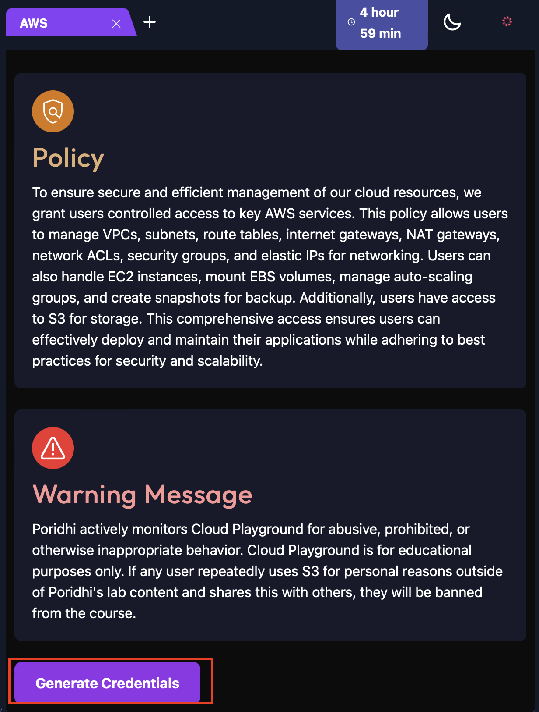
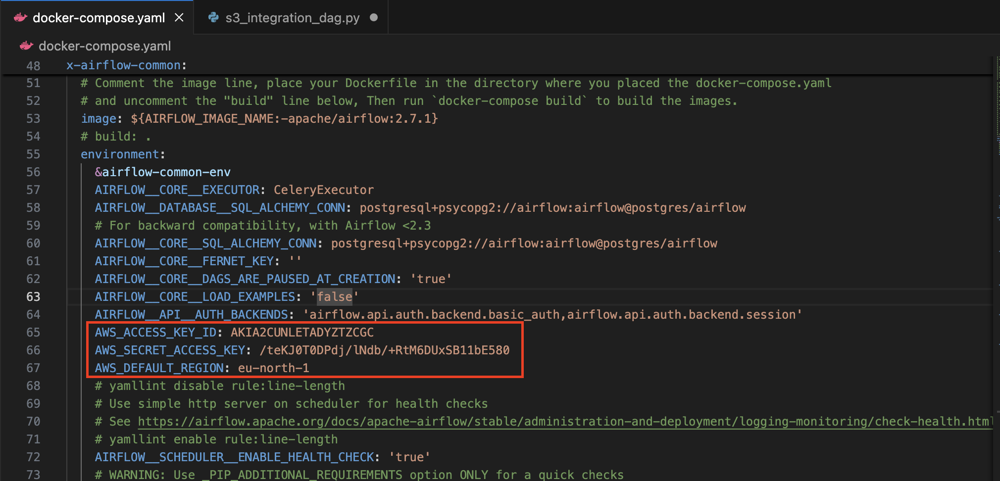
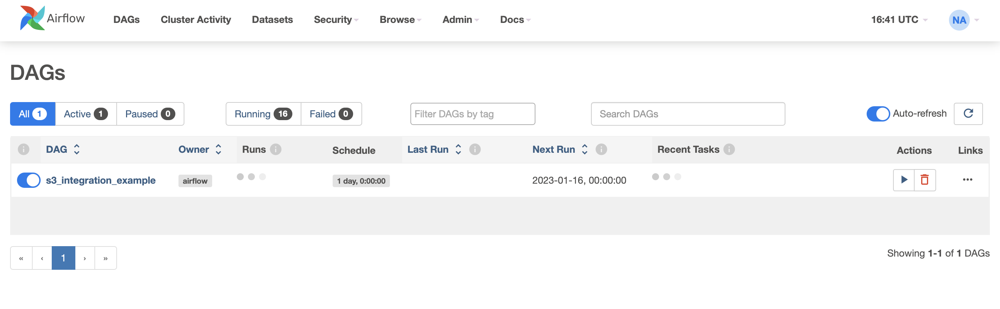
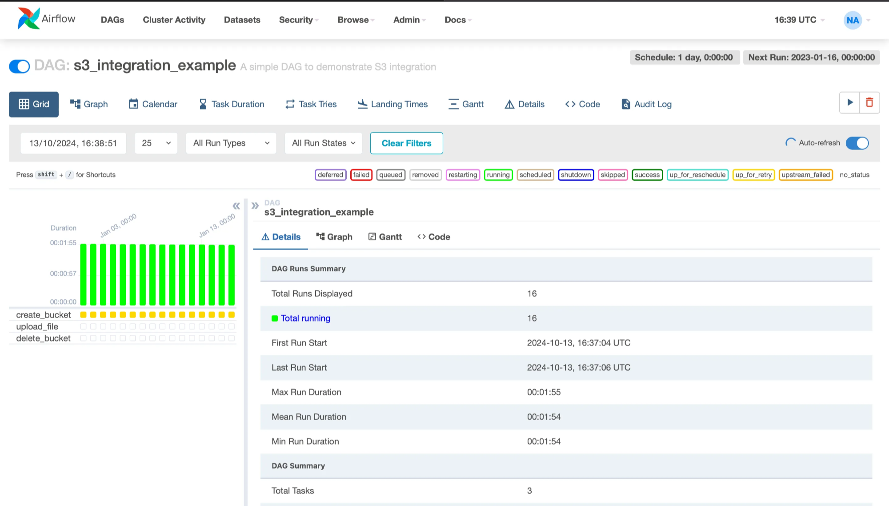
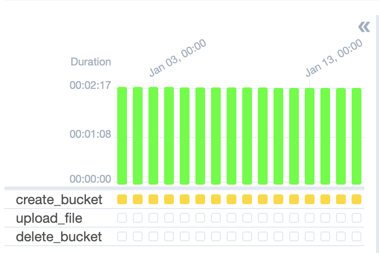
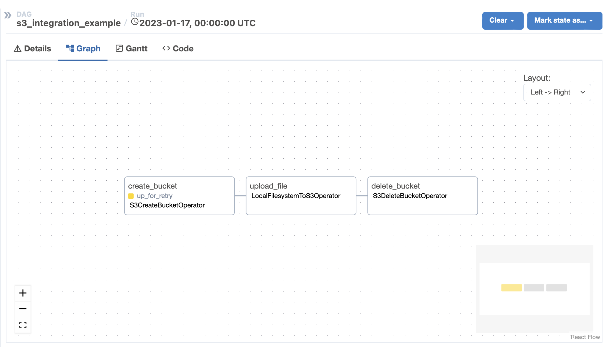

# **Integration of S3 with Apache Airflow** 

This lab demonstrates how to integrate an S3 bucket with Apache Airflow and schedule workflows (DAGs) to automate S3 operations. In the end, you’ll launch the Airflow web interface using a load balancer and monitor DAG execution via the graphical dashboard.

Below is an architectural diagram showcasing S3’s interaction with Airflow.  


## **Objectives**

- To integrate Apache Airflow with AWS S3.
- To automate S3 tasks using Airflow DAGs.
- To monitor Airflow workflows via its GUI.


## **Table of Contents**

1. **What is S3?**  
2. **Setup Your Environment**  
3. **AWS Account Creation**  
4. **Setting Up Connections in Apache Airflow**  
5. **VSCode Environment Setup**  
6. **Common Issues**  
7. **Conclusion**  

## **What is S3?**

An S3 bucket is a fundamental storage unit in Amazon Simple Storage Service (S3), a scalable and secure object storage service offered by Amazon Web Services (AWS). Think of it as a container where you can store and organize your data. These buckets serve as the top-level namespace for data storage in S3 and allow for structured management and access control of objects (files) within them.

### Features of S3 Buckets

1. **Scalability**  
   S3 automatically scales to handle high volumes of data and request traffic without requiring user intervention.

2. **Durability**  
   S3 is designed to provide **99.999999999% (11 nines)** durability. Data is redundantly stored across multiple devices and facilities within an AWS region.

3. **Access Control and Security**  
   - **Identity and Access Management (IAM)** policies allow fine-grained access control.  
   - **Bucket policies** and **Access Control Lists (ACLs)** define who can access the bucket or specific objects.  
   - Encryption options: Server-side encryption (SSE) or client-side encryption ensures data confidentiality.

4. **Versioning**  
   Enables maintaining multiple versions of objects within a bucket, allowing recovery from unintended deletions or overwrites.

5. **Lifecycle Management**  
   Automates moving objects between storage classes (e.g., S3 Standard, S3 Glacier) or deleting objects after a set period.

6. **Event Notifications**  
   Buckets can trigger events (e.g., object creation or deletion) to notify other AWS services like **Lambda**, **SNS**, or **SQS**.


To integrate S3 with Apache Airflow, we will follow the below steps:

## **Step 1: Set Up Your Environment**

These following steps are required to set up your environment. If you have already installed the required tools, you can skip this section.

**1. Install Homebrew**

Open your terminal and run:
  
```bash
/bin/bash -c "$(curl -fsSL [https://raw.githubusercontent.com/Homebrew/install/HEAD/install.sh](https://raw.githubusercontent.com/Homebrew/install/HEAD/install.sh))"
```

**2. Install Visual Studio Code**

```bash
brew install --cask visual-studio-code
```

**3. Install Docker**  
```bash
brew install --cask docker
```

**4. Install Python**  
```bash
brew install python
```

**5. Install AWS CLI**  
```bash
brew install awscli
```

## **Step 2: AWS Account Creation**

**1. Install AWS CLI (if not installed)**  
For Linux:  
```bash
curl "[https://awscli.amazonaws.com/awscli-exe-linux-x86_64.zip](https://awscli.amazonaws.com/awscli-exe-linux-x86_64.zip)" -o "awscliv2.zip"
unzip awscliv2.zip
sudo ./aws/install
```

**2. Verify Installation**  
```bash
aws --version
```

**3. Configure AWS CLI**  
Run the following command to set up your AWS credentials:

```bash
aws configure
```  
- **`Access Key`** and **`Secret Access Key`**: Generate these from your AWS account or a designated lab (e.g., Poridhi Lab).

- **Region**: Set your preferred AWS region (e.g., `ap-southeast-1`).



## **Step 3: Setting Up Connections in Apache Airflow**

1. Launch the Airflow web interface by navigating to [http://localhost:8080](http://localhost:8080). Use your previously created username and password.

2. Go to **Admin > Connections > Add a New Record [+]**.

3. Configure the connection:

   - **Connection ID**: `aws_default`  
   - **Connection Type**: `Amazon Web Services`  
   - **Access Key** and **Secret Access Key**: Enter your AWS credentials.

   

## **Step 4: VSCode Environment Setup**

**1. Update System Packages**  
```bash
sudo apt update
sudo apt upgrade -y
```

**2. Create a Project Directory**  
```bash
mkdir airflow-s3-project
cd airflow-s3-project
```

**3. Set Up a Virtual Environment**  
```bash
python3 -m venv s3
source s3/bin/activate
```

**4. Creating a DAG**

**Install Apache Airflow**

```bash
pip install apache-airflow
```

or,

```sh
AIRFLOW_VERSION=2.7.3
PYTHON_VERSION="$(python3 --version | cut -d " " -f 2 | cut -d "." -f 1-2)"
CONSTRAINT_URL="[https://raw.githubusercontent.com/apache/airflow/constraints-${AIRFLOW_VERSION}/constraints-${PYTHON_VERSION}.txt](https://raw.githubusercontent.com/apache/airflow/constraints-$%7BAIRFLOW_VERSION%7D/constraints-$%7BPYTHON_VERSION%7D.txt)"
pip install "apache-airflow==${AIRFLOW_VERSION}" --constraint "${CONSTRAINT_URL}"
```
**Install Apache Airflow with Amazon provider:**

```sh
pip install apache-airflow apache-airflow-providers-amazon
```

**5. Prepare Docker Setup** 

- Download the `docker-compose.yaml` file:

    ```bash
    curl -LfO '[https://airflow.apache.org/docs/apache-airflow/2.7.1/docker-compose.yaml](https://airflow.apache.org/docs/apache-airflow/2.7.1/docker-compose.yaml)'
    ```

- Create an `.env` file in the same directory:

    ```bash
    echo -e "AIRFLOW_UID=$(id -u)\nAIRFLOW_GID=0" > .env
    ```

**6. Update Docker Configuration**

Modify `docker-compose.yaml` to include your AWS credentials:

```yaml
environment:
    AWS_ACCESS_KEY_ID: ${AWS_ACCESS_KEY_ID}
    AWS_SECRET_ACCESS_KEY: ${AWS_SECRET_ACCESS_KEY}
    AWS_DEFAULT_REGION: ${AWS_DEFAULT_REGION}
```



Use the credentials from the AWS account you created in the previous step.

**7. Create a DAG**

- Create a folder for your DAGs:

    ```bash
    mkdir ./dags
    ```
- Create a Python script `s3_integration_dag.py` in the `dags` folder. Use the following code:  

    ```python
    from airflow import DAG
    from airflow.providers.amazon.aws.operators.s3 import S3CreateBucketOperator, S3DeleteBucketOperator
    from airflow.providers.amazon.aws.transfers.local_to_s3 import LocalFilesystemToS3Operator
    from datetime import datetime, timedelta

    default_args = {
        'owner': 'airflow',
        'depends_on_past': False,
        'start_date': datetime(2024, 10, 6),
        'email_on_failure': False,
        'email_on_retry': False,
        'retries': 1,
        'retry_delay': timedelta(minutes=5),
    }

    dag = DAG(
        's3_integration_example',
        default_args=default_args,
        description='A simple DAG to demonstrate S3 integration',
        schedule=timedelta(days=1),
    )

    create_bucket = S3CreateBucketOperator(
        task_id='create_bucket',
        bucket_name='my-airflow-bucket-{}'.format(datetime.now().strftime('%Y%m%d%H%M%S')),
        region_name='us-east-1',
        aws_conn_id='aws_default',
        dag=dag,
    )

    upload_file = LocalFilesystemToS3Operator(
        task_id='upload_file',
        filename='/path/to/local/file.txt',
        dest_key='file.txt',
        dest_bucket='{{ task_instance.xcom_pull(task_ids="create_bucket") }}',
        aws_conn_id='aws_default',
        dag=dag,
    )

    delete_bucket = S3DeleteBucketOperator(
        task_id='delete_bucket',
        bucket_name='{{ task_instance.xcom_pull(task_ids="create_bucket") }}',
        force_delete=True,
        aws_conn_id='aws_default',
        dag=dag,
    )

    create_bucket >> upload_file >> delete_bucket
    ```

This DAG creates a **bucket, uploads a file, and then deletes the bucket.**

**8. Start Airflow Services**

```bash
docker-compose up --build
docker-compose up -d
```


## **Step 5: Launch Airflow with a Load Balancer**

**1. Configure your load balancer with `Poridhi's VM's` `eth0` IP address and `PORT`.**


**2. Access the Airflow GUI through the load balancer URL. Log in and view your DAGs.  **

Example grid view:  


**3. Enable and trigger your DAG. Monitor its progress.**


- First view the DAGs:


- To remove these example DAG files, go to the yaml file and change this from true → false.


- After refreshing the DAG dashboard will look like this.



- Enable and trigger your DAG execution from the Airflow UI and monitor it.

**Possible Outputs:**




**Grid view of DAG execution:**




## **Common Issues**

### **Issue 1: Unable to Log In to Airflow Web Interface**

- Verify user creation:

  ```bash
  docker exec -it s3airflow-airflow-webserver-1 airflow users list
  ```

  You should see the user you created in the previous step.

  

- To synchronize the database run this command:

  ```bash
  docker-compose restart airflow-webserver
  ```

### Issue 2: DAG showed up in the dashboard but can't be triggered


- Check if the DAG file is in the dags folder.

    

- The file name must match the dag_id on your dag file.
- Try running this command on your terminal:

    ```sh
    docker-compose restart
    ```
- If the issue persists, make sure that the file and folder permissions allow the Airflow process to access and read the DAG file.

    ```sh
    ls -l dags/s3_integration_example.py
    ```
The output should be something like this:

```sh
-rw-r--r--  1 username  groupname  1234 Jan 1 00:00 s3_integration_example.py
```

> Tips: Do not change the yaml file other than the given instruction, it might give some issues regarding finding dag in the dashboard or no getting connected to Docker.

## **Conclusion**

You have successfully integrated AWS S3 with Apache Airflow and scheduled workflows. This setup demonstrates the power of Airflow for automating cloud-based tasks, and you can further expand this integration to meet more complex MLOps requirements.