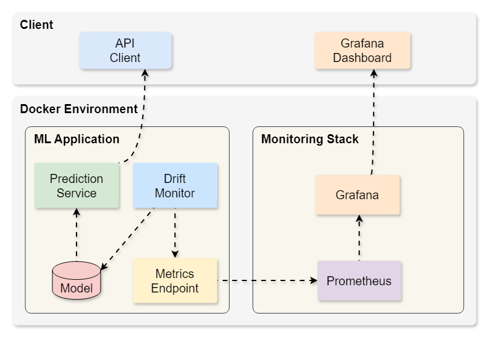

# Setting Up Model Monitoring with Grafana and Prometheus

This document introduces you to the world of machine learning model monitoring through Grafana using the example of a simple regression model. By the end, we will have a monitoring system set up that can send alerts when production performance drops



## Prerequisites
- Python 3.8+
- Docker and Docker Compose
- Basic understanding of ML model deployment
- Admin privileges (for installing system packages)

## 1. Environment Setup

### Create Virtual Environment
```bash
conda create -n grafana_monitoring python=3.8 -y
conda activate grafana_monitoring
```

### Create requirements.txt
Create a file named `requirements.txt` with these dependencies:
```
scikit-learn
numpy
pandas
seaborn
flask
apscheduler
prometheus-client
joblib
werkzeug
```

### Install Dependencies
```bash
pip install -U -r requirements.txt
```

### Project Structure
Create the project directory and files:
```bash
mkdir grafana_model_monitoring
cd grafana_model_monitoring
mkdir src
touch src/app.py src/concept_drift.py src/data_drift.py src/train.py
touch Dockerfile docker-compose.yml prometheus.yml
```

### Install Grafana

For Ubuntu/Debian/WSL2:
```bash
sudo apt-get install -y software-properties-common
sudo add-apt-repository "deb https://packages.grafana.com/oss/deb stable main"
sudo apt-get update
sudo apt-get install grafana
```

For macOS:
```bash
brew update
brew install grafana
```

Start Grafana Service:
- Ubuntu/Debian: `sudo systemctl start grafana-server && sudo systemctl enable grafana-server`
- WSL2: `sudo /usr/sbin/grafana-server --config=/etc/grafana/grafana.ini --homepath /usr/share/grafana`
- macOS: `brew services start grafana`

### Install Prometheus

For Ubuntu/Debian/WSL2:
```bash
wget https://github.com/prometheus/prometheus/releases/download/v2.30.3/prometheus-2.30.3.linux-amd64.tar.gz
tar xvfz prometheus-*.tar.gz
cd prometheus-*
```

For macOS:
```bash
brew update
brew install prometheus
```

## 2. Model Development

### Create train.py
In `src/train.py`:
```python
import seaborn as sns
from sklearn.model_selection import train_test_split
from sklearn.ensemble import RandomForestRegressor
from sklearn.compose import ColumnTransformer
from sklearn.preprocessing import StandardScaler, OneHotEncoder
from sklearn.pipeline import Pipeline
import joblib

def train_model():
    # Load data
    diamonds = sns.load_dataset("diamonds")
    
    # Split features and target
    X = diamonds[["carat", "cut", "color", "clarity", "depth", "table"]]
    y = diamonds["price"]
    
    # Split data
    X_train, X_test, y_train, y_test = train_test_split(
        X, y, test_size=0.2, random_state=42
    )
    
    # Create preprocessor
    numeric_features = ["carat", "depth", "table"]
    categorical_features = ["cut", "color", "clarity"]
    
    preprocessor = ColumnTransformer(
        transformers=[
            ("num", StandardScaler(), numeric_features),
            ("cat", OneHotEncoder(drop="first"), categorical_features)
        ]
    )
    
    # Create pipeline
    model_pipeline = Pipeline([
        ("preprocessor", preprocessor),
        ("regressor", RandomForestRegressor(random_state=42))
    ])
    
    # Train model
    model_pipeline.fit(X_train, y_train)
    
    # Save model
    joblib.dump(model_pipeline, "model_pipeline.joblib")
    
    return model_pipeline

if __name__ == "__main__":
    train_model()
```

## 3. Drift Detection Implementation

### Create data_drift.py
In `src/data_drift.py`:
```python
import numpy as np
from scipy.stats import ks_2samp

def detect_data_drift(reference_data, current_data, threshold=0.1):
    drift_scores = {}
    for column in reference_data.columns:
        ks_statistic, p_value = ks_2samp(reference_data[column], current_data[column])
        drift_scores[column] = ks_statistic
    
    overall_drift_score = np.mean(list(drift_scores.values()))
    is_drift = overall_drift_score > threshold
    
    return is_drift, drift_scores, overall_drift_score
```

### Create concept_drift.py
In `src/concept_drift.py`:
```python
from sklearn.metrics import mean_squared_error
import numpy as np

def detect_concept_drift(
    model_pipeline, X_reference, y_reference, X_current, y_current, threshold=0.1
):
    y_pred_reference = model_pipeline.predict(X_reference)
    y_pred_current = model_pipeline.predict(X_current)
    
    mse_reference = mean_squared_error(y_reference, y_pred_reference)
    mse_current = mean_squared_error(y_current, y_pred_current)
    
    relative_performance_decrease = (mse_current - mse_reference) / mse_reference
    is_drift = relative_performance_decrease > threshold
    
    return is_drift, relative_performance_decrease
```

## 4. API Development

### Create app.py
In `src/app.py`:
```python
import os
import joblib
import pandas as pd
import seaborn as sns
from prometheus_client import start_http_server, Gauge
from prometheus_client import make_wsgi_app
from flask import Flask, request, jsonify
from apscheduler.schedulers.background import BackgroundScheduler
from werkzeug.middleware.dispatcher import DispatcherMiddleware
from data_drift import detect_data_drift
from concept_drift import detect_concept_drift

app = Flask(__name__)

# Load model
try:
    model_pipeline = joblib.load("model_pipeline.joblib")
    print("Model pipeline loaded successfully")
except Exception as e:
    print(f"Error loading model pipeline: {e}")
    model_pipeline = None

# Create metrics
data_drift_gauge = Gauge("data_drift", "Data Drift Score")
concept_drift_gauge = Gauge("concept_drift", "Concept Drift Score")

# Load reference data
diamonds = sns.load_dataset("diamonds")
X_reference = diamonds[["carat", "cut", "color", "clarity", "depth", "table"]]
y_reference = diamonds["price"]

@app.route("/predict", methods=["POST"])
def predict():
    if model_pipeline is None:
        return jsonify({"error": "Model pipeline not loaded"}), 500
    
    data = request.json
    df = pd.DataFrame(data, index=[0])
    prediction = model_pipeline.predict(df)
    
    return jsonify({"prediction": prediction[0]})

def monitor_drifts():
    # Simulate production data
    new_diamonds = sns.load_dataset("diamonds").sample(n=1000, replace=True)
    X_current = new_diamonds[["carat", "cut", "color", "clarity", "depth", "table"]]
    y_current = new_diamonds["price"]
    
    # Check data drift
    is_data_drift, _, data_drift_score = detect_data_drift(X_reference, X_current)
    data_drift_gauge.set(data_drift_score)
    
    # Check concept drift
    is_concept_drift, concept_drift_score = detect_concept_drift(
        model_pipeline,
        X_reference,
        y_reference,
        X_current,
        y_current,
    )
    concept_drift_gauge.set(concept_drift_score)
    
    if is_data_drift:
        print("Data drift detected!")
    if is_concept_drift:
        print("Concept drift detected!")

# Add prometheus wsgi middleware
app.wsgi_app = DispatcherMiddleware(app.wsgi_app, {"/metrics": make_wsgi_app()})

if __name__ == "__main__":
    # Start prometheus client
    start_http_server(8000)
    
    # Schedule drift monitoring
    scheduler = BackgroundScheduler()
    scheduler.add_job(monitor_drifts, "interval", minutes=1)
    scheduler.start()
    
    # Start Flask app
    app.run(host="0.0.0.0", port=5000)
```

## 5. Docker Configuration

### Create Dockerfile
```dockerfile
FROM python:3.8-slim

WORKDIR /app
COPY requirements.txt .
RUN pip install --no-cache-dir -U -r requirements.txt

COPY . .
RUN python src/train.py

CMD ["python", "src/app.py"]
```

### Create docker-compose.yml
```yaml
version: "3"
services:
  app:
    build: .
    ports:
      - "5000:5000"  # Flask app
      - "8000:8000"  # Prometheus metrics
    volumes:
      - ./:/app
  
  prometheus:
    image: prom/prometheus
    ports:
      - "9090:9090"
    volumes:
      - ./prometheus.yml:/etc/prometheus/prometheus.yml
  
  grafana:
    image: grafana/grafana
    ports:
      - "3000:3000"
    environment:
      - GF_SECURITY_ADMIN_PASSWORD=admin
    volumes:
      - grafana-storage:/var/lib/grafana

volumes:
  grafana-storage:
```

### Create prometheus.yml
```yaml
global:
  scrape_interval: 15s

scrape_configs:
  - job_name: 'prometheus'
    static_configs:
      - targets: ['localhost:9090']
  
  - job_name: 'model_metrics'
    static_configs:
      - targets: ['app:8000']
```

## 6. Build and Run

1. Build Docker images:
```bash
docker-compose down
docker-compose build
```

2. Start services:
```bash
docker-compose up -d
```

3. Verify services are running:
- Flask API: http://localhost:5000/metrics
- Prometheus: http://localhost:9090
- Grafana: http://localhost:3000 (login: admin/admin)

## 7. Grafana Configuration

1. Add Prometheus Data Source:
   - Go to Configuration > Data Sources
   - Click "Add data source"
   - Select "Prometheus"
   - Set URL to "http://prometheus:9090"
   - Click "Save & Test"

2. Create Dashboard:
   - Click "+ New Dashboard"
   - Add two visualization panels:
     - Data Drift Panel:
       - Query: `data_drift`
       - Visualization: Graph
       - Add threshold at 0.1
     - Concept Drift Panel:
       - Query: `concept_drift`
       - Visualization: Graph
       - Add threshold at 0.1


## 8. Alert Configuration

1. Create Discord Webhook:
   - Create new Discord server
   - Create channel for alerts
   - Server Settings > Integrations > Create Webhook
   - Copy webhook URL

2. Add Discord Contact Point in Grafana:
   - Go to Alerting > Contact points
   - Add new contact point
   - Select Discord integration
   - Paste webhook URL
   - Test connection

3. Create Alert Rules:
   For each panel:
   - Edit panel
   - Go to Alert tab
   - Create new alert rule
   - Set condition (e.g., `data_drift > 0.1`)
   - Set evaluation period
   - Select Discord contact point
   - Add custom message
   - Save rule

   

   

Your monitoring system is now complete! The system will:
- Serve predictions via the Flask API
- Monitor for data and concept drift every minute
- Display drift metrics in Grafana dashboards
- Send Discord alerts when drift exceeds thresholds

For production use, consider:
- Adding authentication to APIs
- Implementing proper logging
- Setting up backup and recovery
- Adding more sophisticated drift detection
- Implementing model retraining pipeline