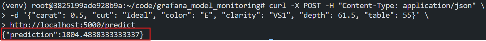
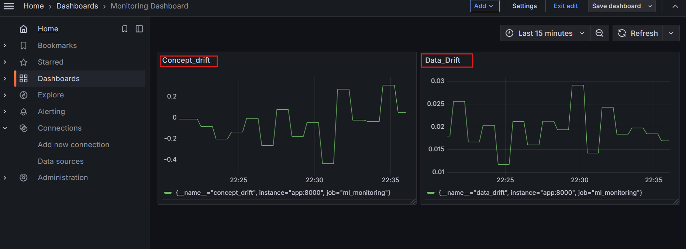
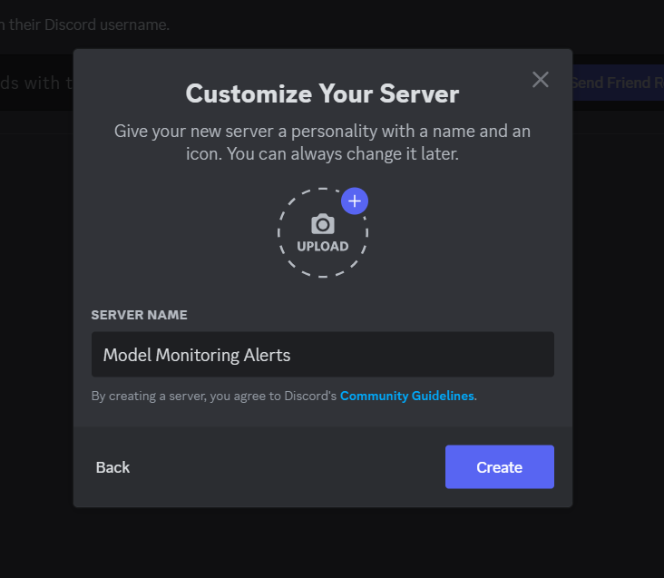
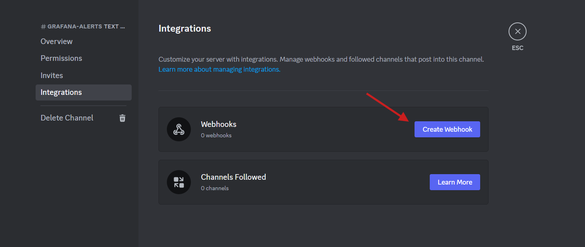
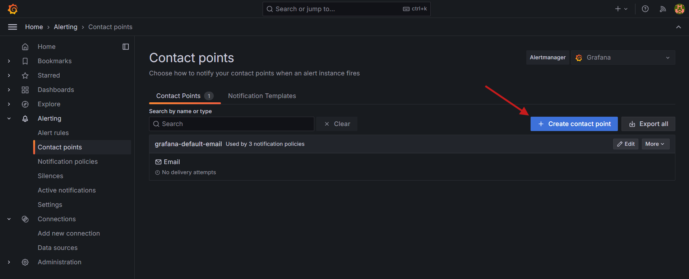
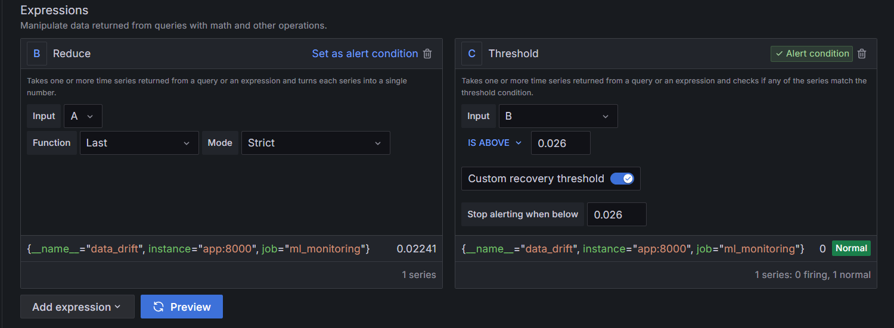
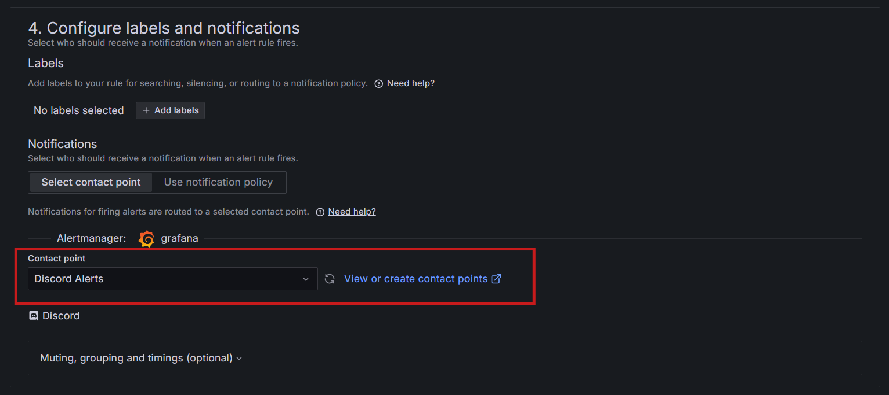
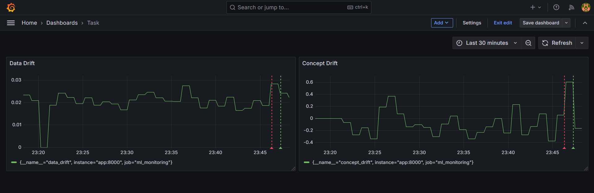

# **Monitoring Machine Learning Models**

Machine learning projects require **continuous monitoring** post-deployment to ensure the model's performance doesn’t degrade. Tools like **Grafana** allow data scientists and ML engineers to monitor and visualize production models in real-time, enabling timely actions when performance drops.

In this lab, we will:
- Build a regression model to predict diamond prices.
- Create a REST API to serve predictions and expose monitoring metrics.
- Detect data drift and concept drift in real-time.
- Visualize metrics using Grafana and monitor them using Prometheus.
- Deploy the system using Docker and Docker Compose.
- Set up Discord alerts for drift threshold.


## **Why Monitoring Is Necessary**
ML models degrade in production due to:
1. **Data Drift**: Changes in input data distributions compared to training data.
   - **Example**: A robot trained to sort red apples might fail when faced with green apples.
   - **Impact**: Poor predictions due to outdated input patterns.
2. **Concept Drift**: Changes in the relationship between input features and the target variable.
   - **Example**: A preference shift to underripe apples changes the model's logic.
   - **Impact**: Model assumptions become invalid, requiring updates.

## **Why It Matters**
Monitoring detects drift early, enabling:
- Timely retraining.
- Feature engineering adjustments.
- Model updates to maintain reliability.


## Required Tools
- **Grafana**: Visualization dashboards and alerting.
- **Prometheus**: Metrics collection and storage.
- **Flask**: REST API for predictions and metrics.
- **Scikit-learn**: Model building and preprocessing.
- **SciPy**: Statistical tests for drift detection.
- **Docker and Docker Compose**: Containerization and deployment.
- **APScheduler**: Scheduling drift checks.


## Project Structure
```
grafana_model_monitoring/
├── src/
│   ├── app.py               # Flask API for model serving and metrics
│   ├── train.py             # Model training and pipeline creation
│   ├── data_drift.py        # Data drift detection
│   ├── concept_drift.py     # Concept drift detection
├── prometheus.yml           # Prometheus configuration
├── Dockerfile               # Docker configuration for the app
├── docker-compose.yml       # Docker Compose configuration
├── requirements.txt         # Python dependencies
```


## Setting Up the Environment

**Create a Virtual Environment**:
   ```bash
   sudo apt update
   apt install python3.8-venv
   python3 -m venv venv
   source venv/bin/activate
   ```
**Create the Project Structure**:
   ```bash
   mkdir grafana_model_monitoring; cd grafana_model_monitoring
   mkdir src
   touch src/{app.py,train.py,data_drift.py,concept_drift.py}
   touch requirements.txt Dockerfile docker-compose.yml prometheus.yml
   ```

**Install Dependencies**:
   Add this dependencies to the `requirements.txt` file:
   ```
   scikit-learn
   numpy
   pandas
   seaborn
   flask
   apscheduler
   prometheus-client
   joblib
   werkzeug
   scipy
   ```
   Install the dependencies:
   ```bash
   pip install -r requirements.txt
   ```

## Setup the Model

In this lab, we will use the `Diamonds` dataset from the `Seaborn` library to predict diamond prices. This dataset includes both numerical and categorical features, necessitating pre-processing before model training.

The `train_model()` function: 

- Loads the Diamonds dataset.
- Preprocesses data using a `ColumnTransformer` (one-hot encoding for categorical features and scaling for numeric ones).
- Builds a `RandomForestRegressor` pipeline.
- Splits the data, trains the pipeline, and evaluates it using MSE.
- Saves the trained pipeline with `joblib` as `model_pipeline.joblib`.

This script lays the foundation for the REST API.

**`src/train.py`**
```python
from sklearn.compose import ColumnTransformer
from sklearn.preprocessing import StandardScaler, OneHotEncoder
from sklearn.ensemble import RandomForestRegressor
from sklearn.pipeline import Pipeline
from sklearn.model_selection import train_test_split
from sklearn.metrics import mean_squared_error
import joblib
import pandas as pd
import seaborn as sns

def train_model():
    # Load the diamonds dataset
    diamonds = sns.load_dataset("diamonds")

    # Separate features and target
    X = diamonds[["carat", "cut", "color", "clarity", "depth", "table"]]
    y = diamonds["price"]

    # Create preprocessing steps
    preprocessor = ColumnTransformer(
        transformers=[
            ("num", StandardScaler(), ["carat", "depth", "table"]),
            ("cat", OneHotEncoder(drop="first", sparse=False), ["cut", "color", "clarity"]),
        ]
    )

    # Create a pipeline that includes preprocessing and the model
    model_pipeline = Pipeline(
        [("preprocessor", preprocessor), ("regressor", RandomForestRegressor(n_estimators=100, random_state=42))]
    )

    # Split the data
    X_train, X_test, y_train, y_test = train_test_split(X, y, test_size=0.2, random_state=42)

    # Fit the pipeline
    model_pipeline.fit(X_train, y_train)

    # Evaluate the model
    y_pred = model_pipeline.predict(X_test)
    mse = mean_squared_error(y_test, y_pred)
    print(f"Model MSE: {mse}")

    # Save the entire pipeline
    joblib.dump(model_pipeline, "model_pipeline.joblib")
    print("Model pipeline saved successfully.")

if __name__ == "__main__":
    train_model()
```

**Train the Model**:
```bash
python src/train.py
```

### Data Drift Detection

For this lab, we will use the `Kolmogorov-Smirnov (KS)` test to detect data drift. The `Kolmogorov-Smirnov (K-S)` test compares the `cumulative distribution functions (CDFs)` of two distributions. In the context of data drift detection, these two distributions are:

- Reference set: the training data used by the model
- Analysis set: incoming production data

The test measures the maximum distance between the CDFs of the two distributions and reports the K-S statistic. If the statistic exceeds a critical value or if the p-value is below a chosen threshold (e.g. 0.05), it suggests data drift has occurred. In other words, the model is now seeing significantly different data from the one it was trained on.

**`src/data_drift.py`**
```python
import numpy as np
from scipy.stats import ks_2samp

def detect_data_drift(reference_data, current_data, threshold=0.1):
    drift_scores = {}
    for column in reference_data.columns:
        ks_statistic, _ = ks_2samp(reference_data[column], current_data[column])
        drift_scores[column] = ks_statistic

    overall_drift_score = np.mean(list(drift_scores.values()))
    is_drift = overall_drift_score > threshold

    return is_drift, drift_scores, overall_drift_score
```

### Concept Drift Detection

In concept drift, the relationship between the input features and the target variable changes. This can be due to changes in the underlying data distribution, changes in the model's assumptions, or changes in the environment.

The `detect_concept_drift()` function identifies concept drift by comparing the model's Mean Squared Error (MSE) on reference (training) and current (production) datasets. If the production MSE exceeds the training MSE by more than a set threshold (e.g., 10%), drift is flagged.

**`src/concept_drift.py`**
```python
from sklearn.metrics import mean_squared_error

def detect_concept_drift(
    model_pipeline, X_reference, y_reference, X_current, y_current, threshold=0.1
):
    y_pred_reference = model_pipeline.predict(X_reference)
    y_pred_current = model_pipeline.predict(X_current)

    mse_reference = mean_squared_error(y_reference, y_pred_reference)
    mse_current = mean_squared_error(y_current, y_pred_current)

    relative_performance_decrease = (mse_current - mse_reference) / mse_reference
    is_drift = relative_performance_decrease > threshold

    return is_drift, relative_performance_decrease
```

## **Serve the Model as a REST API**

The `app.py` script sets up a Flask API to serve predictions and monitor model drift using Prometheus.

**Model Loading**: Loads the trained model pipeline from `model_pipeline.joblib`.

**Endpoints**:
   - `/predict`: Accepts input data and returns predictions.
   - `/metrics`: Exposes Prometheus metrics for monitoring.

**Drift Detection**: 
   - Uses reference data (`Diamonds` dataset) and simulated production data. As we are using the same dataset for both reference and production data, we use random sampling to simulate production data.
   - Detects data and concept drift, updating Prometheus metrics (`data_drift`, `concept_drift`).

**Scheduler**: Runs drift checks every minute using `APScheduler`.

**`src/app.py`**
```python
import os
import joblib
import pandas as pd
import seaborn as sns
from prometheus_client import start_http_server, Gauge, make_wsgi_app
from flask import Flask, request, jsonify
from apscheduler.schedulers.background import BackgroundScheduler
from werkzeug.middleware.dispatcher import DispatcherMiddleware
from data_drift import detect_data_drift
from concept_drift import detect_concept_drift

app = Flask(__name__)

# Load the model pipeline
try:
    model_pipeline = joblib.load("model_pipeline.joblib")
    print("Model pipeline loaded successfully")
except Exception as e:
    print(f"Error loading model pipeline: {e}")
    model_pipeline = None

@app.route("/predict", methods=["POST"])
def predict():
    if model_pipeline is None:
        return jsonify({"error": "Model pipeline not loaded properly"}), 500

    data = request.json
    df = pd.DataFrame(data, index=[0])
    prediction = model_pipeline.predict(df)
    return jsonify({"prediction": prediction[0]})

# Prometheus metrics
data_drift_gauge = Gauge("data_drift", "Data Drift Score")
concept_drift_gauge = Gauge("concept_drift", "Concept Drift Score")

# Load reference data
diamonds = sns.load_dataset("diamonds")
X_reference = diamonds[["carat", "cut", "color", "clarity", "depth", "table"]]
y_reference = diamonds["price"]

def monitor_drifts():
    # Simulate production data
    new_diamonds = sns.load_dataset("diamonds").sample(n=1000, replace=True)
    X_current = new_diamonds[["carat", "cut", "color", "clarity", "depth", "table"]]
    y_current = new_diamonds["price"]

    # Detect data drift
    is_data_drift, _, data_drift_score = detect_data_drift(X_reference, X_current)
    data_drift_gauge.set(data_drift_score)

    # Detect concept drift
    is_concept_drift, concept_drift_score = detect_concept_drift(
        model_pipeline, X_reference, y_reference, X_current, y_current
    )
    concept_drift_gauge.set(concept_drift_score)

    if is_data_drift:
        print("Data drift detected!")
    if is_concept_drift:
        print("Concept drift detected!")

app.wsgi_app = DispatcherMiddleware(app.wsgi_app, {"/metrics": make_wsgi_app()})

if __name__ == "__main__":
    # Start Prometheus metrics server
    start_http_server(8000)
    scheduler = BackgroundScheduler()
    scheduler.add_job(monitor_drifts, "interval", minutes=1)
    scheduler.start()
    app.run(host="0.0.0.0", port=5000)
```

## **Dockerizing the Application**

#### **Dockerfile**
```dockerfile
FROM python:3.8-slim

WORKDIR /app

COPY requirements.txt .
RUN pip install --no-cache-dir -r requirements.txt

COPY . .

RUN python src/train.py

CMD ["python", "src/app.py"]
```
This Dockerfile sets up a Python environment and copies the project files into the container. It then installs the dependencies and trains the model before running the Flask API.

#### **docker-compose.yml**
```yaml
version: "3"
services:
  app:
    build: .
    ports:
      - "5000:5000"
      - "8000:8000"
    volumes:
      - .:/app

  prometheus:
    image: prom/prometheus
    ports:
      - "9090:9090"
    volumes:
      - ./prometheus.yml:/etc/prometheus/prometheus.yml

  grafana:
    image: grafana/grafana
    ports:
      - "3000:3000"
    environment:
      - GF_SECURITY_ADMIN_PASSWORD=admin
    volumes:
      - grafana-storage:/var/lib/grafana

volumes:
  grafana-storage:
```

#### **prometheus.yml**
```yaml
global:
  scrape_interval: 15s

scrape_configs:
  - job_name: "ml_monitoring"
    static_configs:
      - targets: ["app:8000"]
```

This configuration sets up Prometheus to scrape metrics from the Flask API running on the `app` service.

## Running the Application

### Build and Start Services

Run the following command to build and start the services defined in the `docker-compose.yml` file:

```bash
docker-compose up --build -d
```

### Create Load balancer for Grafana 

Create poridhis load balancer for Grafana to expose the services. Get the `eth0` IP address using the following command:

```bash
ifconfig
```


Create a `load balancer` for Grafana using the IP and port `3000`.

Create another `load balancer` for Metrics using the IP and port `8000`.


#### Testing the Services

Use the `/predict` endpoint to test the model by sending a JSON payload with sample data. For example:
```bash
curl -X POST -H "Content-Type: application/json" \
-d '{"carat": 0.5, "cut": "Ideal", "color": "E", "clarity": "VS1", "depth": 61.5, "table": 55}' \
http://localhost:5000/predict
```


To check the metrics, open the `load balancer` for Metrics in the browser.


### **Adding Prometheus as a Data Source in Grafana**

1. **Log in to Grafana**:
   - Open your browser and visit the `load balancer` for Grafana.
   - Use the default credentials:
     - **Username**: `admin`
     - **Password**: `admin`.

2. **Add Prometheus as a Data Source**:
   - From the left-hand menu, navigate to **Configuration > Data Sources**.
   - Click **"Add Data Source"** and select **Prometheus**.
   - Provide the **URL**: `http://prometheus:9090` in the **Connection** field.
   - Click **Save & Test** to verify the connection.


### **Creating a Grafana Dashboard**

**Create a New Dashboard**
- On the Grafana homepage, click the **Dashboard** on the left sidebar.
- Click **"+ Create dashboard"** and **"+ Add visualization"** to start editing the first visualization.
- Select `Prometheus` as the data source.

**Add Data Drift Panel**

In the panel edit view:
   - Navigate to the **Query** tab.
   - Select **Prometheus** as the data source.
   - Search for the metric **`data_drift`** in the **Metrics Explorer**.
   - Click **Run queries** to display the graph. It will show the data drift score in different time intervals.
   - Add `Data_Drift` as panel title under `time series` on right side.

     
   - Save the Dashboard as `Monitoring Dashboard`.

     


#### **Add Concept Drift Panel**

Navigate to Dashboard and select `Monitoring Dashboard`.
   - click on `Add` icon on the top right corner and select `Visualization`.

     

   - Select the **`concept_drift`** metric from the **Metrics Explorer**.
   - Click **Run queries** to display the graph. It will show the concept drift score in different time intervals.
   - Add `Concept_Drift` as panel title under `time series` on right side.
   - Click **Save Dashboard** to save the panel.


### **Outcome**

Your Grafana dashboard now includes two panels:
1. **Data Drift Panel**: Displays the `data_drift` metric
2. **Concept Drift Panel**: Displays the `concept_drift` metric



## Setting Up Discord Alerts for Drift Threshold in Grafana

This document guides you through setting up Discord alerts for detecting drift scores crossing a custom threshold in Grafana.


### **Creating a Discord Webhook**

1. **Log in to Discord**: Access your Discord account.  
2. **Create a New Server**:  
   - In the bottom left corner, click **Create Server**.  
   - Choose **Create my own** and then **For me and my friends**.  
   - Provide a server name, e.g., *Model Monitoring Alerts*.  

   

3. **Add a Text Channel**:  
   - Click the **+** button next to *Text Channels* in the top-left.  
   - Name the channel, e.g., *grafana-alerts*.  
4. **Configure Webhook**:  
   - Open the newly created channel, click **Edit Channel**, and navigate to the **Integrations** tab.  
   - Click **Create Webhook**.  
   - Copy the generated webhook URL and save it securely.

   

### **Configuring Grafana to Use Discord Webhook**

1. **Navigate to Contact Points**:  
   - Open Grafana and go to **Home > Alerting > Contact points**.  

   

2. **Create a New Contact Point**:  
   - Click **+ Add contact point**.  
   - Name the contact point, e.g., *Discord Alerts*.  
   - Select **Discord** as the integration type.  
   - Paste the Discord webhook URL. 

   

3. **Test the Connection**:  
   - Click **Test** to send a test alert.  
   - Verify in Discord that the test alert has been received.  

   

4. **Save the Contact Point**:  
   - Click **Save contact point** to store the configuration.


### **Creating Alerting Rules in Grafana**

1. **Open the Dashboard**:  
   - Go to **Home > Dashboards > Your dashboard name**.  
2. **Edit the Metric Panel**:  
   - Select the relevant metric pane and click **Edit**.  
   - Navigate to the **Alert** tab and choose **New alert rule**.  

   

3. **Define Query and Alert Condition**:  
   - Under **Define query and alert condition**, click **Code**, then **Run queries**.  
   - Select the relevant metric (e.g., `data_drift`) as the first input (A). 

   

4. **Set a Threshold**:  
   - In the **Expressions** section, set a custom threshold under **Thresholds**.  
   - Example: Set the threshold to `0.026` to trigger an alert when the drift score exceeds this value.  
   - Use the **Preview** button to verify.

     

5. **Set Evaluation Behavior**:  
   - Under **Set evaluation behavior**, set the **Pending period** to **None** for immediate alerts.  
   - Assign folders and groups to save the evaluation rule.  

6. **Configure Labels and Notifications**:  
   - Under **Configure labels and notifications**, select the Discord webhook contact point.  

   

7. **Add Annotations (Optional)**:  
   - Provide a summary or custom message for the alert.  

8. **Save the Rule**:  
   - Click **Save rule and exit**.  

## **Verify Alerts**

1. **Test Alerts**: Simulate conditions to verify that alerts are triggered and delivered to the Discord channel. 

   

2. **Monitor**: Confirm that alerts fire when the drift threshold is crossed. 

   
