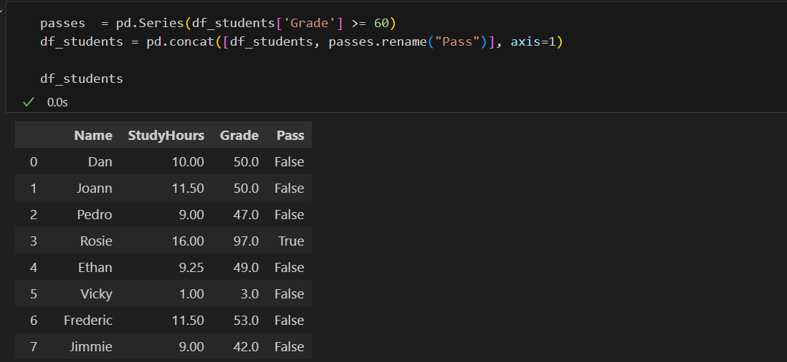
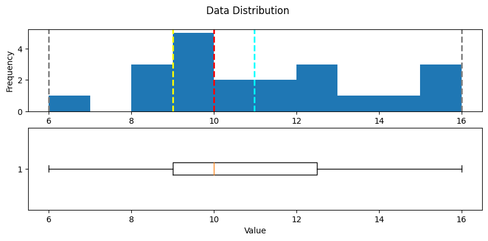

# Data Exploration with Python

Data scientists explore, analyze, and visualize data using various tools, with **Python** and Jupyter notebooks being among the most popular. Python's flexibility and extensive libraries make it ideal for data science and machine learning. This lab provides a basic introduction to key Python packages and basic data analysis techniques.

> This is not intended to be a comprehensive Python programming exercise; or even a deep dive into data analysis. Rather, it's intended as a crash course in some of the common ways in which data scientists can use Python to work with data.

## Environment Setup in Poridhi's VS Code

First, we need to install the required packages.

```bash
sudo apt-get update
sudo apt-get install python3-pip
```

### Kernel Setup

In **Poridhi's VSCode server**, create a new Jupyter notebook. Select the python kernel.

](https://github.com/poridhiEng/poridhi-labs/raw/main/Poridhi%20Labs/MLOps%20Lab/ML-Fundamentals/05a%20-%20Deep%20Neural%20Networks%20(TensorFlow)/images/image-13.png)

Install required extensions for running the notebook and then select the python kernel.

](https://github.com/poridhiEng/poridhi-labs/raw/main/Poridhi%20Labs/MLOps%20Lab/ML-Fundamentals/05a%20-%20Deep%20Neural%20Networks%20(TensorFlow)/images/image-12.png)


## Exploring data arrays with NumPy

Let's start by looking at some simple data. Suppose a college takes a sample of student grades for a data science class.

> Run the code in the cell below by clicking the **&#9658; Run** button to see the data.

```python
data = [50,50,47,97,49,3,53,42,26,74,82,62,37,15,70,27,36,35,48,52,63,64]
print(data)
```


The data has been loaded into a Python **list** structure, which is a good data type for general data manipulation, but not optimized for numeric analysis. 

For that, we're going to use the **NumPy** package, which includes specific data types and functions for working with *Num*bers in *Py*thon. 

First, we need to install the package.

```bash
!pip install numpy
```

Then, run the cell below to load the data into a NumPy **array**.

```python
import numpy as np

# Convert the list to a NumPy array
grades = np.array(data)
print(data)
print(grades)
```


### What is the difference between the two?

The list is a general purpose data structure that can contain any type of data. The array is a numeric data structure that is optimized for mathematical operations. To see the difference, let's look at the data types of the two structures.

```python
print (type(data),'x 2:', data * 2)
print('---')
print (type(grades),'x 2:', grades * 2)
```

Here, we've used the `type` function to get the data type of the two structures, and then we've multiplied each by 2 to see the effect.


* Multiplying a list by 2 creates a new list of twice the length with the original sequence of list elements repeated. 

* Multiplying a NumPy array on the other hand performs an element-wise calculation in which the array behaves like a *vector*. So we end up with an array of the same size in which each element has been multiplied by 2.

The key takeaway from this is that NumPy arrays are specifically designed to support mathematical operations on numeric data - which makes them more useful for data analysis than a generic list.


### Shape of the array

You might have spotted that the class type for the numpy array above is a **numpy.ndarray**. The **nd** indicates that this is a structure that can consists of multiple *dimensions* (it can have *n* dimensions). Our specific instance has a single dimension of student grades.

Run the cell below to view the **shape** of the array.

```python
print(grades.shape)
```


The shape of an array is a tuple that describes the number of elements in each dimension. In this case, the array has a single dimension with 22 elements, so the shape is (22,).


### Add dimensions to the array

We can add dimensions to the array by passing a list of arrays to the `np.array` function.

```python
# Define an array of study hours
study_hours = [10.0,11.5,9.0,16.0,9.25,1.0,11.5,9.0,8.5,14.5,15.5,
               13.75,9.0,8.0,15.5,8.0,9.0,6.0,10.0,12.0,12.5,12.0]

# Create a 2D array (an array of arrays)
student_data = np.array([study_hours, grades])

# display the array
student_data
```


Now, the array has two dimensions: the first dimension has 22 elements (the number of students), and the second dimension has 2 elements (the number of columns of data for each student).

We can also use the `shape` property to view the shape of the array.

```python
print(student_data.shape)
```

### Accessing elements

We can access elements of the array using indexing.

```python
print(student_data[0])
print(student_data[0][0])
```


### Apply some operations

We can apply operations to the array using NumPy's built-in functions.

```python
# Get the mean value of each sub-array
avg_study = student_data[0].mean()
avg_grade = student_data[1].mean()

print('Average study hours: {:.2f}\nAverage grade: {:.2f}'.format(avg_study, avg_grade))
```

## Exploring tabular data with Pandas

While NumPy provides a lot of the functionality you need to work with numbers, and specifically arrays of numeric values; when you start to deal with two-dimensional tables of data, the **Pandas** package offers a more convenient structure to work with - the **DataFrame**.

Lets first install the package.

```bash
!pip install pandas
```

Run the following code to import the Pandas library and create a DataFrame with three columns. The first column is a list of student names, and the second and third columns are the NumPy arrays containing the study time and grade data.

```python
import pandas as pd

df_students = pd.DataFrame({
    'Name': ['Dan', 'Joann', 'Pedro', 'Rosie', 'Ethan', 'Vicky', 'Frederic', 'Jimmie', 
             'Rhonda', 'Giovanni', 'Francesca', 'Rajab', 'Naiyana', 'Kian', 'Jenny',
             'Jakeem','Helena','Ismat','Anila','Skye','Daniel','Aisha'],
    'StudyHours':student_data[0],
    'Grade':student_data[1]
})

df_students
```


> Note that in addition to the columns you specified, the DataFrame includes an **index** to unique identify each row. We could have specified the index explicitly, and assigned any kind of appropriate value (for example, an email address); but because we didn't specify an index, one has been created with a unique integer value for each row.


### Finding and filtering data in a DataFrame

We can use the DataFrame's **loc** method to retrieve data for a specific index value, like this.

```python
# Get the data for index value 5
print(df_students.loc[5])

# Get the rows with index values from 0 to 5
print(df_students.loc[0:5])
```


We can also use the **`iloc`** method to find rows based on their ordinal position in the DataFrame (regardless of the index):

```python
# Get data in the first five rows
df_students.iloc[0:5]
```


#### Can you notice the difference between the two methods?

* The **loc** method returned rows with index *label* in the list of values from *0* to *5* - which includes *0*, *1*, *2*, *3*, *4*, and *5* (six rows). However, the **iloc** method returns the rows in the *positions* included in the range 0 to 5, and since integer ranges don't include the upper-bound value, this includes positions *0*, *1*, *2*, *3*, and *4* (five rows).

* **iloc** identifies data values in a DataFrame by *position*, which extends beyond rows to columns. So for example, you can use it to find the values for the columns in positions 1 and 2 in row 0, like this:

```python
df_students.iloc[0,[1, 2]]
```

This returns a Series object containing the data values for the columns in positions 1 and 2 in row 0.


Let's return to the **loc** method, and see how it works with columns. Remember that **loc** is used to locate data items based on index values rather than positions. In the absence of an explicit index column, the rows in our dataframe are indexed as integer values, but the columns are identified by name:

```python
# Grade value of 0'th column
df_students.loc[0,'Grade']
```

Here's another useful trick. You can use the **loc** method to find indexed rows based on a filtering expression that references named columns other than the index, like this:

```python
df_students.loc[df_students['Name']=='Aisha']
```


Actually, you don't need to explicitly use the **loc** method to do this - you can simply apply a DataFrame filtering expression, like this:

```python
df_students[df_students['Name']=='Aisha']
```


We can also use the **query** method to filter data

```python
print(df_students.query('Name=="Aisha"'))

print(df_students[df_students.Name == 'Aisha'])
```

## Loading a DataFrame from a  file

We have constructed the DataFrame from some existing arrays. However, in many real-world scenarios, data is loaded from sources such as files. Let's replace the student grades DataFrame with the contents of a text file.

First, let's download the data from the course GitHub repository.

```bash
curl -o grades.csv "https://raw.githubusercontent.com/Konami33/MlOps-Dataset/main/Data/grades.csv"
```

* The `-o` flag specifies the output file name (grades.csv in this case).
* The file will be saved in your current working directory.

Load the data from the file into a DataFrame.

```python
df_students = pd.read_csv('grades.csv', delimiter=',', header=0)
```


The DataFrame's **read_csv** method is used to load data from text files. As you can see in the example code, you can specify options such as the column delimiter and which row (if any) contains column headers (in this case, the delimiter is a comma and the first row contains the column names - these are the default settings, so the parameters could have been omitted).


### Handling missing values

One of the most common issues data scientists need to deal with is incomplete or missing data. So how would we know that the DataFrame contains missing values? You can use the **`isnull`** method to identify which individual values are null, like this:

```python
df_students.isnull()
```

Of course, with a larger DataFrame, it would be inefficient to review all of the rows and columns individually; so we can get the sum of missing values for each column, like this:

```python
df_students.isnull().sum()
```


So now we know that there's one missing **StudyHours** value, and two missing **Grade** values.

To see them in context, we can filter the dataframe to include only rows where any of the columns (axis 1 of the DataFrame) are null.

```python
df_students[df_students.isnull().any(axis=1)]
```


When the DataFrame is retrieved, the missing numeric values show up as **NaN** (*not a number*). So now that we've found the null values, what can we do about them?

### Imputing missing values

One common approach is to *impute* replacement values. For example, if the number of study hours is missing, we could just assume that the student studied for an average amount of time and replace the missing value with the mean study hours. To do this, we can use the **fillna** method, like this:

```python
df_students.StudyHours = df_students.StudyHours.fillna(df_students.StudyHours.mean())
df_students
```

### Dropping rows with missing values

Another approach is to drop the rows that contain missing values. This is easy to do using the **dropna** method, like this:

```python
df_students = df_students.dropna(axis=0, how='any')
df_students
```

> `axis=0` means that the rows are dropped, and `how='any'` means that any rows with missing values will be dropped.


## Explore data in a DataFrame

Now that we've cleaned up the missing values, we're ready to explore the data in the DataFrame. Let's start by comparing the mean study hours and grades.

```python
# Get the mean study hours using the column name as an index
mean_study = df_students['StudyHours'].mean()

# Get the mean grade using the column name as a property (just to make the point!)
mean_grade = df_students.Grade.mean()

# Print the mean study hours and mean grade
print('Average weekly study hours: {:.2f}\nAverage grade: {:.2f}'.format(mean_study, mean_grade))
```

Let's filter the DataFrame to find only the students who studied for more than the average amount of time.

```python
# Get students who studied for the mean or more hours
df_students[df_students.StudyHours > mean_study]
```


Note that the final result is a new DataFrame that contains only the students who studied for more than the average amount of time.

For example, let's find the average grade for students who undertook more than the average amount of study time.

```python
# What was their mean grade?
df_students[df_students.StudyHours > mean_study].Grade.mean()
```

Let's assume that the passing grade for the course is 60. We can use that information to add a new column to the DataFrame, indicating whether or not each student passed. 

First, we'll create a Pandas **Series** containing the pass/fail indicator (True or False), and then we'll concatenate that series as a new column (axis 1) in the DataFrame.

```python
passes  = pd.Series(df_students['Grade'] >= 60)
df_students = pd.concat([df_students, passes.rename("Pass")], axis=1)

df_students
```




DataFrames are designed for tabular data, and you can use them to perform many of the kinds of data analytics operation you can do in a relational database; such as grouping and aggregating tables of data.

For example, you can use the **`groupby`** method to group the student data into groups based on the **Pass** column you added previously, and count the number of names in each group - in other words, you can determine how many students passed and failed.


```python
print(df_students.groupby(df_students.Pass).Name.count())
```


You can aggregate multiple fields in a group using any available aggregation function. For example, you can find the mean study time and grade for the groups of students who passed and failed the course.


```python
print(df_students.groupby(df_students.Pass)[['StudyHours', 'Grade']].mean())
```


## Visualizing data with Matplotlib

DataFrames provide a great way to explore and analyze tabular data, but sometimes a picture is worth a thousand rows and columns. The **Matplotlib** library provides the foundation for plotting data visualizations that can greatly enhance your ability to analyze the data. 

First, we need to install the package.

```bash
!pip install matplotlib scipy
```

Let's start with a simple bar chart that shows the grade of each student.


```python
# Ensure plots are displayed inline in the notebook
%matplotlib inline

from matplotlib import pyplot as plt

# Create a bar plot of name vs grade
plt.bar(x=df_students.Name, height=df_students.Grade)

# Display the plot
plt.show()
```


Well, that worked; but the chart could use some improvements to make it clearer what we're looking at.

Note that you used the **pyplot** class from Matplotlib to plot the chart. This class provides a whole bunch of ways to improve the visual elements of the plot. For example, the following code:

- Specifies the color of the bar chart.
- Adds a title to the chart (so we know what it represents)
- Adds labels to the X and Y (so we know which axis shows which data)
- Adds a grid (to make it easier to determine the values for the bars)
- Rotates the X markers (so we can read them)


```python
# Create a bar plot of name vs grade
plt.bar(x=df_students.Name, height=df_students.Grade, color='orange')

# Customize the chart
plt.title('Student Grades')
plt.xlabel('Student')
plt.ylabel('Grade')
plt.grid(color='#95a5a6', linestyle='--', linewidth=2, axis='y', alpha=0.7)
plt.xticks(rotation=90)

# Display the plot
plt.show()
```


A plot is technically contained with a **Figure**. In the previous examples, the figure was created implicitly for you; but you can create it explicitly. For example, the following code creates a figure with a specific size.


```python
# Create a Figure
fig = plt.figure(figsize=(8,3))

# Create a bar plot of name vs grade
plt.bar(x=df_students.Name, height=df_students.Grade, color='orange')

# Customize the chart
plt.title('Student Grades')
plt.xlabel('Student')
plt.ylabel('Grade')
plt.grid(color='#95a5a6', linestyle='--', linewidth=2, axis='y', alpha=0.7)
plt.xticks(rotation=90)

# Show the figure
plt.show()
```

A figure can contain multiple subplots, each on its own *axis*.

For example, the following code creates a figure with two subplots - one is a bar chart showing student grades, and the other is a pie chart comparing the number of passing grades to non-passing grades.


```python
# Create a figure for 2 subplots (1 row, 2 columns)
fig, ax = plt.subplots(1, 2, figsize = (12,5))

# Create a bar plot of name vs grade on the first axis
ax[0].bar(x=df_students.Name, height=df_students.Grade, color='orange')
ax[0].set_title('Grades')
ax[0].set_xticklabels(df_students.Name, rotation=90)

# Create a pie chart of pass counts on the second axis
pass_counts = df_students['Pass'].value_counts()
ax[1].pie(pass_counts, labels=pass_counts)
ax[1].set_title('Passing Grades')
ax[1].legend(pass_counts.keys().tolist())

# Add a title to the Figure
fig.suptitle('Student Data')

# Show the figure
fig.show()
```


Until now, you've used methods of the Matplotlib.pyplot object to plot charts. However, Matplotlib is so foundational to graphics in Python that many packages, including Pandas, provide methods that abstract the underlying Matplotlib functions and simplify plotting. For example, the DataFrame provides its own methods for plotting data, as shown in the following example to plot a bar chart of study hours.


```python
df_students.plot.bar(x='Name', y='StudyHours', color='teal', figsize=(8,4))
```


## Getting started with statistical analysis

Now that you know how to use Python to manipulate and visualize data, you can start analyzing it.

A lot of data science is rooted in *statistics*, so we'll explore some basic statistical techniques.

> **Note**: This is not intended to teach you statistics - that's much too big a topic for this notebook. It will however introduce you to some statistical concepts and techniques that data scientists use as they explore data in preparation for machine learning modeling.

### Descriptive statistics and data distribution

When examining a *variable* (for example a sample of student grades), data scientists are particularly interested in its *distribution* (in other words, how are all the different grade values spread across the sample). The starting point for this exploration is often to visualize the data as a histogram, and see how frequently each value for the variable occurs.


```python
# Get the variable to examine
var_data = df_students['Grade']

# Create a Figure
fig = plt.figure(figsize=(10,4))

# Plot a histogram
plt.hist(var_data)

# Add titles and labels
plt.title('Data Distribution')
plt.xlabel('Value')
plt.ylabel('Frequency')

# Show the figure
fig.show()
```


The histogram for grades is a symmetric shape, where the most frequently occurring grades tend to be in the middle of the range (around 50), with fewer grades at the extreme ends of the scale.

#### Measures of central tendency

To understand the distribution better, we can examine so-called *measures of central tendency*; which is a fancy way of describing statistics that represent the "middle" of the data. The goal of this is to try to find a "typical" value. Common ways to define the middle of the data include:

- The *mean*: A simple average based on adding together all of the values in the sample set, and then dividing the total by the number of samples.
- The *median*: The value in the middle of the range of all of the sample values.
- The *mode*: The most commonly occuring value in the sample set<sup>\*</sup>.

Let's calculate these values, along with the minimum and maximum values for comparison, and show them on the histogram.

> <sup>\*</sup>Of course, in some sample sets , there may be a tie for the most common value - in which case the dataset is described as *bimodal* or even *multimodal*.

```python
# Get the variable to examine
var = df_students['Grade']

# Get statistics
min_val = var.min()
max_val = var.max()
mean_val = var.mean()
med_val = var.median()
mod_val = var.mode()[0]

print('Minimum:{:.2f}\nMean:{:.2f}\nMedian:{:.2f}\nMode:{:.2f}\nMaximum:{:.2f}\n'.format(min_val,
                                                                                        mean_val,
                                                                                        med_val,
                                                                                        mod_val,
                                                                                        max_val))

# Create a Figure
fig = plt.figure(figsize=(10,4))

# Plot a histogram
plt.hist(var)

# Add lines for the statistics
plt.axvline(x=min_val, color = 'gray', linestyle='dashed', linewidth = 2)
plt.axvline(x=mean_val, color = 'cyan', linestyle='dashed', linewidth = 2)
plt.axvline(x=med_val, color = 'red', linestyle='dashed', linewidth = 2)
plt.axvline(x=mod_val, color = 'yellow', linestyle='dashed', linewidth = 2)
plt.axvline(x=max_val, color = 'gray', linestyle='dashed', linewidth = 2)

# Add titles and labels
plt.title('Data Distribution')
plt.xlabel('Value')
plt.ylabel('Frequency')

# Show the figure
fig.show()
```


For the grade data, the mean, median, and mode all seem to be more or less in the middle of the minimum and maximum, at around 50.

Another way to visualize the distribution of a variable is to use a *box* plot (sometimes called a *box-and-whiskers* plot). Let's create one for the grade data.

```python
# Get the variable to examine
var = df_students['Grade']

# Create a Figure
fig = plt.figure(figsize=(10,4))

# Plot a histogram
plt.boxplot(var)

# Add titles and labels
plt.title('Data Distribution')

# Show the figure
fig.show()
```


The box plot shows the distribution of the grade values in a different format to the histogram. The *box* part of the plot shows where the inner two *quartiles* of the data reside - so in this case, half of the grades are between approximately 36 and 63. The *whiskers* extending from the box show the outer two quartiles; so the other half of the grades in this case are between 0 and 36 or 63 and 100. The line in the box indicates the *median* value.

It's often useful to combine histograms and box plots, with the box plot's orientation changed to align it with the histogram (in some ways, it can be helpful to think of the histogram as a "front elevation" view of the distribution, and the box plot as a "plan" view of the distribution from above.)


```python
# Create a function that we can re-use
def show_distribution(var_data):
    from matplotlib import pyplot as plt

    # Get statistics
    min_val = var_data.min()
    max_val = var_data.max()
    mean_val = var_data.mean()
    med_val = var_data.median()
    mod_val = var_data.mode()[0]

    print('Minimum:{:.2f}\nMean:{:.2f}\nMedian:{:.2f}\nMode:{:.2f}\nMaximum:{:.2f}\n'.format(min_val,
                                                                                            mean_val,
                                                                                            med_val,
                                                                                            mod_val,
                                                                                            max_val))

    # Create a figure for 2 subplots (2 rows, 1 column)
    fig, ax = plt.subplots(2, 1, figsize = (10,4))

    # Plot the histogram   
    ax[0].hist(var_data)
    ax[0].set_ylabel('Frequency')

    # Add lines for the mean, median, and mode
    ax[0].axvline(x=min_val, color = 'gray', linestyle='dashed', linewidth = 2)
    ax[0].axvline(x=mean_val, color = 'cyan', linestyle='dashed', linewidth = 2)
    ax[0].axvline(x=med_val, color = 'red', linestyle='dashed', linewidth = 2)
    ax[0].axvline(x=mod_val, color = 'yellow', linestyle='dashed', linewidth = 2)
    ax[0].axvline(x=max_val, color = 'gray', linestyle='dashed', linewidth = 2)

    # Plot the boxplot   
    ax[1].boxplot(var_data, vert=False)
    ax[1].set_xlabel('Value')

    # Add a title to the Figure
    fig.suptitle('Data Distribution')

    # Show the figure
    fig.show()

# Get the variable to examine
col = df_students['Grade']
# Call the function
show_distribution(col)
```


All of the measurements of central tendency are right in the middle of the data distribution, which is symmetric with values becoming progressively lower in both directions from the middle.

To explore this distribution in more detail, you need to understand that statistics is fundamentally about taking *samples* of data and using probability functions to extrapolate information about the full *population* of data. For example, the student data consists of 22 samples, and for each sample there is a grade value. You can think of each sample grade as a variable that's been randomly selected from the set of all grades awarded for this course. With enough of these random variables, you can calculate something called a *probability density function*, which estimates the distribution of grades for the full population.

The Pandas DataFrame class provides a helpful plot function to show this density.

```python
def show_density(var_data):
    from matplotlib import pyplot as plt

    fig = plt.figure(figsize=(10,4))

    # Plot density
    var_data.plot.density()

    # Add titles and labels
    plt.title('Data Density')

    # Show the mean, median, and mode
    plt.axvline(x=var_data.mean(), color = 'cyan', linestyle='dashed', linewidth = 2)
    plt.axvline(x=var_data.median(), color = 'red', linestyle='dashed', linewidth = 2)
    plt.axvline(x=var_data.mode()[0], color = 'yellow', linestyle='dashed', linewidth = 2)

    # Show the figure
    plt.show()

# Get the density of Grade
col = df_students['Grade']
show_density(col)
```


As expected from the histogram of the sample, the density shows the characteristic 'bell curve" of what statisticians call a *normal* distribution with the mean and mode at the center and symmetric tails.

Now let's take a look at the distribution of the study hours data.


```python
# Get the variable to examine
col = df_students['StudyHours']
# Call the function
show_distribution(col)
```


The distribution of the study time data is significantly different from that of the grades.

Note that the whiskers of the box plot only extend to around 6.0, indicating that the vast majority of the first quarter of the data is above this value. The minimum is marked with an **o**, indicating that it is statistically an *outlier* - a value that lies significantly outside the range of the rest of the distribution.

Outliers can occur for many reasons. Maybe a student meant to record "10" hours of study time, but entered "1" and missed the "0". Or maybe the student was abnormally lazy when it comes to studying! Either way, it's a statistical anomaly that doesn't represent a typical student. Let's see what the distribution looks like without it.


```python
# Get the variable to examine
col = df_students[df_students.StudyHours>1]['StudyHours']
# Call the function
show_distribution(col)
```




In this example, the dataset is small enough to clearly see that the value **1** is an outlier for the **StudyHours** column, so you can exclude it explicitly. In most real-world cases, it's easier to consider outliers as being values that fall below or above percentiles within which most of the data lie. For example, the following code uses the Pandas **quantile** function to exclude observations below the 0.01th percentile (the value above which 99% of the data reside).

```python
q01 = df_students.StudyHours.quantile(0.01)
# Get the variable to examine
col = df_students[df_students.StudyHours>q01]['StudyHours']
# Call the function
show_distribution(col)
```

> **Tip**: You can also eliminate outliers at the upper end of the distribution by defining a threshold at a high percentile value - for example, you could use the **quantile** function to find the 0.99 percentile below which 99% of the data reside.

With the outliers removed, the box plot shows all data within the four quartiles. Note that the distribution is not symmetric like it is for the grade data though - there are some students with very high study times of around 16 hours, but the bulk of the data is between 7 and 13 hours; The few extremely high values pull the mean towards the higher end of the scale.

Let's look at the density for this distribution.

```python
# Get the density of StudyHours
show_density(col)
```


This kind of distribution is called *right skewed*. The mass of the data is on the left side of the distribution, creating a long tail to the right because of the values at the extreme high end; which pull the mean to the right.

#### Measures of variance

So now we have a good idea where the middle of the grade and study hours data distributions are. However, there's another aspect of the distributions we should examine: how much variability is there in the data?

Typical statistics that measure variability in the data include:

- **Range**: The difference between the maximum and minimum. There's no built-in function for this, but it's easy to calculate using the **min** and **max** functions.
- **Variance**: The average of the squared difference from the mean. You can use the built-in **var** function to find this.
- **Standard Deviation**: The square root of the variance. You can use the built-in **std** function to find this.

```python
for col_name in ['Grade','StudyHours']:
    col = df_students[col_name]
    rng = col.max() - col.min()
    var = col.var()
    std = col.std()
    print('\n{}:\n - Range: {:.2f}\n - Variance: {:.2f}\n - Std.Dev: {:.2f}'.format(col_name, rng, var, std))
```


Of these statistics, the standard deviation is generally the most useful. It provides a measure of variance in the data on the same scale as the data itself (so grade points for the Grade distribution and hours for the StudyHours distribution). The higher the standard deviation, the more variance there is when comparing values in the distribution to the distribution mean - in other words, the data is more spread out.

When working with a *normal* distribution, the standard deviation works with the particular characteristics of a normal distribution to provide even greater insight. Run the cell below to see the relationship between standard deviations and the data in the normal distribution.


```python
import scipy.stats as stats

# Get the Grade column
col = df_students['Grade']

# get the density
density = stats.gaussian_kde(col)

# Plot the density
col.plot.density()

# Get the mean and standard deviation
s = col.std()
m = col.mean()

# Annotate 1 stdev
x1 = [m-s, m+s]
y1 = density(x1)
plt.plot(x1,y1, color='magenta')
plt.annotate('1 std (68.26%)', (x1[1],y1[1]))

# Annotate 2 stdevs
x2 = [m-(s*2), m+(s*2)]
y2 = density(x2)
plt.plot(x2,y2, color='green')
plt.annotate('2 std (95.45%)', (x2[1],y2[1]))

# Annotate 3 stdevs
x3 = [m-(s*3), m+(s*3)]
y3 = density(x3)
plt.plot(x3,y3, color='orange')
plt.annotate('3 std (99.73%)', (x3[1],y3[1]))

# Show the location of the mean
plt.axvline(col.mean(), color='cyan', linestyle='dashed', linewidth=1)

plt.axis('off')

plt.show()
```


The horizontal lines show the percentage of data within 1, 2, and 3 standard deviations of the mean (plus or minus).

In any normal distribution:
- Approximately 68.26% of values fall within one standard deviation from the mean.
- Approximately 95.45% of values fall within two standard deviations from the mean.
- Approximately 99.73% of values fall within three standard deviations from the mean.

So, since we know that the mean grade is 49.18, the standard deviation is 21.74, and distribution of grades is approximately normal; we can calculate that 68.26% of students should achieve a grade between 27.44 and 70.92.

The descriptive statistics we've used to understand the distribution of the student data variables are the basis of statistical analysis; and because they're such an important part of exploring your data, there's a built-in **Describe** method of the DataFrame object that returns the main descriptive statistics for all numeric columns.


## Comparing data

Now that you know something about the statistical distribution of the data in your dataset, you're ready to examine your data to identify any apparent relationships between variables.

First of all, let's get rid of any rows that contain outliers so that we have a sample that is representative of a typical class of students. We identified that the StudyHours column contains some outliers with extremely low values, so we'll remove those rows.

```python
df_sample = df_students[df_students['StudyHours']>1]
df_sample
```

### Comparing numeric and categorical variables

The data includes two *numeric* variables (**StudyHours** and **Grade**) and two *categorical* variables (**Name** and **Pass**). Let's start by comparing the numeric **StudyHours** column to the categorical **Pass** column to see if there's an apparent relationship between the number of hours studied and a passing grade.

To make this comparison, let's create box plots showing the distribution of StudyHours for each possible Pass value (true and false).


```python
df_sample.boxplot(column='StudyHours', by='Pass', figsize=(8,5))
```


Comparing the StudyHours distributions, it's immediately apparent (if not particularly surprising) that students who passed the course tended to study for more hours than students who didn't. So if you wanted to predict whether or not a student is likely to pass the course, the amount of time they spend studying may be a good predictive feature.

### Comparing numeric variables

Now let's compare two numeric variables. We'll start by creating a bar chart that shows both grade and study hours.


```python
# Create a bar plot of name vs grade and study hours
df_sample.plot(x='Name', y=['Grade','StudyHours'], kind='bar', figsize=(8,5))
```


The chart shows bars for both grade and study hours for each student; but it's not easy to compare because the values are on different scales. Grades are measured in grade points, and range from 3 to 97; while study time is measured in hours and ranges from 1 to 16.

### Normalizing data

A common technique when dealing with numeric data in different scales is to *normalize* the data so that the values retain their proportional distribution, but are measured on the same scale. To accomplish this, we'll use a technique called *MinMax* scaling that distributes the values proportionally on a scale of 0 to 1. You could write the code to apply this transformation; but the **Scikit-Learn** library provides a scaler to do it for you.

lets install the library.

```bash
!pip install scikit-learn
```

```python
from sklearn.preprocessing import MinMaxScaler

# Get a scaler object
scaler = MinMaxScaler()

# Create a new dataframe for the scaled values
df_normalized = df_sample[['Name', 'Grade', 'StudyHours']].copy()

# Normalize the numeric columns
df_normalized[['Grade','StudyHours']] = scaler.fit_transform(df_normalized[['Grade','StudyHours']])

# Plot the normalized values
df_normalized.plot(x='Name', y=['Grade','StudyHours'], kind='bar', figsize=(8,5))
```


With the data normalized, it's easier to see an apparent relationship between grade and study time. It's not an exact match, but it definitely seems like students with higher grades tend to have studied more.

So there seems to be a correlation between study time and grade; and in fact, there's a statistical *correlation* measurement we can use to quantify the relationship between these columns.


```python
df_normalized.Grade.corr(df_normalized.StudyHours)
```

The correlation statistic is a value between -1 and 1 that indicates the strength of a relationship. Values above 0 indicate a *positive* correlation (high values of one variable tend to coincide with high values of the other), while values below 0 indicate a *negative* correlation (high values of one variable tend to coincide with low values of the other). In this case, the correlation value is close to 1; showing a strongly positive correlation between study time and grade.

> **Note**: Data scientists often quote the maxim "*correlation* is not *causation*". In other words, as tempting as it might be, you shouldn't interpret the statistical correlation as explaining *why* one of the values is high. In the case of the student data, the statistics demonstrates that students with high grades tend to also have high amounts of study time; but this is not the same as proving that they achieved high grades *because* they studied a lot. The statistic could equally be used as evidence to support the nonsensical conclusion that the students studied a lot *because* their grades were going to be high.

Another way to visualise the apparent correlation between two numeric columns is to use a *scatter* plot.

```python
# Create a scatter plot
df_sample.plot.scatter(title='Study Time vs Grade', x='StudyHours', y='Grade')
```


Again, it looks like there's a discernible pattern in which the students who studied the most hours are also the students who got the highest grades.

We can see this more clearly by adding a *regression* line (or a *line of best fit*) to the plot that shows the general trend in the data. To do this, we'll use a statistical technique called *least squares regression*.

> **Warning - Math Ahead!**
>
> Cast your mind back to when you were learning how to solve linear equations in school, and recall that the *slope-intercept* form of a linear equation looks like this:
>
> **y = mx + b**
>
> In this equation, *y* and *x* are the coordinate variables, *m* is the slope of the line, and *b* is the y-intercept (where the line goes through the Y-axis).
>
> In the case of our scatter plot for our student data, we already have our values for *x* (*StudyHours*) and *y* (*Grade*), so we just need to calculate the intercept and slope of the straight line that lies closest to those points. Then we can form a linear equation that calculates a new *y* value on that line for each of our *x* (*StudyHours*) values - to avoid confusion, we'll call this new *y* value *f(x)* (because it's the output from a linear equation ***f***unction based on *x*). The difference between the original *y* (*Grade*) value and the *f(x)* value is the *error* between our regression line and the actual *Grade* achieved by the student. Our goal is to calculate the slope and intercept for a line with the lowest overall error.
>
> Specifically, we define the overall error by taking the error for each point, squaring it, and adding all the squared errors together. The line of best fit is the line that gives us the lowest value for the sum of the squared errors - hence the name *least squares regression*.

Fortunately, you don't need to code the regression calculation yourself - the **SciPy** package includes a **stats** class that provides a **linregress** method to do the hard work for you. This returns (among other things) the coefficients you need for the slope equation - slope (*m*) and intercept (*b*) based on a given pair of variable samples you want to compare.


```python
from scipy import stats

#
df_regression = df_sample[['Grade', 'StudyHours']].copy()

# Get the regression slope and intercept
m, b, r, p, se = stats.linregress(df_regression['StudyHours'], df_regression['Grade'])
print('slope: {:.4f}\ny-intercept: {:.4f}'.format(m,b))
print('so...\n f(x) = {:.4f}x + {:.4f}'.format(m,b))

# Use the function (mx + b) to calculate f(x) for each x (StudyHours) value
df_regression['fx'] = (m * df_regression['StudyHours']) + b

# Calculate the error between f(x) and the actual y (Grade) value
df_regression['error'] = df_regression['fx'] - df_regression['Grade']

# Create a scatter plot of Grade vs StudyHours
df_regression.plot.scatter(x='StudyHours', y='Grade')

# Plot the regression line
plt.plot(df_regression['StudyHours'],df_regression['fx'], color='cyan')

# Display the plot
plt.show()
```


We can see that the regression line (in cyan) is reasonably close to the general shape of the data points (in blue).


Note that this time, the code plotted two distinct things - the scatter plot of the sample study hours and grades is plotted as before, and then a line of best fit based on the least squares regression coefficients is plotted.

The slope and intercept coefficients calculated for the regression line are shown above the plot.

The line is based on the ***f*(x)** values calculated for each **StudyHours** value. Run the following cell to see a table that includes the following values:

- The **StudyHours** for each student.
- The **Grade** achieved by each student.
- The ***f(x)*** value calculated using the regression line coefficients.
- The *error* between the calculated ***f(x)*** value and the actual **Grade** value.

Some of the errors, particularly at the extreme ends, are quite large (up to over 17.5 grade points); but in general, the line is pretty close to the actual grades.


```python
# Show the original x,y values, the f(x) value, and the error
df_regression[['StudyHours', 'Grade', 'fx', 'error']]
```


### Using the regression coefficients for prediction

Now that you have the regression coefficients for the study time and grade relationship, you can use them in a function to estimate the expected grade for a given amount of study.

```python
# Define a function based on our regression coefficients
def f(x):
    m = 6.3134
    b = -17.9164
    return m*x + b

study_time = 14

# Get f(x) for study time
prediction = f(study_time)

# Grade can't be less than 0 or more than 100
expected_grade = max(0,min(100,prediction))

#Print the estimated grade
print ('Studying for {} hours per week may result in a grade of {:.0f}'.format(study_time, expected_grade))
```

So by applying statistics to sample data, you've determined a relationship between study time and grade; and encapsulated that relationship in a general function that can be used to predict a grade for a given amount of study time.

This technique is in fact the basic premise of machine learning. You can take a set of sample data that includes one or more *features* (in this case, the number of hours studied) and a known *label* value (in this case, the grade achieved) and use the sample data to derive a function that calculates predicted label values for any given set of features.


## Conclusion

In this notebook, you've learned how to explore data in a Pandas DataFrame, and how to use statistical techniques to understand the relationship between variables in the sample data.


