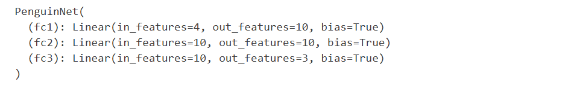

# Deep Learning with PyTorch

Classical machine learning relies on using statistics to determine
relationships between features and labels, and can be very effective for
creating predictive models. However, a massive growth in the
availability of data coupled with advances in the computing technology
required to process it has led to the emergence of new machine learning
techniques that mimic the way the brain processes information in a
structure called an artificial neural network.

PyTorch is a framework for creating machine learning models, including
deep neural networks (DNNs). In this example, we\'ll use PyTorch to
create a simple neural network that classifies penguins into species
based on the length and depth of their culmen (bill), their flipper
length, and their body mass.

> **Citation**: The penguins dataset used in the this exercise is a
> subset of data collected and made available by [Dr. Kristen
> Gorman](./images/https://www.uaf.edu/cfos/people/faculty/detail/kristen-gorman.php)
> and the [Palmer Station, Antarctica LTER](./images/https://pal.lternet.edu/), a
> member of the [Long Term Ecological Research
> Network](./images/https://lternet.edu/).

Create a data folder and download the dataset `penguins.csv` from [here](https://drive.google.com/drive/folders/1TK_E03iny9t20XHuXHWXrY2UK6T7w31b?usp=drive_link)


## Task Description


In this hands-on exercise, you'll build a deep neural network using PyTorch to classify penguin species based on their physical measurements. The model will use four input features (CulmenLength, CulmenDepth, FlipperLength, and BodyMass) to predict one of three penguin species (Adelie, Gentoo, or Chinstrap). You'll learn to:

1. Load and preprocess the Palmer Islands penguins dataset
2. Create a simple neural network with three fully-connected layers using PyTorch
3. Train the model using CrossEntropyLoss and Adam optimizer over 50 epochs
4. Evaluate model performance using confusion matrix
5. Save the trained model and use it for making new predictions

This exercise serves as a practical introduction to deep learning concepts and PyTorch implementation, using a straightforward classification problem as an example.


Install required libraries using terminal:

```bash
pip install pandas
pip install scikit-learn
pip install matplotlib
```


## Explore the Dataset

At first open a notebook `lab-notebook.ipynb` then follow the instructions to complete the task.


Before we start using PyTorch to create a model, let\'s load the data we
need from the Palmer Islands penguins dataset, which contains
observations of three different species of penguin.

> **Note**: In reality, you can solve the penguin classification problem
> easily using classical machine learning techniques without the need
> for a deep learning model; but it\'s a useful, easy to understand
> dataset with which to demonstrate the principles of neural networks in
> this notebook.


``` python
import pandas as pd

# load the training dataset (excluding rows with null values)
penguins = pd.read_csv('data/penguins.csv').dropna()

# Deep Learning models work best when features are on similar scales
# In a real solution, we'd implement some custom normalization for each feature, but to keep things simple
# we'll just rescale the FlipperLength and BodyMass so they're on a similar scale to the bill measurements
penguins['FlipperLength'] = penguins['FlipperLength']/10
penguins['BodyMass'] = penguins['BodyMass']/100

# The dataset is too small to be useful for deep learning
# So we'll oversample it to increase its size
penguins = pd.concat([penguins] * 3, ignore_index=True)


# Display a random sample of 10 observations
sample = penguins.sample(10)
sample
```

Expected Output:


The **Species** column is the label our model will predict. Each label
value represents a class of penguin species, encoded as 0, 1, or 2. The
following code shows the actual species to which these class labels
corrrespond.


``` python
penguin_classes = ['Adelie', 'Gentoo', 'Chinstrap']
print(sample.columns[0:5].values, 'SpeciesName')
for index, row in penguins.sample(10).iterrows():
    print('[',row[0], row[1], row[2],row[3], int(row[4]), ']',penguin_classes[int(row[-1])])
```

Expected Output:


As is common in a supervised learning problem, we\'ll split the dataset
into a set of records with which to train the model, and a smaller set
with which to validate the trained model.

``` python
from sklearn.model_selection import train_test_split

features = ['CulmenLength','CulmenDepth','FlipperLength','BodyMass']
label = 'Species'
   
# Split data 70%-30% into training set and test set
x_train, x_test, y_train, y_test = train_test_split(penguins[features].values,
                                                    penguins[label].values,
                                                    test_size=0.30,
                                                    random_state=0)

print ('Training Set: %d, Test Set: %d \n' % (len(x_train), len(x_test)))
print("Sample of features and labels:")

# Take a look at the first 25 training features and corresponding labels
for n in range(0,24):
    print(x_train[n], y_train[n], '(' + penguin_classes[y_train[n]] + ')')
```

Expected Output:


The *features* are the measurements for each penguin observation, and
the *label* is a numeric value that indicates the species of penguin
that the observation represents (Adelie, Gentoo, or Chinstrap).

## Install and import the PyTorch libraries

Since we plan to use PyTorch to create our penguin classifier, we\'ll
need to run the following two cells to install and import the PyTorch
libraries we intend to use. The specific installation of of PyTorch
depends on your operating system and whether your computer has graphics
processing units (GPUs) that can be used for high-performance processing
via *cuda*. You can find detailed instructions at
<https://pytorch.org/get-started/locally/>.
``` python
!pip install torch==1.9.0+cpu torchvision==0.10.0+cpu torchaudio==0.9.0 -f https://download.pytorch.org/whl/torch_stable.html
```

``` python
import torch
import torch.nn as nn
import torch.utils.data as td

# Set random seed for reproducability
torch.manual_seed(0)

print("Libraries imported - ready to use PyTorch", torch.__version__)
```


## Prepare the data for PyTorch

PyTorch makes use of *data loaders* to load training and validation data
in batches. We\'ve already loaded the data into numpy arrays, but we
need to wrap those in PyTorch datasets (in which the data is converted
to PyTorch *tensor* objects) and create loaders to read batches from
those datasets.
"}
``` python
# Create a dataset and loader for the training data and labels
train_x = torch.Tensor(x_train).float()
train_y = torch.Tensor(y_train).long()
train_ds = td.TensorDataset(train_x,train_y)
train_loader = td.DataLoader(train_ds, batch_size=20,
    shuffle=False, num_workers=1)

# Create a dataset and loader for the test data and labels
test_x = torch.Tensor(x_test).float()
test_y = torch.Tensor(y_test).long()
test_ds = td.TensorDataset(test_x,test_y)
test_loader = td.DataLoader(test_ds, batch_size=20,
    shuffle=False, num_workers=1)
print('Ready to load data')
```


## Define a neural network

Now we\'re ready to define our neural network. In this case, we\'ll
create a network that consists of 3 fully-connected layers:

-   An input layer that receives an input value for each feature (in
    this case, the four penguin measurements) and applies a *ReLU*
    activation function.
-   A hidden layer that receives ten inputs and applies a *ReLU*
    activation function.
-   An output layer that generates a non-negative numeric output for
    each penguin species (which a loss function will translate into
    classification probabilities for each of the three possible penguin
    species).


``` python
# Number of hidden layer nodes
hl = 10

# Define the neural network
class PenguinNet(nn.Module):
    def __init__(self):
        super(PenguinNet, self).__init__()
        self.fc1 = nn.Linear(len(features), hl)
        self.fc2 = nn.Linear(hl, hl)
        self.fc3 = nn.Linear(hl, len(penguin_classes))

    def forward(self, x):
        x = torch.relu(self.fc1(x))
        x = torch.relu(self.fc2(x))
        x = torch.relu(self.fc3(x))
        return x

# Create a model instance from the network
model = PenguinNet()
print(model)
```

Expected Output:



## Train the model

To train the model, we need to repeatedly feed the training values
forward through the network, use a loss function to calculate the loss,
use an optimizer to backpropagate the weight and bias value adjustments,
and validate the model using the test data we withheld.

To do this, we\'ll create a function to train and optimize the model,
and function to test the model. Then we\'ll call these functions
iteratively over 50 epochs, logging the loss and accuracy statistics for
each epoch.

``` python
def train(model, data_loader, optimizer):
    # Set the model to training mode
    model.train()
    train_loss = 0
    
    for batch, tensor in enumerate(data_loader):
        data, target = tensor
        #feedforward
        optimizer.zero_grad()
        out = model(data)
        loss = loss_criteria(out, target)
        train_loss += loss.item()

        # backpropagate
        loss.backward()
        optimizer.step()

    #Return average loss
    avg_loss = train_loss / (batch+1)
    print('Training set: Average loss: {:.6f}'.format(avg_loss))
    return avg_loss
           
            
def test(model, data_loader):
    # Switch the model to evaluation mode (so we don't backpropagate)
    model.eval()
    test_loss = 0
    correct = 0

    with torch.no_grad():
        batch_count = 0
        for batch, tensor in enumerate(data_loader):
            batch_count += 1
            data, target = tensor
            # Get the predictions
            out = model(data)

            # calculate the loss
            test_loss += loss_criteria(out, target).item()

            # Calculate the accuracy
            _, predicted = torch.max(out.data, 1)
            correct += torch.sum(target==predicted).item()
            
    # Calculate the average loss and total accuracy for this epoch
    avg_loss = test_loss/batch_count
    print('Validation set: Average loss: {:.6f}, Accuracy: {}/{} ({:.0f}%)\n'.format(
        avg_loss, correct, len(data_loader.dataset),
        100. * correct / len(data_loader.dataset)))
    
    # return average loss for the epoch
    return avg_loss

# Specify the loss criteria (we'll use CrossEntropyLoss for multi-class classification)
loss_criteria = nn.CrossEntropyLoss()

# Use an "Adam" optimizer to adjust weights
# (see https://pytorch.org/docs/stable/optim.html#algorithms for details of supported algorithms)
learning_rate = 0.001
optimizer = torch.optim.Adam(model.parameters(), lr=learning_rate)
optimizer.zero_grad()

# We'll track metrics for each epoch in these arrays
epoch_nums = []
training_loss = []
validation_loss = []

# Train over 50 epochs
epochs = 50
for epoch in range(1, epochs + 1):

    # print the epoch number
    print('Epoch: {}'.format(epoch))
    
    # Feed training data into the model to optimize the weights
    train_loss = train(model, train_loader, optimizer)
    
    # Feed the test data into the model to check its performance
    test_loss = test(model, test_loader)
    
    # Log the metrics for this epoch
    epoch_nums.append(epoch)
    training_loss.append(train_loss)
    validation_loss.append(test_loss)
```

Expected Output:


#### Detailed Explanation of Neural Network Training Process

#### 1. Forward Pass Mechanics
##### Data Flow
- Each epoch processes the complete training dataset
- Input features (CulmenLength, CulmenDepth, FlipperLength, BodyMass) form 4-dimensional vectors
- Multiple feature vectors are batched into matrices for efficient processing
- Example: 20 observations per batch = 20x4 input matrix

##### Layer Processing
- **Input Layer**: 
  - Applies weighted sum (W₁x + b₁) to input features
  - Processes through ReLU activation function
  - Output feeds into hidden layer

- **Hidden Layer**:
  - Receives activated outputs from input layer
  - Applies its own weights and biases (W₂x + b₂)
  - Another ReLU activation constrains values

- **Output Layer**:
  - Final transformation produces class probabilities
  - Example output: [0.3, 0.4, 0.3] for three penguin species

#### 2. Loss Calculation and Optimization

##### Loss Computation
- **For Training Data**:
  - Compares predicted vs actual class probabilities
  - Example:
    - Prediction: [0.3, 0.4, 0.3]
    - Actual (Gentoo): [0.0, 1.0, 0.0]
    - Variance: [0.3, 0.6, 0.3]
  - CrossEntropyLoss aggregates errors across batch

##### Validation Process
- Runs after each training epoch
- Uses separate validation dataset (30% of data)
- Calculates two metrics:
  - Validation loss (same as training loss calculation)
  - Accuracy (percentage of correct predictions)
- Helps detect overfitting by comparing with training metrics

#### 3. Weight Optimization and Backpropagation
##### Gradient Calculation
- Treats network as composite function
- Uses chain rule for efficient derivative calculation
- Computes partial derivatives for each weight and bias
- Determines optimal direction for weight adjustments

##### Weight Updates
- **Learning Rate** (0.001) controls adjustment magnitude
- **Adam Optimizer**:
  - Processes loss gradients
  - Updates weights and biases
  - Adapts learning dynamically

##### Backpropagation Process
1. Starts from output layer
2. Propagates errors backward
3. Updates weights layer by layer
4. Prepares network for next epoch

#### 4. Training Cycle
- Repeats for 50 epochs
- Each epoch:
  1. Forward pass with current weights
  2. Loss calculation
  3. Backpropagation
  4. Validation
- Expects decreasing loss trend
- Monitors validation metrics to ensure proper generalization

#### 5. GPU Optimization
- Matrix operations benefit from GPU acceleration
- Parallel processing of batched data
- Especially important for:
  - Large datasets
  - Complex network architectures
  - Multiple training epochs

This process combines mathematical optimization with efficient computing to gradually refine the model's ability to classify penguins based on their physical measurements.


## Review training and validation loss

After training is complete, we can examine the loss metrics we recorded
while training and validating the model. We\'re really looking for two
things:

-   The loss should reduce with each epoch, showing that the model is
    learning the right weights and biases to predict the correct labels.
-   The training loss and validation loss should follow a similar trend,
    showing that the model is not overfitting to the training data.

Let\'s plot the loss metrics and see:

``` python
%matplotlib inline
from matplotlib import pyplot as plt

plt.plot(epoch_nums, training_loss)
plt.plot(epoch_nums, validation_loss)
plt.xlabel('epoch')
plt.ylabel('loss')
plt.legend(['training', 'validation'], loc='upper right')
plt.show()
```

Expected Output:


## View the learned weights and biases

The trained model consists of the final weights and biases that were
determined by the optimizer during training. Based on our network model
we should expect the following values for each layer:

-   Layer 1: There are four input values going to ten output nodes, so
    there should be 10 x 4 weights and 10 bias values.
-   Layer 2: There are ten input values going to ten output nodes, so
    there should be 10 x 10 weights and 10 bias values.
-   Layer 3: There are ten input values going to three output nodes, so
    there should be 3 x 10 weights and 3 bias values.

``` python
for param_tensor in model.state_dict():
    print(param_tensor, "\n", model.state_dict()[param_tensor].numpy())
```

Expected Output:


## Evaluate model performance

So, is the model any good? The raw accuracy reported from the validation
data would seem to indicate that it predicts pretty well; but it\'s
typically useful to dig a little deeper and compare the predictions for
each possible class. A common way to visualize the performance of a
classification model is to create a *confusion matrix* that shows a
crosstab of correct and incorrect predictions for each class.

``` python
#Pytorch doesn't have a built-in confusion matrix metric, so we'll use SciKit-Learn
from sklearn.metrics import confusion_matrix
import numpy as np

# Set the model to evaluate mode
model.eval()

# Get predictions for the test data
x = torch.Tensor(x_test).float()
_, predicted = torch.max(model(x).data, 1)

# Plot the confusion matrix
cm = confusion_matrix(y_test, predicted.numpy())
plt.imshow(cm, interpolation="nearest", cmap=plt.cm.Blues)
plt.colorbar()
tick_marks = np.arange(len(penguin_classes))
plt.xticks(tick_marks, penguin_classes, rotation=45)
plt.yticks(tick_marks, penguin_classes)
plt.xlabel("Predicted Species")
plt.ylabel("Actual Species")
plt.show()
```


Expected Output:


The confusion matrix should show a strong diagonal line indicating that
there are more correct than incorrect predictions for each class.

## Save the trained model

Now that we have a model we believe is reasonably accurate, we can save
its trained weights for use later.

``` python
# Save the model weights
model_file = 'models/penguin_classifier.pt'
torch.save(model.state_dict(), model_file)
del model
print('model saved as', model_file)
```

## Use the trained model

When we have a new penguin observation, we can use the model to predict
the species.

``` python
# New penguin features
x_new = [[50.4,15.3,20,50]]
print ('New sample: {}'.format(x_new))

# Create a new model class and load weights
model = PenguinNet()
model.load_state_dict(torch.load(model_file))

# Set model to evaluation mode
model.eval()

# Get a prediction for the new data sample
x = torch.Tensor(x_new).float()
_, predicted = torch.max(model(x).data, 1)

print('Prediction:',penguin_classes[predicted.item()])
```

Expected Output:


## Conclusion

This tutorial effectively demonstrated the practical implementation of deep learning using PyTorch through a penguin species classification example. Using a simple neural network architecture with three fully-connected layers, the model processed four input features (CulmenLength, CulmenDepth, FlipperLength, and BodyMass) to classify penguins into three species. The training process, conducted over 50 epochs using CrossEntropyLoss and Adam optimizer, showed consistent improvement in both training and validation sets, with the confusion matrix revealing strong classification accuracy. The tutorial covered essential deep learning concepts including data preparation with DataLoaders, model architecture design, training optimization, and model deployment, while also demonstrating practical aspects like saving and loading models for future use. While using a straightforward dataset, this example successfully illustrated core deep learning principles and serves as an excellent foundation for those beginning their journey with PyTorch, though more complex applications would require exploring advanced concepts through official PyTorch documentation.

## Learn more

This notebook was designed to help you understand the basic concepts and
principles involved in deep neural networks, using a simple PyTorch
example. To learn more about PyTorch, take a look at the [tutorials on
the PyTorch web site](./images/https://pytorch.org/tutorials/).
