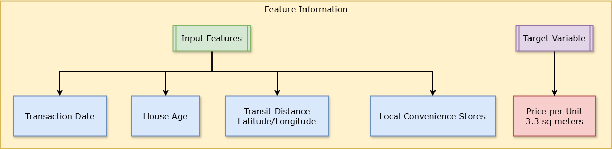

# Real State Regression Challenge

Predicting the selling price of a residential property depends on a number of factors, including the property age, availability of local amenities, and location.

In this challenge, you will use a dataset of **real estate sales** transactions to predict the **price-per-unit** of a property based on its features. The **price-per-unit** in this data is based on a unit measurement of `3.3` square meters.

> **Citation**: The data used in this exercise originates from the following study:
>
> *Yeh, I. C., & Hsu, T. K. (2018). Building real estate valuation models with comparative approach through case-based reasoning. Applied Soft Computing, 65, 260-271.*


## Environment Setup in Poridhi's VS Code

First, we need to install the required packages.

```bash
sudo apt-get update
sudo apt-get install python3-pip
```

### Kernel Setup

In **Poridhi's VSCode server**, create a new Jupyter notebook. Select the python kernel.

](https://github.com/poridhiEng/poridhi-labs/raw/main/Poridhi%20Labs/MLOps%20Lab/ML-Fundamentals/05a%20-%20Deep%20Neural%20Networks%20(TensorFlow)/images/image-13.png)

Install required extensions for running the notebook and then select the python kernel.

](https://github.com/poridhiEng/poridhi-labs/raw/main/Poridhi%20Labs/MLOps%20Lab/ML-Fundamentals/05a%20-%20Deep%20Neural%20Networks%20(TensorFlow)/images/image-12.png)

## Review the data

First download the dataset file by running the following command and save it in the same directory as the notebook.

```sh
curl -o "real_estate.csv" "https://raw.githubusercontent.com/Konami33/MlOps-Dataset/refs/heads/main/Challenges_Data/real_estate.csv"
```

Run the following cell to load the data and view the first few rows.

```python
import pandas as pd

# load the training dataset
data = pd.read_csv('real_estate.csv')
data.head()
```

> Make sure you have the dataset file in the same directory as the notebook and necessary libraries installed.



The data consists of the following variables:

- **transaction_date** - the transaction date (for example, 2013.250=2013 March, 2013.500=2013 June, etc.)
- **house_age** - the house age (in years)
- **transit_distance** - the distance to the nearest light rail station (in meters)
- **local_convenience_stores** - the number of convenience stores within walking distance
- **latitude** - the geographic coordinate, latitude
- **longitude** - the geographic coordinate, longitude
- **price_per_unit** house price of unit area (3.3 square meters)

## Train a Regression Model

**Your challenge** is to
- Explore and prepare the data,
- Identify predictive features that will help predict the **`price_per_unit`** label,
- Train a `regression` model that achieves the lowest Root Mean Square Error `(RMSE)` you can achieve (which must be less than **`7`**) when evaluated against a test subset of data.

> Add markdown and code cells as required to create your solution.

## Use the Trained Model

Save your trained model, and then use it to predict the `price-per-unit` for the following real estate transactions:

| transaction_date | house_age | transit_distance | local_convenience_stores | latitude | longitude |
| ---------------- | --------- | ---------------- | ------------------------ | -------- | --------- |
|2013.167|16.2|289.3248|5|24.98203|121.54348|
|2013.000|13.6|4082.015|0|24.94155|121.50381|

## Solution

There is no single "**correct**" solution. First try to explore the data and then come up with your own analysis and conclusions. Here is a sample solution if you get stuck. Here is method to do analysis on the data.


Run this command in a terminal to download the sample solution.

```sh
curl -o "Real Estate Regression Solution.ipynb" "https://raw.githubusercontent.com/Konami33/MlOps-Dataset/refs/heads/main/Challenges_Soln/02%20-%20Real%20Estate%20Regression%20Solution.ipynb"
```