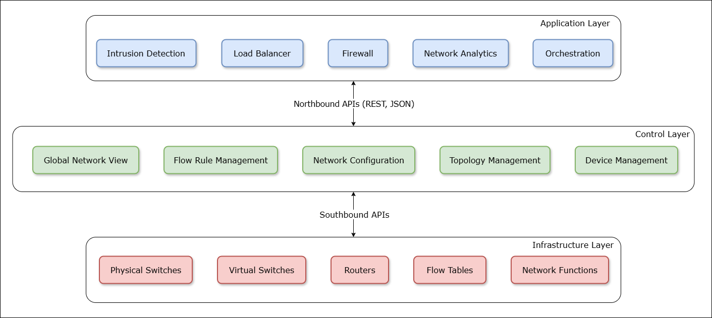
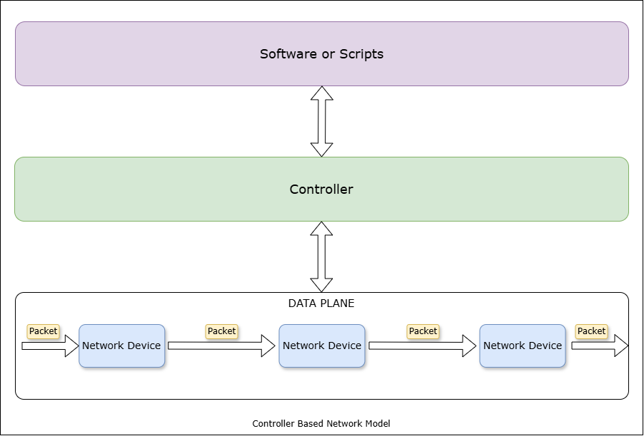

# Software Defined Networking (SDN)

Software-Defined Networking (SDN) is a network architecture approach that enables dynamic, programmatically efficient network configuration to improve network performance and monitoring. It decouples the network control plane from the data plane, allowing for centralized control of network traffic through software applications.

In traditional networking, the control plane and data plane are tightly coupled, with network configuration and management performed through manual processes. This approach is inflexible and lacks the ability to respond to changing network conditions or traffic patterns. The hardware decides the flow of data packets, and the network configuration is static. SDN changes this by moving the decision-making process to central software system.

## Data Plane and Control Plane

**Data Plane (also called Forwarding Plane):**
The Data Plane handles the actual forwarding of data packets through the network. It's responsible for moving user traffic from source to destination based on the rules and routing tables that have been established. Think of it as the worker that physically moves packets between interfaces based on pre-determined rules. Key functions include:
- Packet forwarding
- Packet filtering
- QoS (Quality of Service) enforcement
- Traffic shaping and policing
- Packet modification (like NAT)

**Control Plane:**
The Control Plane is the "brain" that makes decisions about how data should flow through the network. It determines the rules and paths that the Data Plane will use to forward traffic. Its main responsibilities include:
- Building and maintaining routing tables
- Running routing protocols (like OSPF, BGP)
- Managing network topology information
- Handling high-level network policies
- Processing routing updates from other network devices
- Managing network security policies

To help visualize this relationship: Imagine a postal service where:
- The Control Plane is like the logistics center that determines routes, creates maps, and decides how mail should be sorted
- The Data Plane is like the mail carriers who actually deliver the mail following those pre-determined routes

The separation of these planes is particularly important in modern Software-Defined Networking (SDN), where the Control Plane can be centralized and managed separately from the Data Plane, allowing for more flexible and programmable network management.

## How SDN works 

**1. Network Device Initialization**  
- Upon startup, SDN-enabled switches or routers (called OpenFlow-enabled devices) connect to the SDN controller via a standard protocol such as **OpenFlow**.  
- The devices do not make independent routing decisions but instead forward all control decisions to the controller.

**2. Topology Discovery and Monitoring**  
- The SDN controller actively gathers information about the network topology by communicating with connected devices.
- It maintains an up-to-date global view of the network's state, including available paths and device conditions.

**3. Traffic Flow Decision Making**  
- When a new data flow enters the network, the switch sends a **packet-in message** to the controller, requesting instructions for handling it.  
- The controller analyzes the packet, consults its policies, and determines the optimal path for the packet to travel.

**4. Flow Rule Installation**  
- The controller sends **flow-mod messages** to install rules on switches, specifying actions such as forwarding, dropping, or modifying packets.  
- These flow rules are cached on the switches to optimize performance for subsequent packets in the same flow.

**5. Dynamic Network Control**  
- Administrators can define high-level policies and automate network functions through applications running on top of the SDN controller.  
- SDN supports dynamic adjustments to routing paths, bandwidth allocation, and security measures in response to changing network conditions.

## Architecture of SDN

In a traditional network architecture, each network device *(e.g., switches and routers)* manages both data forwarding **(data plane)** and decision-making **(control plane)** independently. This distributed approach requires switches to exchange topology information to build forwarding tables autonomously. However, Software-Defined Networking (SDN) fundamentally changes this by centralizing the control plane and separating it from the data plane.

### **1. Application Layer**

The application layer consists of various network applications that interact with the control layer to enforce policies or implement functionalities such as intrusion detection, load balancing, and firewalls. This layer is responsible for:

- Abstracting network complexities for application developers.
- Providing programmable access to define traffic policies.
- Enhancing network management with user-defined automation and analytics.

### **2. Control Layer (SDN Controller)**

The control layer is the centralized brain of the SDN architecture, embodied by the **SDN controller**. It handles decision-making for data traffic, network configuration, and routing across the infrastructure.

**Key Functions:**  
- Maintains a global view of the network state.  
- Sends flow rules to switches based on application demands and network conditions.  
- Provides hardware abstraction for applications through programmable APIs.

**Examples of SDN Controllers:**  
- OpenDaylight, Ryu, ONOS (Open Network Operating System), POX.

### **3. Infrastructure Layer**

This layer comprises the physical network devices, such as switches and routers, responsible for forwarding data packets based on flow table entries set by the SDN controller.  

**Key Components:**  
- **OpenFlow-enabled switches:** Devices capable of receiving instructions from the controller for dynamic packet forwarding.
- **Data Plane:** Executes the forwarding, dropping, or processing of packets as directed by the controller.
- **Functionality:**

  - Matches incoming packets to pre-defined flow rules.  
  - Queries the controller when no matching flow rule is found for new traffic types.

### **Communication Interfaces**

**1. Northbound APIs:**  
- Connect the control layer to the application layer.  
- Allow applications to request network information or configure traffic policies.
- Examples: REST APIs for querying and configuring the controller.

**2. Southbound APIs:**  
- Facilitate communication between the control layer and the infrastructure layer.
- Enable the controller to install flow rules and monitor device status.
- Examples: **OpenFlow**, Netconf, and SNMP.

---

### **Packet Flow Process in SDN**

**1. Flow Table Configuration:**  

The controller pre-assigns flow tables to the switches containing match fields (such as packet headers or input port numbers) and corresponding instructions.

**2. Packet Forwarding:**  

When a packet enters a switch, the switch matches the packet against the flow table entries. Depending on the match, instructions are executed:
  - Forwarding the packet to specific ports.
  - Dropping the packet.
  - Adding or modifying packet headers.

**3. Handling Unknown Packets:**  

- If the packet does not match any flow entry, the switch queries the SDN controller.  
- The controller analyzes the packet, decides the appropriate action, and sends a new flow entry to the switch.  
- The packet is then forwarded or dropped based on the newly installed flow entry.

## Conclusion

In this lab, we have explored the basic concepts of Software-Defined Networking (SDN) and its architecture. We have learned how SDN separates the control plane from the data plane, allowing for centralized network management and dynamic traffic control. We have also seen how SDN enables programmable network configurations and supports advanced network functionalities such as traffic engineering, security policies, and network virtualization.

