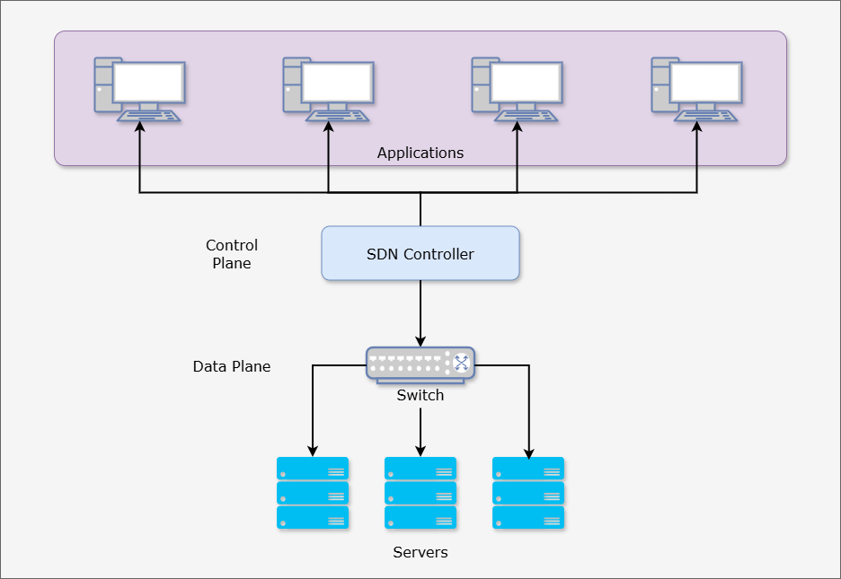

# Software Defined Networking (SDN)

Software-Defined Networking (SDN) is a network architecture approach that enables dynamic, programmatically efficient network configuration to improve network performance and monitoring. It decouples the network control plane from the data plane, allowing for centralized control of network traffic through software applications.

In traditional networking, the control plane and data plane are tightly coupled, with network configuration and management performed through manual processes. This approach is inflexible and lacks the ability to respond to changing network conditions or traffic patterns. The hardware decides the flow of data packets, and the network configuration is static. SDN changes this by moving the decision-making process to central software system.

## Data Plane and Control Plane

**Data Plane (also called Forwarding Plane):**
The Data Plane handles the actual forwarding of data packets through the network. It's responsible for moving user traffic from source to destination based on the rules and routing tables that have been established. Think of it as the worker that physically moves packets between interfaces based on pre-determined rules. Key functions include:
- Packet forwarding
- Packet filtering
- QoS (Quality of Service) enforcement
- Traffic shaping and policing
- Packet modification (like NAT)

**Control Plane:**
The Control Plane is the "brain" that makes decisions about how data should flow through the network. It determines the rules and paths that the Data Plane will use to forward traffic. Its main responsibilities include:
- Building and maintaining routing tables
- Running routing protocols (like OSPF, BGP)
- Managing network topology information
- Handling high-level network policies
- Processing routing updates from other network devices
- Managing network security policies

To help visualize this relationship: Imagine a postal service where:
- The Control Plane is like the logistics center that determines routes, creates maps, and decides how mail should be sorted
- The Data Plane is like the mail carriers who actually deliver the mail following those pre-determined routes

The separation of these planes is particularly important in modern Software-Defined Networking (SDN), where the Control Plane can be centralized and managed separately from the Data Plane, allowing for more flexible and programmable network management.

