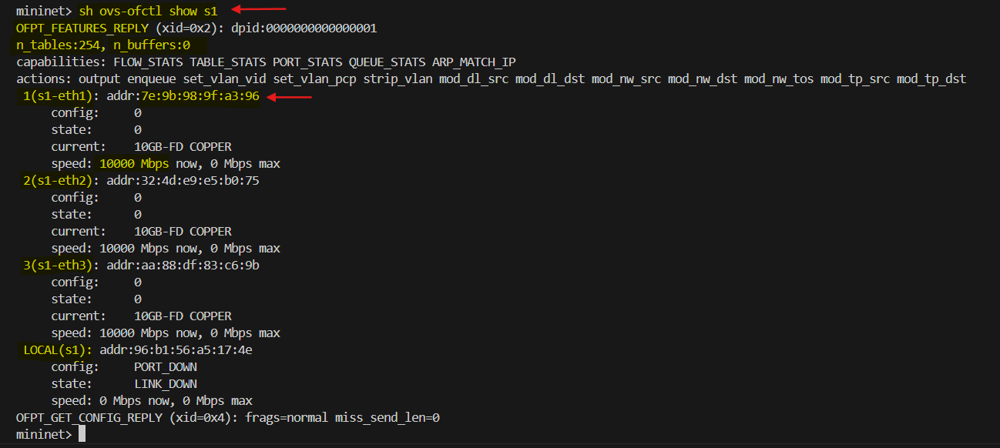

# **Configure and manage network flows at different layers**

This lab focuses on Software-Defined Networking (SDN) concepts and practices using Mininet and Open vSwitch (OVS). The primary goal is to manually configure and manage network flows at different layers (L1 to L4) of the network stack without using a centralized controller.


### **Purpose of the Lab**
- **Explore SDN principles:** Understand how to programmatically control network behavior by manually managing flow rules.
- **Learn flow management:** Create, modify, and delete flow entries to direct traffic through an SDN-enabled switch.
- **Use Open vSwitch (OVS):** Experiment with OpenFlow protocols using `ovs-ofctl` commands to manage packet forwarding.
- **Operate at different network layers:** Apply flow rules at:
  - **Layer 1:** Physical ports
  - **Layer 2:** MAC addresses
  - **Layer 3:** IP addresses
  - **Layer 4:** Application-layer protocols like TCP

### **Prerequisites**

Install Mininet on your system.

```bash
sudo apt-get update
sudo apt-get install mininet
```

## **Basic Operations**
Flow entries in an **OpenFlow-compatible** switch determine how packets are handled. Usually, these flows are dynamically managed by an SDN controller. In this exercise, you'll provide flow commands manually.

### **Network Setup**
Create a network topology using:

```bash
$ sudo mn --topo=single,3 --controller=none --mac
```


### **Command Breakdown:**
- `--topo=single,3`: Creates a single switch topology connecting three hosts (`h1`, `h2`, `h3`).
- `--controller=none`: No SDN controller is connected. Flow rules must be manually added.
- `--mac`: Assigns simplified MAC addresses to hosts for easier identification.

### **Verify Topology**
Check the network setup by executing:

```bash
mininet> dump
mininet> net
```


### **Understanding the Output**

#### **1. `dump` Command Output**
The `dump` command provides a **detailed status of network elements** in the Mininet topology. Here’s a breakdown:

- **Hosts (`h1`, `h2`, `h3`)**:
  - `h1-eth0`, `h2-eth0`, and `h3-eth0` are the network interfaces for hosts `h1`, `h2`, and `h3` respectively.
  - Each host is assigned a unique IP address: `10.0.0.1`, `10.0.0.2`, and `10.0.0.3`.
  - `pid=2667`, `pid=2671`, etc., indicate the process IDs of the virtual network namespaces hosting each host.

- **Open vSwitch (`s1`)**:
  - The switch `s1` has multiple ports (`lo`, `s1-eth1`, `s1-eth2`, `s1-eth3`).
  - `lo:127.0.0.1` represents the local loopback interface.
  - The switch interfaces `s1-eth1`, `s1-eth2`, and `s1-eth3` currently show `None`, indicating they have not yet been configured or mapped to specific addresses in the dump output.

#### **2. `net` Command Output**

The `net` command displays the **network connectivity in the topology**:

- **Host Connections**:
  - `h1 h1-eth0:s1-eth1`: The host `h1` is connected to port `s1-eth1` on switch `s1`.
  - Similarly, `h2` and `h3` are connected via ports `s1-eth2` and `s1-eth3` respectively.

- **Switch Connections**:
  - The switch `s1` lists its connected ports:
    - `s1-eth1:h1-eth0`: Switch port `s1-eth1` is connected to host `h1`'s interface `h1-eth0`.
    - `s1-eth2:h2-eth0`: Switch port `s1-eth2` is connected to host `h2`.
    - `s1-eth3:h3-eth0`: Switch port `s1-eth3` is connected to host `h3`.
  - `lo:` is the loopback interface for the switch.

### **What is `dump` and `net` command?**

#### **1. `dump` Command**
- Displays the **current state of all network nodes** (hosts and switches) in the Mininet topology.
- Includes information such as:
  - Node types (hosts, switches)
  - Interface names and IP addresses
  - Process IDs associated with each virtual host or switch.

#### **2. `net` Command**
- Shows the **network topology and connection mapping** between nodes in Mininet.
- Helps verify which ports are connected to which interfaces.
- Useful for understanding the physical or logical connectivity in your virtual network.

### **Map Switch Ports to OpenFlow Port Numbers**

```bash
mininet> sh ovs-ofctl show s1
```



This command uses **Open vSwitch (OVS) utilities** to inspect the **features and status** of the OpenFlow switch `s1` in a Mininet topology. It provides information on the switch's datapath, ports, capabilities, and other properties.

### **Command Output Breakdown**

#### **1. Switch Information**

```plaintext
OFPT_FEATURES_REPLY (xid=0x2): dpid:0000000000000001
```
- **`OFPT_FEATURES_REPLY`**: Indicates a response from the switch to the feature request message.
- **`xid=0x2`**: Transaction ID to track request-response pairs.
- **`dpid:0000000000000001`**: The datapath ID (unique identifier) for the switch `s1`.

#### **2. Table and Buffer Information**
```plaintext
n_tables:254, n_buffers:0
```
- **`n_tables:254`**: The switch supports up to 254 flow tables.
- **`n_buffers:0`**: Indicates no packet buffering is supported by this switch.

#### **3. Switch Capabilities**
```plaintext
capabilities: FLOW_STATS TABLE_STATS PORT_STATS QUEUE_STATS ARP_MATCH_IP
```
- **`FLOW_STATS`**: Supports flow statistics collection.
- **`TABLE_STATS`**: Supports table statistics collection.
- **`PORT_STATS`**: Can gather port statistics.
- **`QUEUE_STATS`**: Can collect queue statistics.
- **`ARP_MATCH_IP`**: Supports matching IP addresses in ARP requests.

#### **4. Supported Actions**
```plaintext
actions: output enqueue set_vlan_vid set_vlan_pcp strip_vlan mod_dl_src mod_dl_dst mod_nw_src mod_nw_dst mod_nw_tos mod_tp_src mod_tp_dst
```
The switch can perform various OpenFlow actions:
- **`output`**: Forward packets to specific ports.
- **`enqueue`**: Direct packets to specific queues.
- **`set_vlan_vid/set_vlan_pcp`**: Set VLAN ID or priority.
- **`strip_vlan`**: Remove VLAN tags from packets.
- **`mod_dl_src/mod_dl_dst`**: Modify source or destination MAC addresses.
- **`mod_nw_src/mod_nw_dst`**: Modify source or destination IP addresses.
- **`mod_tp_src/mod_tp_dst`**: Modify transport layer source or destination ports.

#### **5. Port Information**
```plaintext
1(s1-eth1): addr:de:54:31:64:4f:47
  config:     0
  state:      0
  current:    10GB-FD COPPER
  speed: 10000 Mbps now, 0 Mbps max
```
This section describes the properties of each switch port:

- **Port Number (`1(s1-eth1)`)**: Represents port `s1-eth1`.
- **MAC Address (`addr:de:54:31:64:4f:47`)**: The MAC address of the port.
- **`config: 0`**: No special configuration settings for the port.
- **`state: 0`**: The port is in a normal operational state.
- **`current: 10GB-FD COPPER`**: The port is running at full-duplex, 10 Gbps copper connectivity.
- **`speed: 10000 Mbps`**: Indicates the current speed is 10 Gbps.

#### **6. Local Interface**
```plaintext
LOCAL(s1): addr:f2:23:37:03:56:40
  config:     PORT_DOWN
  state:      LINK_DOWN
  speed: 0 Mbps now, 0 Mbps max
```
- The `LOCAL` port is used for traffic originating from or destined for the switch itself.
- **`PORT_DOWN`/`LINK_DOWN`**: Indicates the port is administratively or physically disabled.

#### **7. Configuration Reply**
```plaintext
OFPT_GET_CONFIG_REPLY (xid=0x4): frags=normal miss_send_len=0
```
- **`frags=normal`**: Indicates normal handling of fragmented packets.
- **`miss_send_len=0`**: Specifies the length of packet data sent to the controller when a packet misses all flow table entries.


### **Creating Flow Entries**
Add a flow to mimic traditional switch behavior:

```bash
mininet> sh ovs-ofctl add-flow s1 action=normal
```

This command installs a flow rule in the switch `s1` to handle packets using the default switch logic **(i.e., normal Layer 2 learning and forwarding)**. The normal action allows the switch to behave similarly to a traditional Ethernet switch, learning MAC addresses and forwarding packets based on MAC address tables.

### **Components Breakdown**

- **`sh`**: Executes a shell command within the Mininet environment.
- **`ovs-ofctl`**: A command-line tool to control and manage Open vSwitch (OVS) instances.
- **`add-flow`**: Adds a flow entry to the flow table of the specified switch.
- **`s1`**: The target switch for the flow rule.
- **`action=normal`**: Specifies the action for packet processing. The `normal` action delegates packet handling to the built-in switch logic, mimicking the behavior of a conventional switch.

#### **Testing Connectivity**

Run this command to test the connectivity between all hosts in the network:

```bash
mininet> pingall
```

**Expected Result:** All hosts should communicate successfully.


### **Dumping and Deleting Flows**
List current flows on the switch:

```bash
mininet> sh ovs-ofctl dump-flows s1
```


This command lists all the flow rules currently installed on the switch `s1`. It provides a detailed view of the flow table, including the rules' priority, match criteria, and actions.

Delete all flow entries:

```bash
mininet> sh ovs-ofctl del-flows s1
```

Verify flows are cleared:

```bash
mininet> sh ovs-ofctl dump-flows s1
```

**Result:** No flows should remain.  
Run `pingall` again — communication will fail because no flow rules are defined.


### **Programming Flows Using Physical Ports**
Direct traffic between specific ports:


```bash
sh ovs-ofctl add-flow s1 priority=500,in_port=1,actions=output:2
```
- **`priority=500`**: Specifies the priority of the flow rule. Higher priorities are matched first.
- **`in_port=1`**: The rule applies to packets arriving at port 1.
- **`actions=output:2`**: Packets that match this rule are forwarded to port 2.


  

```bash
sh ovs-ofctl add-flow s1 priority=500,in_port=2,actions=output:1
```
- Similar to the first command, but it handles packets coming into port 2 and forwards them to port 1.

#### **Flow Table Behavior**
These commands effectively create a direct connection between port 1 and port 2:
- Packets from **h1 (port 1)** are forwarded to **h2 (port 2)**.
- Packets from **h2 (port 2)** are forwarded to **h1 (port 1)**.


### **Ping Tests and Outputs**
#### **Command:**
```bash
h1 ping -c2 h2
```


- **Successful Ping**: 
  - Two ICMP packets are sent from `h1` to `h2` and successfully reach their destination.
  - The switch uses the flow table rules to forward packets between h1 and h2.
  
**Output Breakdown:**
- **`64 bytes from 10.0.0.2`**: Indicates successful reception of packets by h2.
- **`time=0.375 ms`**: Round-trip time for the packet.
- **`0% packet loss`**: All packets were successfully transmitted and received.


#### **Command:**

If you try to ping from `h3` to `h2`, you will get the following output:

```bash
h3 ping -c2 h2
```


- **Ping Failure**:
  - Since no flow rule exists for packets entering from port 3 (connected to h3), the switch drops the packets.
  - Therefore, h3 cannot reach h2.


**Output Breakdown:**
- **`Destination Host Unreachable`**: Indicates that the packets could not be routed to h2.
- **`100% packet loss`**: All packets from h3 to h2 were lost due to the lack of a flow rule for port 3.


### **Improving Connectivity**

**Command 1:**

```bash
sh ovs-ofctl add-flow s1 priority=500,in_port=3,actions=output:1,2
```
- **`priority=500`**: Specifies the priority of the flow rule.
- **`in_port=3`**: Applies to packets arriving at port 3 (`s1-eth3`).
- **`actions=output:1,2`**: Packets received on port 3 are forwarded to ports 1 and 2 (`s1-eth1` and `s1-eth2`).


**Command 2:**

```bash
sh ovs-ofctl add-flow s1 priority=500,in_port=1,actions=output:2,3
```
- Packets entering through port 1 are forwarded to ports 2 and 3.


**Command 3:**

```bash
sh ovs-ofctl add-flow s1 priority=500,in_port=2,actions=output:1,3
```
- Packets entering through port 2 are forwarded to ports 1 and 3.


These rules establish `bi-directional` communication between all ports, ensuring that any packet arriving at a port is forwarded to the remaining two ports.

### **Verifying Flow Table with `dump-flows`**

```bash
sh ovs-ofctl dump-flows s1
```


  
- **`actions=output:"s1-eth1",output:"s1-eth2"`**: Packets are forwarded to `s1-eth1` and `s1-eth2`.

- Packets entering from `s1-eth1` are forwarded to `s1-eth2` and `s1-eth3`.

- Packets entering from `s1-eth2` are forwarded to `s1-eth1` and `s1-eth3`.

### **Ping Tests and Outputs**

Run the following command to test the connectivity between all hosts in the network:

```bash
mininet> pingall
```


## Conclusion

In this lab, we have manually configured and managed network flows of the network stack without using a centralized controller. We have created flow rules to direct traffic through an SDN-enabled switch and tested the connectivity between all hosts in the network. We have also verified the flow table and deleted all flow entries to see the impact on connectivity. Finally, we have improved the connectivity by adding additional flow rules to allow full communication between all hosts.


