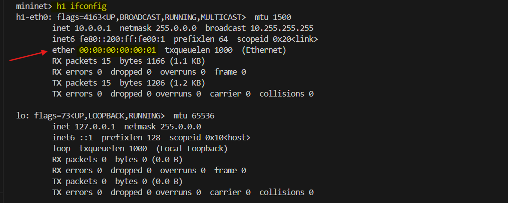

# **Using MAC Addresses (Layer 2 Data)**


First Find the MAC Addresses of the hosts:

```bash
mininet> h1 ifconfig
mininet> h2 ifconfig
mininet> h3 ifconfig
```



Add flow rules based on source and destination MAC addresses:

```bash
mininet> sh ovs-ofctl add-flow s1 dl_src=00:00:00:00:00:01,dl_dst=00:00:00:00:00:02,actions=output:2
mininet> sh ovs-ofctl add-flow s1 dl_src=00:00:00:00:00:02,dl_dst=00:00:00:00:00:01,actions=output:1
```

Now try to ping the hosts:

```bash
mininet> pingall
```


Here we can see that the ping fails. This is because when you run `pingall` in Mininet, it tries to send ICMP packets (ping) from each host to all others. However, ICMP operates at the `**IP layer**` (Layer 3), while the underlying network setup requires ARP (Address Resolution Protocol) at the `**data link layer (Layer 2)**` to resolve IP addresses to MAC addresses. 

### **Why the Ping Fails?**

**1. ARP Requests Are Blocked**:

- Before a host can send an IP packet to another host, it must resolve the target IP address into a MAC address. This is done using ARP, which sends a **broadcast request** to all devices in the network asking, **"Who has this IP?"**
- The Open vSwitch (OVS), with its current flow rules, does not forward ARP broadcast packets by default.  It's filtering out **ARP data traffic**.

**2. No Matching Flow for ARP Packets**:

OVS checks its flow table for a rule to handle ARP packets (`dl_type=0x806`). Without a rule for `ARP`, these packets are dropped, preventing hosts from learning each other’s MAC addresses.

### **How to Fix It?**

To allow **ARP broadcasts** and enable communication between hosts, you need to add a flow rule to handle ARP packets:

```bash
mininet> sh ovs-ofctl add-flow s1 dl_type=0x806,nw_proto=1,action=flood
```

- **`dl_type=0x806`**: Matches Ethernet frames of type `0x806`, which indicates ARP packets.
- **`nw_proto=1`**: Matches ARP request packets.
- **`action=flood`**: Broadcasts the ARP request to all ports on the switch.

### **How It Works**

**1. ARP Requests Broadcasted**:

With this rule, whenever a host sends an **ARP request**, OVS **broadcasts** it to all connected devices. This allows the target host to receive the request and respond with its **MAC address** in an ARP reply.

**2. Unicast ARP Replies**:

ARP replies are **unicast** (sent directly to the requester). These unicast replies are handled correctly by the existing flow rules, as they match the source and destination MAC addresses specified in the rules.

### **Testing the Fix**

```bash
mininet> pingall
```


When you run `pingall`, the ARP requests are broadcasted to all hosts, enabling them to resolve each other's MAC addresses. Once MAC addresses are resolved, ICMP packets (ping) can flow as expected. 


> `h3` is not able to communicate with h1 and h2 as we have not added any flow rules for h3. You can try adding flow rules for h3 and see if it works.

## **Using Layer 4 (Transport Layer) Data**
Start a simple Python web server on host `h3`:

```bash
mininet> h3 python -m SimpleHTTPServer 80 &
```

Add a rule for TCP traffic to port 80:

```bash
mininet> sh ovs-ofctl add-flow s1 priority=500,dl_type=0x800,nw_proto=6,tp_dst=80,actions=output:3
```

## **Explanation:**  
- **nw_proto=6:** Matches TCP traffic.
- **tp_dst=80:** Matches traffic destined for port 80.
  
Check connectivity:

```bash
mininet> h1 curl h3
```