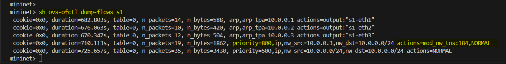
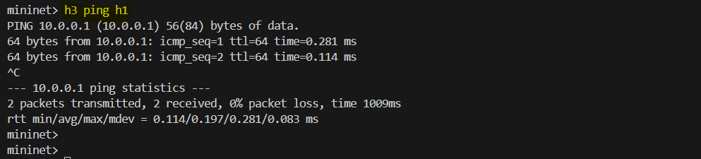

# Layer 3 Flow Rules

In this section, we will create **OpenFlow** rules using **Layer 3 (IP)** information and implement **QoS (Quality of Service)** with Differentiated Services Code Point (**DSCP**). Let's break it down step by step.


## General IP Traffic Handling

```bash
mininet> sh ovs-ofctl add-flow s1 priority=500,dl_type=0x800,nw_src=10.0.0.0/24,nw_dst=10.0.0.0/24,actions=normal
```

- **`priority=500`**: The priority of this rule. Higher-priority rules override lower-priority ones.
- **`dl_type=0x800`**: Matches packets with an Ethernet type of `0x800`, indicating IPv4 packets.
- **`nw_src=10.0.0.0/24`**: Matches packets from the IP range `10.0.0.0/24` (all hosts in the subnet).
- **`nw_dst=10.0.0.0/24`**: Matches packets destined for the same subnet.
- **`actions=normal`**: Forwards packets using the switch's normal MAC learning and forwarding behavior.

This rule ensures that **all IP packets** between hosts in the `10.0.0.0/24` subnet are handled normally.


## Prioritizing Traffic from `h3`

```bash
mininet> sh ovs-ofctl add-flow s1 priority=800,dl_type=0x800,nw_src=10.0.0.3,nw_dst=10.0.0.0/24,actions=mod_nw_tos:184,normal
```

- **`priority=800`**: A higher priority than the previous rule ensures this rule is applied first.
- **`dl_type=0x800`**: Matches IPv4 packets.
- **`nw_src=10.0.0.3`**: Matches packets originating from `h3` (source IP `10.0.0.3`).
- **`nw_dst=10.0.0.0/24`**: Matches packets destined for the `10.0.0.0/24` subnet.
- **`actions=mod_nw_tos:184,normal`**:
  - **`mod_nw_tos:184`**: Modifies the **Type of Service (TOS)** field in the IP header to `184`.
    - **`184` in decimal** corresponds to **DSCP value `46`** for Expedited Forwarding (EF). 
    - The DSCP value is shifted **two bits to the left** when stored in the TOS field.
  - **`normal`**: After modifying the TOS field, packets are forwarded using normal switch behavior.



This rule gives traffic from `h3` higher priority, ensuring low latency and faster delivery (e.g., for real-time applications like VoIP).

## Differentiated Services (DSCP) and TOS Field

The **DSCP (Differentiated Services Code Point)** and **TOS (Type of Service)** field are components of the IP header used to indicate and manage the priority or quality of service (QoS) for IP packets in a network.


### **1. TOS (Type of Service) Field**

The TOS field is part of the **IPv4 header** and is used to specify how packets should be handled in terms of priority and service quality.

#### **Structure of the TOS Field**

The TOS field is 8 bits long and consists of:
1. **DSCP (6 bits)**: Used to define the packet's QoS level (modern usage).
2. **ECN (2 bits)**: Used for Explicit Congestion Notification.


### **2. DSCP (Differentiated Services Code Point)**

DSCP is a modern, scalable replacement for TOS, introduced as part of the **Differentiated Services (DiffServ)** architecture. It allows classification of packets into different QoS categories for traffic prioritization and better network resource management.

#### **DSCP Bits**
- DSCP uses the first **6 bits** of the TOS field.
- Provides up to **64 QoS classes** (2⁶ = 64) to label packets for priority handling.

#### **Common DSCP Values**

DSCP values are often mapped to well-known QoS classes:
| **DSCP Value** | **Binary**  | **Class**                      | **Use Case**                        |
|----------------|-------------|--------------------------------|--------------------------------------|
| 0             | `000000`    | Default Best Effort           | General traffic                     |
| 10            | `001010`    | AF11 (Assured Forwarding)     | Medium-priority traffic             |
| 26            | `011010`    | AF31 (Assured Forwarding)     | High-priority business applications |
| 46            | `101110`    | EF (Expedited Forwarding)     | Real-time traffic (e.g., VoIP)      |
| 48            | `110000`    | CS6 (Class Selector)          | Critical network traffic            |

**Why `184`?**

To set DSCP = `46` in the TOS field:
- `46` in binary: `101110`.
- Shift it 2 bits to the left: `10111000` = `184` in decimal.

#### **DSCP in QoS**

1. **Traffic Classification**: Packets are marked with a DSCP value to indicate their priority.
2. **Traffic Treatment**: Routers and switches read the DSCP value and provide differentiated handling, such as: Prioritizing voice or video traffic, Dropping lower-priority packets in congestion scenarios.

---

### **ARP Rules**

The new ARP rules handle ARP packets **without flooding**, directing them to specific ports instead:

#### Rules:
```bash
mininet> sh ovs-ofctl add-flow s1 arp,nw_dst=10.0.0.1,actions=output:1
mininet> sh ovs-ofctl add-flow s1 arp,nw_dst=10.0.0.2,actions=output:2
mininet> sh ovs-ofctl add-flow s1 arp,nw_dst=10.0.0.3,actions=output:3
```

- **`arp`**: Matches ARP packets.
- **`nw_dst=10.0.0.x`**: Matches ARP requests destined for the specified host.
- **`actions=output:x`**: Forwards ARP packets to the port where the destination host is connected.

#### **Why Not Flood ARP?**

Flooding ARP requests sends them to all ports, which can be inefficient in large networks (e.g., a 24-port switch). These specific rules direct ARP traffic to the correct port, reducing unnecessary network congestion.

## Testing the Flow Rules

Start the pinging from `h3` to `h1` and `h2` and observe the traffic on the switch.

```bash
mininet> h3 ping h1
mininet> h3 ping h2
```




## Conclusion

In this lab, we have implemented Layer 3 flow rules to prioritize traffic from `h3` and handle general IP traffic within the subnet. We have also added ARP rules to avoid flooding ARP packets, directing them to specific ports for efficient handling. This setup ensures that critical traffic from `h3` is prioritized while maintaining efficient network behavior for other hosts.


