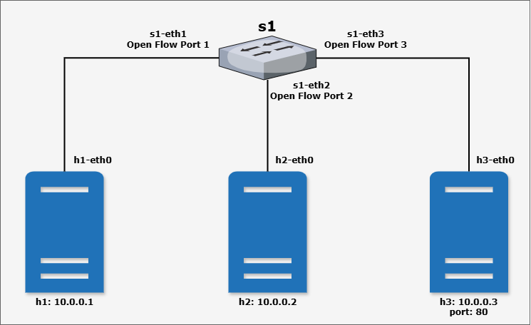
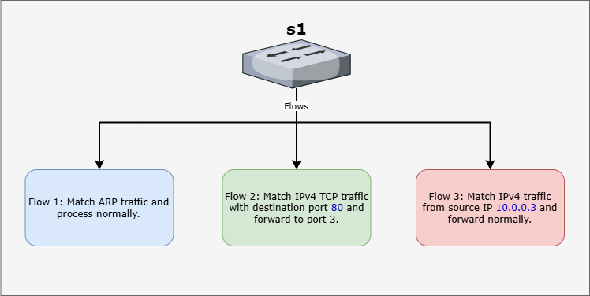

# Layer 4 Traffic Forwarding Setup in Mininet with OpenFlow

In this lab, we will configure basic traffic forwarding setup in Mininet using OpenFlow rules. We will demonstrate the use case of forwarding `HTTP` traffic to a specific host running a web server using OpenFlow rules.


## Overview

In this setup, a Python HTTP server is running on Host 3 (`h3`) and listens on port 80. The goal is to forward all HTTP traffic (TCP traffic destined for port 80) to `h3` regardless of its origin. This scenario is a simple example of using OpenFlow rules to control traffic flow at the transport layer.

## Network Topology

The network topology consists of:
- A single OpenFlow switch (`s1`).
- Three hosts:
  - `h1` (IP: `10.0.0.1`, Port: `s1-eth1`)
  - `h2` (IP: `10.0.0.2`, Port: `s1-eth2`)
  - `h3` (IP: `10.0.0.3`, Port: `s1-eth3`)

All hosts are connected to the same switch (`s1`).



## Steps to Configure the Setup

### Start Mininet
Launch Mininet with the default topology:

```bash
sudo mn --topo=single,3 --controller=none --mac
```

This creates a network with one switch and three hosts.

### Start an HTTP Server on Host 3

On `h3`, start a simple Python HTTP server that listens on port `80`:

```bash
mininet> h3 python -m SimpleHTTPServer 80 &
```
The server can respond to HTTP requests sent to `h3`’s IP address (e.g., `10.0.0.3`).

### Flow Rules

We will add flow rules to the switch `s1` to forward HTTP traffic to `h3` and normal traffic from `h3` to the appropriate destination. Also, we will add a rule to handle ARP packets.




### 1. Enable ARP Handling

Add an OpenFlow rule to handle ARP packets. This flow rule allows the **switch s1** to process ARP packets normally. This is necessary for IP communication to work:

```bash
mininet> sh ovs-ofctl add-flow s1 arp,actions=normal
```

Here is a simulation of the ARP packets being forwarded to all the ports:

<video controls src="Screen Recording 2025-01-18 225622.mp4" title="Title"></video>

ARP packets are broadcast traffic and are required for resolving IP-to-MAC addresses. This rule ensures that ARP packets are forwarded normally to all necessary ports.

### 2. Add a Rule for HTTP Traffic Forwarding

Add an OpenFlow rule to forward all TCP traffic destined for port 80 (HTTP) to port 3 (`h3`):

```bash
mininet> sh ovs-ofctl add-flow s1 priority=500,dl_type=0x800,nw_proto=6,tp_dst=80,actions=output:3
```

This command adds a flow rule to the switch `s1` with the following characteristics:

- **Match**:
  - `priority=500`: Sets the rule priority (higher than default rules).
  - `dl_type=0x800`: Matches IPv4 packets.
  - `nw_proto=6`: Matches TCP packets (TCP protocol number = 6).
  - `tp_dst=80`: Matches packets with destination port 80 (HTTP traffic).
- **Action**: Forward all matching packets to switch port 3, where `h3` is connected.
- **Purpose**: This rule ensures that all HTTP traffic (destined for port 80) is directed to `h3`.

### 3. Add a Rule for Normal Traffic Flow

Add another rule to handle normal traffic from `h3`:
```bash
mininet> sh ovs-ofctl add-flow s1 priority=800,ip,nw_src=10.0.0.3,actions=normal
```

This command adds a flow rule to the switch `s1` with the following characteristics:

- **Match**:
  - `priority=800`: Sets a higher priority for this rule.
  - `ip`: Matches IPv4 packets.
  - `nw_src=10.0.0.3`: Matches packets originating from `h3` (source IP `10.0.0.3`).
- **Action**: 
  - `normal`: Forward the packet using the switch’s normal behavior (forward to appropriate destination port based on MAC address table or flood if unknown).
- **Purpose**: 
  - This rule ensures that outgoing traffic from `h3` is forwarded correctly to the destination host (`h1` or `h2`).
  - It prevents the default flow from misrouting or blocking packets sent by `h3` in response to HTTP requests.

### Test the Setup
To test the configuration, send an HTTP request from `h1` to `h3`:
```bash
mininet> h1 curl h3
```
This sends an HTTP GET request from `h1` to `h3` (IP `10.0.0.3`). The switch `s1` handles the traffic as follows:

**From `h1` to `h3`**:

- ARP resolves `h3`’s MAC address.
- The HTTP request is matched by the rule for `tp_dst=80` and forwarded to port 3 (`h3`).

**From `h3` to `h1`**:
- The HTTP response is matched by the rule for `nw_src=10.0.0.3` and forwarded normally (`normal` action).

### Verifying OpenFlow Rules

To view all installed rules on `s1`:
```bash
mininet> sh ovs-ofctl dump-flows s1
```

The output will display the active flow rules, packet counts, and byte counts.

## Conclusion

This setup demonstrates how OpenFlow rules can control traffic based on Layer 4 parameters. By redirecting HTTP traffic to a specific host, you can implement simple traffic management or forwarding policies, such as directing traffic to a firewall or a load balancer.

