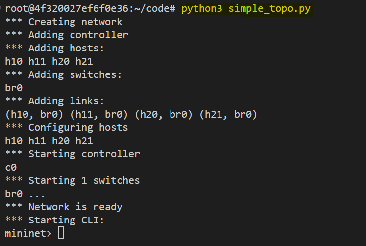
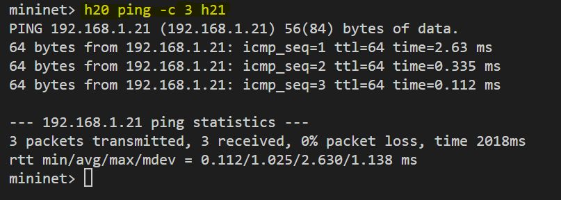
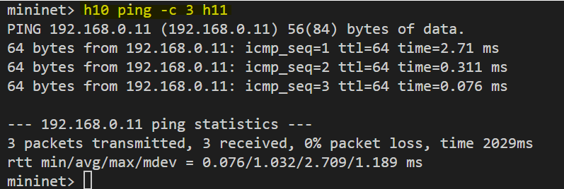
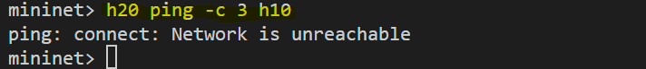
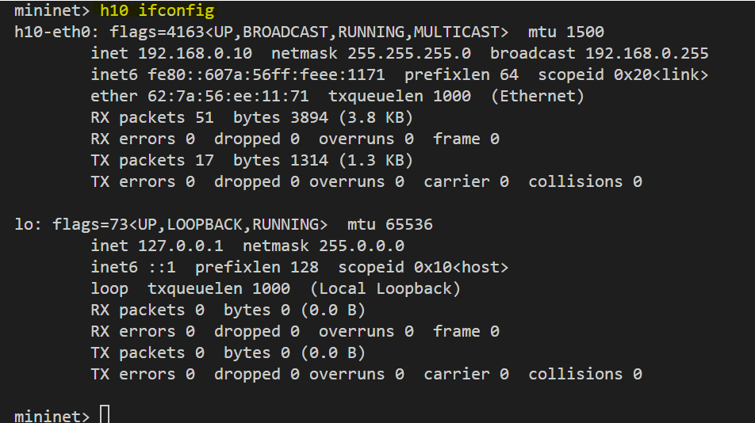
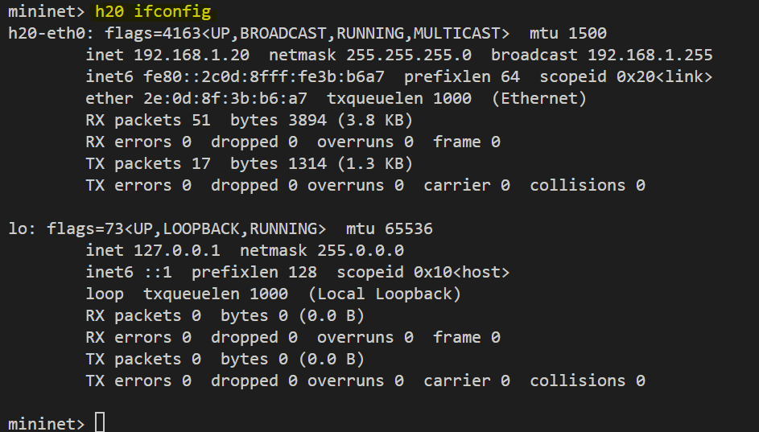
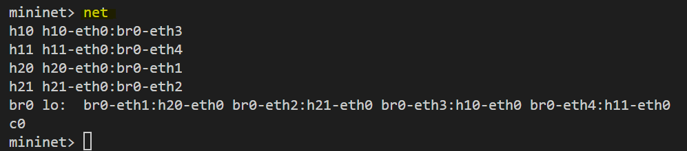
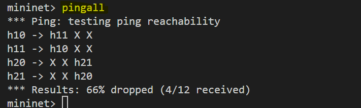

# **Simulating a Two-Subnet Network Topology in Mininet with One Switch**


Mininet is a popular network emulator that creates a virtual network of hosts, switches, controllers, and links. It is widely used for learning and research purposes in Software-Defined Networking (SDN). In this lab, we will simulate a simple network topology with one switch connecting two subnets, each containing two hosts. The subnets will be configured with different IP ranges to emulate isolated network segments.

This lab demonstrates how to:

1. Build a custom Mininet topology using Python.
2. Configure two subnets with distinct IP ranges.
3. Verify connectivity within and across subnets.


## **Task Description**


The goal of this lab is to create a network topology with:

- **One Switch (br0):** Acts as the central switch connecting all hosts.
- **Two Subnets:**
  - Subnet `192.168.1.0/24`containing hosts `h20` and `h21`.
  - Subnet `192.168.0.0/24` containing hosts `h10` and `h11`.
- **Verification Steps:** Test connectivity within each subnet and across subnets using ping.


## **Setup Explanation**

The topology is defined in Python using the Mininet library. Below is a detailed explanation of each part of the setup:

### 1. **Switch (br0)**
A standalone Open vSwitch (OVS) bridge `br0` is created to connect all hosts. The `failMode` is set to `standalone`, ensuring it operates independently without requiring an external controller.

### 2. **Hosts**
Four hosts are created with the following IP configurations:

- **Subnet 192.168.1.0/24**
  - `h20`: 192.168.1.20/24
  - `h21`: 192.168.1.21/24
- **Subnet 192.168.0.0/24**
  - `h10`: 192.168.0.10/24
  - `h11`: 192.168.0.11/24

Each host is assigned an IP address and connected to the switch.

### 3. **Links**
Links are created between each host and the switch. This ensures all hosts are connected to the central bridge, facilitating communication.

### 4. **Network Initialization**
The custom topology is passed to the Mininet instance. Once started, the Mininet Command-Line Interface (CLI) allows us to interact with and test the network.


## **Code**

Open a file `simple_topo.py` and save the following script:

```python
from mininet.net import Mininet
from mininet.topo import Topo
from mininet.node import OVSKernelSwitch
from mininet.cli import CLI
from mininet.log import setLogLevel, info

class TwoSubnetTopo(Topo):
    def build(self):
        # Add bridge
        br0 = self.addSwitch('br0', cls=OVSKernelSwitch, failMode='standalone')
        
        # Add hosts for subnet 192.168.1.0/24
        h20 = self.addHost('h20', ip='192.168.1.20/24')
        h21 = self.addHost('h21', ip='192.168.1.21/24')
        
        # Add hosts for subnet 192.168.0.0/24
        h10 = self.addHost('h10', ip='192.168.0.10/24')
        h11 = self.addHost('h11', ip='192.168.0.11/24')
        
        # Add links between hosts and bridge
        self.addLink(h20, br0)
        self.addLink(h21, br0)
        self.addLink(h10, br0)
        self.addLink(h11, br0)

def start_network():
    """Initialize and start the network"""
    topo = TwoSubnetTopo()
    net = Mininet(topo=topo, switch=OVSKernelSwitch)
    net.start()
    
    info('*** Network is ready\n')
    CLI(net)
    net.stop()

if __name__ == '__main__':
    setLogLevel('info')
    start_network()
```

Now, run the following command to start the network:
```bash
python3 simple_topo.py
```

Expected output:




## **Verification**

After starting the network, follow these steps to verify the setup:

### 1. **Ping Hosts in the Same Subnet**

Within the Mininet CLI, use the `ping` command to test connectivity within each subnet.

- Test within Subnet `192.168.1.0/24`:
  ```bash
  mininet> h20 ping -c 3 h21
  ```

   

- Test within Subnet `192.168.0.0/24`:
  ```bash
  mininet> h10 ping -c 3 h11
  ```

   

**Expected Result:** Hosts within the same subnet should communicate successfully.

### 2. **Ping Hosts Across Subnets**

- Test between Subnet 192.168.1.0/24 and 192.168.0.0/24:
  ```bash
  mininet> h20 ping h10
  ```

   

**Expected Result:** Communication across subnets will fail unless routing is explicitly configured.

### 3. **List Network Configuration**

Use the following commands to inspect the network:

- **Display IP configurations:**
  ```bash
  mininet> h20 ifconfig
  mininet> h10 ifconfig
  ```

   

   

- **Show network links:**
  ```bash
  mininet> net
  ```

   

- **Ping from all hosts to others:**

   The `pingall` command in Mininet sends ICMP echo requests (pings) between all pairs of hosts in the network to test connectivity. The results show which hosts can communicate with each other.
   ```bash
   mininet> pingall
   ```

   

   **Why Are Pings Failing Across Subnets?**
   - *Lack of Routing:*
      The switch br0 operates as a Layer 2 device, facilitating communication within the same subnet.
      Without a router or Layer 3 configuration, packets between subnets (192.168.0.0/24 and 192.168.1.0/24) cannot be routed.

   - *Network Isolation by Design:*
      Subnets are isolated unless explicitly connected through a router or routing rules.


## **Conclusion**

This lab provided hands-on experience with Mininet to create a network topology featuring one switch and two subnets. You learned how to:

1. Define a custom topology in Python.
2. Configure subnets and hosts with distinct IP addresses.
3. Verify connectivity using Mininet CLI.

This foundational setup can be extended to include routing, firewalls, or SDN controllers for more advanced networking scenarios.

