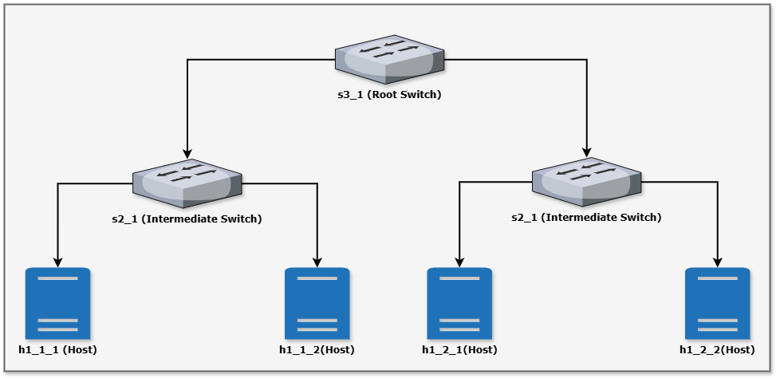

# **Mininet: Network Topologies**

Mininet is a powerful tool for network simulation, enabling developers to create, test, and debug network configurations in a virtual environment. In this lab, we will create Network Topologies and perform network testing and debugging.

## **1. Network Topologies**

A network topology is a graphical representation of the network architecture, including the physical and logical connections between devices. Custom topologies allow users to design specific network layouts for testing or research purposes. **Mininet's Python API** provides extensive flexibility to define hosts, switches, controllers, and links.

### **Key Components of Network Topologies**

**1. Hosts**:

Hosts represent end devices (like computers or IoT devices). They can send or receive traffic. They are assigned an IP address and MAC address in Mininet.

**2. Switches**:

Switcher are network devices that simulate Layer 2 devices (e.g., Open vSwitch). They forward packets between hosts or other switches. They work with a controller to handle traffic intelligently.

**3. Controllers**:

Controllers manage the flow of packets through switches using protocols like OpenFlow. They can be local (Mininet’s default `Controller`) or remote (e.g., an external SDN controller like `ONOS` or `Ryu`).

**4. Links**:

Links define the connections between nodes. They support custom parameters like bandwidth, delay, and packet loss. They are used to create the network topology.


### **Types of Topologies**

Mininet supports pre-defined topologies, but custom topologies provide flexibility to simulate any network structure.

#### **Pre-Defined Topologies**:
- **Single**: A single switch connected to multiple hosts.
- **Linear**: Switches connected in a line.
- **Tree**: A hierarchical structure of switches and hosts.
- **Minimal**: The simplest topology with one switch and two hosts.

#### **Custom Topologies**:

Custom Topologies can represent:

- Complex graphs (e.g., mesh, ring, star).
- Real-world network layouts (e.g., a campus or data center).

## **Hands-On Implementation of Network Topologies**

### **Pre-requisites**:

- Mininet installed
- Python 3 installed

Install Mininet: (If not already installed)

```bash
sudo apt-get update
sudo apt-get install mininet
```

### **1. Linear Topology**

Linear Topology is a simple topology where switches are connected in a straight line. Each switch is connected to the next one in the sequence. Hosts are connected to the switches.


In this example, we will create a linear topology with 3 hosts and 2 switches.

```python
from mininet.topo import Topo
from mininet.net import Mininet
from mininet.node import Controller
from mininet.cli import CLI
from mininet.log import setLogLevel

class CustomTopo(Topo):
    def build(self):
        # Add hosts
        h1 = self.addHost('h1')
        h2 = self.addHost('h2')
        h3 = self.addHost('h3')

        # Add switches
        s1 = self.addSwitch('s1')
        s2 = self.addSwitch('s2')

        # Add links with parameters
        self.addLink(h1, s1, bw=10, delay='5ms', loss=1)
        self.addLink(h2, s1, bw=20)
        self.addLink(s1, s2, bw=15, delay='10ms')
        self.addLink(h3, s2, bw=10)

def run():
    topo = CustomTopo()
    net = Mininet(topo=topo, controller=Controller)
    net.start()

    # Test connectivity
    print("Testing network connectivity...")
    net.pingAll()

    # Open CLI for further testing
    CLI(net)

    net.stop()

if __name__ == '__main__':
    setLogLevel('info')  # Enable Mininet logs
    run()
```

#### **Steps to Execute**

1. Save the script as `linear_topology.py`.
2. Run the script:
   ```bash
   sudo python3 linear_topology.py
   ```
3. Inside the CLI:
   - Use `pingall` to test connectivity.
   - Use `nodes` to view the nodes in the topology.

### **2. Tree Topology**

Now, we will create a tree topology with 3 switches and 4 hosts. The tree topology follows a hierarchical structure where switches are connected in levels, and hosts are connected to the switches at the lowest level.




#### **Topology with Depth 3 and Fanout 2**

- **Root switch**: `s3_1`.
- **Intermediate switches**: `s2_1`, `s2_2`.
- **Hosts**: `h1_1_1`, `h1_1_2`, `h1_2_1`, `h1_2_2`.

### **Python Script for Tree Topology**

This python script creates a tree topology with 3 switches and 4 hosts.

```python
from mininet.topo import Topo
from mininet.net import Mininet
from mininet.cli import CLI
from mininet.log import setLogLevel

class TreeTopology(Topo):
    """
    Tree topology example:
        - Root switch at the top.
        - Intermediate switches connected to the root.
        - Hosts connected to the intermediate switches.
    """

    def build(self, depth=2, fanout=2):
        """
        Build a tree topology.
        :param depth: Number of levels in the tree.
        :param fanout: Number of child nodes (switches or hosts) per parent switch.
        """
        self.create_tree(depth, fanout, parent=None)

    def create_tree(self, depth, fanout, parent):
        """
        Recursively create the tree structure.
        :param depth: Current depth of the tree.
        :param fanout: Number of child nodes per parent.
        :param parent: Parent switch for the current level.
        """
        # Base case: If depth is 0, return (no more switches to add).
        if depth == 0:
            return

        # Create switches at the current level.
        for i in range(1, fanout + 1):
            switch = self.addSwitch(f's{depth}_{i}')

            # If there is a parent switch, connect it to the current switch.
            if parent:
                self.addLink(parent, switch)

            # If we are at the last level, add hosts to the switch.
            if depth == 1:
                for j in range(1, fanout + 1):
                    host = self.addHost(f'h{depth}_{i}_{j}')
                    self.addLink(switch, host)
            else:
                # Recurse to add child switches or hosts.
                self.create_tree(depth - 1, fanout, switch)

def run():
    """
    Run the tree topology in Mininet.
    """
    # Create the network using the TreeTopology
    topo = TreeTopology(depth=3, fanout=2)  # Example: Depth of 3, fanout of 2
    net = Mininet(topo=topo)
    net.start()

    # Test network connectivity
    print("Testing network connectivity...")
    net.pingAll()

    # Start the CLI for user interaction
    CLI(net)

    # Stop the network
    net.stop()

if __name__ == '__main__':
    setLogLevel('info')  # Set logging level to display info messages
    run()
```

### **Explanation of the Code**

1. **Tree Structure**:
   - The `depth` parameter specifies the number of levels in the tree (e.g., root → intermediate → leaf).
   - The `fanout` parameter determines how many child nodes (switches or hosts) each switch has.

2. **Recursive Tree Creation**:
   - The `create_tree` function is a recursive method that adds switches and connects them to their parent.
   - At the last level (`depth == 1`), hosts are added to the switches instead of more child switches.

3. **Key Classes and Methods**:
   - `addSwitch(name)`: Adds a switch to the topology.
   - `addHost(name)`: Adds a host to the topology.
   - `addLink(node1, node2)`: Connects two nodes (switches or hosts).

4. **Mininet Interaction**:
   - The `run()` function initializes the network, starts it, performs connectivity tests using `pingAll()`, and launches the interactive CLI.


### **Run the Script**

1. Save the script as `tree_topology.py`.
2. Run it using:
   ```bash
   sudo python3 tree_topology.py
   ```
3. Test connectivity and interact with the network in the Mininet CLI.

This script allows flexible creation of tree topologies, making it ideal for hierarchical network testing.


## **Conclusion**

In this lab, we have created two network topologies using Mininet. We have created a linear topology with 3 hosts and 2 switches and a tree topology with 3 switches and 4 hosts. We have also tested the connectivity of the networks and interacted with the networks using the Mininet CLI.


