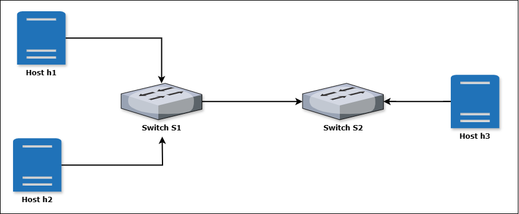
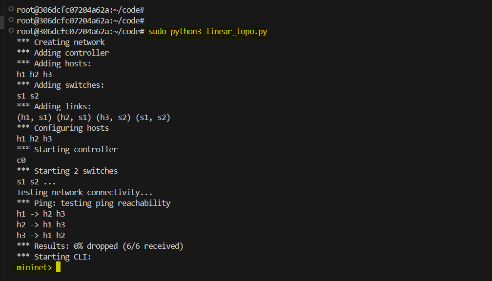
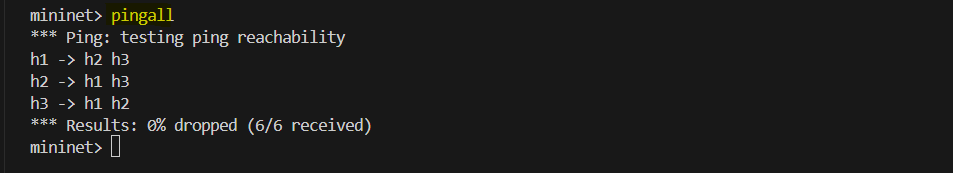
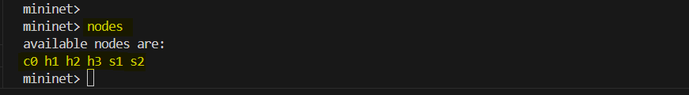
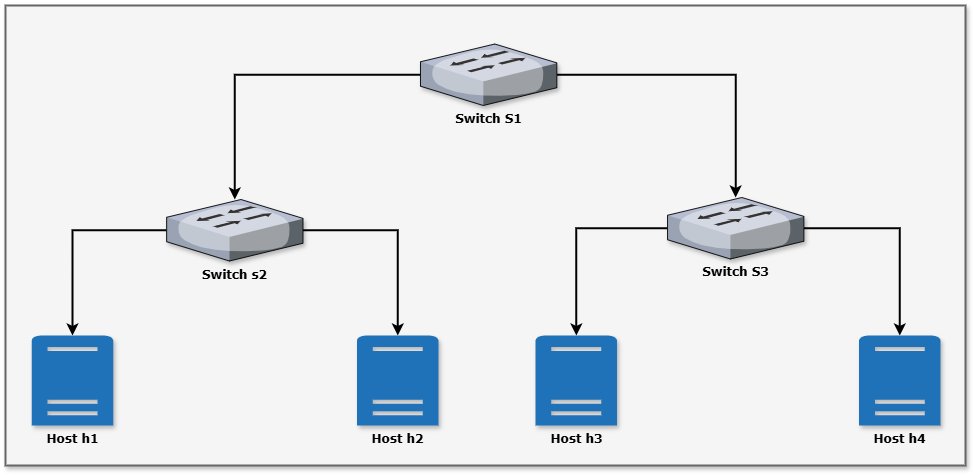
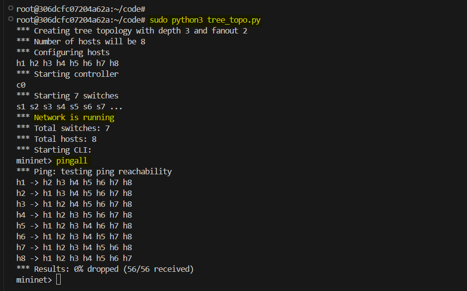

# **Mininet: Network Topologies**

Mininet is a powerful tool for network simulation, enabling developers to create, test, and debug network configurations in a virtual environment. In this lab, we will create Network Topologies and perform network testing and debugging.

## **1. Network Topologies**

A network topology is a graphical representation of the network architecture, including the physical and logical connections between devices. Custom topologies allow users to design specific network layouts for testing or research purposes. **Mininet's Python API** provides extensive flexibility to define hosts, switches, controllers, and links.

### **Key Components of Network Topologies**

**1. Hosts**:

Hosts represent end devices (like computers or IoT devices). They can send or receive traffic. They are assigned an IP address and MAC address in Mininet.

**2. Switches**:

Switcher are network devices that simulate Layer 2 devices `(e.g., Open vSwitch)`. They forward packets between hosts or other switches. They work with a controller to handle traffic intelligently.

**3. Controllers**:

Controllers manage the flow of packets through switches using protocols like OpenFlow. They can be local (Mininet’s default `Controller`) or remote (e.g., an external SDN controller like `ONOS` or `Ryu`).

**4. Links**:

Links define the connections between nodes. They support custom parameters like bandwidth, delay, and packet loss. They are used to create the network topology.


### **Types of Topologies**

Mininet supports pre-defined topologies, but custom topologies provide flexibility to simulate any network structure.

#### **Pre-Defined Topologies**:
- **Single**: A single switch connected to multiple hosts.
- **Linear**: Switches connected in a line.
- **Tree**: A hierarchical structure of switches and hosts.
- **Minimal**: The simplest topology with one switch and two hosts.

#### **Custom Topologies**:

Custom Topologies can represent:

- Complex graphs (e.g., mesh, ring, star).
- Real-world network layouts (e.g., a campus or data center).

## **Hands-On Implementation of Network Topologies**

### **Pre-requisites**:

- Mininet installed
- Python 3 installed

Install Mininet: (If not already installed)

```bash
sudo apt-get update
sudo apt-get install mininet
```

### **1. Linear Topology**

Linear Topology is a simple topology where switches are connected in a straight line. Each switch is connected to the next one in the sequence. Hosts are connected to the switches.



In this example, we will create a linear topology with 3 hosts and 2 switches.

```python
from mininet.topo import Topo
from mininet.net import Mininet
from mininet.node import Controller
from mininet.cli import CLI
from mininet.log import setLogLevel

class CustomTopo(Topo):
    def build(self):
        # Add hosts
        h1 = self.addHost('h1')
        h2 = self.addHost('h2')
        h3 = self.addHost('h3')

        # Add switches
        s1 = self.addSwitch('s1')
        s2 = self.addSwitch('s2')

        # Add links with parameters
        self.addLink(h1, s1, bw=10, delay='5ms', loss=1)
        self.addLink(h2, s1, bw=20)
        self.addLink(s1, s2, bw=15, delay='10ms')
        self.addLink(h3, s2, bw=10)

def run():
    topo = CustomTopo()
    net = Mininet(topo=topo, controller=Controller)
    net.start()

    # Test connectivity
    print("Testing network connectivity...")
    net.pingAll()

    # Open CLI for further testing
    CLI(net)

    net.stop()

if __name__ == '__main__':
    setLogLevel('info')  # Enable Mininet logs
    run()
```

#### **Steps to Execute**

1. Save the script as `linear_topology.py`.
2. Run the script:
   ```bash
   sudo python3 linear_topology.py
   ```

   


3. Inside the CLI:
   - Use `pingall` to test connectivity.

        

   - Use `nodes` to view the nodes in the topology.

        

### **2. Tree Topology**

Now, we will create a tree topology with 3 switches and 4 hosts. The tree topology follows a hierarchical structure where switches are connected in levels, and hosts are connected to the switches at the lowest level.




#### **Topology with Depth 3 and Fanout 2**

- **Root switch**: `s1`.
- **Intermediate switches**: `s2`, `s3`.
- **Hosts**: `h1`, `h2`, `h3`, `h4`.

### **Python Script for Tree Topology**

This python script creates a tree topology with 3 switches and 4 hosts.

```python
from mininet.net import Mininet
from mininet.node import Controller, OVSSwitch
from mininet.cli import CLI
from mininet.log import setLogLevel, info

def createTreeTopo(depth=3, fanout=2):
    # Create an empty network with default controller
    net = Mininet(controller=Controller, switch=OVSSwitch)
    
    # Add controller to the network
    c0 = net.addController('c0')
    
    # Dictionary to store switches at each level
    switches = {}
    
    # Create switches for each level
    switch_count = 1
    for level in range(depth):
        switches[level] = []
        # Number of switches at this level = fanout^level
        num_switches_at_level = fanout ** level
        
        for i in range(num_switches_at_level):
            switch = net.addSwitch(f's{switch_count}')
            switches[level].append(switch)
            switch_count += 1
    
    # Connect switches between levels
    for level in range(depth-1):
        for i, parent_switch in enumerate(switches[level]):
            # Calculate children indices
            child_start_idx = i * fanout
            child_end_idx = child_start_idx + fanout
            
            # Connect parent to its children
            for child_switch in switches[level+1][child_start_idx:child_end_idx]:
                net.addLink(parent_switch, child_switch)
    
    # Add hosts to the lowest level switches
    host_count = 1
    for switch in switches[depth-1]:
        # Add fanout number of hosts to each leaf switch
        for _ in range(fanout):
            host = net.addHost(f'h{host_count}')
            net.addLink(switch, host)
            host_count += 1
    
    return net

def main():
    # Set log level for debugging
    setLogLevel('info')
    
    # Create network with specified depth and fanout
    depth = 3  # Can be changed to any value
    fanout = 2  # Can be changed to any value
    
    info(f'*** Creating tree topology with depth {depth} and fanout {fanout}\n')
    info(f'*** Number of hosts will be {fanout ** depth}\n')
    
    net = createTreeTopo(depth, fanout)
    
    # Start network
    net.start()
    
    # Print basic network info
    info('*** Network is running\n')
    info(f'*** Total switches: {len(net.switches)}\n')
    info(f'*** Total hosts: {len(net.hosts)}\n')
    
    # Start CLI
    CLI(net)
    
    # Stop network
    net.stop()

if __name__ == '__main__':
    main()
```

In this code, first we have created an empty network with default controller. Then we added controller to the network. Then we created switches at each level and connect them to their parent. Then we added hosts to the lowest level switches.


### **Run the Script**

1. Save the script as `tree_topology.py`.
2. Run it using:
   ```bash
   sudo python3 tree_topology.py
   ```
3. Test connectivity and interact with the network in the Mininet CLI.

    ```sh
    pingall
    ```

    

This script allows flexible creation of tree topologies, making it ideal for hierarchical network testing.


## **Conclusion**

In this lab, we have created two network topologies using Mininet. We have created a linear topology with 3 hosts and 2 switches and a tree topology with 3 switches and 4 hosts. We have also tested the connectivity of the networks and interacted with the networks using the Mininet CLI.


