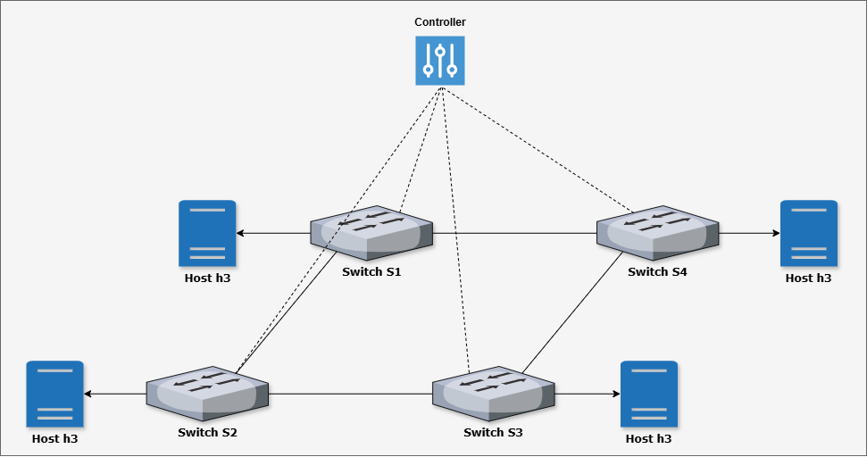

# **Mininet: Custom Network Topologies**




```python
from mininet.topo import Topo
from mininet.net import Mininet
from mininet.node import CPULimitedHost
from mininet.link import TCLink
from mininet.util import dumpNodeConnections
from mininet.log import setLogLevel
from mininet.cli import CLI
from mininet.node import Controller

class MeshNetworkTopo(Topo):
    "Create a mesh network topology"
    
    def build(self, n=4):
        # Initialize topology
        # n: number of hosts/switches in the mesh network
        
        # Add switches
        switches = []
        for s in range(n):
            switch = self.addSwitch(f's{s+1}')
            switches.append(switch)
            
        # Add hosts and create connections to corresponding switches
        hosts = []
        for h in range(n):
            # Add hosts with specific IP addresses
            host = self.addHost(f'h{h+1}', 
                              ip=f'10.0.0.{h+1}/24',
                              mac=f'00:00:00:00:00:0{h+1}')
            hosts.append(host)
            # Connect each host to its corresponding switch
            self.addLink(hosts[h], switches[h])
        
        # Create mesh connections between switches
        for i in range(n):
            for j in range(i + 1, n):
                self.addLink(switches[i], switches[j])

def setupNetwork():
    "Create and test the mesh network with default controller"
    
    # Create topology with 4 hosts/switches
    topo = MeshNetworkTopo(n=4)
    
    # Create network with default controller
    net = Mininet(
        topo=topo,
        host=CPULimitedHost,
        link=TCLink,
        controller=Controller
    )
    
    # Start network
    net.start()
    
    # Dump host connections
    print("\nDumping host connections")
    dumpNodeConnections(net.hosts)
    
    # Testing network connectivity
    print("\nTesting network connectivity")
    net.pingAll()
    
    # Start CLI
    CLI(net)
    
    # Stop network
    net.stop()

if __name__ == '__main__':
    # Tell mininet to print useful information
    setLogLevel('info')
    setupNetwork()
```
