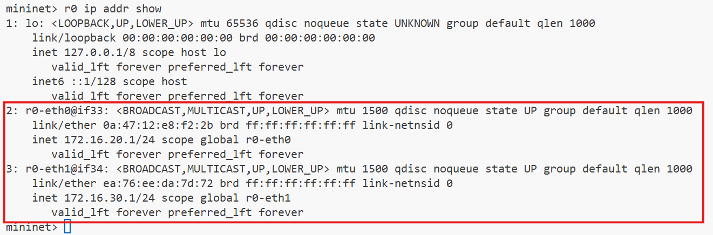
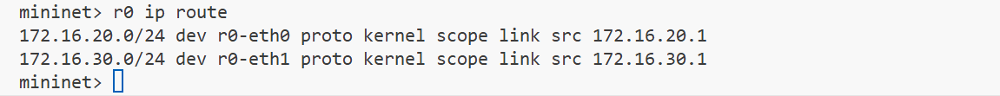
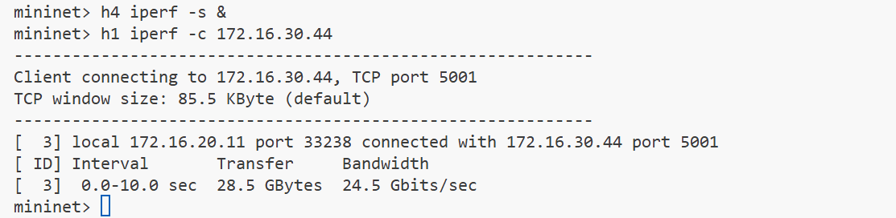
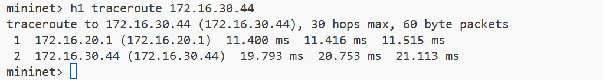

# Two-Subnet Network Topology with Routing using Mininet

This lab demonstrates how to create a network with two subnets (172.16.20.x and 172.16.30.x) connected by a router using Mininet. Each subnet contains three hosts connected through a switch.

## Prerequisites
- Linux system with Mininet installed
- Python 3.x
- Root/sudo privileges
- Basic understanding of networking concepts
- tcproute installed

For requirements:

```bash
sudo apt update
sudo apt-get install -y mininet
sudo apt-get install -y tcproute
```
## Network Topology


- `Network 1`: 172.16.20.0/24
  - `Host 1`: 172.16.20.11
  - `Host 2`: 172.16.20.22
  - `Host 3`: 172.16.20.33
- `Network 2`: 172.16.30.0/24
  - `Host 1`: 172.16.30.44
  - `Host 2`: 172.16.30.55
  - `Host 3`: 172.16.30.66

## Lab Implementation

### Step 1: Create the Python Script
Create a new file named `two_subnet_network.py` with the following content:

```python
#!/usr/bin/python3

from mininet.net import Mininet
from mininet.node import Controller, OVSSwitch
from mininet.cli import CLI
from mininet.log import setLogLevel, info
from mininet.link import TCLink

def createNetwork():
    # Initialize Mininet
    net = Mininet(controller=Controller, switch=OVSSwitch, link=TCLink)

    # Add controller
    info('*** Adding controller\n')
    net.addController('c0')

    # Add switches
    info('*** Adding switches\n')
    s1 = net.addSwitch('s1')
    s2 = net.addSwitch('s2')

    # Add router (implemented as a host)
    info('*** Adding router\n')
    router = net.addHost('r0')

    # Add hosts for subnet 1 (172.16.20.x)
    info('*** Adding hosts for subnet 1\n')
    h1 = net.addHost('h1', ip='172.16.20.11/24', defaultRoute='via 172.16.20.1')
    h2 = net.addHost('h2', ip='172.16.20.22/24', defaultRoute='via 172.16.20.1')
    h3 = net.addHost('h3', ip='172.16.20.33/24', defaultRoute='via 172.16.20.1')

    # Add hosts for subnet 2 (172.16.30.x)
    info('*** Adding hosts for subnet 2\n')
    h4 = net.addHost('h4', ip='172.16.30.44/24', defaultRoute='via 172.16.30.1')
    h5 = net.addHost('h5', ip='172.16.30.55/24', defaultRoute='via 172.16.30.1')
    h6 = net.addHost('h6', ip='172.16.30.66/24', defaultRoute='via 172.16.30.1')

    # Add links
    info('*** Creating links\n')
    # Connect hosts to switches
    net.addLink(h1, s1)
    net.addLink(h2, s1)
    net.addLink(h3, s1)
    net.addLink(h4, s2)
    net.addLink(h5, s2)
    net.addLink(h6, s2)

    # Connect switches to router
    net.addLink(s1, router)
    net.addLink(s2, router)

    # Start network
    info('*** Starting network\n')
    net.start()

    # Configure router
    info('*** Configuring router\n')
    # Enable IP forwarding
    router.cmd('sysctl net.ipv4.ip_forward=1')
    
    # Configure router interfaces
    router.cmd('ip addr flush dev r0-eth0')
    router.cmd('ip addr flush dev r0-eth1')
    router.cmd('ip addr add 172.16.20.1/24 dev r0-eth0')
    router.cmd('ip addr add 172.16.30.1/24 dev r0-eth1')
    
    # Add static routes if needed
    router.cmd('ip route add 172.16.20.0/24 dev r0-eth0')
    router.cmd('ip route add 172.16.30.0/24 dev r0-eth1')

    # Start CLI
    CLI(net)

    # Clean up
    net.stop()

if __name__ == '__main__':
    setLogLevel('info')
    createNetwork()
```

The code creates a virtual network using Mininet with two separate subnets (`172.16.20.0/24` and `172.16.30.0/24`) connected by a router. It starts by importing necessary Mininet components and initializes a network with an OpenFlow controller (`c0`) and two Open vSwitches (`s1` and `s2`). Each subnet contains three hosts with specific IP addresses, and all hosts are connected to their respective switches.

The key part is how the router is implemented. Since Mininet doesn't have a dedicated router class, the code creates a Linux host (`r0`) to act as a router. The router is configured by enabling IP forwarding (`sysctl net.ipv4.ip_forward=1`) and setting up its interfaces (`r0-eth0` and `r0-eth1`) with appropriate IP addresses (`172.16.20.1/24` and `172.16.30.1/24`) to serve as default gateways for each subnet. Static routes are added to ensure proper packet forwarding between the subnets. The network is then started, and a command-line interface (CLI) is provided for interaction and testing.


When traffic needs to flow between subnets (e.g., from `172.16.20.11` to `172.16.30.44`), it first goes to the host's default gateway (the router interface for that subnet), gets processed by the router (which knows how to reach the other subnet through its static routes), and then is forwarded to the destination subnet and ultimately to the target host. The OpenFlow controller manages the switches' behavior, while the TCLink enables the possibility of implementing traffic control features like bandwidth limits or delays.

### Step 2: Set Up the Lab Environment

1. Save the script and make it executable:
    ```bash
    chmod +x two_subnet_network.py
    ```

2. Run the script with sudo privileges:
    ```bash
    sudo python3 two_subnet_network.py
    ```

## Verification Steps

### 1. Basic Connectivity Tests

From the Mininet CLI, perform the following tests:

a. Test connectivity within subnet 1:
```bash
mininet> h1 ping h2
mininet> h2 ping h3
```

b. Test connectivity within subnet 2:
```bash
mininet> h4 ping h5
mininet> h5 ping h6
```

c. Test cross-subnet connectivity:
```bash
mininet> h1 ping h4
mininet> h3 ping h6
```

### 2. Network Interface Verification

a. Check router interfaces:
```bash
mininet> r0 ip addr show
```
Expected output should show two interfaces with IP addresses 172.16.20.1 and 172.16.30.1.



b. Check host configurations:
```bash
mininet> h1 ip addr show
mininet> h4 ip addr show
```

### 3. Routing Table Verification

a. Check router routing table:
```bash
mininet> r0 ip route
```



b. Check host routing tables:
```bash
mininet> h1 ip route
mininet> h4 ip route
```

### 4. Advanced Tests

a. Test TCP connectivity using iperf:
```bash
mininet> h4 iperf -s &
mininet> h1 iperf -c 172.16.30.44
```



b. Traceroute between subnets:
```bash
mininet> h1 traceroute 172.16.30.44
```



## Expected Results

1. Ping tests should show successful communication with round-trip times typically less than 1ms
2. Router interfaces should show correct IP configurations
3. Routing tables should show appropriate routes for both subnets
4. Traceroute should show the path through the router (2 hops)

## Troubleshooting

1. If pings fail:
   - Check router interface configuration using `ip addr show`
   - Verify IP forwarding is enabled with `sysctl net.ipv4.ip_forward`
   - Check host default gateway settings
   - Check switch connectivity with `ovs-ofctl show s1`

2. If router interfaces aren't configured correctly:
   - Manually configure using commands in the CLI:
   ```bash
   mininet> r0 ip addr add 172.16.20.1/24 dev r0-eth0
   mininet> r0 ip addr add 172.16.30.1/24 dev r0-eth1
   ```

3. If IP forwarding isn't working:
   - Manually enable it:
   ```bash
   mininet> r0 sysctl net.ipv4.ip_forward=1
   ```

4. If routes are missing:
   ```bash
   mininet> r0 ip route add 172.16.20.0/24 dev r0-eth0
   mininet> r0 ip route add 172.16.30.0/24 dev r0-eth1
   ```

## Clean Up

1. Exit the Mininet CLI:
```bash
mininet> exit
```

2. Clean up Mininet:
```bash
sudo mn -c
```

## Additional Exercises

1. Add bandwidth limits to the links:
```python
# Modify link creation with bandwidth parameter (in Mbps)
net.addLink(s1, router, bw=10)
net.addLink(s2, router, bw=10)
```

2. Add delay to the links:
```python
# Add delay parameter (in ms)
net.addLink(s1, router, delay='10ms')
```

3. Implement access control using iptables:
```bash
mininet> r0 iptables -A FORWARD -s 172.16.20.0/24 -d 172.16.30.0/24 -j ACCEPT
mininet> r0 iptables -A FORWARD -s 172.16.30.0/24 -d 172.16.20.0/24 -j ACCEPT
```

