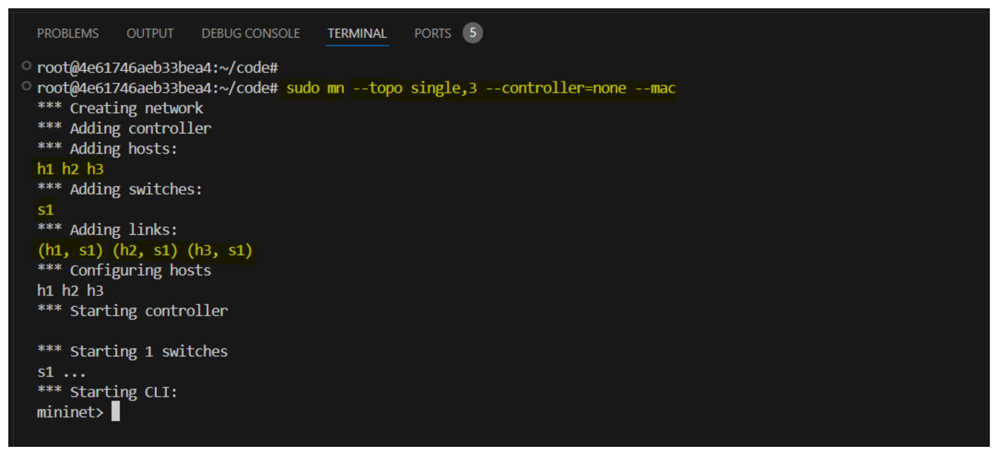

## **Lab: Configuring a NAT Gateway in Mininet**

### **Objective**
The goal of this lab is to **simulate a NAT (Network Address Translation) Gateway using Mininet**. A NAT Gateway allows hosts in a **private subnet** to access the internet while blocking inbound traffic from external sources. This is commonly used in cloud and enterprise networks to protect internal resources while still allowing them to communicate with external services.

---

## **Prerequisites**
Before starting, ensure you have the following installed on your system:

1. **Mininet** – A network emulator to create virtual networks.  
   Install Mininet using:
   ```bash
   sudo apt update
   sudo apt install mininet -y
   ```
2. **iptables** – A firewall utility for managing NAT and packet filtering rules.  
   Install it using:
   ```bash
   sudo apt install iptables -y
   ```
3. **DNS Resolver** – To allow internal hosts to resolve domain names, install `dnsmasq`:
   ```bash
   sudo apt install dnsmasq -y
   ```
4. **Internet Connection** – Required for testing external access.

---

## **Understanding NAT Gateway**

### **What is a NAT Gateway?**
A **NAT (Network Address Translation) Gateway** is a device or virtual instance that allows **outbound traffic from private instances to the internet** while preventing inbound connections from external networks.

### **Why Do We Need a NAT Gateway?**
- **Security**: Blocks incoming traffic from the internet, preventing direct access to private resources.
- **Internet Access for Private Networks**: Allows internal machines (private subnet) to communicate with the internet.
- **IP Address Conservation**: Uses a single public IP address for multiple private hosts, reducing the need for multiple public IPs.

---

## **Network Topology**
We will simulate the following topology in Mininet:

```
    [h1] --- [ NAT Router ] --- [ Internet (eth0) ]
    [h2] ---/
```
- `h1` and `h2` are private hosts that need internet access.
- The `NAT Router` will act as the NAT Gateway.
- `eth0` is the interface connected to the real internet.

---

## **Step-by-Step Guide to Configuring NAT Gateway in Mininet**

### **Step 1: Start Mininet and Create the Network**
Launch Mininet with the following command to create a **simple topology** with two hosts and a NAT router:

```bash
sudo mn --topo single,3 --controller=none --mac
```
- `--topo single,3` creates a network with **one switch** and **three nodes** (one NAT router and two hosts).
- `--controller=none` disables the default controller.
- `--mac` assigns MAC addresses automatically.



Once inside the Mininet CLI, rename nodes for clarity:

```bash
xterm h1 h2 s1
```
This will open terminal windows for `h1`, `h2`, and the switch (`s1`).

---

### **Step 2: Configure Network Interfaces**
Assign IP addresses to the NAT Router:

```bash
sudo ifconfig s1-eth1 192.168.1.1/24 up  # NAT interface to private subnet
sudo ifconfig s1-eth2 up                 # NAT interface to public network
```
Assign private IPs to `h1` and `h2`:

```bash
h1 ifconfig h1-eth0 192.168.1.100/24 up
h2 ifconfig h2-eth0 192.168.1.101/24 up
```
Set the default gateway for the hosts:

```bash
h1 route add default gw 192.168.1.1
h2 route add default gw 192.168.1.1
```

---

### **Step 3: Enable NAT on the Router**
Now, configure `s1` (acting as the NAT Router) to forward packets:

```bash
echo 1 > /proc/sys/net/ipv4/ip_forward
```
This enables **IP forwarding**, allowing traffic to pass through the router.

---

### **Step 4: Configure NAT with iptables**
Use `iptables` to perform NAT, masquerading private IPs:

```bash
sudo iptables -t nat -A POSTROUTING -o eth0 -j MASQUERADE
```
- `-t nat` selects the **NAT table**.
- `-A POSTROUTING` applies rules after routing.
- `-o eth0` matches packets leaving the **public interface**.
- `-j MASQUERADE` replaces the **private source IP** with the **public IP**.

Allow traffic from the private subnet:

```bash
sudo iptables -A FORWARD -i s1-eth1 -o eth0 -j ACCEPT
sudo iptables -A FORWARD -i eth0 -o s1-eth1 -m state --state RELATED,ESTABLISHED -j ACCEPT
```
- The first rule **allows outgoing traffic**.
- The second rule **allows return traffic** for established connections.

---

### **Step 5: Test Internet Connectivity**
On `h1` or `h2`, test connectivity to an external server (e.g., Google’s public DNS):

```bash
h1 ping 8.8.8.8
```
If successful, it means NAT is working.

---

### **Step 6: Configure DNS for Domain Name Resolution**
Install and configure `dnsmasq` to provide DNS resolution:

```bash
sudo apt install dnsmasq -y
sudo systemctl start dnsmasq
```
Edit the `dnsmasq` config file:

```bash
sudo nano /etc/dnsmasq.conf
```
Add:
```
server=8.8.8.8
```
Restart the service:

```bash
sudo systemctl restart dnsmasq
```
Now, test domain resolution:

```bash
h1 ping google.com
```

---

### **Step 7: Block Inbound Traffic from External Networks**
To ensure the NAT Gateway only allows outbound traffic and blocks incoming traffic, add the following rule:

```bash
sudo iptables -A INPUT -i eth0 -m state --state NEW -j DROP
```
This **blocks all new incoming connections** while allowing responses to existing connections.

---

## **Conclusion**
In this lab, we:
✅ **Created a Mininet network** with private hosts and a NAT router.  
✅ **Configured IP addresses and routing** for private subnet hosts.  
✅ **Enabled NAT using iptables** to allow outbound internet access.  
✅ **Verified connectivity** using `ping`.  
✅ **Blocked inbound traffic** for security.

This setup mimics a real-world NAT Gateway, commonly used in **AWS, GCP, and enterprise networks** to allow private instances to access external services securely.

Would you like to extend this lab with **firewall rules** or **load balancing**? 🚀