# Kubernetes log collection using Grafana Loki

This lab covers the setup and configuration for collecting Kubernetes logs using Grafana Loki. Loki, paired with Promtail and Grafana, provides an efficient solution for aggregating and visualizing logs from Kubernetes clusters. This documentation will guide you through deploying Loki, Promtail, and Grafana in your Kubernetes environment, configuring them to capture logs, and using Grafana for log analysis.


---

## **Overview**

- **Loki**: A log aggregation system designed for simplicity and scalability. Unlike traditional log systems, Loki doesn’t index full logs but relies on a unique approach using labels, which is both cost-effective and fast.
- **Promtail**: A log collector that works as a daemon on each Kubernetes node. It forwards logs from each pod to Loki.
- **Grafana**: A visualization tool that integrates with Loki to provide dashboards for log analysis.

---


## Environment Overview

We will require a kubernetes cluster with one master node and atleast one worker node. To create this kubernetes cluster, we will use three AWS ec2 instances and for kubernetes cluster we will setup `k3s`.


## Create AWS Infrastructure

**1. Configure AWS CLI**

```sh
aws configure
```


**2. Create a Directory for Your Infrastructure**

```sh
mkdir loki-infra
cd loki-infra
```

**3. Install Python venv**

```sh
sudo apt update
sudo apt install python3.8-venv -y
```

**4. Create a New Pulumi Project**

```sh
pulumi new aws-python
```


**5. Update the `main.py` file:**

```python
import pulumi
import pulumi_aws as aws
import os

# Create a VPC
vpc = aws.ec2.Vpc(
    'kubernetes-vpc',
    cidr_block='10.0.0.0/16',
    enable_dns_support=True,
    enable_dns_hostnames=True,
    tags={'Name': 'kubernetes'}
)

# Create a subnet
subnet = aws.ec2.Subnet(
    'kubernetes-subnet',
    vpc_id=vpc.id,
    cidr_block='10.0.1.0/24',
    map_public_ip_on_launch=True,
    tags={'Name': 'kubernetes'}
)

# Create an Internet Gateway
internet_gateway = aws.ec2.InternetGateway(
    'kubernetes-internet-gateway',
    vpc_id=vpc.id,
    tags={'Name': 'kubernetes'}
)

# Create a Route Table
route_table = aws.ec2.RouteTable(
    'kubernetes-route-table',
    vpc_id=vpc.id,
    routes=[
        aws.ec2.RouteTableRouteArgs(
            cidr_block='0.0.0.0/0',
            gateway_id=internet_gateway.id,
        )
    ],
    tags={'Name': 'kubernetes'}
)

# Associate the route table with the subnet
route_table_association = aws.ec2.RouteTableAssociation(
    'kubernetes-route-table-association',
    subnet_id=subnet.id,
    route_table_id=route_table.id
)

# Create a security group with egress and ingress rules
security_group = aws.ec2.SecurityGroup(
    'kubernetes-security-group',
    vpc_id=vpc.id,
    description="Kubernetes security group",
    ingress=[
        aws.ec2.SecurityGroupIngressArgs(
            protocol='-1',
            from_port=0,
            to_port=0,
            cidr_blocks=['0.0.0.0/0'],
        ),
        aws.ec2.SecurityGroupIngressArgs(
            protocol='tcp',
            from_port=22,
            to_port=22,
            cidr_blocks=['0.0.0.0/0'],
        ),
        aws.ec2.SecurityGroupIngressArgs(
            protocol='tcp',
            from_port=6443,
            to_port=6443,
            cidr_blocks=['0.0.0.0/0'],
        ),
        aws.ec2.SecurityGroupIngressArgs(
            protocol='tcp',
            from_port=443,
            to_port=443,
            cidr_blocks=['0.0.0.0/0'],
        ),
        aws.ec2.SecurityGroupIngressArgs(
            protocol='icmp',
            from_port=-1,
            to_port=-1,
            cidr_blocks=['0.0.0.0/0'],
        ),
    ],
    egress=[
        aws.ec2.SecurityGroupEgressArgs(
            protocol='-1',  # -1 allows all protocols
            from_port=0,
            to_port=0,
            cidr_blocks=['0.0.0.0/0'],  # Allow all outbound traffic
        )
    ],
    tags={'Name': 'kubernetes'}
)

# Create EC2 Instances for Controllers
controller_instances = []
for i in range(1):
    controller = aws.ec2.Instance(
        f'controller-{i}',
        instance_type='t2.small',
        ami='ami-01811d4912b4ccb26',  # Update with correct Ubuntu AMI ID
        subnet_id=subnet.id,
        key_name="loki",
        vpc_security_group_ids=[security_group.id],
        associate_public_ip_address=True,
        private_ip=f'10.0.1.1{i}',
        tags={
            'Name': f'controller-{i}'
        }
    )
    controller_instances.append(controller)

# Create EC2 Instances for Workers
worker_instances = []
for i in range(2):
    worker = aws.ec2.Instance(
        f'worker-{i}',
        instance_type='t2.small',
        ami='ami-01811d4912b4ccb26',  # Update with correct Ubuntu AMI ID
        subnet_id=subnet.id,
        key_name="loki",
        vpc_security_group_ids=[security_group.id],
        associate_public_ip_address=True,
        private_ip=f'10.0.1.2{i}',
        tags={'Name': f'worker-{i}'}
    )
    worker_instances.append(worker)

# Export Public and Private IPs of Controller and Worker Instances
controller_public_ips = [controller.public_ip for controller in controller_instances]
controller_private_ips = [controller.private_ip for controller in controller_instances]
worker_public_ips = [worker.public_ip for worker in worker_instances]
worker_private_ips = [worker.private_ip for worker in worker_instances]

pulumi.export('controller_public_ips', controller_public_ips)
pulumi.export('controller_private_ips', controller_private_ips)
pulumi.export('worker_public_ips', worker_public_ips)
pulumi.export('worker_private_ips', worker_private_ips)

# Export the VPC ID and Subnet ID for reference
pulumi.export('vpc_id', vpc.id)
pulumi.export('subnet_id', subnet.id)

# create config file
def create_config_file(ip_list):
    # Define the hostnames for each IP address
    hostnames = ['controller-0', 'worker-0', 'worker-1']
    
    config_content = ""
    
    # Iterate over IP addresses and corresponding hostnames
    for hostname, ip in zip(hostnames, ip_list):
        config_content += f"Host {hostname}\n"
        config_content += f"    HostName {ip}\n"
        config_content += f"    User ubuntu\n"
        config_content += f"    IdentityFile ~/.ssh/loki.id_rsa\n\n"
    
    # Write the content to the SSH config file
    config_path = os.path.expanduser("~/.ssh/config")
    with open(config_path, "w") as config_file:
        config_file.write(config_content)

# Collect the IPs for all nodes
all_ips = [controller.public_ip for controller in controller_instances] + [worker.public_ip for worker in worker_instances]

# Create the config file with the IPs once the instances are ready
pulumi.Output.all(*all_ips).apply(create_config_file)
```

**6. Generate the key Pair**

```sh
cd ~/.ssh/
aws ec2 create-key-pair --key-name loki --output text --query 'KeyMaterial' > loki.id_rsa
chmod 400 loki.id_rsa
```

**7. Create Infra**

```sh
pulumi up --yes
```


## k3s cluster setup

**1. SSH into the controller-0 instance, which will be considered as the Master Node.**

```bash
ssh controller-0
```

**2. Install k3s using an Installation script**

After SSHing into the controller-0 instance run the folllowing command to install k3s.

```bash
curl -sfL https://get.k3s.io | sh -
```

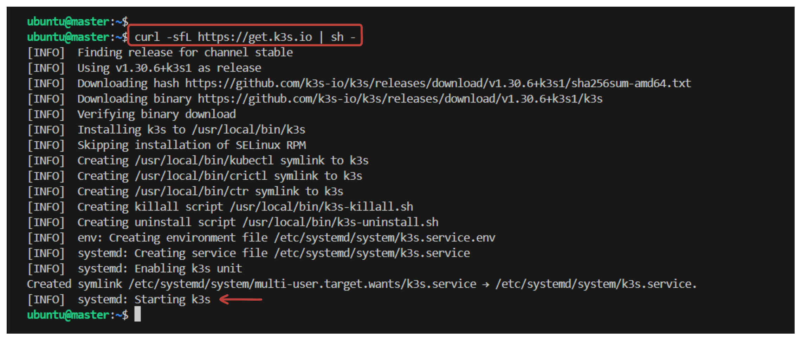

**2. Get the K3S token.**

The value to use for K3S_TOKEN is stored at `/var/lib/rancher/k3s/server/node-token` on your master node. Copy the token.

**3. Now SSH into the worker nodes:**

- Worker-Node-0:

   ```sh
   ssh worker-0
   ```
- Worker-Node-0:

   ```sh
   ssh worker-1
   ```

**4. Add Agent nodes**

To install additional agent nodes and add them to the cluster, run the installation script with the following command:

```bash
curl -sfL https://get.k3s.io | K3S_URL=https://myserver:6443 K3S_TOKEN=mynodetoken sh -
```

> NOTE: Remember to replace the `K3S_URL` with master node PrivateIp and `K3S_TOKEN` token with token copied from the master node.

After running the commands, you have configured a k3s cluster with one master node and two worker node. Run this command to ensure the cluster setup is working fine.

```bash
sudo kubectl get nodes
```

## Install Helm on the Master Node

**Helm**: Used to simplify the deployment of Loki and Grafana. Install Helm:

```bash
curl https://baltocdn.com/helm/signing.asc | gpg --dearmor | sudo tee /usr/share/keyrings/helm.gpg > /dev/null
sudo apt-get install apt-transport-https --yes
echo "deb [arch=$(dpkg --print-architecture) signed-by=/usr/share/keyrings/helm.gpg] https://baltocdn.com/helm/stable/debian/ all main" | sudo tee /etc/apt/sources.list.d/helm-stable-debian.list
sudo apt-get update
sudo apt-get install helm
```

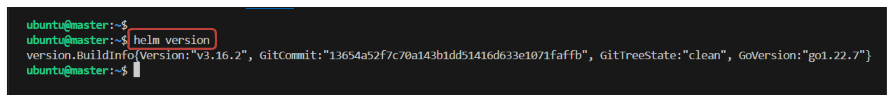


## **Deploying Loki, Promtail, and Grafana**

**1. Add Grafana’s Helm Repository**:

To get Loki, Promtail, and Grafana, add Grafana’s official Helm chart repository.
```bash
helm repo add grafana https://grafana.github.io/helm-charts
helm repo update
```

**2. Explore the Loki Helm Chart Options**:

Check available Loki stack configurations:
```bash
helm search repo loki
```
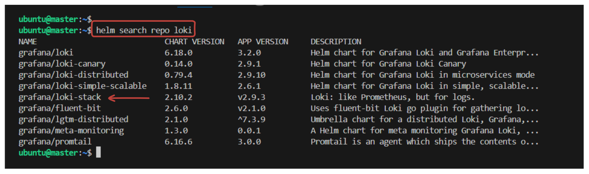

The preferred option for deploying Loki, Promtail, and Grafana is `loki-stack`.

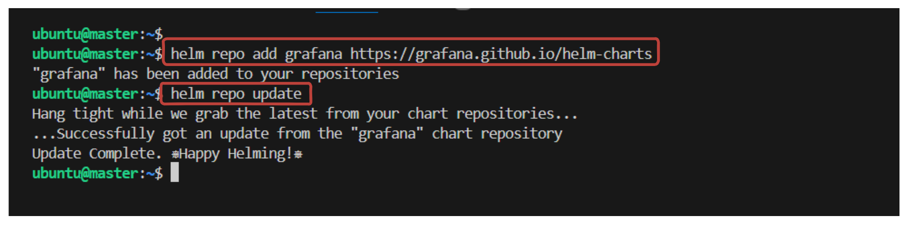

**3. Customize Configuration**:

Before deploying, check and modify Helm chart values to suit your environment by generating a configuration file:
```bash
helm show values grafana/loki-stack > loki-values.yaml
```
**Modifications**:
- Enable Grafana by setting `grafana.enabled` to `true`.
- Set the `grafana.tag` to `latest` for the latest version.


**4. Install Loki Stack**:

Install Loki with Promtail and Grafana:
```bash
helm install loki grafana/loki-stack -f loki-values.yaml
```
After installation, you should see confirmation that Loki Stack is deployed.

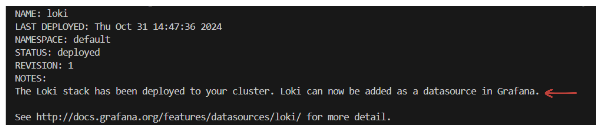

> NOTE: If you face any issue with installing. Try changing the kubeconfig file permission for the `ubuntu` user. 

**5. Verify Deployment**:

Check that the required pods are running:
```bash
sudo kubectl get all
```
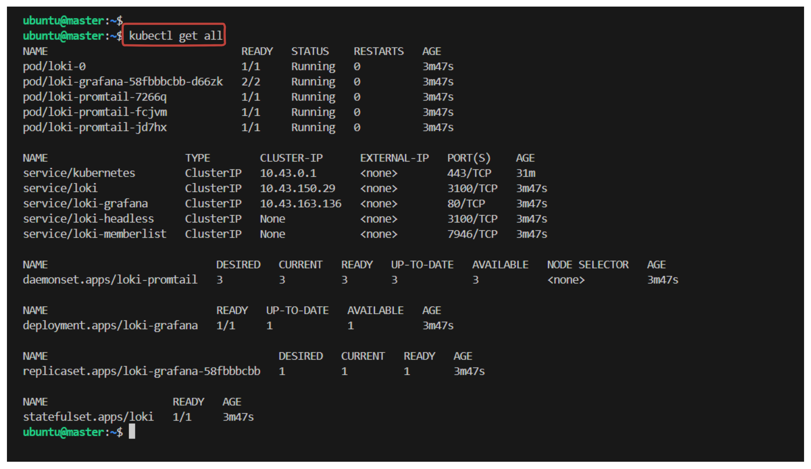

---

## **Configuring Grafana**

### **Access Grafana**:
Since the service type is `ClusterIP`, we can not access it from outside of the kubernetes cluster.
To expose the `loki-grafana` service as a NodePort, follow these steps:

**1. Edit the Service**:

Change the `loki-grafana` service type from `ClusterIP` to `NodePort` to make it accessible from outside the cluster. You can do this by editing the service configuration.

```bash
kubectl edit svc loki-grafana
```

**2. Modify the Type and Set the NodePort**:

In the editor that opens, locate the `spec.type` field and change it to `NodePort`. Then, under the `ports` section, add a `nodePort` field with your desired port (or let Kubernetes assign a random port in the NodePort range if you leave it out).

Here’s an example:
```yaml
spec:
   type: NodePort
   ports:
      - port: 80
      targetPort: 3000
      protocol: TCP
      nodePort: 32000  # Choose a port within the 30000–32767 range
```

**3. Save and Exit**:

Save the changes and exit the editor. Kubernetes will update the service.

**4. Verify the NodePort Service**:

Confirm that the `loki-grafana` service is now using a `NodePort` and check the assigned port:

```bash
kubectl get svc loki-grafana
```

You should see the `loki-grafana` service listed as `NodePort` with the specified port number under `PORT(S)`.

**5. Access Grafana**:
Access Grafana by visiting `http://<node-ip>:<node-port>` in your web browser:

```sh
http://<node-ip>:32000
```

Replace `<node-ip>` with the IP of any node in your cluster.

You get the node-ip using this command:

```sh
kubectl get nodes -o wide
```

This should make Grafana accessible from outside the cluster via the specified NodePort.
   

### **Grafana Credentials**:

Default Grafana username is `admin`. Retrieve the password from the Kubernetes secrets:

```bash
kubectl get secret --namespace <namespace> loki-grafana -o jsonpath="{.data.admin-password}" | base64 --decode ; echo
```
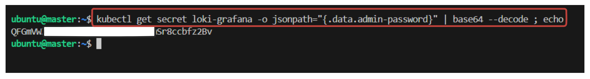

### **Add Loki as a Data Source**:
   Grafana automatically configures Loki as a data source. Verify this in Grafana under `Settings > Data Sources`.

   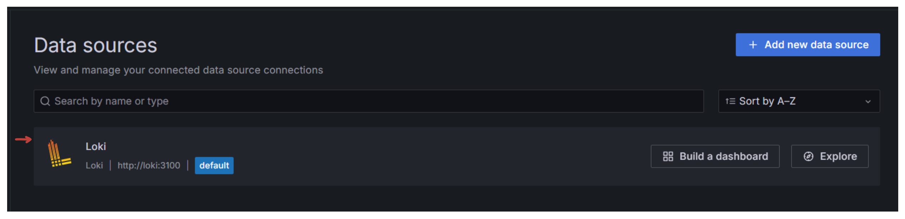

---

## **Log Generator Application**

Here’s a simple log-generating application that can be deployed in Kubernetes. This app will generate **dummy** logs that can be collected by Promtail and viewed in Grafana Loki. The example below is a Python-based application that produces log messages at regular intervals.

### 1. **Application Code** (`app.py`)

Create a directory for example log-application. Then create a file named `app.py` which which will generate log messages with random data.

```python
# app.py
import time
import logging
import random

# Configure logging
logging.basicConfig(level=logging.INFO, format='%(asctime)s - %(levelname)s - %(message)s')
logger = logging.getLogger("SimpleLogApp")

# Function to simulate log messages
def generate_log():
    log_levels = [logging.INFO, logging.WARNING, logging.ERROR]
    messages = [
        "User accessed the home page",
        "Database connection established",
        "Failed to retrieve data",
        "API call received",
        "Service temporarily unavailable",
        "User session expired"
    ]
    while True:
        level = random.choice(log_levels)
        message = random.choice(messages)
        logger.log(level, message)
        time.sleep(2)  # Generate log every 2 seconds

if __name__ == "__main__":
    generate_log()
```

### 2. **Dockerfile**

To run this app in a container, create a `Dockerfile`:

```Dockerfile
# Dockerfile
FROM python:3.8-slim

WORKDIR /app

# Copy the Python script
COPY app.py /app

CMD ["python", "app.py"]
```

### 3. **Build and Push Docker Image**

Build and push the Docker image to a registry (like Docker Hub):

```bash
# Build the Docker image
docker build -t <your-docker-username>/simple-log-app:latest .

# Push the Docker image to Docker Hub
docker push <your-docker-username>/simple-log-app:latest
```

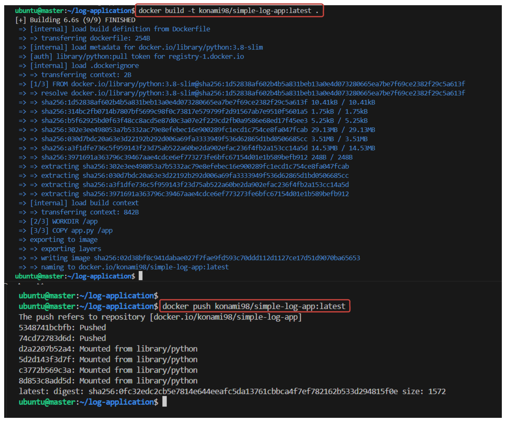

Replace `<your-docker-username>` with your Docker Hub username.

### 4. **Kubernetes Deployment** (`app-deployment.yaml`)

Deploy the application on Kubernetes with the following deployment file:

```yaml
apiVersion: apps/v1
kind: Deployment
metadata:
  name: simple-log-app
spec:
  replicas: 1
  selector:
    matchLabels:
      app: simple-log-app
  template:
    metadata:
      labels:
        app: simple-log-app
    spec:
      containers:
      - name: simple-log-app
        image: <your-docker-username>/simple-log-app:latest
        imagePullPolicy: Always
```

Replace `<your-docker-username>` with your actual Docker Hub username.

### 5. **Deploy the Application**

Use `kubectl` to apply the deployment:

```bash
kubectl apply -f app-deployment.yaml
```

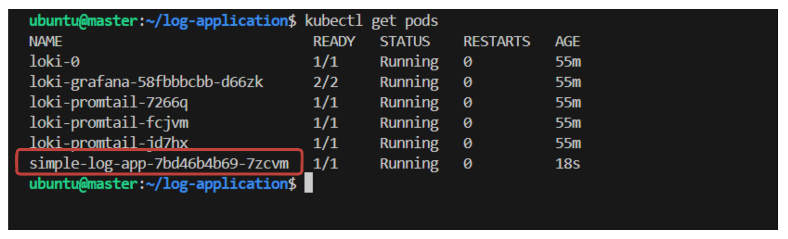


## **Promtail Configurations**:

Promtail collects logs from all pods on each node and forwards them to Loki. Promtail is deployed using a DaemonSet to ensure a Promtail instance on every node.

- **Pipeline Stages**: Promtail pipelines allow custom parsing and label extraction. Modify `promtail.yaml` to create labels for specific log attributes.
- **Example**: To extract HTTP method and status code labels from JSON logs.

1. **Edit Promtail Configuration**:
   Retrieve and modify Promtail configuration from the Helm chart secret:
   ```bash
   kubectl get secret loki-promtail -o jsonpath="{.data.promtail\.yaml}" | base64 --decode > promtail.yaml
   ```

2. **Add Pipeline Stages**:
   In `promtail.yaml`, add the following under `pipeline_stages`:
   ```yaml
   pipeline_stages:
     - match:
         selector: '{app="simple-log-app"}'
         stages:
           - json:
               expressions:
                 method: log.method
                 code: log.code
           - labels:
               method:
               code:
   ```

3. **Apply Changes**:
   Update the Promtail configuration in Kubernetes:

    - Generate the Updated YAML:
    ```bash
    kubectl create secret generic loki-promtail --from-file=promtail.yaml --dry-run=client -o yaml > updated-promtail-secret.yaml
    ```
    - Apply the Update:
    ```bash
    kubectl apply -f updated-promtail-secret.yaml
    ```
    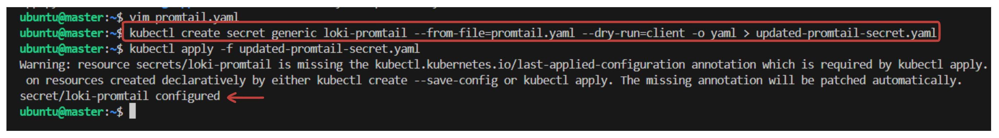

    After updating, restart the Promtail pods to load the new secret.

4. **Check Logs in Grafana**:
   - Go to **Explore** in Grafana.
   - Run a query on the `simple-log-app` pod or app.

   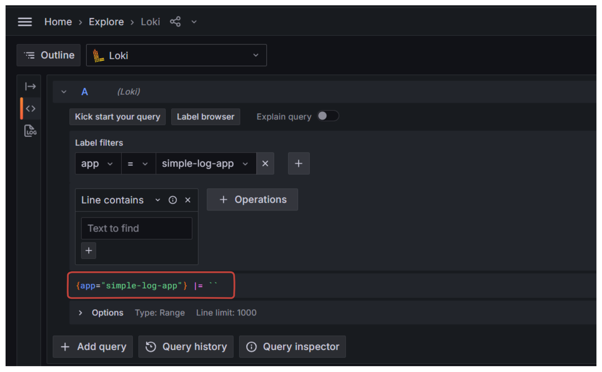

   - You will see the generated logs:

   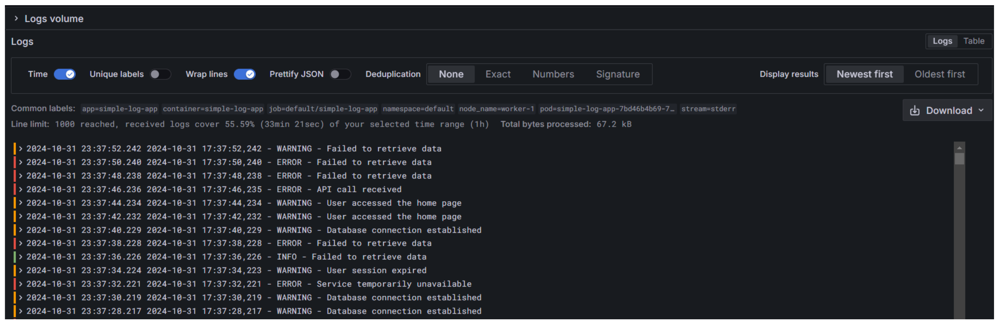
---

## **Conclusion**

With Loki, Promtail, and Grafana deployed on Kubernetes, you have a robust, scalable log aggregation setup that enables efficient log collection and visualization. Promtail's label customization enhances search and filtering, allowing quick insights into application and system logs.