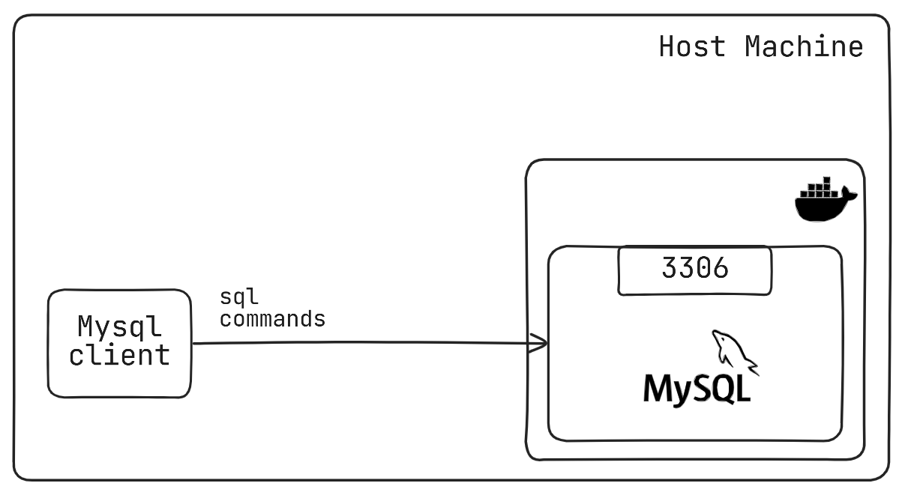
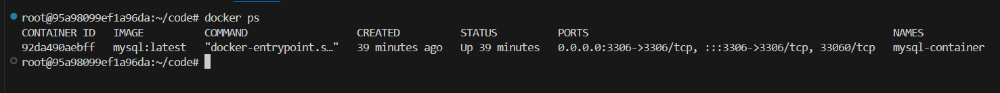
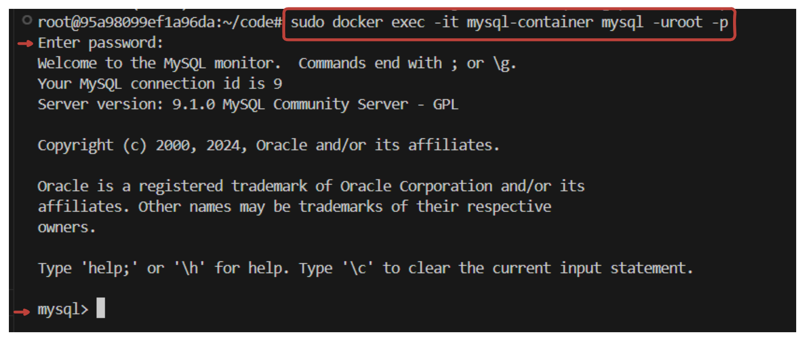
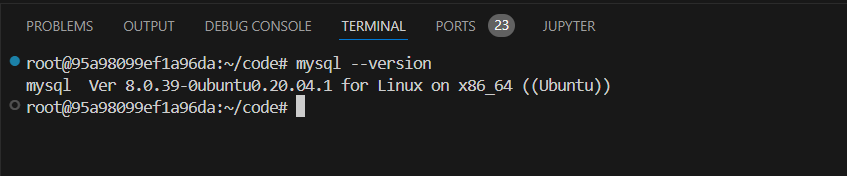
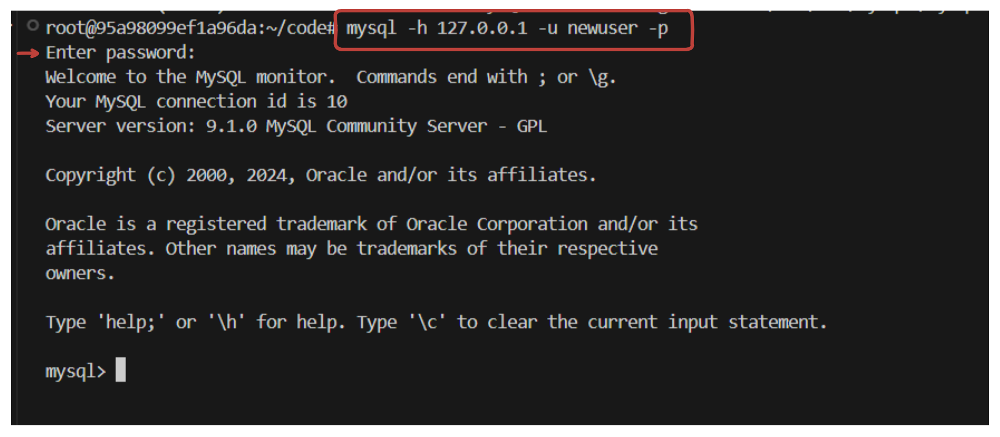
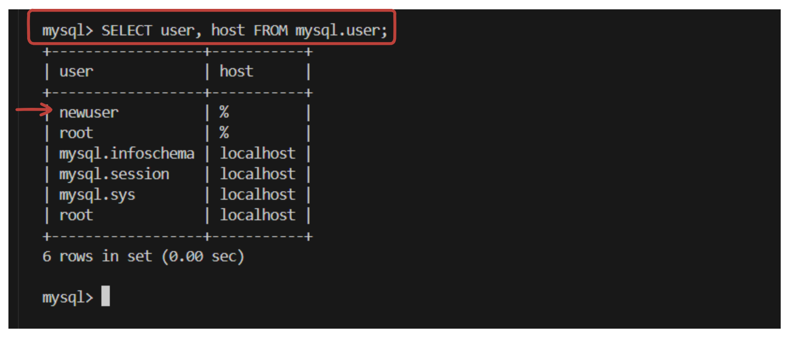

# MySQL Server in Docker: A detailed Overview

This lab will provide a complete walkthrough for setting up a MySQL server in a Docker container, including container configuration, connecting with various tools, and managing user access. With these steps, you’ll learn how to download and run a MySQL Docker image, interact with the server using Telnet and the MySQL client, create new users, and confirm connectivity and permissions.



---

### **Step 1: Download the MySQL Docker Image**

1. **Purpose**: Begin by pulling the latest MySQL image from Docker Hub, which contains the necessary files to run a MySQL server within a container.

   ```bash
   docker pull mysql:latest
   ```
   

2. **Run the Container**: This command starts the MySQL container with the specified root password and maps port 3306 from the container to the host for accessibility.
   
   ```bash
   docker run --name mysql-container -e MYSQL_ROOT_PASSWORD=root -p 3306:3306 -d mysql:latest
   ```
   

3. **Check Container Status:** Run this command to check the Mysql container status.

    ```bash
    docker ps
    ```
    

---

### **Step 2: Install Telnet for Testing Connections**

Telnet is a network tool that lets you connect to ports to test if the MySQL server is accessible.

   **Command:**
   ```bash
   sudo apt-get install telnet
   ```
   

---

### **Step 3: Retrieve Docker Container’s IP Address**

1. **Purpose**: Docker assigns an internal IP address to each container. You can retrieve this address to test connectivity within the Docker network.

   **Command:**
   ```bash
   docker inspect -f '{{range .NetworkSettings.Networks}}{{.IPAddress}}{{end}}' mysql-container
   ```
   Example output: `172.17.0.2`

---

### **Step 4: Test Connectivity to MySQL Server Using Telnet**

1. **Test via Localhost**: Try connecting to the MySQL server on the host's port `3306` (exposed by Docker).

   ```bash
   telnet localhost 3306
   ```

2. **Test Using Container IP**: Connect directly using the Docker container’s IP address.

   ```bash
   telnet 172.17.0.2 3306
   ```
   

---

### **Step 5: Access MySQL Server Inside Docker Container**

1. **Purpose**: Use the MySQL client within the Docker container to log in to the MySQL server and perform administrative tasks.

   **Command:**
   ```bash
   sudo docker exec -it mysql-container mysql -uroot -p
   ```
   This logs in to MySQL as the root user with the specified password.

   

---

### **Step 6: Create a New MySQL User and Grant Permissions**

1. **Purpose**: Establish a new MySQL user with broad permissions, which can be useful for external connections or application integrations.

   **SQL Commands:**
   ```sql
   CREATE USER 'newuser'@'%' IDENTIFIED BY 'newpassword';
   GRANT ALL PRIVILEGES ON *.* TO 'newuser'@'%' WITH GRANT OPTION;
   FLUSH PRIVILEGES;
   ```
   - `CREATE USER`: Defines a new user `newuser`.
   - `GRANT ALL PRIVILEGES`: Provides full access to all databases for this user.
   - `FLUSH PRIVILEGES`: Updates MySQL to recognize the new permissions.

    

---

### **Step 7: Install MySQL Client on the Host Machine**

1. **Purpose**: Install the MySQL client to enable connecting to the MySQL server directly from your host machine.

   **Commands:**
   ```bash
   sudo apt-get update
   sudo apt-get install mysql-client
   ```
   

2. **Verify Installation**: Confirm the client was installed correctly by checking the version.
   
   ```bash
   mysql --version
   ```
   

---

### **Step 8: Connect to MySQL Server Using MySQL Client**

1. **Purpose**: Connect from your host to the MySQL server running in Docker using the new user credentials.

   **Command:**
   ```bash
   mysql -h 127.0.0.1 -u newuser -p
   ```
   - `-h`: Specifies the host (127.0.0.1 for local connections).
   - `-u`: Username (`newuser` created in step 6).
   - `-p`: Password

    

---

### **Step 9: Confirm User Setup in MySQL**

1. **Purpose**: Verify the new user’s creation and its permissions within the MySQL environment.

   **SQL Command:**
   ```sql
   SELECT user, host FROM mysql.user;
   ```
   - This lists all users and their associated hosts.

   
---

### **Summary of Steps**

1. Pulled and ran a MySQL Docker container with port 3306 exposed.
2. Installed Telnet to check connectivity.
3. Retrieved the Docker container's IP address.
4. Tested connections using both localhost and container IP.
5. Accessed the MySQL server within the container.
6. Created a new MySQL user and granted all privileges.
7. Installed the MySQL client on the host and verified the installation.
8. Connected to the MySQL server from the host using the new user.
9. Verified user creation in MySQL.

By following these detailed steps, you can efficiently run and manage a MySQL server within a Docker environment, facilitating smooth database management and user setup.