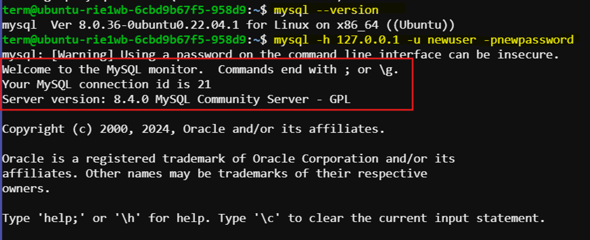

# Working With MySQL container


This guide explains how to set up and interact with a MySQL server running in a Docker container. It covers pulling the MySQL Docker image, running the container, and installing necessary tools like Telnet and the MySQL client. It also details how to access the MySQL server, create a new user, and verify the setup. By following these steps, you can efficiently manage and connect to a MySQL server in a Docker environment.

### **Pull the MySQL Docker Image:**

- **Command:**
    
    ```bash
    docker pull mysql:latest
    ```
    
    
    
    ```bash
    docker run --name mysql-container -e MYSQL_ROOT_PASSWORD=root -p 3306:3306 -d mysql:latest
    ```
    

    

### Install Telnet

- **Command:**
    
    ```bash
    sudo apt-get install telnet
    ```
    
    
    

### Get Docker Container IP Address

- **Command:**
    
    ```bash
    docker inspect -f '{{range .NetworkSettings.Networks}}{{.IPAddress}}{{end}}' mysql-container
    ```
    
    This command retrieves the IP address of a Docker container named `mysql-container`. The output in this case is `172.17.0.2`.
    

### Telnet to MySQL Server on Localhost

- **Command:**
    
    ```bash
    telnet localhost 3306
    ```
    
    This command attempts to connect to the MySQL server running on `localhost` at port `3306` using Telnet. It shows a connection being made but then closed by the foreign host.
    

### Telnet to MySQL Server Using Container IP Address

- **Command:**
    
    ```bash
    telnet 172.17.0.2 3306
    ```
    
    This command attempts to connect to the MySQL server running in the Docker container at IP address `172.17.0.2` on port `3306`. Similar to the previous step, it shows a connection being made but then closed by the foreign host.
    
    Here is the output:
    
    
    

### Access MySQL Server in Docker Container

- **Command:**
    
    ```bash
    sudo docker exec -it mysql-container mysql -uroot -proot
    ```
    
    This command runs the MySQL client inside the Docker container named `mysql-container`, logging in as the `root` user with the password `root`.
    

### Create a New MySQL User

- **Commands:**
    
    ```sql
    CREATE USER 'newuser'@'%' IDENTIFIED BY 'newpassword';
    GRANT ALL PRIVILEGES ON *.* TO 'newuser'@'%' WITH GRANT OPTION;
    FLUSH PRIVILEGES;
    ```
    
    These SQL commands are executed within the MySQL client to:
    
    1. Create a new user `newuser` with the password `newpassword`.
    2. Grant all privileges on all databases and tables to `newuser` with the ability to grant those privileges to others.
    3. Refresh the MySQL privilege tables to ensure the changes take effect.

    

### Install MySQL Client

- **Command:**
    
    ```bash
    sudo apt-get update
    sudo apt-get install mysql-client
    ```
    
    These commands update the package lists for upgrades and new package installations, then install the MySQL client tools.
    
    

### Verify MySQL Client Installation

- **Command:**
    
    ```bash
    mysql --version
    ```
    
    This command checks and displays the installed version of the MySQL client to verify that the installation was successful.
    
    

### Connect to MySQL Server Using MySQL Client

- **Command:**
    
    ```bash
    mysql -h 127.0.0.1 -u newuser -pnewpassword
    ```
    
    This command uses the MySQL client to connect to the MySQL server running on `127.0.0.1` (localhost) as the `newuser` user with the password `newpassword`.

    Expected result:

    
    

### Check User List in MySQL

- **Command:**
    
    ```sql
    SELECT user, host FROM mysql.user;
    ```
    
    This SQL command retrieves the list of users and their associated hosts from the MySQL `user` table. This helps to verify the creation of the new user.
    
    
    

### Summary

1. Installed Telnet to test connections to the MySQL server.
2. Retrieved the IP address of the MySQL Docker container.
3. Tested connectivity to the MySQL server using Telnet.
4. Accessed the MySQL server inside the Docker container and created a new MySQL user.
5. Verified the user creation by checking the user list in MySQL.
6. Installed the MySQL client on the host machine.
7. Verified the MySQL client installation.
8. Connected to the MySQL server using the newly created user credentials.

This documentation outlines the process of interacting with a MySQL server running in a Docker container, creating a user, verifying the user, and connecting to it from the host machine using the MySQL client.