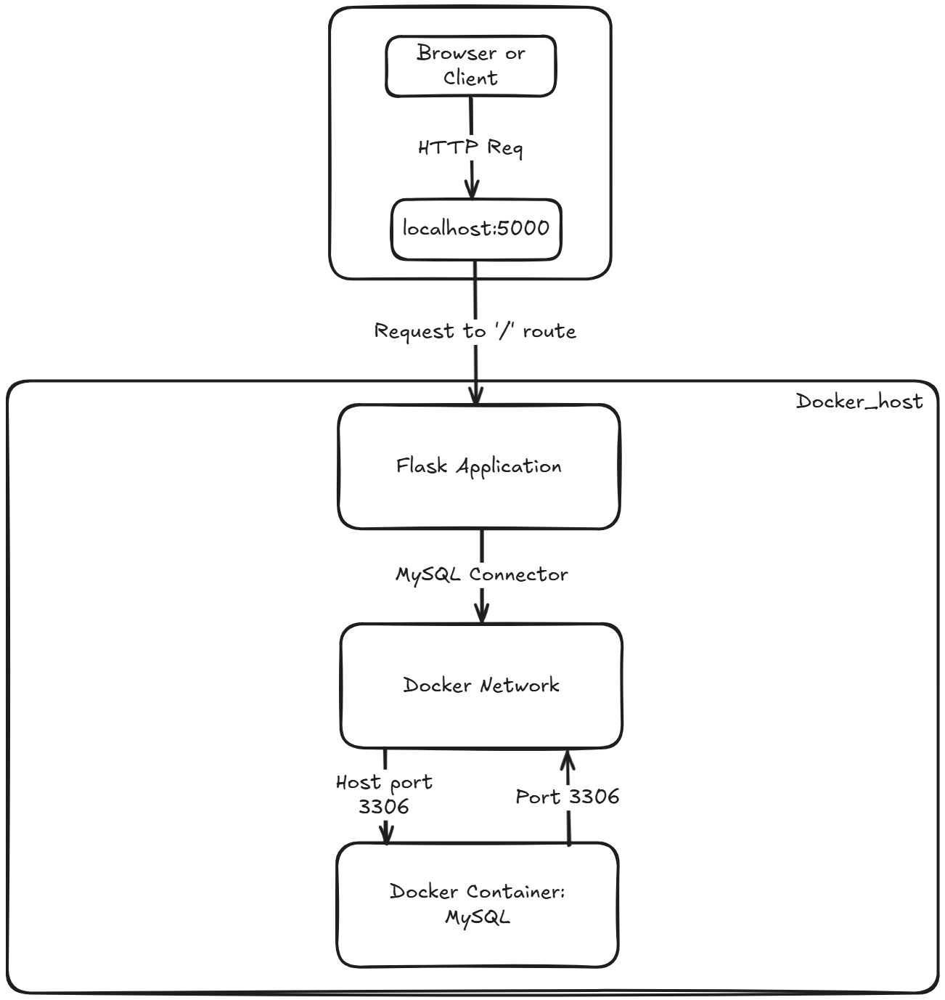

# Connect Flask App with MySQL  

This lab walks you through setting up a Flask application that connects to a MySQL server running in a Docker container. You'll learn how to create and run the Flask app, install the required packages, and set up a MySQL database with a dedicated user.



## Run the MySQL container

To start a MySQL server in Docker, use the following command:

```sh
docker run --name mysql-container -e MYSQL_ROOT_PASSWORD=root -p 3306:3306 -d mysql:latest
```

## Access MySQL Server in Docker Container

Connect to the MySQL server within the container:

```bash
sudo docker exec -it mysql-container mysql -uroot -proot
```

This command runs the MySQL client inside the Docker container named `mysql-container`, logging in as the `root` user with the password `root`.

## Create a New MySQL User

```sql
CREATE USER 'newuser'@'%' IDENTIFIED BY 'newpassword';
GRANT ALL PRIVILEGES ON *.* TO 'newuser'@'%' WITH GRANT OPTION;
FLUSH PRIVILEGES;
```

These SQL commands are executed within the MySQL client to:

1. Create a new user `newuser` with the password `newpassword`.
2. Grant all privileges on all databases and tables to `newuser` with the ability to grant those privileges to others.
3. Refresh the MySQL privilege tables to ensure the changes take effect.


## Set Up Python and a Virtual Environment

Install Python and create a virtual environment for your Flask application:

```bash
sudo apt-get update
sudo apt install python3.10-venv
python3 -m venv venv
source venv/bin/activate
```

## Install Flask and MySQL Connector

With the virtual environment active, install Flask and MySQL connector:

```bash
pip install flask mysql-connector-python
```

## Create the Flask Application

Directory structure:

```
flask_app/
├── app.py
├── venv/
```

Set up a new directory for your Flask app:

```bash
mkdir flask_app
cd flask_app
```

## Write the Flask Application (app.py)

In `app.py`, add the following code:

```python
from flask import Flask, jsonify
import mysql.connector
from mysql.connector import Error

app = Flask(__name__)

def create_connection():
    connection = None
    try:
        connection = mysql.connector.connect(
            host="localhost",
            user="newuser",
            password="newpassword",
            database="mydatabase"
        )
        if connection.is_connected():
            print("Connected to MySQL database")
    except Error as e:
        print(f"The error '{e}' occurred")
    return connection

@app.route('/')
def index():
    connection = create_connection()
    if connection.is_connected():
        return jsonify(message="Connected to MySQL database")
    else:
        return jsonify(message="Failed to connect to MySQL database"), 500

if __name__ == "__main__":
    app.run(debug=True)

```

## Configure and Run the Flask App

**Set the Environment Variables for Flask**

In the terminal, set the environment variables (Linux/Mac):

```bash
export FLASK_APP=app.py
export FLASK_ENV=development
```

**Run the Flask Application**

```bash
flask run
```

If we use the following command:

```bash
curl http://127.0.0.1:5000
```

We may get an error as follows.


Seems like there is no database named `mydatabase`. Let's solve the issue.

Let's see if there is any database of such name using the following command:

```bash
mysql -h 127.0.0.1 -u root -proot
````

```bash
SHOW DATABASES;
```


## Install MySQL Client

```bash
sudo apt-get update
sudo apt-get install mysql-client
```

These commands update the package lists for upgrades and new package installations, then install the MySQL client tools.

## Create `mydatabase` Database

Create the  `mydatabase`  and Verify Database Creation. 

```bash
mysql -h 127.0.0.1 -u root -proot
````

```bash
CREATE DATABASE mydatabase; 
SHOW DATABASES;
```

Grant Permissions to the New User (if not already done).

```bash
GRANT ALL PRIVILEGES ON mydatabase. * TO 'newuser'@'%' WITH GRANT OPTIONS;
FLUSH PRIVILEGES;
```


## **Run the Flask Application again**

```bash
flask run
```


## Verify the Connection
    
```bash
curl http://127.0.0.1:5000
```


    

### Notes:

- Ensure the `newuser` and `newpassword` match the credentials you created earlier.
- Adjust `host`, `user`, `password`, and `database` in `create_connection` function according to your setup.
- The `localhost` in the Flask app code assumes that the MySQL container is running on the same host as the Flask app. If it’s running on a different host, use the appropriate IP address.

By following these steps, you will create a Flask application that connects to your MySQL container using the new user you created.