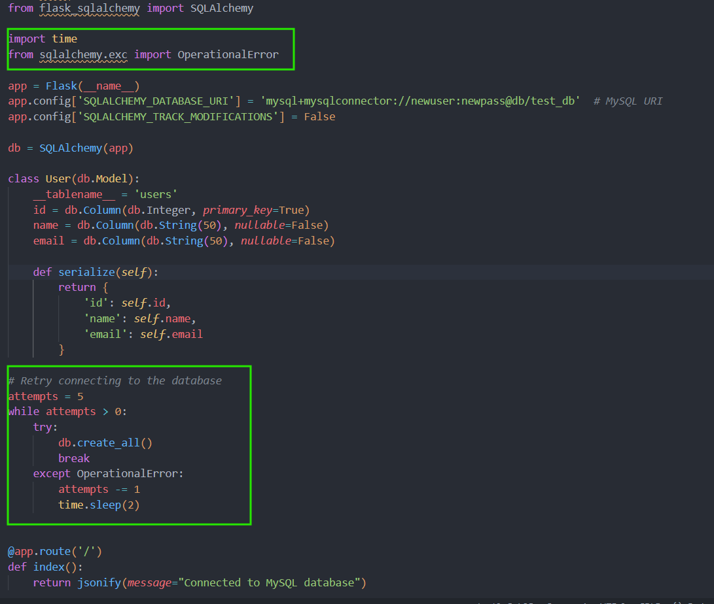

# Flask REST API with SQLAlchemy, MySQL, and Docker

## Introduction

Flask is a lightweight and flexible web framework for Python, ideal for building RESTful APIs. SQLAlchemy is a powerful SQL toolkit and Object-Relational Mapping (ORM) library for Python, providing a high-level abstraction for database interactions.

In this guide, we'll demonstrate how to integrate SQLAlchemy with Flask to create a REST API connected to a MySQL database. Additionally, we'll utilize Docker to deploy the entire setup as containers, providing a consistent and isolated environment for development and production.

## Step 1: Set Up Flask REST API

### Project Structure

```
flask_mysql_docker/
├── app.py
├── Dockerfile
├── docker-compose.yml
└── init_db.sql
```

### Installation

First, create a project directory:

```bash
mkdir flask_mysql_docker
cd flask_mysql_docker
```

Next, install Flask, SQLAlchemy, and MySQL connector:

```bash
pip install Flask Flask-SQLAlchemy mysql-connector-python
```

### Flask Application (app.py)

```python
from flask import Flask, jsonify, request
from flask_sqlalchemy import SQLAlchemy

app = Flask(__name__)
app.config['SQLALCHEMY_DATABASE_URI'] = 'mysql+mysqlconnector://newuser:newpass@db/test_db'  # MySQL URI
app.config['SQLALCHEMY_TRACK_MODIFICATIONS'] = False

db = SQLAlchemy(app)

class User(db.Model):
    __tablename__ = 'users' 
    id = db.Column(db.Integer, primary_key=True)
    name = db.Column(db.String(50), nullable=False)
    email = db.Column(db.String(50), nullable=False)

    def serialize(self):
        return {
            'id': self.id,
            'name': self.name,
            'email': self.email
        }

@app.route('/')
def index():
    return jsonify(message="Connected to MySQL database")

@app.route('/users', methods=['GET'])
def get_users():
    users = User.query.all()
    return jsonify([user.serialize() for user in users])

@app.route('/users/<int:user_id>', methods=['GET'])
def get_user(user_id):
    user = User.query.get(user_id)
    if user:
        return jsonify(user.serialize())
    else:
        return jsonify({"error": "User not found"}), 404

@app.route('/users', methods=['POST'])
def add_user():
    new_user_data = request.get_json()
    new_user = User(name=new_user_data['name'], email=new_user_data['email'])
    db.session.add(new_user)
    db.session.commit()
    return jsonify({"id": new_user.id}), 201

@app.route('/users/<int:user_id>', methods=['PUT'])
def update_user(user_id):
    user = User.query.get(user_id)
    if not user:
        return jsonify({"error": "User not found"}), 404
    update_data = request.get_json()
    user.name = update_data['name']
    user.email = update_data['email']
    db.session.commit()
    return jsonify({"message": "User updated successfully"})

@app.route('/users/<int:user_id>', methods=['DELETE'])
def delete_user(user_id):
    user = User.query.get(user_id)
    if not user:
        return jsonify({"error": "User not found"}), 404
    db.session.delete(user)
    db.session.commit()
    return jsonify({"message": "User deleted successfully"})

if __name__ == '__main__':
    app.run(host='0.0.0.0')
```

## Step 2: Set Up MySQL

### Database Initialization Script (init_db.sql)

```sql
CREATE DATABASE IF NOT EXISTS test_db;
USE test_db;

CREATE TABLE IF NOT EXISTS users (
    id INT AUTO_INCREMENT PRIMARY KEY,
    name VARCHAR(50) NOT NULL,
    email VARCHAR(50) NOT NULL
);
```

## Step 3: Set Up Docker

### Dockerfile

```dockerfile
# Dockerfile

FROM python:3.8-slim-buster

WORKDIR /app

COPY . /app

RUN pip install --no-cache-dir Flask Flask-SQLAlchemy mysql-connector-python

EXPOSE 5000

CMD ["python", "app.py"]
```

### docker-compose.yml

```yaml
version: '3.8'

services:
  db:
    image: mysql:5.7
    restart: always
    environment:
      MYSQL_ROOT_PASSWORD: root
      MYSQL_USER: newuser
      MYSQL_PASSWORD: newpass
      MYSQL_DATABASE: test_db
    volumes:
      - ./init_db.sql:/docker-entrypoint-initdb.d/init_db.sql
    ports:
      - "3307:3306"

  web:
    build: .
    command: python app.py
    volumes:
      - .:/app
    ports:
      - "5000:5000"
    depends_on:
      - db
```

### Install Docker Compose on Ubuntu

First, update your package index:

```bash
sudo apt update
```

Install the required packages to ensure that curl and gnupg are installed:

```bash
sudo apt install curl gnupg
```

Download the Docker Compose binary into the `/usr/local/bin` directory:

```bash
sudo curl -L "https://github.com/docker/compose/releases/latest/download/docker-compose-$(uname -s)-$(uname -m)" -o /usr/local/bin/docker-compose
```

Apply executable permissions to the binary:

```bash
sudo chmod +x /usr/local/bin/docker-compose
```

Verify that docker-compose is installed correctly:

```bash
docker-compose --version
```

You should see the version of Docker Compose printed to the terminal.

## Step 4: Build and Run Docker Containers

```bash
sudo docker-compose up --build
```

The `sudo docker-compose up --build` command initiates the building of Docker images as per specifications in the `docker-compose.yml` file, then starts the corresponding containers, ensuring any changes in Dockerfiles or application code are incorporated before container initialization.

## Step 5: Verify Connection

```bash
curl http://localhost:5000
```

## Step 6: Check Database

### Install MySQL Client

```bash
sudo apt-get update
sudo apt-get install mysql-client
```

### Get MySQL Server IP

```bash
docker ps
docker inspect -f '{{range .NetworkSettings.Networks}}{{.IPAddress}}{{end}}' <container_id>
```

The `docker inspect` command extracts and displays the IP address of a specific container using a Go template, facilitating network-related tasks and troubleshooting within Docker environments.

### Test MySQL Connection Using Telnet

### Install Telnet

If you don't already have `telnet` installed, you can install it using the following command:

```bash
sudo apt-get update
sudo apt-get install telnet
```

Use `telnet` to test the connection to the MySQL server. Replace `<mysql_ip_address>` with the IP address you obtained in the previous step, and `3306` is the default MySQL port.

```bash
telnet <mysql_ip_address> 3306
```

If the connection is successful, you will see something like this:

```plaintext
Trying <mysql_ip_address>...
Connected to <mysql_ip_address>.
Escape character is '^]'.
```

This confirms that the MySQL server is accessible from the network.

### Log in to MySQL

```bash
mysql -h <mysql_server_ip> -u newuser -pnewpass test_db
```

### Verify Database and Tables

To verify that your database and tables are set up correctly, you can run the following commands inside the MySQL client:

```sql
SHOW DATABASES;
USE test_db;
SHOW TABLES;
```

You should see the `test_db` database and the `users` table listed.

### Perform Basic Database Operations

To ensure everything is working, you can perform some basic database operations, like inserting a new user and selecting from the `users` table:

```sql
INSERT INTO users (name, email) VALUES ('Jane Doe', 'jane@example.com');
SELECT * FROM users;
```

## Step 7: Testing the API

### Add a User

```bash
curl -X POST -H "Content-Type: application/json" -d '{"name": "John Doe", "email": "john@example.com"}' http://localhost:5000/users
```

### Get all Users

```bash
curl http://localhost:5000/users
```

### Get User by ID

```bash
curl http://localhost:5000/users/<user_id>
```

### Delete a User

```bash
curl -X DELETE http://localhost:5000/users/<user_id>
```


## MySQL Connection Issues

**Error:** `sqlalchemy.exc.OperationalError: (mysql.connector.errors.InterfaceError) 2003: Can't connect to MySQL server on 'db' (111 Connection refused)`

**Solution:**
Ensure the MySQL container is running and that your Flask app is waiting for the MySQL service to start. You can add a retry mechanism in your Flask app for a more robust connection.

**Example:**

Add a simple retry mechanism in your Flask app:




**Error:** `You have an error in your SQL syntax`.

**Solution:**
Ensure your `init_db.sql` file has no syntax errors and matches the MySQL version's requirements you are using. Double-check the SQL statements for typos or incorrect commands.

By following these steps, you can thoroughly test the MySQL setup and ensure it is correctly integrated with your Flask application running in Docker containers.