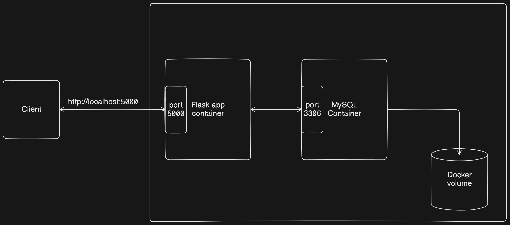

# Mount Docker Volume to Store mysql data

This documentation demonstrates the creation of simple `Flask REST API` that connects to a `MySQL` database running in a Docker container using a `new MySQL user` and `mount` docker volume to store and persisted the mysql data outside the container.



## Step 1: Set Up Flask REST API

1. **Create a project directory**
    Project Structure:
    ```bash
    flask_mysql_docker/
    ├── app.py
    ├── Dockerfile
    ├── docker-compose.yml
    ├── venv/
    ├── init_db.sql
    ```
    ```bash
    mkdir flask_mysql_docker
    cd flask_mysql_docker
    ```

2. **OPTIONAL: Create a virtual environment and activate it to run it locally.**
    ```bash
    sudo apt-get update
    sudo apt install python3.10-venv
    python3 -m venv venv
    source venv/bin/activate  # On Windows use `venv\Scripts\activate`
    ```

3. **Install Flask and MySQL connector**
    ```bash
    pip install Flask mysql-connector-python
    ```

4. **Create the Flask application**

    Create a file named `app.py` with the following content:
    
    ```python
    from flask import Flask, jsonify, request
    import mysql.connector
    from mysql.connector import Error

    app = Flask(__name__)

    # Database connection
    def get_db_connection():
        return mysql.connector.connect(
            host="db",  # service name defined in docker-compose.yml or K8s service name
            port=3306,  # MySQL service port
            user="newuser",
            password="newpass",
            database="test_db"
        )

    @app.route('/')
    def index():
        conn = get_db_connection()
        if conn.is_connected():
            return jsonify(message="Connected to MySQL database")
        else:
            return jsonify(message="Failed to connect to MySQL database"), 500

    @app.route('/users', methods=['GET'])
    def get_users():
        try:
            conn = get_db_connection()
            cursor = conn.cursor(dictionary=True)
            cursor.execute('SELECT * FROM users')
            users = cursor.fetchall()
            return jsonify(users)
        except Error as e:
            return jsonify({"error": str(e)}), 500
        finally:
            cursor.close()
            conn.close()

    @app.route('/users/<int:user_id>', methods=['GET'])
    def get_user(user_id):
        try:
            conn = get_db_connection()
            cursor = conn.cursor(dictionary=True)
            cursor.execute('SELECT * FROM users WHERE id = %s', (user_id,))
            user = cursor.fetchone()
            if user:
                return jsonify(user)
            else:
                return jsonify({"error": "User not found"}), 404
        except Error as e:
            return jsonify({"error": str(e)}), 500
        finally:
            cursor.close()
            conn.close()

    @app.route('/users', methods=['POST'])
    def add_user():
        new_user = request.get_json()
        try:
            conn = get_db_connection()
            cursor = conn.cursor()
            cursor.execute('INSERT INTO users (name, email) VALUES (%s, %s)',
                          (new_user['name'], new_user['email']))
            conn.commit()
            return jsonify({"id": cursor.lastrowid}), 201
        except Error as e:
            return jsonify({"error": str(e)}), 500
        finally:
            cursor.close()
            conn.close()

    @app.route('/users/<int:user_id>', methods=['PUT'])
    def update_user(user_id):
        update_user = request.get_json()
        try:
            conn = get_db_connection()
            cursor = conn.cursor()
            cursor.execute('UPDATE users SET name = %s, email = %s WHERE id = %s',
                          (update_user['name'], update_user['email'], user_id))
            conn.commit()
            if cursor.rowcount == 0:
                return jsonify({"error": "User not found"}), 404
            return jsonify({"message": "User updated successfully"})
        except Error as e:
            return jsonify({"error": str(e)}), 500
        finally:
            cursor.close()
            conn.close()

    @app.route('/users/<int:user_id>', methods=['DELETE'])
    def delete_user(user_id):
        try:
            conn = get_db_connection()
            cursor = conn.cursor()
            cursor.execute('DELETE FROM users WHERE id = %s', (user_id,))
            conn.commit()
            if cursor.rowcount == 0:
                return jsonify({"error": "User not found"}), 404
            return jsonify({"message": "User deleted successfully"})
        except Error as e:
            return jsonify({"error": str(e)}), 500
        finally:
            cursor.close()
            conn.close()

    if __name__ == '__main__':
        app.run(host='0.0.0.0')    
    ```


## Step 2: Set Up MySQL

1. **Create a database initialization script**

    Create a file named `init_db.sql` with the following content:
    ```sql
    CREATE DATABASE IF NOT EXISTS test_db;
    USE test_db;

    CREATE TABLE IF NOT EXISTS users (
        id INT AUTO_INCREMENT PRIMARY KEY,
        name VARCHAR(50) NOT NULL,
        email VARCHAR(50) NOT NULL
    );
    ```

## Step 3: Set Up Docker

1. **Create a `Dockerfile` for the Flask application**
    ```Dockerfile
    # Use an official Python runtime as a parent image
    FROM python:3.8-slim-buster

    # Set the working directory in the container
    WORKDIR /app

    # Copy the current directory contents into the container at /app
    COPY . /app

    # Install any needed packages specified in requirements.txt
    RUN pip install --no-cache-dir Flask mysql-connector-python

    # Make port 5000 available to the world outside this container
    EXPOSE 5000

    # Define environment variable
    ENV NAME World

    # Run app.py when the container launches
    CMD ["python", "app.py"]
    ```

2. **Create a `docker-compose.yml` file**
    ```yaml
    version: '3.8'

    services:
      db:
        image: mysql:5.7
        restart: always
        environment:
          MYSQL_ROOT_PASSWORD: root
          MYSQL_USER: newuser
          MYSQL_PASSWORD: newpass
          MYSQL_DATABASE: test_db
        volumes:
          - mysql_data:/var/lib/mysql  # Mount the volume to the MySQL data directory
          - ./init_db.sql:/docker-entrypoint-initdb.d/init_db.sql
        ports:
          - "3306:3306"

      web:
        build: .
        command: python app.py
        volumes:
          - .:/app
        ports:
          - "5000:5000"
        depends_on:
          - db
    
    volumes:
        mysql_data:
    ```

- Explanation:
    - `volumes`: mysql_data:/var/lib/mysql: This mounts the named volume `mysql_data` to the `/var/lib/mysql` directory **inside the container**, which is where MySQL stores its data files.

    - The volumes section at the bottom defines the named volume `mysql_data`.

## Step 4: Build and Run the Docker Containers

- Build using docker-compose up  command

    ```bash
    docker-compose up --build
    ```
- This command builds the Docker images and starts the containers.

#### ISSUE: It seems that `docker-compose` is not installed on our system. `docker-compose` is a tool for defining and running multi-container Docker applications. 

To resolve this issue, we need to install Docker Compose. Here's how we can do it on Ubuntu:

### Install Docker Compose on Ubuntu

1. First, update your package index:

    ```sh
    sudo apt update
    ```

2. Install the required packages to ensure that `curl` and `gnupg` are installed:

    ```sh
    sudo apt install curl gnupg
    ```

3. Download the Docker Compose binary into the `/usr/local/bin` directory:

    ```sh
    sudo curl -L "https://github.com/docker/compose/releases/latest/download/docker-compose-$(uname -s)-$(uname -m)" -o /usr/local/bin/docker-compose
    ```

4. Apply executable permissions to the binary:

    ```sh
    sudo chmod +x /usr/local/bin/docker-compose
    ```

5. Verify that `docker-compose` is installed correctly:

    ```sh
    docker-compose --version
    ```

We should see the version of Docker Compose printed to the terminal.

### Running Docker Compose

After installing Docker Compose, we should be able to use it to manage our Docker containers. We can run the `docker-compose up --build` command again, and Docker Compose will build and start our containers according to the instructions in your `docker-compose.yml` file.

```bash
docker-compose up --build
```

#### Verify the Connection

```bash
curl http://localhost:5000
```


This shows that, the Database connection is successful!!

## Step 5: Verifying the Volume

To verify that the `volume` is being created correctly, you can check the `Docker volumes` on your system:

1. List all Docker volumes:

```bash
docker volume ls
```

You should see an entry for `flask_mysql_docker_mysql_data` (or similar, depending on your project directory name).

2. Inspect the volume:

Inspect the container for further information:

```bash
docker volume inspect flask_mysql_docker_mysql_data
```


This command will show detailed information about the volume, including its mount point and usage statistics.

## Step 6: Check database

1. Install mysql-client
```bash
sudo apt-get update
sudo apt-get install mysql-client
```
These commands update the package lists for upgrades and new package installations, then install the MySQL client tools.

2. Checkout the mysql server
```bash
docker ps
```
This command will show you the running containers. Find the container id of the mysql container and use it to inspect the container to find out the mysql server ip.

```bash
docker inspect -f '{{range .NetworkSettings.Networks}}{{.IPAddress}}{{end}}' <container_id>
```

This command will give you the Mysql server ip. Now loggin in as the user defined in the `app.py` and `docker-compose.yaml` file.

```bash
mysql -h <mysql_server_ip> -u newuser -pnewpass test_db
```


To see all the databases under this user and to use the required database:

```sql
SHOW DATABASES;
```
Here we can see our created database named `test_db`. Use the database:

```sql
USE test_db;
```
To show the tables under this database we can run:

```sql
SHOW TABLES;
```


To see the content of tables created in the database:

```sql
select * from users;
```

## Step 7: Testing the API

Once the containers are up and running, you can test the API using tools like `curl`.

1. Get all Users

    ```sh
    curl http://localhost:5000/users
    ```
2. **Get User by ID**

    ```bash
    curl http://localhost:5000/users/<user_id>
    ```

Replace `user_id` with the ID of the user you want to retrieve.

3. **Add a User:**

    ```sh
    curl -X POST -H "Content-Type: application/json" -d '{"name": "John Doe", "email": "john@example.com"}' http://localhost:5000/users
    ```
4. **We can see the updated `users` table by:**

    

### Step 8: Test Persistence
Let's test persistence by stopping and starting the containers again.

1. **Add some data** to the MySQL database.
   
   ```sql
   INSERT INTO users (name, email) VALUES ('yasin', 'yasin@example.com');
   INSERT INTO users (name, email) VALUES ('konami', 'konami@example.com');
   ```
   

2. **Stop and remove the MySQL container**:

   ```bash
   docker-compose down
   ```

3. **Restart the Docker Compose application**:

   ```bash
   docker-compose up -d
   ```
    

4. **Check if the data is still present**:

   Connect to the MySQL container and query the `users` table to verify that the data persists.

    ```bash
    docker exec -it <container_id_or_name> mysql -u newuser -pnewpass
    ```

    

   ```sql
   USE test_db;
   SELECT * FROM users;
   ```

   

That's it! We can see the MySQL database data `persisted` even after the container restarts and recreations. So we have ensured the data persistency even if the MySQL container is stopped or removed. So we now have a Flask REST API connected to a MySQL database, all running inside Docker containers and a volume is mounted to the container for data persistency.
