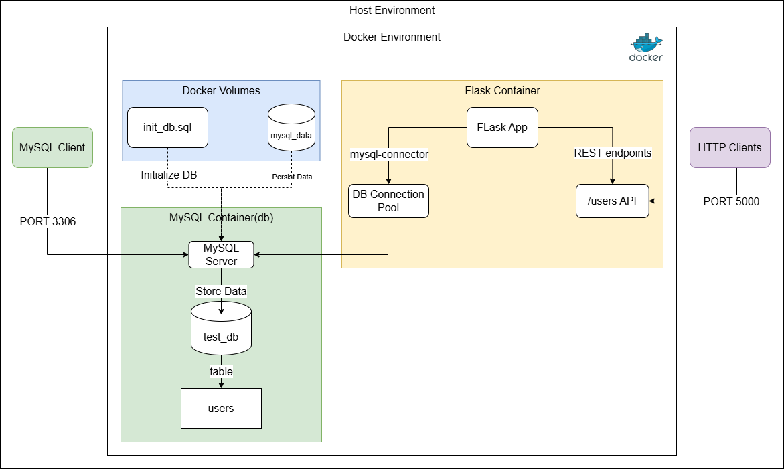
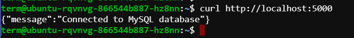
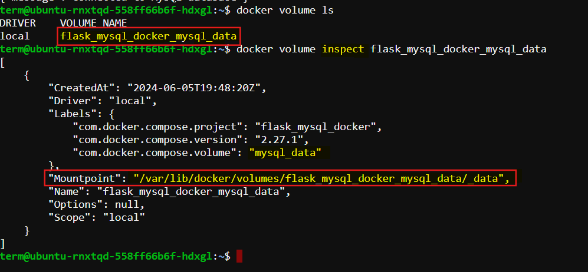
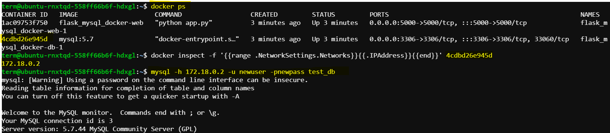
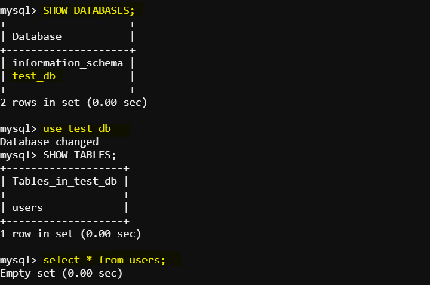
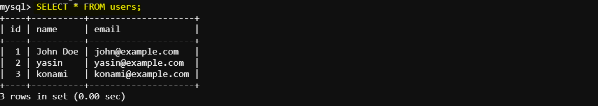
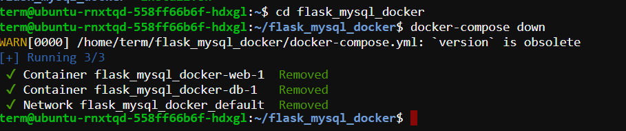
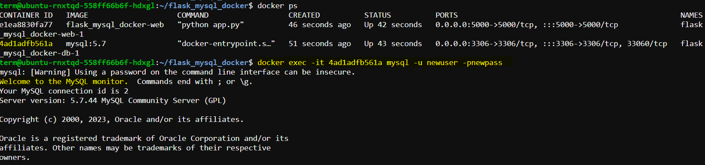
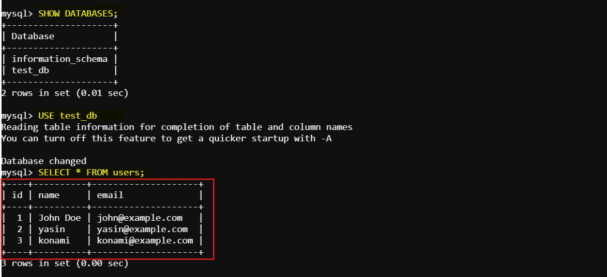

# Mount Docker Volume to Store MySQL Data

This documentation explains how to set up a simple Flask REST API that connects to a MySQL database running in a Docker container. It demonstrates creating a new MySQL user, configuring a Docker volume to persist MySQL data outside of the container, and ensuring data is retained between container restarts.



## Step 1: Set Up Flask REST API

**1. Create a project directory**

First, create a directory to house all project files:

```sh
mkdir flask_mysql_docker
cd flask_mysql_docker
```
Your project structure should look like this:

```sh
flask_mysql_docker/
├── app.py                # Flask app code
├── Dockerfile            # Dockerfile for the Flask app
├── docker-compose.yml    # Docker Compose configuration
├── init_db.sql           # SQL initialization script for MySQL
```

**3. Install Flask and MySQL connector**
To enable Flask to connect to MySQL, install the necessary packages:

```bash
pip install Flask mysql-connector-python
```

**4. Create the Flask application**

In a new file called `app.py`, we will implement our Flask REST API to interact with the MySQL database. This file will contain the logic for connecting, querying, and managing users:
    
```python
from flask import Flask, jsonify, request
import mysql.connector
from mysql.connector import Error

app = Flask(__name__)

# Database connection
def get_db_connection():
    return mysql.connector.connect(
        host="db",  # service name defined in docker-compose.yml or K8s service name
        port=3306,  # MySQL service port
        user="newuser",
        password="newpass", # newuser password.
        database="test_db"
    )

@app.route('/')
def index():
    conn = get_db_connection()
    if conn.is_connected():
        return jsonify(message="Connected to MySQL database")
    else:
        return jsonify(message="Failed to connect to MySQL database"), 500

@app.route('/users', methods=['GET'])
def get_users():
    try:
        conn = get_db_connection()
        cursor = conn.cursor(dictionary=True)
        cursor.execute('SELECT * FROM users')
        users = cursor.fetchall()
        return jsonify(users)
    except Error as e:
        return jsonify({"error": str(e)}), 500
    finally:
        cursor.close()
        conn.close()

@app.route('/users/<int:user_id>', methods=['GET'])
def get_user(user_id):
    try:
        conn = get_db_connection()
        cursor = conn.cursor(dictionary=True)
        cursor.execute('SELECT * FROM users WHERE id = %s', (user_id,))
        user = cursor.fetchone()
        if user:
            return jsonify(user)
        else:
            return jsonify({"error": "User not found"}), 404
    except Error as e:
        return jsonify({"error": str(e)}), 500
    finally:
        cursor.close()
        conn.close()

@app.route('/users', methods=['POST'])
def add_user():
    new_user = request.get_json()
    try:
        conn = get_db_connection()
        cursor = conn.cursor()
        cursor.execute('INSERT INTO users (name, email) VALUES (%s, %s)',
                        (new_user['name'], new_user['email']))
        conn.commit()
        return jsonify({"id": cursor.lastrowid}), 201
    except Error as e:
        return jsonify({"error": str(e)}), 500
    finally:
        cursor.close()
        conn.close()

@app.route('/users/<int:user_id>', methods=['PUT'])
def update_user(user_id):
    update_user = request.get_json()
    try:
        conn = get_db_connection()
        cursor = conn.cursor()
        cursor.execute('UPDATE users SET name = %s, email = %s WHERE id = %s',
                        (update_user['name'], update_user['email'], user_id))
        conn.commit()
        if cursor.rowcount == 0:
            return jsonify({"error": "User not found"}), 404
        return jsonify({"message": "User updated successfully"})
    except Error as e:
        return jsonify({"error": str(e)}), 500
    finally:
        cursor.close()
        conn.close()

@app.route('/users/<int:user_id>', methods=['DELETE'])
def delete_user(user_id):
    try:
        conn = get_db_connection()
        cursor = conn.cursor()
        cursor.execute('DELETE FROM users WHERE id = %s', (user_id,))
        conn.commit()
        if cursor.rowcount == 0:
            return jsonify({"error": "User not found"}), 404
        return jsonify({"message": "User deleted successfully"})
    except Error as e:
        return jsonify({"error": str(e)}), 500
    finally:
        cursor.close()
        conn.close()

if __name__ == '__main__':
    app.run(host='0.0.0.0')    
```


## Step 2: Set Up MySQL Database Initialization Script

Create a MySQL initialization script to set up the database schema when the container starts for the first time.


**Create a file named init_db.sql:**

```sql
CREATE DATABASE IF NOT EXISTS test_db;
USE test_db;

CREATE TABLE IF NOT EXISTS users (
    id INT AUTO_INCREMENT PRIMARY KEY,
    name VARCHAR(50) NOT NULL,
    email VARCHAR(50) NOT NULL
);
```

This script creates a database named `test_db` and a table `users` with `id`, `name`, and `email` fields.

## Step 3: Set Up Docker

**1. Create a `Dockerfile` for the Flask application**

The Dockerfile defines the Flask application environment, dependencies, and startup commands:

```Dockerfile
# Use an official Python runtime as a parent image
FROM python:3.8-slim-buster

# Set the working directory in the container
WORKDIR /app

# Copy the current directory contents into the container at /app
COPY . /app

# Install any needed packages specified in requirements.txt
RUN pip install --no-cache-dir Flask mysql-connector-python

# Make port 5000 available to the world outside this container
EXPOSE 5000

# Run app.py when the container launches
CMD ["python", "app.py"]
```

**2. Create a `docker-compose.yml` file**

Define both the Flask application and MySQL database services, and mount a Docker volume to persist MySQL data:

```yaml
version: '3.8'

services:
  db:
    image: mysql:5.7
    restart: always
    environment:
      MYSQL_ROOT_PASSWORD: root
      MYSQL_USER: newuser
      MYSQL_PASSWORD: newpass
      MYSQL_DATABASE: test_db
    volumes:
      - mysql_data:/var/lib/mysql  # Mount the volume to the MySQL data directory
      - ./init_db.sql:/docker-entrypoint-initdb.d/init_db.sql
    ports:
      - "3306:3306"

  web:
    build: .
    command: python app.py
    volumes:
      - .:/app
    ports:
      - "5000:5000"
    depends_on:
      - db

volumes:
  mysql_data:
```

### Explanation:

- `volumes`: mysql_data:/var/lib/mysql: This mounts the named volume `mysql_data` to the `/var/lib/mysql` directory **inside the container**, which is where MySQL stores its data files.

- The volumes section at the bottom defines the named volume `mysql_data`.

## Step 4: Build and Run the Docker Containers

Run Docker Compose to build images and start both containers:

```bash
docker-compose up --build
```
This command builds the Docker images for the Flask and MySQL services and starts the containers.

#### Verify the Connection

To check if the application is connected to MySQL:

```bash
curl http://localhost:5000
```


If successful, the response should confirm the database connection.

## Step 5: Verify Docker Volume Creation

To confirm that Docker is storing MySQL data in a volume:

**1. List all Docker volumes:**

```bash
docker volume ls
```

You should see an entry for `flask_mysql_docker_mysql_data` (or similar, depending on your project directory name).

**2. Inspect the volume:**

Inspect the container for further information:

```bash
docker volume inspect flask_mysql_docker_mysql_data
```


This shows details such as mount points and storage usage.

## Step 6: Access MySQL Database

To interact with the MySQL database directly:

**1. Install mysql-client**

```bash
sudo apt update
sudo apt install mysql-client
```
These commands update the package lists for upgrades and new package installations, then install the MySQL client tools.

2. Identify MySQL Container IP

```bash
docker ps
```
This command will show you the running containers. Find the container id of the mysql container.

Inspect the MySQL container to find out the mysql server ip.

```bash
docker inspect -f '{{range .NetworkSettings.Networks}}{{.IPAddress}}{{end}}' <container_id>
```

This command will give you the Mysql server ip. Now loggin in as the user defined in the `app.py` and `docker-compose.yaml` file.

3. Connect to MySQL

Using the IP address from above, connect to MySQL:

```bash
mysql -h <mysql_server_ip> -u newuser -p
```



Once connected, verify database setup:

```sql
SHOW DATABASES;
```
Here we can see our created database named `test_db`. Use the database:

```sql
USE test_db;
```
To show the tables under this database we can run:

```sql
SHOW TABLES;
```



To see the content of tables created in the database:

```sql
select * from users;
```

## Step 7: Test the API

o test the REST API endpoints, use `curl` or another HTTP client:

**1. Get all Users**

```sh
curl http://localhost:5000/users
```
**2. Get User by ID**

```bash
curl http://localhost:5000/users/<user_id>
```

Replace `user_id` with the ID of the user you want to retrieve.

**3. Add a User:**

```sh
curl -X POST -H "Content-Type: application/json" -d '{"name": "John Doe", "email": "john@example.com"}' http://localhost:5000/users
```
**4. We can see the updated `users` table by:**

### Step 8: Test Persistence
Let's test persistence by stopping and starting the containers again.

**1. Add some data**
   
```sql
INSERT INTO users (name, email) VALUES ('yasin', 'yasin@example.com');
INSERT INTO users (name, email) VALUES ('konami', 'konami@example.com');
```
   

**2. Stop and Remove Containers**:

```bash
docker-compose down
```

**3. Restart the Docker Compose application**:

```bash
docker-compose up -d
```
    

**4. Verify Data Persistence**:

Connect to the MySQL container and query the `users` table to verify that the data persists.

```bash
docker exec -it <container_id_or_name> mysql -u newuser -p
```



```sql
USE test_db;
SELECT * FROM users;
```



That's it! We can see the MySQL database data `persisted` even after the container restarts and recreations. So we have ensured the data persistency even if the MySQL container is stopped or removed. So we now have a Flask REST API connected to a MySQL database, all running inside Docker containers and a volume is mounted to the container for data persistency.
