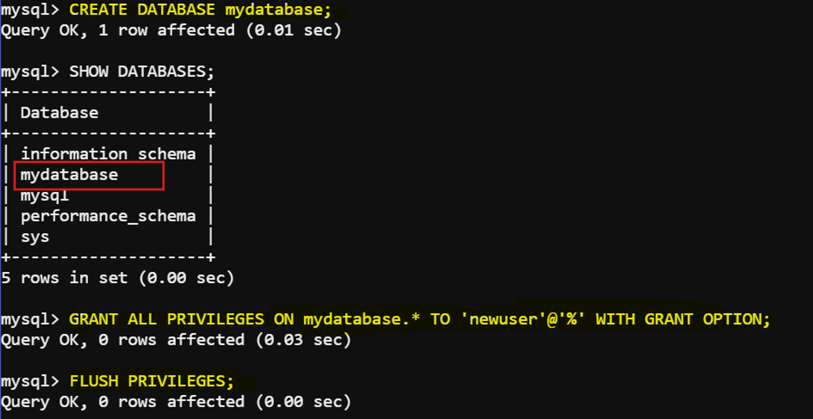

# Connect NodeJS App with MySQL

This is a step-by-step guide to create a Node.js application that connects to a MySQL container. This guide includes installing necessary packages, setting up the Node.js app, and connecting it to the MySQL database.


## Prerequisites
- Docker installed
- Node.js and npm installed

## Step 1: Run the MySQL Container

First, run a MySQL container using Docker:

```bash
docker run --name mysql-container -e MYSQL_ROOT_PASSWORD=root -p 3306:3306 -d mysql:latest
```
This command pulls the latest MySQL image, sets the root password to 'root', and maps port 3306 on your host to port 3306 on the container.

## Step 2: Access MySQL Server in Docker Container

Access the MySQL server inside the Docker container:

```bash
sudo docker exec -it mysql-container mysql -uroot -proot
```
This command runs the MySQL client inside the Docker container, logging in as the root user with the password 'root'.

## Step 3: Create a New MySQL User

Execute the following SQL commands to create a new user and grant necessary privileges:

```sql
CREATE USER 'newuser'@'%' IDENTIFIED BY 'newpassword';
GRANT ALL PRIVILEGES ON *.* TO 'newuser'@'%' WITH GRANT OPTION;
FLUSH PRIVILEGES;
```
These commands create a new user `newuser` with password `newpassword`, grant all privileges to this user, and apply the changes.

Expected output:


## Step 4: Install Node.js and Create a Project Directory

Create a directory for your Node.js application and navigate into it:

```bash
mkdir nodejs_app
cd nodejs_app
```
This sets up a new directory for your Node.js project.

## Step 5: Initialize Node.js Project and Install Dependencies

Initialize a new Node.js project and install the necessary packages:

```bash
npm init -y
npm install express mysql2
```
The `npm init -y` command creates a `package.json` file with default settings. The `npm install` command installs the Express framework and MySQL connector.

## Step 6: Create the Node.js Application

Create an `index.js` file in your project directory:

```bash
touch index.js
```

Edit `index.js` with the following content:

```javascript
const express = require('express');
const mysql = require('mysql2');

const app = express();
const port = 3000;

const dbConfig = {
  host: 'localhost',
  user: 'newuser',
  password: 'newpassword',
  database: 'mydatabase'
};

function createConnection() {
  const connection = mysql.createConnection(dbConfig);
  connection.connect(error => {
    if (error) {
      console.error('Error connecting to the database:', error);
      return null;
    }
    console.log('Connected to MySQL database');
  });
  return connection;
}

app.get('/', (req, res) => {
  const connection = createConnection();
  if (connection) {
    res.json({ message: 'Connected to MySQL database' });
    connection.end();
  } else {
    res.status(500).json({ message: 'Failed to connect to MySQL database' });
  }
});

app.listen(port, () => {
  console.log(`App running on http://localhost:${port}`);
});
```
This code sets up an Express server, connects to the MySQL database using the provided credentials, and defines a route to check the database connection.

Now, if we try to run this code using `node index.js` command, we'll get an error because the database named `mydatabase` doesn't exists. Let's create the database in the following step.

## Step 7: Configure MySQL Database

If the database `mydatabase` does not exist, create it:

```bash
mysql -h 127.0.0.1 -u root -proot
```
This command logs into the MySQL server using the root account.

Expected output:


Inside the MySQL prompt:

```sql
CREATE DATABASE mydatabase;
SHOW DATABASES;
```
These commands create a new database named `mydatabase` and list all databases to verify creation.


Grant the new user permissions on the new database if not already done:

```sql
GRANT ALL PRIVILEGES ON mydatabase.* TO 'newuser'@'%' WITH GRANT OPTION;
FLUSH PRIVILEGES;
```
This grants `newuser` all privileges on the `mydatabase` database and applies the changes.

Expected output:



## Step 8: Run the Node.js Application

Run the Node.js application:

```bash
node index.js
```
This command starts your Node.js application.

## Step 9: Verify the Connection

In a new terminal, use `curl` to verify the connection:

```bash
curl http://127.0.0.1:3000
```
This command sends a request to the Node.js application to check if it can connect to the MySQL database.

Expected output:
```bash
{"message":"Connected to MySQL database"}
```
You should see a response indicating whether the connection to the MySQL database was successful.

## Step 10: Additional Notes

- Ensure the `newuser` and `newpassword` match the credentials you created earlier.
- Adjust `host`, `user`, `password`, and `database` in `dbConfig` object according to your setup.
- The `localhost` in the `dbConfig` object assumes that the MySQL container is running on the same host as the Node.js app. If it’s running on a different host, use the appropriate IP address.

By following these steps, you will create a Node.js application that connects to your MySQL container using the new user you created.