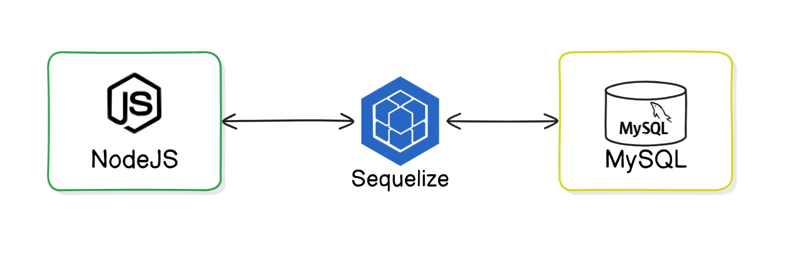

# NodeJS RestAPI App With MySQL

This is a documentation for a Rest API application, a robust and scalable RESTful API built with Node.js, Express.js, Sequelize ORM, and MySQL. This application serves as a foundational template for creating and managing users within a system, offering comprehensive CRUD (Create, Read, Update, Delete) operations.



Let't setup the application step by step:

## Step 1: Set Up the Project

**Initialize a new Node.js project:**

```bash
mkdir my-rest-api
cd my-rest-api
npm init -y
```


`mkdir my-rest-api`: Creates a new directory named `my-rest-api`.

`cd my-rest-api`: Navigates into the `my-rest-api` directory.

`npm init -y`: Initializes a new Node.js project with default settings, creating a `package.json` file.

**Install the required packages:**

```bash
npm install express sequelize mysql2 body-parser nodemon
```


`express`: A minimal and flexible Node.js web application framework.

`sequelize`: A promise-based Node.js ORM for MySQL, Postgres, SQLite, and Microsoft SQL Server.

`mysql2`: A MySQL client for Node.js with a focus on performance.

`body-parser`: Middleware to parse incoming request bodies in a middleware before your handlers.

## Step 2: Configure Sequelize

**Set up the Sequelize configuration:**

Create a folder structure as follows:
```
my-rest-api
├── config
│   └── config.json
├── models
│   └── index.js
│   └── user.js
├── routes
│   └── user.js
├── index.js
└── package.json
```

**Create the Sequelize configuration file:**

**`config/config.json`**
```json
{
  "development": {
    "username": "myuser",
    "password": "mypassword",
    "database": "my_db",
    "host": "127.0.0.1",
    "dialect": "mysql"
  }
}
```

This file configures Sequelize to connect to a MySQL database named `database_development` on the local machine using the specified username and password.

## Step 3: Define Models

**Create the `index.js` file to initialize Sequelize:**

**`models/index.js`**
```javascript
const fs = require('fs');
const path = require('path');
const Sequelize = require('sequelize');
const basename = path.basename(__filename);
const env = process.env.NODE_ENV || 'development';
const config = require(__dirname + '/../config/config.json')[env];

const db = {};

let sequelize;
if (config.use_env_variable) {
  sequelize = new Sequelize(process.env[config.use_env_variable], config);
} else {
  sequelize = new Sequelize(config.database, config.username, config.password, config);
}

fs
  .readdirSync(__dirname)
  .filter(file => {
    return (file.indexOf('.') !== 0) && (file !== basename) && (file.slice(-3) === '.js');
  })
  .forEach(file => {
    const model = require(path.join(__dirname, file))(sequelize, Sequelize.DataTypes);
    db[model.name] = model;
  });

Object.keys(db).forEach(modelName => {
  if (db[modelName].associate) {
    db[modelName].associate(db);
  }
});

db.sequelize = sequelize;
db.Sequelize = Sequelize;

module.exports = db;
```

This file initializes Sequelize, reads all model files, and loads them into the `db` object. It also handles the connection to the database based on the configuration.

**Define the User model:**

**`models/user.js`**
```javascript

module.exports = (sequelize, DataTypes) => {
  const User = sequelize.define('User', {
    username: {
      type: DataTypes.STRING,
      allowNull: false,
      unique: true,
    },
    email: {
      type: DataTypes.STRING,
      allowNull: false,
      unique: true,
      validate: {
        isEmail: true,
      },
    }
  });

  return User;
};
```

This file defines a User model with two fields: `username` and `email`, both of which are strings and cannot be null.

## Step 4: Set Up Routes

**Create a route for users:**

  **`routes/user.js`**
  ```javascript
  const express = require('express');
  const router = express.Router();
  const db = require('../models');

  // Create a new user
  router.post('/', async (req, res) => {
    try {
      const user = await db.User.create(req.body);
      res.json(user);
    } catch (error) {
      res.status(500).json({ error: error.message });
    }
  });

  // Get all users
  router.get('/', async (req, res) => {
    try {
      const users = await db.User.findAll();
      res.json(users);
    } catch (error) {
      res.status(500).json({ error: error.message });
    }
  });

  // Get user by id
  router.get('/:id', async (req, res) => {
    try {
      const user = await db.User.findByPk(req.params.id);
      if (user) {
        res.json(user);
      } else {
        res.status(404).json({ error: 'User not found' });
      }
    } catch (error) {
      res.status(500).json({ error: error.message });
    }
  });

  // Update user by id
  router.put('/:id', async (req, res) => {
    try {
      const user = await db.User.findByPk(req.params.id);
      if (user) {
        await user.update(req.body);
        res.json(user);
      } else {
        res.status(404).json({ error: 'User not found' });
      }
    } catch (error) {
      res.status(500).json({ error: error.message });
    }
  });

  // Delete user by id
  router.delete('/:id', async (req, res) => {
    try {
      const user = await db.User.findByPk(req.params.id);
      if (user) {
        await user.destroy();
        res.json({ message: 'User deleted' });
      } else {
        res.status(404).json({ error: 'User not found' });
      }
    } catch (error) {
      res.status(500).json({ error: error.message });
    }
  });

  module.exports = router;
  ```

- **POST `/users`**: Creates a new user using data from the request body.
- **GET `/users`**: Retrieves all users from the database.
- **GET `/users/:id`**: Retrieves a single user by their ID.
- **PUT `/users/:id`**: Updates a user's data based on their ID using data from the request body.
- **DELETE `/users/:id`**: Deletes a user by their ID.

## Step 5: Create the Main Application File

**Set up the Express app:**

**`index.js`**
```javascript
const express = require('express');
const bodyParser = require('body-parser');
const db = require('./models');
const userRoutes = require('./routes/user');

const app = express();
const PORT = process.env.PORT || 5000;

app.use(bodyParser.json());
app.use('/users', userRoutes);

// Sync database and start server
db.sequelize.sync()
  .then(() => {
    app.listen(PORT, () => {
      console.log(`Server is running on port ${PORT}`);
    });
  })
  .catch(err => {
    console.error('Unable to connect to the database:', err);
  });
```

- `express()`: Initializes an Express application.
- `bodyParser.json()`: Middleware to parse JSON request bodies.
- `app.use('/users', userRoutes)`: Mounts the user routes at the `/users` path.
- `db.sequelize.sync()`: Syncs all defined models to the database.
- `app.listen(PORT)`: Starts the server on the specified port.

## Step 6: Run the Application

1. **Run MySQL container in Docker:**

    ```shell
    docker run --name mysql-container -e MYSQL_ROOT_PASSWORD=root -e MYSQL_USER=myuser -e MYSQL_PASSWORD=mypassword -e MYSQL_DATABASE=my_db -p 3306:3306 -d mysql:latest
    ```

1. **Set the `script` in `package.json`:**
    ```json
    "scripts": {
        "start": "nodemon index.js"
    },
    ```

1. **Start the application:**

    ```bash
   npm start
    ```

This starts your Express server, and the REST API is available at `http://localhost:5000`. You can now use tools like Postman or curl to test the following endpoints:

- **POST /users**: Create a new user.
- **GET /users**: Get all users.
- **GET /users/:id**: Get a user by ID.
- **PUT /users/:id**: Update a user by ID.
- **DELETE /users/:id**: Delete a user by ID.