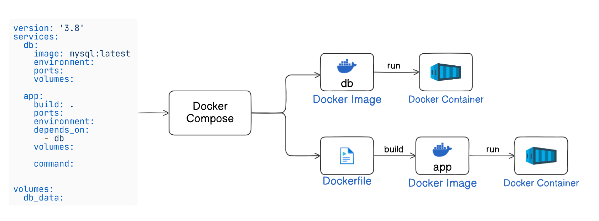

# Dockerizing NodeJS-MySQL RestAPI Application

This documentation provides a comprehensive guide to setting up a Node.js REST API application using Express.js, Sequelize ORM, and MySQL database.


We will go through the process of dockerizing a Node.js-MySQL REST API application. We cover creating a `Dockerfile` and `docker-compose.yml`, setting up and running the Node.js app and MySQL database in Docker containers. 



## Prerequisites
- Docker and Docker Compose installed on your machine.
- Basic understanding of Node.js, Express.js, and MySQL.
- Basic understanding of Docker and Docker Compose.

Let't setup the application step by step:

## Step 1: Set Up the Project

### Initialize a new Node.js project:

```bash
mkdir my-rest-api
cd my-rest-api
npm init -y
```


`mkdir my-rest-api`: Creates a new directory named `my-rest-api`.

`cd my-rest-api`: Navigates into the `my-rest-api` directory.

`npm init -y`: Initializes a new Node.js project with default settings, creating a `package.json` file.

###  Install the required packages:

```bash
npm install express sequelize mysql2 body-parser nodemon
```


`express`: A minimal and flexible Node.js web application framework.

`sequelize`: A promise-based Node.js ORM for MySQL, Postgres, SQLite, and Microsoft SQL Server.

`mysql2`: A MySQL client for Node.js with a focus on performance.

`body-parser`: Middleware to parse incoming request bodies in a middleware before your handlers.

### Set the start script in `package.json`
```json
"scripts": {
    "start": "nodemon index.js"
},
```

## Step 2: Create the File Structure 

### Create a folder structure as follows:

```
├── models
│   └── index.js
│   └── user.js
|── routes
|    └── user.js
|    └── home.js
├── index.js
├── Dockerfile
├── docker-compose.yml
├── .env
├── package.json
└── package-lock.json
```

### Project Structure Overview

- **models/index.js**: Initializes Sequelize, sets up database connection using environment variables, and imports models.
- **models/user.js**: Defines the Sequelize model for the `User` entity, specifying fields and data types.
- **routes/home.js**: Defines routes for the home endpoint (`/`), providing usage instructions.
- **routes/user.js**: Contains route definitions for user CRUD operations (`/users` endpoints).
- **index.js**: The entry point of the application, sets up Express server and middleware.
- **Dockerfile**: Contains instructions for building a Docker image of the Node.js application.
- **docker-compose.yml**: Defines services for MySQL database and Node.js app, along with network and volume configurations.
- **.env**: Stores environment variables such as database credentials and application port.


## Step 3: Define Models

### Create the `index.js` file to initialize Sequelize: **`models/index.js`**
```javascript
const fs = require('fs');
const path = require('path');
const Sequelize = require('sequelize');
const basename = path.basename(__filename);

const config = {
    username: process.env.DB_USERNAME, 
    password: process.env.DB_PASSWORD, 
    database: process.env.DB_NAME, 
    host: process.env.DB_HOST, 
    dialect: "mysql"
};

const db = {};

let sequelize;
if (config.use_env_variable) {
  sequelize = new Sequelize(process.env[config.use_env_variable], config);
} else {
  sequelize = new Sequelize(config.database, config.username, config.password, config);
}

fs
  .readdirSync(__dirname)
  .filter(file => {
    return (file.indexOf('.') !== 0) && (file !== basename) && (file.slice(-3) === '.js');
  })
  .forEach(file => {
    const model = require(path.join(__dirname, file))(sequelize, Sequelize.DataTypes);
    db[model.name] = model;
  });

Object.keys(db).forEach(modelName => {
  if (db[modelName].associate) {
    db[modelName].associate(db);
  }
});

db.sequelize = sequelize;
db.Sequelize = Sequelize;

module.exports = db;
```

This file initializes Sequelize, reads all model files, and loads them into the `db` object. It also handles the connection to the database based on the configuration.

### Define the User model: **`models/user.js`**

```javascript
module.exports = (sequelize, DataTypes) => {
  const User = sequelize.define('User', {
    username: {
      type: DataTypes.STRING,
      allowNull: false,
      unique: true,
    },
    email: {
      type: DataTypes.STRING,
      allowNull: false,
      unique: true,
      validate: {
        isEmail: true,
      },
    }
  });

  return User;
};
```

This file defines a User model with two fields: `username` and `email`, both of which are strings and cannot be null.

## Step 4: Set Up Routes

### Create a route for home: **`routes/home.js`**
```javascript
const express = require('express');
const router = express.Router();

router.get('/', (req, res) => {
    try {
        res.json({
            message: 'Welcome to NodeJS App. You can now use tools like Postman or curl to test the following endpoints:',
            endpoints: [
                { method: 'POST', route: '/users', description: 'Create a new user.' },
                { method: 'GET', route: '/users', description: 'Get all users.' },
                { method: 'GET', route: '/users/:id', description: 'Get a user by ID.' },
                { method: 'PUT', route: '/users/:id', description: 'Update a user by ID.' },
                { method: 'DELETE', route: '/users/:id', description: 'Delete a user by ID.' }
            ]
        });
    } catch (error) {
        res.status(500).json({ error: error.message });
    }
});

module.exports = router;

```

### Create a route for users: **`routes/user.js`**

```javascript
const express = require('express');
const router = express.Router();
const { User } = require('../models');

// Create a new user
router.post('/', async (req, res) => {
  try {
    const { username, email } = req.body;
    if (!username || !email) {
      return res.status(400).json({ error: 'Username and email are required' });
    }
    const user = await User.create(req.body);
    res.status(201).json(user);
  } catch (error) {
    res.status(500).json({ error: error.message });
  }
});

// Get all users
router.get('/', async (req, res) => {
  try {
    const users = await User.findAll();
    res.json(users);
  } catch (error) {
    res.status(500).json({ error: error.message });
  }
});

// Get user by id
router.get('/:id', async (req, res) => {
  try {
    const user = await User.findByPk(req.params.id);
    if (user) {
      res.json(user);
    } else {
      res.status(404).json({ error: 'User not found' });
    }
  } catch (error) {
    res.status(500).json({ error: error.message });
  }
});

// Update user by id
router.put('/:id', async (req, res) => {
  try {
    const user = await User.findByPk(req.params.id);
    if (user) {
      await user.update(req.body);
      res.json(user);
    } else {
      res.status(404).json({ error: 'User not found' });
    }
  } catch (error) {
    res.status(500).json({ error: error.message });
  }
});

// Delete user by id
router.delete('/:id', async (req, res) => {
  try {
    const user = await User.findByPk(req.params.id);
    if (user) {
      await user.destroy();
      res.json({ message: 'User deleted' });
    } else {
      res.status(404).json({ error: 'User not found' });
    }
  } catch (error) {
    res.status(500).json({ error: error.message });
  }
});

module.exports = router;
```

- **POST `/users`**: Creates a new user using data from the request body.
- **GET `/users`**: Retrieves all users from the database.
- **GET `/users/:id`**: Retrieves a single user by their ID.
- **PUT `/users/:id`**: Updates a user's data based on their ID using data from the request body.
- **DELETE `/users/:id`**: Deletes a user by their ID.

## Step 5: Create the Main Application File

### Set up the Express app: **`index.js`**
```javascript
require('dotenv').config();
const express = require('express');
const bodyParser = require('body-parser');
const db = require('./models');
const userRoutes = require('./routes/user');
const homeRoutes = require('./routes/home'); 

const app = express();
const PORT = process.env.PORT || 5000;

app.use(bodyParser.json());
app.use('/', homeRoutes);
app.use('/users', userRoutes);


const startServer = async () => {
    try {
        await db.sequelize.sync();
        console.log("Database synced successfully.");
        app.listen(PORT, () => {
            console.log(`Server is running on port ${PORT}`);
        });
    } catch (err) {
        console.error("Unable to sync database:", err);
    }
};

startServer();
```

- `express()`: Initializes an Express application.
- `bodyParser.json()`: Middleware to parse JSON request bodies.
- `app.use('/users', userRoutes)`: Mounts the user routes at the `/users` path.
- `db.sequelize.sync()`: Syncs all defined models to the database.
- `app.listen(PORT)`: Starts the server on the specified port.

## Step 6: Create the Dockerfile

### Create `Dockerfile` with the following contents:

```Dockerfile
# Use the official Node.js image as a base image
FROM node:14

# Set the working directory inside the container
WORKDIR /app

# Copy package.json and package-lock.json to the working directory
COPY package*.json ./

# Install dependencies
RUN npm install

# Copy the rest of the application code to the working directory
COPY . .

# Expose the port the app runs on
EXPOSE 5000

# # Define the command to run the app
CMD ["npm", "start"]
```

## Step 7: Create a compose file for MySQL and the App

The docker-compose.yml file is used to define and run multi-container Docker applications. This file describes the services, networks, and volumes needed to run the application.

Create `docker-compose.yml` to run `MySQL` container and the NodeJS `App` container on the specified port:

```yaml
version: '3.8'

services:
  db:
    image: mysql:latest
    environment:
      MYSQL_ROOT_PASSWORD: root
      MYSQL_DATABASE: my_db
      MYSQL_USER: myuser
      MYSQL_PASSWORD: mypassword
    ports:
      - "3306:3306"
    volumes:
      - db_data:/var/lib/mysql

  app:
    build: .
    ports:
      - "5000:5000"
    environment:
      DB_USERNAME: myuser
      DB_PASSWORD: mypassword
      DB_NAME: my_db
      DB_HOST: db
      PORT: 5000
    depends_on:
      - db
    volumes:
      - .:/app
      - /app/node_modules
    command: npm start

volumes:
  db_data:
```

- The `docker-compose.yml` file defines two services: a MySQL database (`db`) and a Node.js application (`app`).
- The `db` service uses the official MySQL image and sets up the database with specified environment variables.
- The `app` service builds a Docker image from the current directory, maps necessary ports, sets environment variables, and ensures it starts after the db service.
- Volumes are used to persist database data and manage the application code and dependencies.

This setup allows you to run the Node.js application and MySQL database together, with all configurations and dependencies managed in a single file.


## Step 8: Run the Application

### 1. Build and Start the Containers

   Navigate to the project directory and run the following command:

   ```bash
   docker-compose up --build
   ```

   This command will build the Docker images and start the containers as defined in the `docker-compose.yml` file.

### 2. Access the Application

   Once the containers are up and running, you can access the application at `http://localhost:5000/`. You can now use tools like Postman or curl to test the following endpoints:

- **POST /users**: Create a new user.
- **GET /users**: Get all users.
- **GET /users/:id**: Get a user by ID.
- **PUT /users/:id**: Update a user by ID.
- **DELETE /users/:id**: Delete a user by ID.


## Conclusion

By following this guide, you have successfully set up a Node.js REST API application using Express.js, Sequelize ORM, and MySQL database. The application is fully Dockerized, making it easy to deploy and manage the services. This setup ensures that your application can be developed, tested, and deployed consistently across different environments.