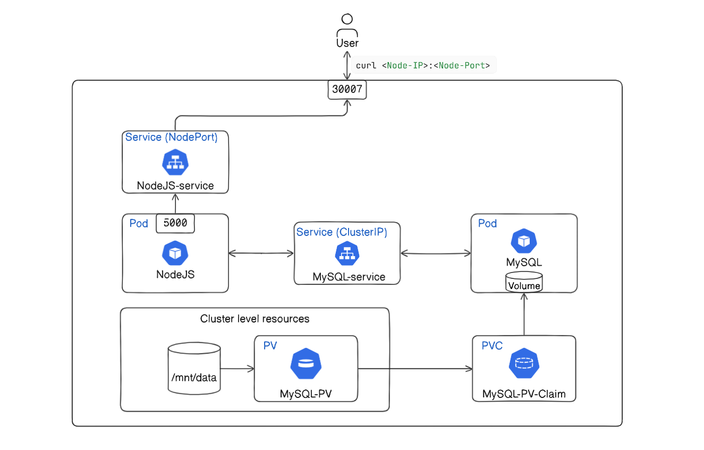

# Deploy NodeJS-MySQL App in Kubernetes

Running your Node.js and MySQL application on Kubernetes involves several steps, including creating Kubernetes manifests for your deployments, services, and configuring environment variables. Below is a detailed solution to deploy your application on Kubernetes.



## Prerequisites

1. A running Kubernetes cluster.
2. `kubectl` configured to interact with your cluster.
3. Docker installed and configured to build your images.
4. A Docker registry (like Docker Hub or Google Container Registry) to push your Docker images.

## Step 1: Dockerize Your Application

Ensure your Docker image for the Node.js application is ready. We assume you have a `Dockerfile` as provided earlier. Build and push your Docker images to a Docker registry. 

```sh
# Build the Docker image
docker build -t minhaz71/nodejs-mysql-app:latest .

# Push the image to Docker Hub
docker push minhaz71/nodejs-mysql-app:latest
```

You can use your own Dockerhub username instead of 'minhaz71' here.

## Step 2: Kubernetes Manifests

Create the necessary Kubernetes manifests for your application. We'll need:

1. A MySQL Deployment and Service.
2. A Node.js Application Deployment and Service.
3. ConfigMaps or Secrets for environment variables.

### 1. MySQL Deployment and Service

Create a file named `mysql-deployment.yaml`:

```yaml
apiVersion: apps/v1
kind: Deployment
metadata:
  name: mysql
spec:
  selector:
    matchLabels:
      app: mysql
  strategy:
    type: Recreate
  template:
    metadata:
      labels:
        app: mysql
    spec:
      containers:
      - image: mysql:5.7
        name: mysql
        env:
        - name: MYSQL_ROOT_PASSWORD
          value: root
        - name: MYSQL_DATABASE
          value: my_db
        - name: MYSQL_USER
          value: myuser
        - name: MYSQL_PASSWORD
          value: mypassword
        ports:
        - containerPort: 3306
          name: mysql
        volumeMounts:
        - name: mysql-persistent-storage
          mountPath: /var/lib/mysql
      volumes:
      - name: mysql-persistent-storage
        persistentVolumeClaim:
          claimName: mysql-pv-claim
---
apiVersion: v1
kind: Service
metadata:
  name: mysql
spec:
  ports:
  - port: 3306
  selector:
    app: mysql
```

### 2. Persistent Volume for MySQL

Create a file named `mysql-pv.yaml`:

```yaml
apiVersion: v1
kind: PersistentVolume
metadata:
  name: mysql-pv
spec:
  capacity:
    storage: 1Gi
  accessModes:
    - ReadWriteOnce
  hostPath:
    path: "/mnt/data"
---
apiVersion: v1
kind: PersistentVolumeClaim
metadata:
  name: mysql-pv-claim
spec:
  resources:
    requests:
      storage: 1Gi
  accessModes:
    - ReadWriteOnce
```

### 3. Node.js Application Deployment and Service

Create a file named `nodejs-deployment.yaml`:

```yaml
apiVersion: apps/v1
kind: Deployment
metadata:
  name: nodejs-app
spec:
  replicas: 1
  selector:
    matchLabels:
      app: nodejs-app
  template:
    metadata:
      labels:
        app: nodejs-app
    spec:
      containers:
      - name: nodejs-app
        image: minhaz71/nodejs-mysql-app:latest
        ports:
        - containerPort: 5000
        env:
        - name: DB_USERNAME
          value: myuser
        - name: DB_PASSWORD
          value: mypassword
        - name: DB_NAME
          value: my_db
        - name: DB_HOST
          value: mysql
        - name: PORT
          value: "5000"
---
apiVersion: v1
kind: Service
metadata:
  name: nodejs-service
spec:
  type: NodePort
  selector:
    app: nodejs-app
  ports:
  - port: 5000
    targetPort: 5000
    nodePort: 30007  
```

## Step 3: Apply the Manifests

Apply these manifests to your Kubernetes cluster using `kubectl`:

```sh
# Apply the Persistent Volume and Claim
kubectl apply -f mysql-pv.yaml

# Apply the MySQL Deployment and Service
kubectl apply -f mysql-deployment.yaml

# Apply the Node.js Application Deployment and Service
kubectl apply -f nodejs-deployment.yaml
```

## Step 4: Verify the Deployment

Check the status of your pods and services to ensure everything is running correctly:

```sh
# Check the status of pods
kubectl get pods

# Check the status of services
kubectl get services
```

Expected output:

```bash
root@7f47fb32b315b745:~# kubectl get pods
NAME                         READY   STATUS    RESTARTS   AGE
mysql-b49899d84-5n8cb        1/1     Running   0          10m
nodejs-app-55dd65896-jjhdm   1/1     Running   0          10m

root@7f47fb32b315b745:~# kubectl get services
NAME             TYPE        CLUSTER-IP     EXTERNAL-IP   PORT(S)          AGE
kubernetes       ClusterIP   10.43.0.1      <none>        443/TCP          13m
mysql            ClusterIP   10.43.229.95   <none>        3306/TCP         10m
nodejs-service   NodePort    10.43.45.249   <none>        5000:30007/TCP   10m
```

## Step 5: Access the Application

To access your application, use the IP address of any node in your Kubernetes cluster along with the NodePort (30007 in this example). If you don't know the IP address of your nodes, you can list them using:

```sh
kubectl get nodes -o wide
```

Expected result [in my case]:
```sh
root@7f47fb32b315b745:~# kubectl get nodes -o wide 
NAME                      STATUS   ROLES                       AGE   VERSION        INTERNAL-IP   EXTERNAL-IP   OS-IMAGE             KERNEL-VERSION   CONTAINER-
RUNTIME
cluster-ukcamj-master-1   Ready    control-plane,etcd,master   57m   v1.30.1+k3s1   10.62.7.56    <none>        Ubuntu 20.04.6 LTS   4.19.125         containerd
://1.7.15-k3s1
cluster-ukcamj-worker-1   Ready    <none>                      57m   v1.30.1+k3s1   10.62.7.57    <none>        Ubuntu 20.04.6 LTS   4.19.125         containerd
://1.7.15-k3s1
cluster-ukcamj-worker-2   Ready    <none>                      57m   v1.30.1+k3s1   10.62.7.58    <none>        Ubuntu 20.04.6 LTS   4.19.125         containerd
://1.7.15-k3s1
```

I will be using `10.62.7.56` as `NOdeIP`. It can be different in your case.

Now curl the following address:
```sh
curl http://<NodeIP>:30007
```
Expected result:

```sh
root@7f47fb32b315b745:~# curl 10.62.7.56:30007

{"message":"Welcome to NodeJS App. You can now use tools like Postman or curl to test the following endpoints:","endpoints":[{"method":"POST","route":"/users","
description":"Create a new user."},{"method":"GET","route":"/users","description":"Get all users."},{"method":"GET","route":"/users/:id","description":"Get a us
er by ID."},{"method":"PUT","route":"/users/:id","description":"Update a user by ID."},{"method":"DELETE","route":"/users/:id","description":"Delete a user by I
D."}]}
```

It shows the API endpoints with a message:
- POST /users: Create a new user.
- GET /users: Get all users.
- GET /users/:id: Get a user by ID.
- PUT /users/:id: Update a user by ID.
- DELETE /users/:id: Delete a user by ID.

## Step 6: Test the CRUD operations

- ### Create new users

    Let's create 2 new users.

    Command:
    ```bash
    curl -X POST http://10.62.7.56:30007/users -H "Content-Type: application/json" -d '{"username": "John Doe", "email": "johndoe@example.com"}'

    curl -X POST http://10.62.7.56:30007/users -H "Content-Type: application/json" -d '{"username": "Minhaz", "email": "minhaz@example.com"}'
    ```

    Expected output:
    ```sh
    root@7f47fb32b315b745:~# curl -X POST http://10.62.7.56:30007/users -H "Content-Type: application/json" -d '{"username": "John Doe", "email": "johndoe@example.com"}'

    {"id":1,"username":"John Doe","email":"johndoe@example.com","updatedAt":"2024-06-19T11:48:40.798Z","createdAt":"2024-06-19T11:48:40.798Z"}

    root@7f47fb32b315b745:~# curl -X POST http://10.62.7.56:30007/users -H "Content-Type: application/json" -d '{"username": "Minhaz", "email": "minhaz@example.com"}'

    {"id":2,"username":"Minhaz","email":"minhaz@example.com","updatedAt":"2024-06-19T11:51:57.241Z","createdAt":"2024-06-19T11:51:57.241Z"}
    ```


- ### Get all users / user by id

    Command:
    ```bash
    curl 10.62.7.56:30007/users
    curl 10.62.7.56:30007/users/2
    ```

    Expected result:

    ```bash
    root@7f47fb32b315b745:~# curl 10.62.7.56:30007/users
    [{"id":1,"username":"John Doe","email":"johndoe@example.com","createdAt":"2024-06-19T11:48:40.000Z","updatedAt":"2024-06-19T11:48:40.000Z"},{"id":2,"username":"
    Minhaz","email":"minhaz@example.com","createdAt":"2024-06-19T11:51:57.000Z","updatedAt":"2024-06-19T11:51:57.000Z"}]

    root@7f47fb32b315b745:~# curl 10.62.7.56:30007/users/2
    {"id":2,"username":"Minhaz","email":"minhaz@example.com","createdAt":"2024-06-19T11:51:57.000Z","updatedAt":"2024-06-19T11:51:57.000Z"}

    root@7f47fb32b315b745:~# 
    ```

- ### Update user

    Let's update the username and email of the first user and varify the updates:
    ```sh
    curl -X PUT http://10.62.7.56:30007/users/1 -H "Content-Type: application/json" -d '{"username": "John Smith", "email": "johnsmith@example.com"}'

    curl 10.62.7.56:30007/users/1
    ```

    Expected result:
    ```bash
    root@7f47fb32b315b745:~# curl -X PUT http://10.62.7.56:30007/users/1 -H "Content-Type: application/json" -d '{"username": "John Smith", "email": "johnsmith@example.com"}'

    root@7f47fb32b315b745:~# curl 10.62.7.56:30007/users/1
    {"id":1,"username":"John Smith","email":"johnsmith@example.com","createdAt":"2024-06-19T11:48:40.000Z","updatedAt":"2024-06-19T12:08:15.000Z"}

    root@7f47fb32b315b745:~# 
    ```

- ### Delete user

    Let's delete the first user:
    ```sh
    curl -X DELETE http://10.62.7.56:30007/users/1
    ```

## Conclusion

By following these steps, you should have your Node.js and MySQL application running on Kubernetes. This setup allows for scalable and manageable deployments, making it easier to maintain and update your application in a production environment.