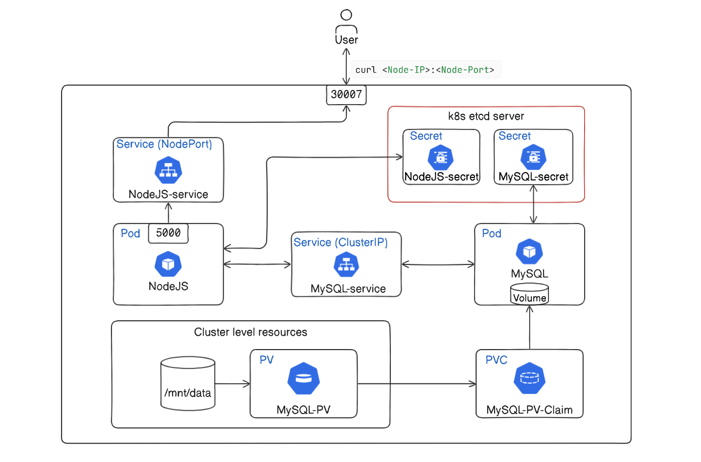

# Deploying a Node.js and MySQL Application using Secrets in Kubernetes


This document provides a step-by-step guide for deploying a Node.js application that uses a MySQL database on a Kubernetes cluster. It utilizes Kubernetes secrets for managing sensitive information and Persistent Volumes (PVs) for data storage. The deployment involves creating necessary Kubernetes resources such as PersistentVolumes, PersistentVolumeClaims, Secrets, Deployments, and Services.



Below are the steps with explanation:

## 1. PersistentVolume and PersistentVolumeClaim for MySQL

The PersistentVolume (PV) and PersistentVolumeClaim (PVC) ensure that your MySQL data persists across pod restarts or rescheduling.

###  **PersistentVolume (PV)**: `mysql-pv.yaml`
  ```yaml
  apiVersion: v1
  kind: PersistentVolume
  metadata:
    name: mysql-pv
  spec:
    capacity:
      storage: 1Gi
    accessModes:
      - ReadWriteOnce
    hostPath:
      path: "/mnt/data"
  ```

  The PV defines a 1Gi storage volume on the host at `/mnt/data`.

### **PersistentVolumeClaim (PVC)**: `mysql-pvc.yaml`
  ```yaml
  apiVersion: v1
  kind: PersistentVolumeClaim
  metadata:
    name: mysql-pv-claim
  spec:
    resources:
      requests:
        storage: 1Gi
    accessModes:
      - ReadWriteOnce
  ```

  The PVC requests 1Gi storage, which matches the PV.

## 2. Kubernetes Secrets for MySQL and Node.js App

Secrets store sensitive information like database credentials in a secure manner.

### **MySQL Secrets**: `mysql-secret.yaml`
  ```yaml
  apiVersion: v1
  kind: Secret
  metadata:
    name: mysql-secrets
  type: Opaque
  data:
    MYSQL_ROOT_PASSWORD: cm9vdA==  # base64 encoded value of 'root'
    MYSQL_DATABASE: bXlfZGI=  # base64 encoded value of 'my_db'
    MYSQL_USER: bXl1c2Vy  # base64 encoded value of 'myuser'
    MYSQL_PASSWORD: bXlwYXNzd29yZA==  # base64 encoded value of 'mypassword'
  ```

  This secret contains base64 encoded values for MySQL credentials.

### **Node.js App Secrets**: `nodejs-app-secret.yaml`
  ```yaml
  apiVersion: v1
  kind: Secret
  metadata:
    name: nodejs-app-secrets
  type: Opaque
  data:
    DB_USERNAME: bXl1c2Vy  # Base64 encoded value of 'myuser'
    DB_PASSWORD: bXlwYXNzd29yZA==  # Base64 encoded value of 'mypassword'
    DB_NAME: bXlfZGI=  # Base64 encoded value of 'my_db'
    DB_HOST: bXlzcWw=  # Base64 encoded value of 'mysql'
  ```

  This secret contains base64 encoded values for the Node.js application's database connection details.

## 3. MySQL Deployment and Service

Deploy the MySQL container and expose it as a service within the cluster.

### **MySQL Deployment**: `mysql-deployment.yaml`
  ```yaml
  apiVersion: apps/v1
  kind: Deployment
  metadata:
    name: mysql
  spec:
    selector:
      matchLabels:
        app: mysql
    strategy:
      type: Recreate
    template:
      metadata:
        labels:
          app: mysql
      spec:
        containers:
        - image: mysql:5.7
          name: mysql
          env:
          - name: MYSQL_ROOT_PASSWORD
            valueFrom:
              secretKeyRef:
                name: mysql-secrets
                key: MYSQL_ROOT_PASSWORD
          - name: MYSQL_DATABASE
            valueFrom:
              secretKeyRef:
                name: mysql-secrets
                key: MYSQL_DATABASE
          - name: MYSQL_USER
            valueFrom:
              secretKeyRef:
                name: mysql-secrets
                key: MYSQL_USER
          - name: MYSQL_PASSWORD
            valueFrom:
              secretKeyRef:
                name: mysql-secrets
                key: MYSQL_PASSWORD
          ports:
          - containerPort: 3306
            name: mysql
          volumeMounts:
          - name: mysql-persistent-storage
            mountPath: /var/lib/mysql
        volumes:
        - name: mysql-persistent-storage
          persistentVolumeClaim:
            claimName: mysql-pv-claim
  ```

  This deployment uses environment variables sourced from the secrets and mounts the PVC for persistent storage.

### **MySQL Service**: `mysql-service.yaml`
  ```yaml
  apiVersion: v1
  kind: Service
  metadata:
    name: mysql
  spec:
    ports:
    - port: 3306
    selector:
      app: mysql
  ```

  This service exposes MySQL on port 3306 within the cluster.

## 4. Node.js Application Deployment and Service

Deploy the Node.js application and expose it via a NodePort service.

### **Node.js App Deployment**: `nodejs-app-deployment.yaml`
  ```yaml
  apiVersion: apps/v1
  kind: Deployment
  metadata:
    name: nodejs-app
  spec:
    replicas: 1
    selector:
      matchLabels:
        app: nodejs-app
    template:
      metadata:
        labels:
          app: nodejs-app
      spec:
        containers:
        - name: nodejs-app
          image: minhaz71/nodejs-mysql-app:latest
          ports:
          - containerPort: 5000
          env:
          - name: DB_USERNAME
            valueFrom:
              secretKeyRef:
                name: nodejs-app-secrets
                key: DB_USERNAME
          - name: DB_PASSWORD
            valueFrom:
              secretKeyRef:
                name: nodejs-app-secrets
                key: DB_PASSWORD
          - name: DB_NAME
            valueFrom:
              secretKeyRef:
                name: nodejs-app-secrets
                key: DB_NAME
          - name: DB_HOST
            valueFrom:
              secretKeyRef:
                name: nodejs-app-secrets
                key: DB_HOST
          - name: PORT
            value: "5000"
  ```

  This deployment uses environment variables sourced from the secrets to connect to the MySQL database.

### **Node.js Service**: `nodejs-app-service.yaml`
  ```yaml
  apiVersion: v1
  kind: Service
  metadata:
    name: nodejs-service
  spec:
    type: NodePort
    selector:
      app: nodejs-app
    ports:
    - port: 5000
      targetPort: 5000
      nodePort: 30007
  ```

  This service exposes the Node.js application on port 5000, accessible via node port 30007.

## Applying the Manifests

Save the above manifests into YAML files, then apply them in the following order:

1. **PersistentVolume and PersistentVolumeClaim**:
   ```sh
   kubectl apply -f mysql-pv.yaml
   kubectl apply -f mysql-pvc.yaml
   ```

2. **Secrets**:
   ```sh
   kubectl apply -f mysql-secret.yaml
   kubectl apply -f nodejs-app-secret.yaml
   ```

3. **MySQL Deployment and Service**:
   ```sh
   kubectl apply -f mysql-deployment.yaml
   kubectl apply -f mysql-service.yaml
   ```

4. **Node.js App Deployment and Service**:
   ```sh
   kubectl apply -f nodejs-app-deployment.yaml
   kubectl apply -f nodejs-app-service.yaml
   ```


## Verify the Deployment

Check the status of your pods and services to ensure everything is running correctly:

```sh
# Check the status of pods
kubectl get pods

# Check the status of services
kubectl get services
```

Expected output:

```bash
root@7f47fb32b315b745:~# kubectl get pods
NAME                         READY   STATUS    RESTARTS   AGE
mysql-b49899d84-5n8cb        1/1     Running   0          10m
nodejs-app-55dd65896-jjhdm   1/1     Running   0          10m

root@7f47fb32b315b745:~# kubectl get services
NAME             TYPE        CLUSTER-IP     EXTERNAL-IP   PORT(S)          AGE
kubernetes       ClusterIP   10.43.0.1      <none>        443/TCP          13m
mysql            ClusterIP   10.43.229.95   <none>        3306/TCP         10m
nodejs-service   NodePort    10.43.45.249   <none>        5000:30007/TCP   10m
```

## Access the Application

To access your application, use the IP address of any node in your Kubernetes cluster along with the NodePort (30007 in this example). If you don't know the IP address of your nodes, you can list them using:

```sh
kubectl get nodes -o wide
```

Expected result [in my case]:
```sh
root@7f47fb32b315b745:~# kubectl get nodes -o wide 
NAME                      STATUS   ROLES                       AGE   VERSION        INTERNAL-IP   EXTERNAL-IP   OS-IMAGE             KERNEL-VERSION   CONTAINER-
RUNTIME
cluster-ukcamj-master-1   Ready    control-plane,etcd,master   57m   v1.30.1+k3s1   10.62.7.56    <none>        Ubuntu 20.04.6 LTS   4.19.125         containerd
://1.7.15-k3s1
cluster-ukcamj-worker-1   Ready    <none>                      57m   v1.30.1+k3s1   10.62.7.57    <none>        Ubuntu 20.04.6 LTS   4.19.125         containerd
://1.7.15-k3s1
cluster-ukcamj-worker-2   Ready    <none>                      57m   v1.30.1+k3s1   10.62.7.58    <none>        Ubuntu 20.04.6 LTS   4.19.125         containerd
://1.7.15-k3s1
```

I will be using `10.62.7.56` as `NOdeIP`. It can be different in your case.

Now curl the following address:
```sh
curl http://<NodeIP>:30007
```
Expected result:

```sh
root@7f47fb32b315b745:~# curl 10.62.7.56:30007

{"message":"Welcome to NodeJS App. You can now use tools like Postman or curl to test the following endpoints:","endpoints":[{"method":"POST","route":"/users","
description":"Create a new user."},{"method":"GET","route":"/users","description":"Get all users."},{"method":"GET","route":"/users/:id","description":"Get a us
er by ID."},{"method":"PUT","route":"/users/:id","description":"Update a user by ID."},{"method":"DELETE","route":"/users/:id","description":"Delete a user by I
D."}]}
```

It shows the API endpoints with a message:
- POST /users: Create a new user.
- GET /users: Get all users.
- GET /users/:id: Get a user by ID.
- PUT /users/:id: Update a user by ID.
- DELETE /users/:id: Delete a user by ID.

## Test the CRUD operations

- ### Create new users

    Let's create 2 new users.

    Command:
    ```bash
    curl -X POST http://10.62.7.56:30007/users -H "Content-Type: application/json" -d '{"username": "John Doe", "email": "johndoe@example.com"}'

    curl -X POST http://10.62.7.56:30007/users -H "Content-Type: application/json" -d '{"username": "Minhaz", "email": "minhaz@example.com"}'
    ```

    Expected output:
    ```sh
    root@7f47fb32b315b745:~# curl -X POST http://10.62.7.56:30007/users -H "Content-Type: application/json" -d '{"username": "John Doe", "email": "johndoe@example.com"}'

    {"id":1,"username":"John Doe","email":"johndoe@example.com","updatedAt":"2024-06-19T11:48:40.798Z","createdAt":"2024-06-19T11:48:40.798Z"}

    root@7f47fb32b315b745:~# curl -X POST http://10.62.7.56:30007/users -H "Content-Type: application/json" -d '{"username": "Minhaz", "email": "minhaz@example.com"}'

    {"id":2,"username":"Minhaz","email":"minhaz@example.com","updatedAt":"2024-06-19T11:51:57.241Z","createdAt":"2024-06-19T11:51:57.241Z"}
    ```


- ### Get all users / user by id

    Command:
    ```bash
    curl 10.62.7.56:30007/users
    curl 10.62.7.56:30007/users/2
    ```

    Expected result:

    ```bash
    root@7f47fb32b315b745:~# curl 10.62.7.56:30007/users
    [{"id":1,"username":"John Doe","email":"johndoe@example.com","createdAt":"2024-06-19T11:48:40.000Z","updatedAt":"2024-06-19T11:48:40.000Z"},{"id":2,"username":"
    Minhaz","email":"minhaz@example.com","createdAt":"2024-06-19T11:51:57.000Z","updatedAt":"2024-06-19T11:51:57.000Z"}]

    root@7f47fb32b315b745:~# curl 10.62.7.56:30007/users/2
    {"id":2,"username":"Minhaz","email":"minhaz@example.com","createdAt":"2024-06-19T11:51:57.000Z","updatedAt":"2024-06-19T11:51:57.000Z"}

    root@7f47fb32b315b745:~# 
    ```

- ### Update user

    Let's update the username and email of the first user and varify the updates:
    ```sh
    curl -X PUT http://10.62.7.56:30007/users/1 -H "Content-Type: application/json" -d '{"username": "John Smith", "email": "johnsmith@example.com"}'

    curl 10.62.7.56:30007/users/1
    ```

    Expected result:
    ```bash
    root@7f47fb32b315b745:~# curl -X PUT http://10.62.7.56:30007/users/1 -H "Content-Type: application/json" -d '{"username": "John Smith", "email": "johnsmith@example.com"}'

    root@7f47fb32b315b745:~# curl 10.62.7.56:30007/users/1
    {"id":1,"username":"John Smith","email":"johnsmith@example.com","createdAt":"2024-06-19T11:48:40.000Z","updatedAt":"2024-06-19T12:08:15.000Z"}

    root@7f47fb32b315b745:~# 
    ```

- ### Delete user

    Let's delete the first user:
    ```sh
    curl -X DELETE http://10.62.7.56:30007/users/1
    ```


## Conclusion

By following these steps, you can deploy a Node.js application with a MySQL database on a Kubernetes cluster. This guide ensures that your sensitive data is securely managed using Kubernetes secrets and your database data is persistent using PVs and PVCs. The Node.js application is accessible through a NodePort service, making it easy to interact with the application.