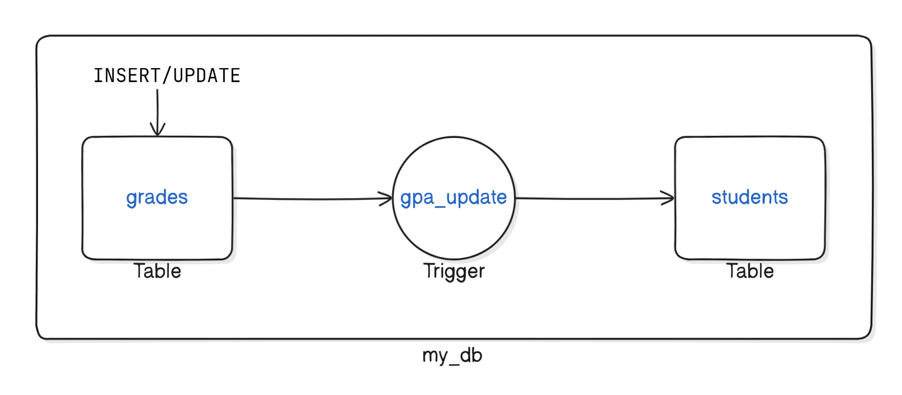

# Understanding PostgreSQL Trigger

A PostgreSQL trigger is a mechanism that automatically initiates a predefined action when a specific event occurs, such as inserting, updating, or deleting data in a table. Triggers enhance database functionality by enforcing rules, maintaining data integrity, and automating tasks, thereby reducing manual intervention and ensuring consistency in data operations.

## Task: Student Grade Update Trigger

In an application, we have a database that manages students and their grades for different courses. We want to implement a trigger that automatically updates a student's GPA whenever a new grade is inserted or an existing grade is updated.



## Database Schema
We'll have two tables: `students` and `grades`.

1. **students** table:
   - `student_id` (Primary Key)
   - `student_name`
   - `gpa`

2. **grades** table:
   - `grade_id` (Primary Key)
   - `student_id` (Foreign Key)
   - `course_name`
   - `grade` (value from 0 to 4)

## Setting up PostgreSQL using Docker

Setting up PostgreSQL using Docker is a straightforward process. Docker allows you to run PostgreSQL in a container, which is isolated from your host environment.


### Run the PostgreSQL Container

Run a PostgreSQL container with the following command. This will create and start a new container instance with PostgreSQL running inside it.

```bash
docker run --name my-postgres -e POSTGRES_PASSWORD=mypassword -d -p 5432:5432 postgres
```

- `--name my-postgres`: Names the container `my-postgres`.
- `-e POSTGRES_PASSWORD=mypassword`: Sets the environment variable `POSTGRES_PASSWORD` to `mypassword`. This is the password for the default PostgreSQL user `postgres`.
- `-d`: Runs the container in detached mode (in the background).
- `-p 5432:5432`: Maps port 5432 on your host to port 5432 on the container. This allows you to connect to PostgreSQL on `localhost:5432`.
- `postgres`: Specifies the image to use.


### Verify the PostgreSQL Container is Running

To verify that the PostgreSQL container is running, use the following command:

```sh
docker ps
```

You should see an entry for the `my-postgres` container with the status `Up`.

### Connect to PostgreSQL

You can connect to the PostgreSQL instance using a PostgreSQL client such as `psql`, pgAdmin, or any other database management tool.

#### Using `psql` from another Docker container

```sh
docker run -it --rm --network host postgres psql -h localhost -U postgres
```

- `-it`: Runs the container in interactive mode with a TTY.
- `--rm`: Removes the container after it exits.
- `--network host`: Uses the host network.
- `postgres`: Specifies the image to use.
- `psql -h localhost -U postgres`: Connects to PostgreSQL on localhost with the user `postgres`.

You will be prompted to enter the password (`mypassword`).


## Create the Database 

Once connected, you can create the `my_db` database by running the following SQL command:

```sql
CREATE DATABASE my_db;
```

You can see the created database using the following command:
```bash
\l
```

To switch to the newly created database and start using it:

Using psql:
```bash
\c my_db
```

## Steps to Create the Trigger

1. **Create the Tables**: Define the `students` and `grades` tables.
2. **Create the Trigger Function**: Write a function that calculates the GPA whenever a grade is inserted or updated.
3. **Create the Trigger**: Define the trigger that calls the function on insert or update on the `grades` table.

## Step-by-Step Solution

### 1. Create the Tables

- `students`: This table holds the student's ID, name, and GPA.
- `grades`: This table records the grades each student receives for different courses.

```sql
CREATE TABLE students (
    student_id SERIAL PRIMARY KEY,
    student_name VARCHAR(100) NOT NULL,
    gpa NUMERIC(3, 2)
);

CREATE TABLE grades (
    grade_id SERIAL PRIMARY KEY,
    student_id INTEGER NOT NULL REFERENCES students(student_id),
    course_name VARCHAR(100) NOT NULL,
    grade NUMERIC(2, 1) CHECK (grade >= 0 AND grade <= 4)
);
```

You can see the created tables using the following command:
```bash
\dt
```

### 2. Create the Trigger Function

```sql
CREATE OR REPLACE FUNCTION update_student_gpa()
RETURNS TRIGGER AS $$
BEGIN
    -- Calculate the new GPA
    UPDATE students
    SET gpa = (
        SELECT ROUND(AVG(grade), 2)
        FROM grades
        WHERE student_id = NEW.student_id
    )
    WHERE student_id = NEW.student_id;

    RETURN NEW;
END;
$$ LANGUAGE plpgsql;
```

Explaination: 
- `CREATE OR REPLACE FUNCTION update_student_gpa()`: Defines a function named `update_student_gpa`.
- `RETURNS TRIGGER AS $$ ... $$ LANGUAGE plpgsql;`: Specifies that the function is a trigger and uses the PL/pgSQL language.
- `BEGIN ... END;`: The block where the actual logic resides.
- Inside the function, we update the `students` table:
- We set the `gpa` field to the rounded average of all grades for the student specified in the `NEW` record.
- `NEW.student_id`: References the `student_id` of the record that triggered the function.
- `ROUND(AVG(grade), 2)`: Calculates the average grade to two decimal places.

### 3. Create the Trigger

```sql
CREATE TRIGGER gpa_update
AFTER INSERT OR UPDATE ON grades
FOR EACH ROW
EXECUTE FUNCTION update_student_gpa();
```

Explaination:
- `CREATE TRIGGER gpa_update`: Defines a trigger named `gpa_update`.
- `AFTER INSERT OR UPDATE ON grades`: Specifies that the trigger should fire after an insert or update operation on the `grades` table.
- `FOR EACH ROW`: Ensures the trigger fires once for each row affected by the insert or update operation.
- `EXECUTE FUNCTION update_student_gpa()`: Specifies the function to execute when the trigger fires.

## Testing the Trigger

1. **Insert a Student**:

```sql
INSERT INTO students (student_name) VALUES ('John Doe');
```

2. **Insert Grades**:

```sql
INSERT INTO grades (student_id, course_name, grade) VALUES (1, 'Math', 3.5);
INSERT INTO grades (student_id, course_name, grade) VALUES (1, 'Science', 4.0);
```

3. **Check the GPA**:

```sql
SELECT * FROM students WHERE student_id = 1;
```

Expected output:
| student_id | student_name  | gpa |
|------------|---------------|-----|
| 1          | John Doe      | 3.75|

The GPA is correctly calculated as the average of the grades 3.5 and 4.0.

4. **Update a Grade**:

```sql
UPDATE grades SET grade = 3.0 WHERE grade_id = 1;
```

5. **Check the GPA Again**:

```sql
SELECT * FROM students WHERE student_id = 1;
```

Expected output:

| student_id | student_name  | gpa |
|------------|---------------|-----|
| 1          | John Doe      | 3.50|

The GPA is recalculated correctly after the grade update.

## Conclusion

This hands-on lab demonstrates how to create a trigger in PostgreSQL that maintains a student's GPA automatically. This scenario is highly applicable in an environment where student grades and GPAs need to be managed efficiently.


