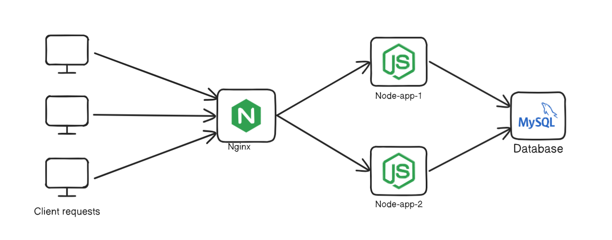
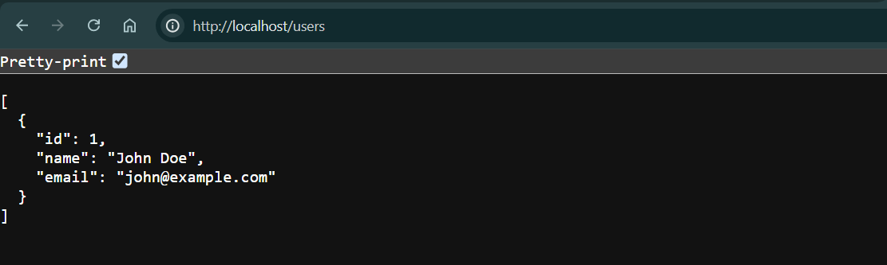
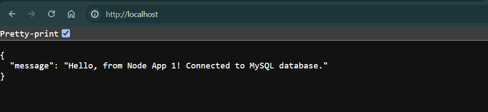
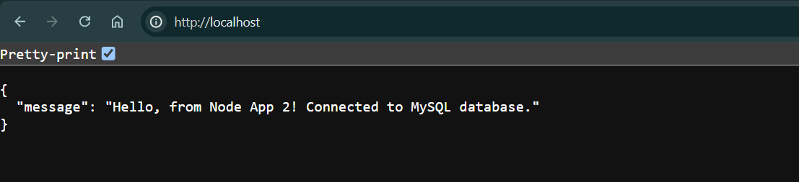

# Layer 4 Load Balancing Node.js servers with Nginx

This document outlines the process of setting up a layer 4 load-balanced Node.js application environment using Nginx. Here we will be using MySQL as the database. The setup consists of two identical Node.js applications, an Nginx server for load balancing, and a MySQL database container.



## Task
Create a load-balanced environment with two Node.js applications, Nginx as a load balancer, and a MySQL database, all running in Docker containers.


## 1. Set up Node.js Applications

### 1.1 Create Node App 1
```bash
mkdir Node-app-1
cd Node-app-1
npm init -y
npm install express mysql2 body-parser
```

Create `index.js` in the Node-app-1 directory with the following code:

```javascript
const express = require('express');
const mysql = require('mysql2');
const bodyParser = require('body-parser');

const app = express();
const port = 3001;

const dbConfig = {
  host: 'localhost',
  user: 'my_user',
  password: 'my_password',
  database: 'my_db'
};

// Middleware to parse JSON bodies
app.use(bodyParser.json());

function createConnection() {
  const connection = mysql.createConnection(dbConfig);
  connection.connect(error => {
    if (error) {
      console.error('Error connecting to the database:', error);
      return null;
    }
    console.log('Connected to MySQL database');
  });
  return connection;
}

function createTable() {
  const connection = createConnection();
  if (connection) {
    const createTableQuery = `
      CREATE TABLE IF NOT EXISTS users (
        id INT AUTO_INCREMENT PRIMARY KEY,
        name VARCHAR(255) NOT NULL,
        email VARCHAR(255) NOT NULL UNIQUE
      )
    `;
    connection.query(createTableQuery, (error, results) => {
      connection.end();
      if (error) {
        console.error('Error creating table:', error);
      } else {
        console.log('Table "users" ensured to exist');
      }
    });
  }
}

// Ensure the table is created when the server starts
createTable();

app.get('/', (req, res) => {
  
  const connection = createConnection();
  if (connection) {
    res.status(200).json({ message: "Hello, from Node App 1! Connected to MySQL database." });
    connection.end();
  } else {
    res.status(500).json({ message: 'Failed to connect to MySQL database' });
  }
});

// GET route to fetch all users
app.get('/users', (req, res) => {
  const connection = createConnection();
  if (connection) {
    connection.query('SELECT * FROM users', (error, results) => {
      connection.end();
      if (error) {
        return res.status(500).json({ message: 'Error fetching users', error });
      }
      res.json(results);
    });
  } else {
    res.status(500).json({ message: 'Failed to connect to MySQL database' });
  }
});

// POST route to add a new user
app.post('/users', (req, res) => {
  const connection = createConnection();
  const { name, email } = req.body;

  if (!name || !email) {
    return res.status(400).json({ message: 'Name and email are required' });
  }

  if (connection) {
    const query = 'INSERT INTO users (name, email) VALUES (?, ?)';
    connection.query(query, [name, email], (error, results) => {
      connection.end();
      if (error) {
        return res.status(500).json({ message: 'Error adding user', error });
      }
      res.status(201).json({ message: 'User added', userId: results.insertId });
    });
  } else {
    res.status(500).json({ message: 'Failed to connect to MySQL database' });
  }
});

app.listen(port, () => {
  console.log(`App running on http://localhost:${port}`);
});
```

### 1.2 Create Node App 2
```bash
mkdir Node-app-2
cd Node-app-2
npm init -y
npm install express mysql2 body-parser
```

Create `index.js` in the Node-app-2 directory with the following code:

```javascript
const express = require('express');
const mysql = require('mysql2');
const bodyParser = require('body-parser');

const app = express();
const port = 3002;

const dbConfig = {
  host: 'localhost',
  user: 'my_user',
  password: 'my_password',
  database: 'my_db'
};

// Middleware to parse JSON bodies
app.use(bodyParser.json());

function createConnection() {
  const connection = mysql.createConnection(dbConfig);
  connection.connect(error => {
    if (error) {
      console.error('Error connecting to the database:', error);
      return null;
    }
    console.log('Connected to MySQL database');
  });
  return connection;
}

function createTable() {
  const connection = createConnection();
  if (connection) {
    const createTableQuery = `
      CREATE TABLE IF NOT EXISTS users (
        id INT AUTO_INCREMENT PRIMARY KEY,
        name VARCHAR(255) NOT NULL,
        email VARCHAR(255) NOT NULL UNIQUE
      )
    `;
    connection.query(createTableQuery, (error, results) => {
      connection.end();
      if (error) {
        console.error('Error creating table:', error);
      } else {
        console.log('Table "users" ensured to exist');
      }
    });
  }
}

// Ensure the table is created when the server starts
createTable();

app.get('/', (req, res) => {
  
  const connection = createConnection();
  if (connection) {
    res.status(200).json({ message: "Hello, from Node App 2! Connected to MySQL database." });
    connection.end();
  } else {
    res.status(500).json({ message: 'Failed to connect to MySQL database' });
  }
});

// GET route to fetch all users
app.get('/users', (req, res) => {
  const connection = createConnection();
  if (connection) {
    connection.query('SELECT * FROM users', (error, results) => {
      connection.end();
      if (error) {
        return res.status(500).json({ message: 'Error fetching users', error });
      }
      res.json(results);
    });
  } else {
    res.status(500).json({ message: 'Failed to connect to MySQL database' });
  }
});

// POST route to add a new user
app.post('/users', (req, res) => {
  const connection = createConnection();
  const { name, email } = req.body;

  if (!name || !email) {
    return res.status(400).json({ message: 'Name and email are required' });
  }

  if (connection) {
    const query = 'INSERT INTO users (name, email) VALUES (?, ?)';
    connection.query(query, [name, email], (error, results) => {
      connection.end();
      if (error) {
        return res.status(500).json({ message: 'Error adding user', error });
      }
      res.status(201).json({ message: 'User added', userId: results.insertId });
    });
  } else {
    res.status(500).json({ message: 'Failed to connect to MySQL database' });
  }
});

app.listen(port, () => {
  console.log(`App running on http://localhost:${port}`);
});
```

Both Node.js applications are identical, one listening on port `3001` and another on port `3002`. They create a connection to the `MySQL` database, ensure a `users` table exists, and provide endpoints for `fetching` and `adding` users.

## 2. Set up Nginx

### 2.1 Create Nginx Configuration
```bash
mkdir Nginx
cd Nginx
```

Create `nginx.conf` in the Nginx directory with the following configuration:

```nginx
events {}

stream {
    upstream nodejs_backend {
        server host.docker.internal:3001; # Node-app-1
        server host.docker.internal:3002; # Node-app-2
    }

    server {
        listen 80;

        proxy_pass nodejs_backend;

        # Enable TCP load balancing
        proxy_connect_timeout 1s;
        proxy_timeout 3s;
    }
}
```

This configuration sets up Nginx to act as a TCP load balancer, distributing traffic between the two Node.js applications. Let's break down the key components:

- `stream {}:` This block is used for TCP and UDP load balancing. It's different from the http {} block used in HTTP load balancing. It allows it to handle TCP and UDP traffic at the transport layer (Layer 4) of the OSI model.

- `upstream nodejs_backend {}:` This defines a group of backend servers. We're using host.docker.internal to refer to the host machine from within the Docker container. The ports 3001 and 3002 correspond to our two Node.js applications.

- `server {}:` This block defines the server configuration for the load balancer.
listen 80: This tells Nginx to listen on port 80 for incoming TCP connections.


This configuration provides a simple round-robin load balancing across our Node.js applications at the TCP level, which can be more efficient than HTTP-level load balancing for certain use cases.

### 2.2 Create Dockerfile for Nginx
Create a file named `Dockerfile` in the Nginx directory with the following content:

```Dockerfile
FROM nginx:latest
COPY nginx.conf /etc/nginx/nginx.conf
```

### 2.3 Build Nginx Docker Image
```bash
docker build -t custom-nginx .
```

This command builds a Docker image for Nginx with our custom configuration.

## 3. Set up MySQL

Run the MySQL container:
```bash
docker run --name my_mysql -e MYSQL_ROOT_PASSWORD=root -e MYSQL_DATABASE=my_db -e MYSQL_USER=my_user -e MYSQL_PASSWORD=my_password -p 3306:3306 -v mysql_data:/var/lib/mysql -d mysql:latest
```

This command creates and runs a MySQL database container with specified database, user, and password and volume mounting for persistent storage, accessible externally on port 3306.

## 4. Run the Applications

#### 4.1 Start Node.js Applications
Navigate to each Node.js application directory and run:
```bash
node index.js
```

Make sure to run each application in a separate terminal or in the background.

## Run Nginx Container
```bash
docker run -d -p 80:80 --name my_nginx custom-nginx
```

This command starts the Nginx container with our custom configuration.

## Verification

1. Visit http://localhost in a web browser. You should see a response from one of the Node.js applications.

2. To test the user operations, use the following endpoints:
   - GET http://localhost/users (to fetch all users)
   - POST http://localhost/users (to add a new user)

   For the POST request, use a JSON body like:
   ```json
   {
     "name": "John Doe",
     "email": "john@example.com"
   }
   ```

    I am using `Postman` for `POST` method. After adding the user, let's try to see the user using `GET` request: `http://localhost/users`.

    Expected output:

    


3. Refresh the browser or make multiple requests to observe the load balancing in action. You should see responses alternating between `"Hello, from Node App 1!"` and `"Hello, from Node App 2!"`.

    Example:

    

    

## Conclusion

By configuring Nginx with the stream module as described, you have effectively set up Nginx as a `Layer 4 load balancer`. It handles TCP connections based on IP addresses and port numbers, making routing decisions at the transport layer without inspecting higher-layer protocols like HTTP. This setup is suitable for scenarios where efficient TCP load balancing across multiple backend services is required.