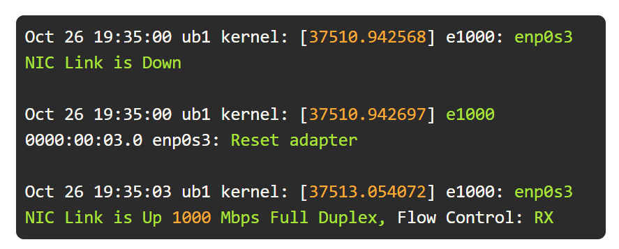
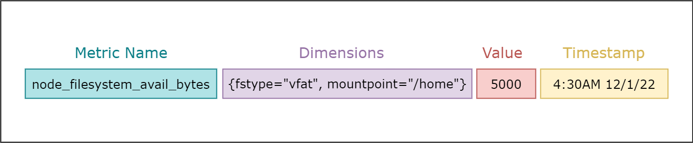
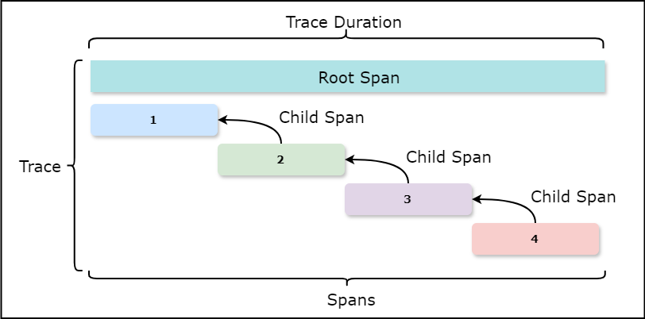

# Introduction to Observability and SLI/SLO/SLA

Imagine you're a detective solving the puzzles of a modern, complex system. In this journey, you'll learn how **Observability** becomes your magnifying glass, helping you see deep inside the system using logs, metrics, and traces. You'll understand setting **Service Level Indicators (SLIs)**, **Objectives (SLOs)**, and **Agreements (SLAs)**—tools that ensure everything runs smoothly and reliably. This guide will give you the insights and tools to quickly find and fix issues, improve system performance, and keep everything working well, even when unexpected problems arise.

## What is Observability?

**Observability** is the ability to infer the internal states of a system solely from its external outputs. It allows teams to understand and measure the state of a system based on data such as logs, metrics, and traces. Observability is not just about knowing **what** is wrong but also understanding **why** it's happening.

Without observability, a complex system is like a black box—we know what goes in and what comes out, but we have no idea what's happening inside. This lack of visibility makes it hard to diagnose problems, understand performance issues, or improve the system. 

With observability, we open up that black box. By using logs, metrics, and traces, we can see inside the system to understand how it works. This helps us find and fix issues quickly, optimize performance, and ensure everything runs smoothly. Observability turns the unknown into the known, making it possible to solve problems that were once hidden from view.

## Benefits of Observability:

1. **Insight into Internal Workings**: Provides a clear view of the system's internal processes and interactions.
2. **Accelerated Troubleshooting**: Speeds up the identification and resolution of issues.
3. **Detection of Complex Problems**: Uncovers hard-to-find issues that traditional monitoring might miss.
4. **Performance Monitoring**: Keeps track of application performance over time.
5. **Improved Collaboration**: Enhances cross-team communication and understanding by providing shared visibility into system behavior.

As systems grow in complexity, the need for observability becomes paramount. It enables teams to navigate unexpected scenarios and dynamic environments effectively.

## The Three Pillars of Observability

To achieve observability, organizations focus on three key data types:

1. **Logging**
2. **Metrics**
3. **Tracing**

### 1. Logging

**Logs** are records of events that have occurred within a system. Each log entry typically contains:

- **Timestamp**: When the event occurred.
- **Message**: Information about the event.

Logs are essential for diagnosing issues and understanding system behavior. However, they can become overwhelming due to their volume and verbosity, especially in distributed systems where logs from multiple services intertwine.

### 2. Metrics

**Metrics** provide quantitative measurements about the state of the system using numerical values. Common metrics include:

- **CPU Load**
- **Memory Usage**
- **HTTP Response Times**
- **Error Rates**

Metrics are valuable for monitoring system health and performance over time. They can be aggregated and visualized to identify trends, spikes, or anomalies.

Each metric typically includes:

1. **Metric Name**: Descriptive identifier.
2. **Value**: Current measurement.
3. **Timestamp**: When the metric was recorded.
4. **Dimensions**: Additional contextual information (e.g., labels, tags).

Tools like **Prometheus** are widely used to collect and aggregate metrics for analysis and visualization.

### 3. Tracing

**Traces** allow teams to follow the path of a request through various services and components within a system. Tracing is crucial in microservices architectures to understand how different parts of the system interact.

A trace is composed of multiple **spans**, each representing a unit of work with:

- **Start Time**
- **Duration**
- **Parent ID**: Linking spans to form a hierarchy.

Tracing helps in:

- **Connecting the Dots**: Visualizing the flow of requests.
- **Identifying Bottlenecks**: Pinpointing slow or failing components.
- **Understanding Dependencies**: Revealing how services interact.

## Service Level Indicators (SLIs), Objectives (SLOs), and Agreements (SLAs)

Establishing clear performance and reliability targets is essential for meeting user expectations. This is where SLIs, SLOs, and SLAs come into play.

### Service Level Indicators (SLIs)

An **SLI** is a quantifiable measure of a specific aspect of service performance. It reflects the end-user experience and is used to assess whether the service meets expected standards.

**Common SLIs**:

- **Latency**: Response time for requests.
- **Error Rate**: Frequency of failed requests.
- **Throughput**: Number of processed requests over time.
- **Availability**: Percentage of time the service is operational.

Not all metrics make good SLIs. Effective SLIs should directly relate to user experience. For example, high CPU usage may not impact users if the service remains responsive.

### Service Level Objectives (SLOs)

An **SLO** is a target value or range for an SLI. It defines the acceptable performance level for a service from the user's perspective.

**Examples**:

- **Latency SLO**: 95% of requests should have a latency below 100 milliseconds.
- **Availability SLO**: Service should be available 99.9% of the time over a 30-day rolling window.

SLOs help organizations balance reliability with operational costs. Setting overly ambitious SLOs (e.g., 100% uptime) can lead to unnecessary expenses without significantly enhancing user satisfaction.

### Service Level Agreements (SLAs)

An **SLA** is a formal agreement between a service provider and a customer that specifies the SLOs and the consequences if these objectives are not met. SLAs are contractual and may include penalties, such as financial compensation or service credits.

---

## Importance of SLIs, SLOs, and SLAs in Observability

- **Alignment with User Expectations**: SLIs and SLOs ensure that performance metrics reflect what users care about.
- **Prioritization**: Helps teams focus on areas that impact user experience the most.
- **Accountability**: SLAs formalize the commitment to service quality, holding providers accountable.
- **Continuous Improvement**: Monitoring SLIs against SLOs drives ongoing enhancements in service reliability.

---

## Implementing Observability

To effectively implement observability:

1. **Collect Comprehensive Data**: Gather logs, metrics, and traces from all parts of the system.
2. **Use the Right Tools**: Implement tools like Prometheus for metrics, centralized logging solutions, and distributed tracing systems.
3. **Define Meaningful SLIs**: Choose indicators that truly reflect user experience.
4. **Set Realistic SLOs**: Establish achievable objectives that balance user satisfaction and operational costs.
5. **Formalize with SLAs**: Create agreements that define expectations and consequences.

---

## Conclusion

Observability is a critical component in modern system design and operation. By leveraging logs, metrics, and traces, organizations can gain deep insights into system behavior, leading to faster issue resolution and improved performance. Coupled with well-defined SLIs, SLOs, and SLAs, observability ensures that systems meet reliability targets and user expectations.

Implementing observability requires careful planning and the right set of tools, but the benefits in terms of system reliability and user satisfaction make it an essential practice in today's complex technological environments.

